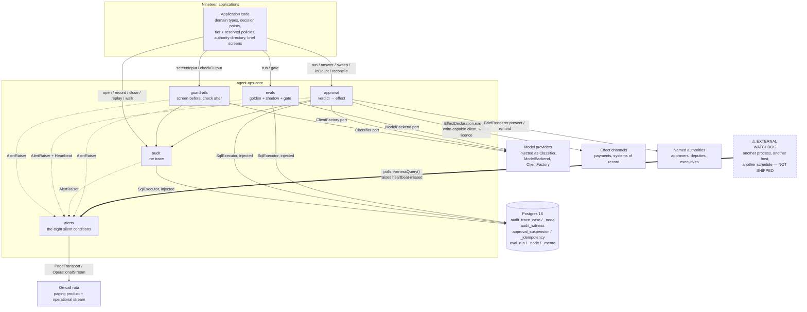
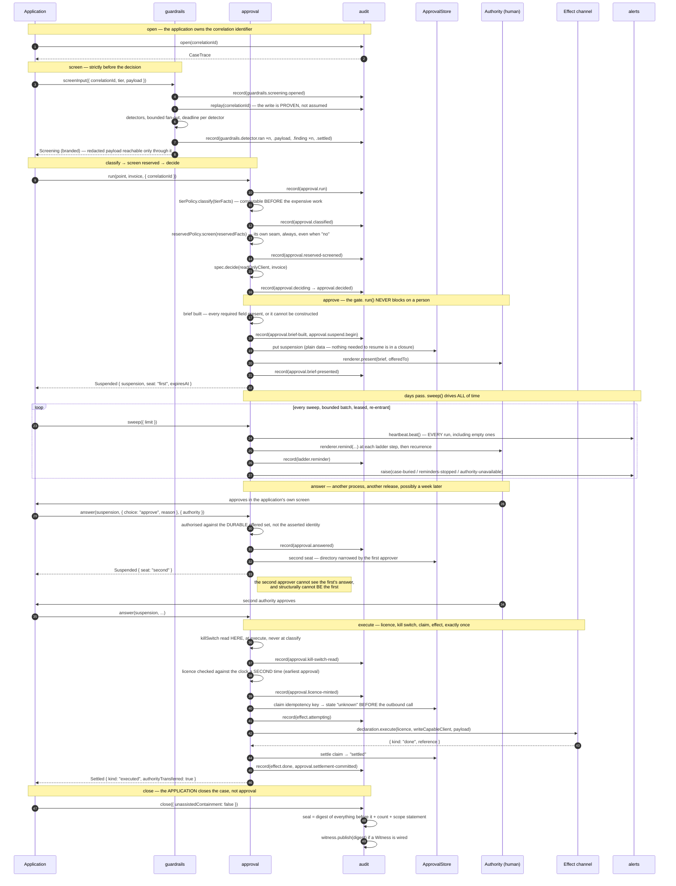
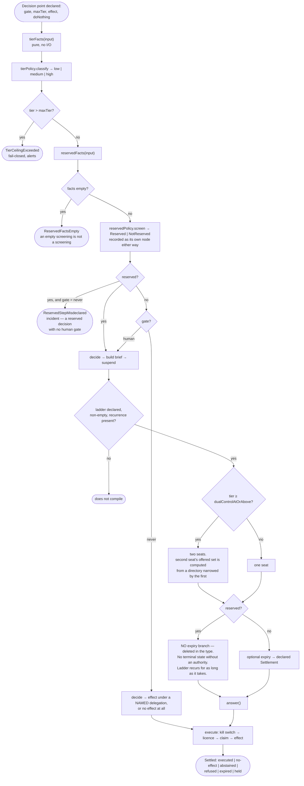
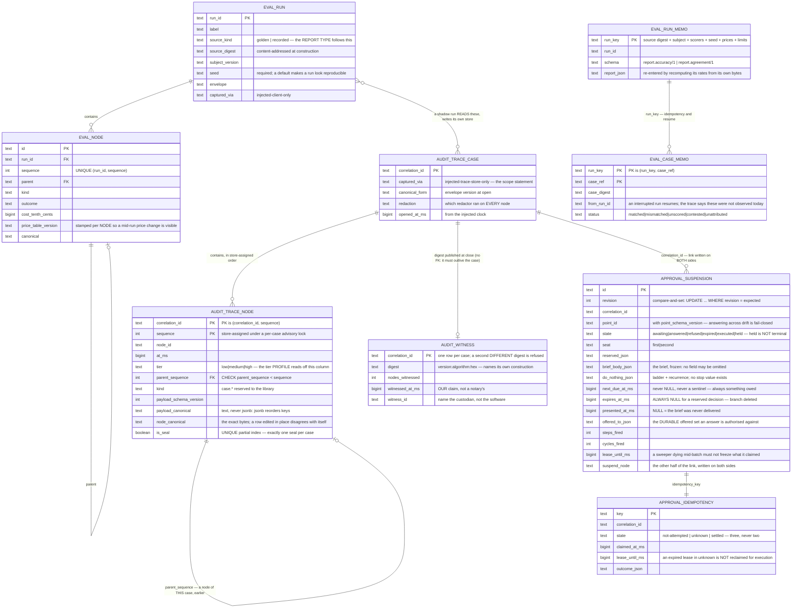

# Architecture

Track A. For engineers about to wire this library into one of the nineteen
applications, or about to change it.

Written from the code that exists. Where a design document and the code
disagree, the code is the truth and the last section says where. Every claim
here was checked against a file; where a guarantee stops, this document says so
rather than smoothing it, because an overstated guarantee is a liability the
first time a regulator finds the gap.

Read `docs/CONTEXT.md` first. The vocabulary is binding and several of its terms
overlap in ordinary speech.

**Contents**

1. [System context](#1-system-context)
2. [Why `audit` is the foundation](#2-why-audit-is-the-foundation)
3. [The modules and their seams](#3-the-modules-and-their-seams)
4. [The main path](#4-the-main-path)
5. [Risk-tier routing](#5-risk-tier-routing)
6. [The data model](#6-the-data-model)
7. [Each module's interface, in full](#7-each-modules-interface-in-full)
8. [Cross-cutting properties](#8-cross-cutting-properties)
9. [Where the guarantees stop](#9-where-the-guarantees-stop)
10. [Where the design documents and the code diverge](#10-where-the-design-documents-and-the-code-diverge)

---

## 1. System context

The library sits between nineteen applications and everything irreversible.
Note what is outside the box on purpose: every model client, every database
driver, every pager transport, and the watchdog.

Three things this diagram is making an argument about.

**Every arrow leaving the library is an injected port.** The library imports no
driver, constructs no HTTP client, and reads no URL, token or routing key from
the environment. That is why hermeticity is structural: there is no code path
from this package to a network for a test to accidentally take, whatever
credentials are present. It is a fact about the call graph, not a flag.

**The watchdog is outside and is not shipped.** `approval.sweep` is what fires
every reminder in the system. If it stops, nobody is chased, nothing throws, no
dashboard turns red, and every waiting case rots. A watchdog running inside that
process dies with it, so the library ships the emit side (`createHeartbeat`),
the store, the verdict (`livenessFindings`) and the query (`livenessQuery`) —
and refuses to pretend it can be its own watcher. `EXTERNAL_WATCHDOG_REQUIREMENT`
is the sentence a deployment must carry verbatim.

**Alerting never shares a channel with escalation.** Escalation routes a
*decision* to a business authority: routine, expected, continuous. An alert says
the *machinery* is wrong: rare, unexpected. Mixed into one channel the routine
volume mutes the exceptional signal. It is enforced in the types — an alert is
addressed to an `OperatorRotaId`, which an authority identifier does not
typecheck as, and an `Alert` carries no brief, no verdict and no effect.

---

## 2. Why `audit` is the foundation

Everything else in this library produces evidence, and `audit` is what evidence
means here. Three arguments, in ascending order of how much they cost to
discover late.

**Depth.** Delete `audit` and the complexity does not vanish; it reappears in
nineteen applications, each inventing an ordering scheme, a serialisation, a
redaction point and a definition of "closed". Nineteen traces that cannot be
compared are nineteen archives, not one. The other four modules exist because
their subject matter is *worth recording*: `approval` records who licensed an
effect, `guardrails` records what was screened and what was not,
`evals` records what was measured, `alerts` records that somebody was told.

**Ordering.** A store-assigned sequence, correct under concurrent writers, is
the only thing that makes replay meaningful. A caller-assigned sequence is a
caller-assigned lie under concurrency, and the two shipped adapters assign it
inside the same critical section that writes — a per-case advisory lock in
Postgres, a serialised append in memory. `createAudit` then checks every
acknowledgement against what it asked to be written, so an adapter that returns
a plausible node it did not form raises `StoreContractViolated`.

**Recording is not optional at the interfaces that matter.** `guardrails`
writes its opened node *before any detector runs* and proves it by replay before
any detector runs either; only then can a `Screening` be minted, and the
redacted payload is reachable only through a `Screening`. `approval` has no
`classify`, `authorise`, `execute` or `suspend` verb — those phases exist,
they are strictly ordered, every one writes a node, and none is reachable from
outside the module. `evals`' `NodeHandle` exposes only `child(spec, body)`, so
the `try`/`finally`, the abort path and the throw path are written by the
library rather than by a caller who might forget. In each case the absence of a
verb is the auditability mechanism.

The dependency direction follows from this and is one-way: `alerts` imports no
other module; `audit` knows only `alerts`; `guardrails`, `approval` and `evals`
know `audit` and `alerts`. Reverse any of it — an `alerts` that inspected a
suspension, an `audit` that knew what an approval was — and the fifth module
becomes a fifth god object.

---

## 3. The modules and their seams

A **seam** is a place behaviour can be altered without editing in that place.
Two shipped adapters make a seam real; one makes it hypothetical, and this
diagram marks the hypothetical ones rather than counting them.

```mermaid
flowchart LR
    subgraph AUDIT["audit — open, record, close, replay, walk, witness"]
        TS{{"TraceStore"}}
        RED{{"Redactor"}}
        WIT{{"Witness"}}
        RET{{"RetentionRegister"}}
        SQL["SqlExecutor<br/>(port, not a seam)"]
        TS --- TSa["inMemoryTraceStore"] & TSb["postgresTraceStore"]
        RED --- REDa["redactAllExcept"] & REDb["redactFields"]
        WIT --- WITa["inMemoryWitness"] & WITb["postgresWitness"] & WITc["separate custody<br/>NAMED, NOT SHIPPED"]
        RET --- RETa["inMemoryTraceStore"] & RETb["postgresRetentionRegister"]
    end

    subgraph APPROVAL["approval — run, answer, sweep, inDoubt, reconcile"]
        AS{{"ApprovalStore"}}
        CF{{"ClientFactory"}}
        TP{{"TierPolicy · ReservedPolicy<br/>AuthorityDirectory · BriefRenderer"}}
        AS --- ASa["inMemoryApprovalStore"] & ASb["postgresApprovalStore"]
        CF --- CFa["inMemoryClientFactory"] & CFb["the application's own"]
        TP --- TPa["the nineteen applications<br/>NONE SHIPPED — no domain here"]
    end

    subgraph GUARDRAILS["guardrails — screenInput, checkOutput"]
        DET{{"Detector"}}
        GRO{{"Groundedness"}}
        CLS["Classifier<br/>(port, zero adapters)"]
        DET --- DETa["deterministicDetector"] & DETb["modelDetector"]
        GRO --- GROa["overlapGroundedness"] & GROb["judgeGroundedness"]
    end

    subgraph EVALS["evals — run, gate"]
        CS{{"CaseSource"}}
        SC{{"Scorer"}}
        ES{{"EvalNodeStore"}}
        RL{{"RunLedger"}}
        HD{{"HumanDecisionSource"}}
        TM{{"Timers"}}
        MB{{"ModelBackend"}}
        CS --- CSa["goldenSuite"] & CSb["recordedCases"]
        SC --- SCa["exactVerdict"] & SCb["judgePanel"]
        ES --- ESa["inMemoryEvalNodeStore"] & ESb["sqlEvalNodeStore"]
        RL --- RLa["inMemoryRunLedger"] & RLb["sqlRunLedger"]
        HD --- HDa["humanDecisionsFromAuditTrace"] & HDb["legacyReviewerExport"]
        TM --- TMa["systemTimers"] & TMb["manualTimers"]
        MB --- MBa["scriptedModelBackend"] & MBb["nineteen provider clients<br/>NOT SHIPPED"]
    end

    subgraph ALERTS["alerts — raise, health, beat, check"]
        SNK{{"AlertSink"}}
        JRN{{"AlertJournal"}}
        LIV{{"LivenessStore"}}
        PT["PageTransport<br/>(port, not a seam)"]
        SNK --- SNKa["pagingAlertSink"] & SNKb["operationalStreamAlertSink"]
        JRN --- JRNa["inMemoryAlertJournal<br/>ONE ADAPTER — hypothetical"]
        LIV --- LIVa["inMemoryLivenessStore<br/>ONE ADAPTER — hypothetical"]
    end

    GUARDRAILS -->|"records into"| AUDIT
    APPROVAL -->|"records into"| AUDIT
    EVALS -->|"reads recorded cases from"| AUDIT
    AUDIT -.->|"AlertRaiser"| ALERTS
    APPROVAL -.->|"AlertRaiser + Heartbeat"| ALERTS
    GUARDRAILS -.->|"AlertRaiser"| ALERTS
    EVALS -.->|"AlertRaiser"| ALERTS
```

Two accounting notes that the diagram would otherwise flatter.

**In-memory adapters are deliverables, not mocks.** `inMemoryTraceStore`,
`inMemoryApprovalStore`, `inMemoryEvalNodeStore`, `inMemoryRunLedger`,
`inMemoryClientFactory` and `recordingAlertSink` are exported and supported.
They are what makes hermeticity structural rather than conventional. Private
fixtures under a module's `tests/` are *not* counted as adapters, by the same
standard.

**`Clock`, `Timer` and `KillSwitchReader` are injected, not seamed.** Injection
is a hermeticism requirement; a seam is a place behaviour genuinely varies with
a second shipped adapter. Counting a fake clock as an adapter would let anyone
call any injected dependency a seam, and then the rule stops meaning anything.

---

## 4. The main path

One invoice: opened, screened, classified, decided, approved by two humans days
apart, paid once, closed. Time runs down the page and days pass in the middle of
it.

Five things worth reading twice.

**`run` never blocks on a person.** There is no promise here that resolves when
a human answers, because `await approve()` is the wrong shape for a wait
measured in days. A suspension is plain data, so the runtime may be rebuilt
between the question and the answer — `postgresApprovalStore`'s own test
serialises the whole database to bytes, throws away every object including the
store and the executor, rebuilds from those bytes alone, and answers the case.

**`sweep` is an honest fourth entry point.** Ladder steps, recurrence reminders,
expiry and the release of a kill-switch hold do not happen because a timer fired
inside the module — nothing here owns a timer. `sweep` is bounded per
invocation, leases what it touches with a time-to-live, is safe to run
concurrently (it will be, during a deploy), and records its own nodes: a
reminder that fired is a `ladder.reminder` node with a parent, so "we chased
them" is evidence rather than an assertion.

**The kill switch is read at execute, not at classify.** A killed run still
records its whole decision. That is the point: the evidence of what the system
*would* have done during the incident is preserved, and a hold is not terminal —
the sweep keeps visiting it, and on release the case returns to the first seat
with the ladder restarted and the sealed answers cleared, because an approval
given before an incident was given against pre-incident evidence.

**The claim goes to `unknown` before the outbound call, never after.** Three
states, not two: `not-attempted` (claimed, nothing sent — safe to retry),
`unknown` (sent, outcome unrecorded — **never** auto-retried, goes to
`inDoubt()` for a human with the trace attached), `settled` (return the original
outcome). Ambiguity resolves toward not paying twice, because a duplicated
payment is a clawback, a trust incident and a regulatory conversation, while a
delayed payment is a phone call.

**`approval` does not close the case.** It returns `authorityTransferred`, which
is a raw fact about one decision. Unassisted containment is a property of a
*case* observed at close, and the application computes it and writes it. Naming
`authorityTransferred` `unassistedContainment` would be exactly the conflation
`docs/CONTEXT.md` spends four pages preventing.

A note on what the diagram shows and the code does not enforce: `guardrails`
runs before `approval` because the application calls it in that order.
`approval` does not import `guardrails`, and `guardrails` cannot see effects.
The ordering it *does* enforce structurally is `checkOutput` requiring an input
`Screening`; the effect side of the ordering belongs to `approval`.

---

## 5. Risk-tier routing

Tier is the **consequence of being wrong**, computed before the expensive work
runs, attached to a decision-and-its-effect rather than to a case. Reading an
invoice is low risk; paying it is high risk; same case, same minute. A case
therefore has a **tier profile**, readable straight off the `tier` column of its
nodes.

Reserved status is orthogonal and is screened on its own seam, always — including
when the answer is "no rule matched", because "we checked" and "nobody thought
about it" must not share a representation.

Note the two states that are deliberately *not* on the terminal list:
`awaiting_authority` is not terminal and is never contained, and a kill-switch
`held` case keeps a due time and stays in the sweep. Any metric that counted a
waiting case as finished — in either direction — would be measuring the wrong
thing.

---

## 6. The data model

Four physical stores, three of them in Postgres today. The separation is not
incidental: `audit`'s trace tables grant `SELECT, INSERT` and nothing else, and
`evals`' tables need `DELETE` to expire 90-day node graphs. Granting `DELETE`
on the trace tables to save disk on test data would void append-only for all
five modules and all nineteen applications, so the stores are separate and **a
trace never spans both**.

**What is not in Postgres.** `alerts`' `LivenessStore` and `AlertJournal` ship
only in-memory adapters; `postgresLivenessStore` is named and not built because
it needs a migration that does not exist. Heartbeat history therefore dies with
the process, and an external watcher polling across a restart sees `never-seen`
rather than a real gap — the safe direction, and still a limit.

**Why `text` and not `jsonb`.** `jsonb` reorders keys and normalises numbers.
That would destroy the byte-stable serialisation replay and the digest chain
stand on. The one place `jsonb` appears is `eval_node.payload`, alongside a
separate `canonical` text column that holds the bytes the digest is computed
over.

**How a payload stays readable for seven years.** Three versions, owned by three
different people, kept apart on purpose: the **envelope version**
(`ENVELOPE_VERSION`, this library's canonicalisation rules), the **payload
version** (`payload.v`, the caller's field set, required and never defaulted),
and — in `evals` — the **artefact version** (the literal `schema` field on a
report). Canonicalisers are registered per envelope version and old ones are
kept, so replay recomputes each node under *its* envelope rather than under
whatever is current. A version this build cannot decode raises `UnknownEnvelope`
— never `TraceTampered`, because "I dropped that canonicaliser" and "somebody
edited this row" are different sentences to say to an auditor.

---

## 7. Each module's interface, in full

*Interface* here means everything a caller must know to use the module
correctly: the signature, but also invariants, ordering, error modes, required
configuration and performance characteristics.

### 7.1 `audit`

**Signature.** `open` → `CaseTrace` (`record`, `close`); `replay`; `walk`;
`witness`; `verifyAgainstWitness`.

**Invariants.** Append-only, in the interface and in the grants. Sequence is
store-assigned. Every node may name a parent of the *same* case, so a case is a
directed acyclic graph. One logical node canonicalises to identical bytes on
every host and version. `close` seals, and `replay` *reads* the seal: the digest
of everything before it, the count it sealed, the scope statement, and the
requirement that the seal is last with sequences running 0..n-1. Redaction runs
before write, so no store adapter ever sees an unredacted payload. `case.`-
prefixed kinds are reserved to the library.

**Ordering.** Totally ordered within one correlation identifier, including under
concurrent writers; nothing is promised across correlation identifiers. `close`
is terminal — recording afterwards is `CaseAlreadyClosed`, an error rather than
a no-op. `replay` reflects acknowledged nodes only.

**Error modes.** 18 named, and exactly one is degradable. `TraceUnavailable`
(`store-failure`, `backpressure`, `capacity`) may degrade at low or medium tier
if the policy permits; every other mode is fail-closed at every tier, because
`AuditError.degradable` defaults to `false` on the class rather than being
listed in an allow-list that a new error mode could silently join.
`StoreContractViolated` covers an adapter that acknowledged something other than
what it was asked to write; `TraceTampered` an edited row; `TraceIncoherent` a
removed row, a row after the seal, a duplicated sequence or a rewritten scope
statement; `UnknownEnvelope` a canonicaliser this build does not have.

**Configuration.** `UnavailabilityPolicy` is **required with no default**, and
`high` is pinned to `"fail-closed"` in the type — it is still required, so a
reader of the composition root confronts it, but no configuration change makes a
high-tier decision proceed untraced. A default there would be a decision about
whether a £2M disbursement may proceed unrecorded, and that decision belongs to
the application that will answer for it. `Redactor` is required; `limits`
(`maxPayloadBytes`, 64 KiB) and `witness` are optional, and an unwired witness
raises `WitnessUnavailable("not-configured")` rather than quietly reporting
agreement.

**Performance.** `maxNodesPerCase` is 100,000 on both adapters, which is why
that ceiling is part of the interface rather than an implementation detail.
`replay` materialises the case and indexes the graph once, so `childrenOf` is
linear rather than quadratic and `digest()` is computed at most once. `walk`
holds one page and a fixed-size verifier however long the case is, cursored on
the store-assigned sequence. Both read paths run the *same* incremental checks
in `lib/stream.ts`; two paths claiming one guarantee and holding different ones
is the defect this module spent its releases removing. A walk that stops early
gets no verdict, deliberately.

**Alerting.** `trace-unavailable-at-high-tier` — the seventh silent condition.
Fail-closed is correct here *and* means work has stopped, and the only outward
sign is an error a retry loop will reasonably catch. The alert record travels on
`TraceUnavailable.alerting`, because the one place this library normally records
an alert — a node on the case's trace — is the thing that just failed.

### 7.2 `approval`

**Signature.** `run`, `answer`, `sweep`, `inDoubt`, `reconcile`. Five verbs; the
last two are reconciliation queues and exist because two stores that cannot
share a transaction can still be compared.

**Invariants.** No `decide` receives a write-capable client at any tier, and
declaring one is a compile error in both directions. `ReservedStatus` has no
boolean and no `undefined` branch. A gated decision cannot be declared without a
non-empty ladder and a recurrence with no stop value and no maximum attempt
count; the cadence is bounded and never accelerates, and each cycle widens the
audience rather than raising the volume. An answer is authorised against the
**durable set of authorities the directory actually offered the brief to**,
never against the identity the calling surface asserts — and dual-control
distinctness falls out of that, because the second seat's set is computed from a
directory narrowed by the first approver. `licenceValidFor` is enforced twice,
once in `answer` and once at the instant of execution against the clock, and it
runs from the **earliest** approval in hand so a second seat cannot resurrect a
stale first one. Every number crossing into the trace is a safe integer.

**Ordering.** Classify → screen reserved → decide → (gate) → approve → execute →
settle, strictly, and no phase is reachable from outside. The kill switch is read
at execute. The idempotency claim is written before the outbound call.

**Error modes.** 25 named. Notable: `IdempotencyIndeterminate` (`unknown`
semantics, fail-closed, alerts, never auto-retried); `AuthorityUnavailable`
(nobody to escalate to — looks like a queue with nothing in it, so it alerts);
`ReservedStepMisdeclared` and `ReservedDelegationAttempt` (a reserved decision
routed as though it were not); `PointSchemaChanged` and
`EffectDeclarationDrifted` (answering across a declaration change is fail-closed,
because the payload was serialised under the old field set);
`LadderCadenceTooTight` (a recurrence that would flood and therefore mute a
channel); `SuspensionRaceLost` (compare-and-set lost, correct under concurrent
writers).

**Configuration.** Twelve injected dependencies, no defaults for the four
policy seams. `limits` defaults exist and are all bounds rather than policies:
`sweepBatch` 200, `sweepLeaseMs` 5 min, `minRecurrenceIntervalMs` 1 hour,
`idempotencyLeaseMs` 10 min, `maxRecipientsPerReminder` 12, `inDoubtBatch` 100,
`reconcileBatch` 50, `maxInFlight` 64, `parentIndexCases` 512. `sweeperId`
identifies this process in a lease; two sweepers must be distinguishable.

**Performance.** Nothing unbounded: no unbounded batch, fan-out, queue read or
retry — and no retries on an effect at all, at any tier, ever. `maxInFlight` 64
matches `audit`'s Postgres adapter deliberately, so two ceilings bounding the
same connection pool do not disagree by an order of magnitude. A parent index is
held for at most 512 cases, least-recently-used evicted, so a 200-suspension
sweep replays at most 200 traces the first time and none thereafter. No lock is
ever held across the human gate: every conditional write is a single
`UPDATE ... WHERE id = $1 AND revision = $2`.

**Alerting and the heartbeat.** Five of the eight silent conditions are visible
only from inside this module, and every one returns success or returns nothing:
a reserved decision completed unassisted, an effect in `unknown`, reminders that
stopped, a buried case, and `AuthorityUnavailable`. What became of each raise is
recorded on the node — `alerted: "delivered"` and `alerted: "not-configured"`
are different rows in the archive seven years from now. `sweep` beats on every
run under `DEFAULT_SWEEPER_COMPONENT` (`"approval.sweeper"`), including empty
ones, and **the watcher is external**.

### 7.3 `guardrails`

**Signature.** `screenInput` (strictly before the decision) and `checkOutput`
(strictly after the decision, strictly before any effect). No third verb: there
is no `redact`, no `runDetector`, no `score`.

**Invariants.** Fail-closed, at every tier, with no configuration key that
changes it: a detector that errors, times out or declares itself unavailable
yields **abstain-recommended, never allow**. This is deliberately the *opposite*
of `audit`'s tiered policy, and both modules state the asymmetry because a
reader who learns one will assume the other — an unrecordable decision is a gap
in the evidence about work that was nonetheless done, and its cost genuinely
differs between routing a ticket and a £2M disbursement; an unscreened payload is
a gap in the work itself, and there is no tier at which "we did not check, so we
allowed it" is defensible. `Sources` has no empty-array branch. Detectors report
*coordinates*, never matched text, and receive deep-frozen copies of both the
payload and the sources with no client, no store, no recorder and no clock — so
a detector cannot rewrite the reference material a sibling is judged against.
"Nothing found" is `searchedAndFoundNone: { searched }`, never an empty array.
`Pattern` cannot be constructed from a regular expression capable of exponential
backtracking; `safePattern` is the only mint and there is no override.

**Ordering.** The opened node is written before any detector runs, and *proven
by replay* before any detector runs either. Only then is a `Screening` minted,
and the redacted `ScreenedPayload` is reachable only through one — so a caller
holding the screened payload has already caused every node to be written.
`checkOutput` requires an input `Screening`, which is what makes the ordering
structural rather than documented.

**Error modes.** 13 named, none degradable. `PatternUnsafe` is a **boot**
failure, never a screening-time one. `LocaleNotJurisdictional` refuses `en` where
`en-GB` is required, because a language is not a jurisdiction, and a detector
wired into a market it does not declare fails at construction rather than by
finding nothing. `LimitsInvalid` range-checks every bound, because
`maxFindingsPerScreening: 0` used to turn a `block` into an `allow`.

**Configuration.** `locale` and `detectorSets` are required with no default and
no fallback. `rateAlerting` is optional but is wired **as one object with its
raiser**, so a window with nowhere to raise cannot be constructed —
half-wiring would produce something that *looks* monitored, which is worse than
being visibly unmonitored. Defaults: `detectorConcurrency` 8,
`detectorBudgetMicros` 2,000,000, `maxFields` 64, `maxFieldChars` 32,768,
`maxRecordedFieldChars` 512, `maxFindingsPerScreening` 64, `maxClaims` 128,
`maxSources` 32.

**Performance.** Bounded fan-out, bounded payload, bounded finding list, a
bounded budget per detector — and **no retries at all**. A caller wanting a
second attempt re-screens with the first `Screening` as `under`, so the retry is
a visible node with a recorded parent rather than a hidden one. `Detector.screen`
must return a promise, so the race is scheduled rather than deferred, and every
detector is handed a `deadline` — one bit over the engine's injected clock — that
both shipped adapters check between patterns, between fields and between
classifier calls.

**Coverage, which is the module's honest half.** Every screening reports how much
of the payload a completing detector examined, how much text went into the trace
unmasked, and what the detectors that ran declare they do and do not cover — the
third list being the one that prevents the incident, because a missing rule is
invisible in a trace unless somebody wrote it down. `localeCoverage(locale)`
answers the same question before anything is wired.

### 7.4 `evals`

**Signature.** `run` and `gate`, plus constructors and artefact readers
(`goldenSuite`, `recordedCases`, `defineSubject`, `exactVerdict`, `judgePanel`,
`preMergeSubset`, `accept`, `runKeyOf`, `exitCodeFor`, `mintCompletedRun`,
`reopenAccuracyReport`). A third *executing* entry point is a signal to split
the module, not to extend it.

**Invariants.** **The report type is derived from the case source, not from
which function you called**: a golden suite yields an `AccuracyReport`, recorded
production cases yield an `AgreementReport`, and neither is assignable where the
other is expected. There is no `runShadow` and no `mode: "shadow"` flag, because
a shadow run is not a different verb — it is a run whose cases came from
production. `gate` accepts only an `AccuracyReport`. Agreement is not accuracy:
if reviewers are wrong 8% of the time, perfect agreement is 8% wrong, so the
field is called `disagreements` and every one is a case for adjudication rather
than a defect. A subject cannot write — `Client<"read">` and `Client<"write">`
are disjoint in both directions — which is what gives a shadow run its
no-effect guarantee structurally rather than by a flag. Determinism is
**checked, not declared**: a seeded sample is re-executed under the identical
seed and the verdicts compared byte for byte. A partial run cannot pass a gate.
An unscored case is never `passed`.

**Ordering and idempotency.** `run` is content-addressed by `runKeyOf(spec)` —
source digest, subject version and purity, scorer digests, seed, price-table
version, every limit. Re-running a completed key **returns the original report
and executes nothing**: the original `runId`, `startedAt` and `traceDigest`, not
a fresh run that happens to agree. An interrupted run resumes, and the resumed
cases arrive stamped with the run and node they came from so the trace says they
were not observed today. A partial run is never memoised as complete —
`mintCompletedRun` is the only producer of the ledger's write type and refuses
one. There is no `force: true`.

**Error modes.** 24 named. `EvalStoreUnavailable` is fail-closed at every tier
with no configuration key, **on every path including scoring** — this is
deliberately the opposite of `audit`'s per-tier policy, because `audit` lets a
low-tier decision proceed unrecorded when a real customer is waiting and an eval
run has no customer. `ProviderUnavailable` (a 429, a 503, a reset) makes a case
`could-not-evaluate` with its own status, rate, gate reason and exit code: a
provider that will not serve is not a regression. `RecorderNotMinted`,
`StoreNotMinted` and `LedgerNotMinted` are the brands refusing an impostor.

**Configuration.** `seed`, `limits` and `priceTable` are all required with no
defaults — a default seed makes a run look reproducible, and a default price
table silently rewrites historical cost figures. `DEFAULT_LIMITS` exists to be
passed explicitly: concurrency 8, 12 s per case, 300 s per run, 20 case
failures, 3 retries, 15,000 tenth-cents ceiling, 2 determinism-sample cases.
Gate floors default to attribution 10,000 basis points, 0 unscored, 500 basis
points contested.

**Performance.** Target: 200 golden cases under 5 minutes at concurrency 8
(200/8 = 25 waves × 12 s = 300 s). Both wall clocks race the subject and the
scorers, so a subject ignoring `ctx.signal` bounds the run rather than hanging
it. What is *not* bounded, stated because JavaScript cannot: the subject's own
promise. Nothing here kills it — the run terminates, the node is settled
`timeout`, the report is `partial`, and the abandoned work runs on.

### 7.5 `alerts`

**Signature.** `createAlerts` (`raise`, `health`), `createHeartbeat` (`beat`),
`createLivenessCheck` (`check`), `livenessQuery`, and one assertion —
`assertProductionAlerting`, called at the composition root, which throws rather
than letting a chain that pages nobody look healthy.

**Invariants.** Severity is **derived from the condition, never a parameter**,
and the ordering "a missed heartbeat outranks every per-case alert" is a
compile-time proof in `lib/severity.ts` rather than a comment: one stalled case
is one customer, a stopped sweeper is every waiting case at once. The condition
union is closed at nine — the eight silent conditions plus the missed heartbeat —
and exhaustively checked in four places (severity table, correlation lookup,
fingerprint, payload), so adding a tenth without handling it does not compile.
A component must be `watch`ed before it may `beat`. Suppression collapses
repeats but **never silences a condition**: the first occurrence always fires,
every window ends, and the collapsed count rides on the next delivery. **No
condition has a free-text field**, so there is nowhere for a name or a narrative
to arrive, and a sink failure records the exception's *name* only — never its
message, which routinely echoes the request that failed.

**Ordering and degradation.** Sinks form an ordered chain. A sink that throws
does not take the case down and does not fail silently: it degrades to the next
sink and the degradation is recorded on the outcome, in the journal, and in
`health()`. A chain that fails entirely returns `outcome: "undelivered"`. What
this module does **not** do is raise an alert about the alerting through the
alerting — that is an infinite regress dressed up as thoroughness. The regress
stops at the external watcher, which reads `health()` alongside the liveness
records. That is the honest bottom.

**Error modes.** 6 named, all fail-closed, none degradable, because every one is
a defect: a float in a payload, an unknown condition, an unusable bound, a chain
that pages nobody, a heartbeat nobody watches. **Delivery failures are not
errors here** — they are recorded degradations on the returned outcome, so
`try { alert() } catch {}` cannot turn a failed alert back into a silent one.

**Configuration.** Clock, timers, transport, stream, store and journal are all
injected; this module constructs no HTTP client and reads no URL, token or
routing key from the environment. Defaults: `suppressionWindowMs` 300,000,
`maxTrackedFingerprints` 1,024, `maxInFlightDeliveries` 8, `maxQueuedRaises`
256, `deliveryTimeoutMs` 5,000, `ledgerSize` 128, `maxIdentifierChars` 256 —
each range-checked, each publishing what it shed.

**How the other four modules reach it.** Through exactly one function:
`raiseAndRecord(alerting, condition)`. It never throws and its result is
node-shaped, so a detection site spreads it into the payload it was already
writing — an alert that fired and left no trace is half a mechanism, and the
missing half is the half an auditor reads.

---

## 8. Cross-cutting properties

**Concurrency.** Correctness under concurrent writers is a per-store property,
implemented rather than assumed. `audit`'s Postgres adapter assigns sequences
inside a per-case advisory lock and the primary key `(correlation_id, sequence)`
makes a duplicate impossible even if the lock were bypassed; the one-seal
partial unique index makes a second close impossible for a writer that ignores
the interface. `approval` uses compare-and-set on a `revision` column in a single
statement, so two writers to one case are correct without a lock — and no lock is
ever held across the human gate, because a lock held for three days is an outage.
`sweep` leases what it touches with a time-to-live and is safe to run
concurrently. `evals` assigns node sequences inside a per-run advisory lock.

**Fail policy at a glance.**

| Module | Degradable modes | Why |
|---|---|---|
| `audit` | `TraceUnavailable` only, and never at high tier | A gap in the evidence about work that was done; its cost genuinely differs by tier |
| `approval` | none | Between a verdict and an effect there is no tier at which proceeding blind is defensible |
| `guardrails` | none, at any tier, with no configuration key | An unscreened payload is a gap in the work itself |
| `evals` | none, on every path including scoring | An unrecorded eval run produces a number nobody can check, and no customer is waiting |
| `alerts` | none; delivery failures are recorded outcomes, not errors | So a swallowed exception cannot turn a failed alert back into a silent one |

**Hermeticity.** 707 tests across 76 files, none of which can open a socket.
This is not a flag and not an environment variable: no module constructs its own
model client, clock, database handle, HTTP client or pager transport, so there
is no code path from this package to a network to be disabled. `audit`'s
Postgres test file states what that costs — the schema's own guarantees are
properties of Postgres and are verified by an operational step outside the test
suite, so a green run is evidence about the adapter and *not* evidence that
append-only holds in the database.

**Boundaries.** `npm run lint:boundaries` (dependency-cruiser) forbids any
import into a module's subfolders from outside it — including from
`src/index.ts`, and including from a module's own tests, which cross the same
seam as the nineteen callers. It also forbids cycles. A shallow module fails
continuous integration rather than merely looking wrong in review.

---

## 9. Where the guarantees stop

Each module states its own ceiling; they are collected here because a reader
comparing them is the one most likely to over-read a single sentence.

**"Unrepresentable through this module", never "unrepresentable".** No type in
this package reaches outside this package. Application code holding its own
closure can `import` a provider SDK inside `decide` and call a model directly,
or call a payments provider and move money with no node of any kind. Each module
stamps its scope onto the artefact rather than asserting a stronger claim in
prose: `capturedVia: "injected-trace-store-only"` on every case,
`"declared-seams-only"` on every `approval` node,
`"caller-supplied-audit-witness"` on every `guardrails` screening,
`"injected-client-only"` on every eval run and report. A reader in 2033 learns
the limit of the evidence from the evidence.

**Acknowledgement is not proof of a write.** A store that forms the node
correctly and discards it is indistinguishable from one that writes it, until
you replay. **Replay is the proof of a write**; acknowledgement is the proof of
a correctly formed node. Branding stops a two-line impostor from typechecking; a
runtime check catches a cast; neither proves that bytes reached a disk.

**Tamper detection has a ceiling and the witness is where it now stops.** An
edited row is `TraceTampered`; a removed row, a row inserted after the seal, a
duplicated sequence or a rewritten scope statement are `TraceIncoherent`. An
adversary who rewrites the whole case and recomputes the seal is caught by none
of them, because every one of those checks is computed from the rows and that
adversary controls the rows. Publishing the whole-case digest to a `Witness`
moves the ceiling — it defeats a consistent rewrite, a case restored from an
edited backup, and retro-dating — and does not remove it: an adversary holding
both sets of credentials, a compromise of the host both tables sit on, tampering
before the seal, and anything at all in the in-memory adapter all remain.
Crossing a real trust boundary needs a witness under separate custody, which is
a third adapter behind the same interface, named and not shipped.

**Redaction covers detected sites.** Text no detector flagged is recorded
verbatim, bounded by `maxRecordedFieldChars`, and the digest beside the
truncation is brute-forceable for a low-entropy value. That is inherent to
detection-based redaction. `Screening.coverage` makes it visible rather than
closing it, so "we found and masked three items" and "we found nothing and wrote
all 4,812 characters down" are different rows in the trace.

**Under-recording is detected in one shape only.** A decision subtree with no
recorded model call, from a subject that did not declare itself pure, fails the
gate. `purity: "pure"` turns the check off — such a run is reported
`declared-pure` with coverage `0`, an assertion by the subject's author rather
than a measurement — and under `"calls-models"` the check is a floor of one, so
a single three-token call satisfies it. That is not fixable, so `modelCalls` and
`costTenthCents` are on every case result instead: "high-tier underwriting
determination, 1 call, 3 tokens" is a shape a reviewer can see without having to
allege anything.

**The report brands hold in one process, and only there.** `AccuracyReport` and
`AgreementReport` are sealed with non-exported symbols, which does not survive
`JSON.stringify`. The boundary is carried by three things instead: the brands in
process, the literal `schema` and `against` fields that do survive
serialisation, and `reopenAccuracyReport`, which refuses an agreement report by
schema and **recomputes the four rates from the cases**. What that does not
prove is that the run happened; establishing *that* means reading the trace out
of the eval store by `runId` and recomputing `traceDigest`, which is what an
auditor does rather than what a gate does.

**The suspension and its trace node do not share a transaction, and cannot.**
`audit` exposes none, and a transaction spanning `decide` would hold a pooled
connection open across a model call. The link is therefore written on both sides
— the record carries `suspendNode`, the node carries the suspension identifier —
so a crash between the two writes loses a row rather than the link, and
`reconcile` is the bounded query that finds the disagreement. This is a real
weakening, reported rather than dressed up: the window is detectable and
recoverable, not absent.

**A missed heartbeat cannot be delivered by this library.** It is the one alert
that requires something outside the process, and it is the deployment step most
likely to be skipped and the most expensive to have skipped.

---

## 10. Where the design documents and the code diverge

The code is the truth. These are the places a reader of `docs/design/` would
otherwise be misled.

| Design document says | The code does | Reading |
|---|---|---|
| `PHASE-2-INTERFACE-REVIEW.md`: "**Four** modules confirmed. No implementation code exists yet." | Five modules, all implemented; `alerts` was added afterwards and did not come from that review. | The review's status line is stale. `src/index.ts` records why `alerts` exists and applies the same deletion test to it. |
| `PHASE-2`: `Audit.open(caseId, profile: TierProfile)`, and `CaseTrace.close(containment: Containment)` | `open(correlationId)` takes no profile — tier is supplied per `record` and stamped on the node, so the tier profile reads straight off the trace. `close(outcome: UnassistedContainment)`. | Both changes follow settled decisions: tier attaches per decision-and-effect (item 5), and bare `containment` is a lint failure per `CONTEXT.md`. |
| `PHASE-2`: `Audit` is "three verbs a caller learns" | Five: `open`, `replay`, `walk`, `witness`, `verifyAgainstWitness` (plus `record`/`close` on `CaseTrace`). | `walk` exists because `replay` is the wrong verb at the 100,000-node ceiling; the witness verbs exist because tamper detection computed from the rows has a ceiling. Both are documented additions, not drift. |
| `OPEN-ITEMS-RESOLVED.md` item 2: "an honest fourth entry point: `approval.sweep(now)`" | `sweep({ limit })`, reading `now` from the injected clock. | Stated in `approval/index.ts`: a module with two sources of time has two clocks, and they disagree on the day it matters. Ageing stays fully testable because the clock is a constructor parameter. |
| `OPEN-ITEMS-RESOLVED` item 0's sketch uses `Duration`, `ReservedStatus` as `{ reserved: true }` | `DurationMs`, and `ReservedStatus` is a discriminated union whose `NotReserved` arm carries a `basis` and a `policyVersion`. | The sketch's shape would let "we checked and it is not reserved" and "nobody thought about it" produce byte-identical nodes; the code refuses an empty fact set with `ReservedFactsEmpty` for the same reason. |
| `OPEN-ITEMS-RESOLVED` item 1: the recorder is branded so a caller cannot supply an impostor | Branded on `TraceStore`, `EvalNodeStore`, `RunLedger` and `Screening` — **not** on `Audit`, which is what `GuardrailsDeps.audit` names. | The one place the resolution is not implemented. `guardrails` compensates by checking every acknowledgement and proving its first node by replay, and reports the brand upward as the real fix. Item 1 is not fully delivered. |
| `evals/index.ts` and `guardrails/index.ts`: "`evals` consumes [`Groundedness`] as a scorer; `guardrails` wraps it as a detector. One implementation, two callers." | Only `guardrails` uses it. `evals` does not import `guardrails` and ships no adapter converting a `Groundedness` into a `Scorer`. | The interface is *shaped* to be usable as a scorer — pure, integer result, no correlation identifier, no recorder, no tier — and a caller can write the four-line adapter. As shipped it has one caller. |
| `OPEN-ITEMS-RESOLVED` item 6: an `AlertSink` seam with "two real adapters" and alerting driven by absence | Delivered — two sink adapters, nine conditions, severity proved in the type. But `AlertJournal` and `LivenessStore` each ship **one** adapter, and `postgresLivenessStore` needs a migration that does not exist. | Item 6's alerting is real; its durability is not. Heartbeat history dies with the process. |
| `docs/CONTEXT.md`'s eighth silent condition: "**Abstention rate**, or fail-closed screening rate, moves sharply" | `AlertCondition.measure` declares `"abstention" \| "fail-closed-screening"`, and only the second is ever produced — by `guardrails`' rate watch. Nothing in this library watches the abstention rate. | Half of that condition is unimplemented. An application relying on abstention-rate alerting must compute it itself. |
| `docs/CONTEXT.md`: a kill switch stops effects "system-wide **or per tier**" | `KillSwitchReader` is `() => Promise<KillSwitchState>` — it takes no tier and asks no per-tier question. `scope` is a string recorded on the node. | Scope is recorded, not enforced. A per-tier kill switch is the reader's own business today, and the trace will faithfully record whatever it says. |
| `docs/CONTEXT.md` open question 1: "Does `verdict` survive as a separate term from `decision`?" | It survives. `Verdict` is the content and a `Determination` produces exactly one, immutably. | Settled by the code; not yet written back into `CONTEXT.md`'s open-questions list. |
| `docs/CONTEXT.md` and `OPEN-ITEMS-RESOLVED`: decisions "are tracked as ADRs once decided" | `docs/adr/` holds thirteen records, one per settled decision. | No divergence. Retained as a row because the promotion is the thing a reader checks. |
| `audit/tests/postgres-store.test.ts`: the schema's guarantees "are verified by applying `migrations/0002_audit_trace.sql` to a real database and running the assertions from `docs/RUNBOOK.md` against it" | No such assertion set exists. The runbook covers the watchdog, the eight silent conditions, digest verification and reconciliation; it does not carry a grants-and-triggers verification procedure. | The primary key, the one-seal index, the parent foreign key, the immutability triggers and the `INSERT`-only grants are asserted by nothing that runs. This is the largest untested surface in the repository. |
