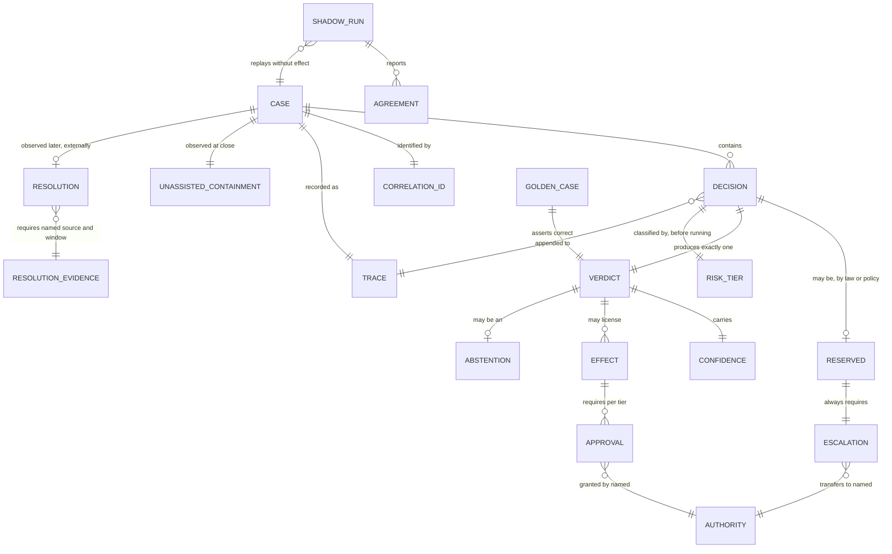

# Context: agent-ops-core

The ubiquitous language for the operational machinery shared by nineteen AI
decisioning applications. The applications differ entirely in domain — claims,
invoices, tickets, expenses, membership, underwriting. These words are the part
they hold in common, so these words have to be exact.

**This file is binding.** Code, comments, column names, metric names, log
fields, dashboards and both documentation tracks use these terms with these
meanings. If a term feels wrong, change it here first, then change the code. A
term that means one thing in `evals` and another in `audit` has already cost
more than it saved.

Several of these words overlap in ordinary speech. Where they do, the entry
says what the term is **not**, because the confusion is the expensive part.

---

## The unit of work

**Case**:
One instance of the thing the application exists to judge — a claim, an
invoice, a ticket, an expense report, a membership application. Owned by the
application; `agent-ops-core` knows only its identity, its tier, and its trace.
A case has a lifecycle and reaches exactly one terminal state.
_Avoid_: request, job, task, item, conversation, ticket (unless the domain is
literally ticketing).

**Correlation ID**:
The stable identifier that ties every decision, tool call, token, and effect
belonging to one case together across processes and retries. Assigned once, at
case creation, by the application.
_Avoid_: trace ID, request ID, session ID.

**Trace**:
The complete, ordered, append-only record of everything that happened under one
correlation ID, sufficient to replay the case. A trace is evidence, not a log —
it is written to be read years later by someone hostile.
_Avoid_: log, history, audit log (an audit log is a trace; call it a trace).

---

## The act of judging

**Decision**:
One recorded act of judgment: a bounded computation that takes a stated
question about a case, plus the evidence available at that instant, and
produces a verdict. A decision is an **event** — it has an identity, a
timestamp, inputs, an author (model or human), a cost, and exactly one verdict.
One case usually contains several decisions.
_Avoid_: inference, call, run, prediction, judgement (spelling), evaluation.

**Verdict**:
The **content** of a decision — what was concluded, plus the disposition that
follows from it. Decision is the *when, by whom, on what*; verdict is the
*what*. A verdict is immutable; a case that needs re-judging gets a new
decision with a new verdict, never an edited one.
_Avoid_: result, output, answer, outcome (outcome is reserved — see below).

> **Challenge.** If you do not want this event/content split, cut `verdict` and
> keep `decision` for both. Two words for one concept is worse than either word
> alone, and nineteen teams will each pick a different one. I think the split
> earns its place — replay compares verdicts while audit indexes decisions —
> but it is your call, and it is cheaper to make now than after nineteen
> schemas exist.

**Confidence**:
The system's own estimate of how likely its verdict is to be wrong. A property
of the verdict, produced by the decision.
_Avoid_: score, certainty, probability, trust.

**Effect**:
An action taken in the world outside the system as a consequence of a verdict —
a payment issued, an email sent, a policy cancelled, a record written to a
system of record. Effects are the only irreversible part of a case. A decision
without an effect can always be replayed; a decision with one cannot be undone
by replaying it.
_Avoid_: action, side effect, write, mutation.

---

## Dispositions

These three are routinely collapsed into one status field. They are
independent, and collapsing them destroys information you will need.

**Abstention**:
The system deliberately declining to produce a determination, because it judges
itself unfit to judge this case — evidence missing, question out of scope,
guardrail triggered, confidence beneath the tier's floor. An abstention is a
**successful outcome of a working system**, and is recorded as a verdict like
any other.
_Avoid_: failure, error, unknown, null, timeout, low confidence, punt.

**Not** an error: an error is the system breaking. An abstention is the system
working correctly and saying so. **Not** a low-confidence determination: in that
case the system did conclude, weakly. Abstention means it did not conclude at
all. **Not** an escalation: abstention is about the system's own epistemic
state; escalation is about who holds authority next.

**Escalation**:
Transfer of authority over a case from the system to a named human role,
because policy requires it or because the system abstained. Escalation changes
**who decides**, not what is decided.
_Avoid_: handoff, handover, transfer, routing, fallback, human-in-the-loop.

**Not** a notification: telling a human is not escalation unless authority moves
with the message. **Not** retrying on a more capable model: that is another
decision at higher cost, and calling it escalation makes "escalation rate" mean
two different things at once. Escalation crosses the human/machine line, or it
is not escalation.

**Approval**:
A recorded act by a named authority licensing an effect to take place. Approval
answers *may this happen*; a verdict answers *what is true*. Keeping them apart
is what lets a case be replayed without its payments being made twice.
_Avoid_: sign-off, authorisation, confirmation, gate, permission.

An authority may be a human, or — at low tiers only — an automated policy
holding explicitly delegated authority. Automated approval is still approval and
is still recorded with a named authority; "the system approved it" must never
appear in a trace without saying under whose delegation.

**Dual control**:
A requirement that two distinct authorities approve the same effect, where
distinctness is enforced structurally rather than checked. The second approver
must be unable to be the first.
_Avoid_: four-eyes, maker-checker, double approval.

**The second approver must not see the first approver's verdict before giving
their own.** Dual control where the second person is shown "Jane approved this"
is not two decisions; it is Jane's decision with an echo. The brief served to
the second approver structurally excludes the first's outcome.

**Approval brief**:
The package of information that must accompany a request for approval, without
which the request cannot be constructed. Not a screen — the data behind one.
Each application renders it however suits its people; none may omit a field.
_Avoid_: context, summary, approval screen, review packet.

Required contents:

1. **The effect in concrete terms** — what will actually happen, in the units
   the approver thinks in. "£47,200 leaves account 8812 today", not "payment
   authorised".
2. **What the system concluded, and the evidence it used** — with the evidence
   reachable, not summarised away.
3. **What the system is unsure about, stated explicitly**, including contrary
   evidence. A brief that presents only the supporting case is advocacy, not a
   brief.
4. **What it could not check**, and why. Absence of a finding is not a finding.
5. **Whether the decision is reserved**, and under which rule or statute.
6. **What happens if the approver does nothing** — expiry, escalation, or
   indefinite hold. An approver who does not know the cost of waiting cannot
   weigh it.
7. **The correlation identifier**, so the full trace is one step away.

**Escalation ladder**:
*Plain English: what happens as a case sits unanswered — who gets told, when,
and who it goes to next.*
The ordered sequence of ageing responses for a decision awaiting an authority:
each step names a delay, an action, and a recipient. Mandatory and non-empty
for every gated decision, and doubly so for a reserved one.
_Avoid_: timeout, SLA, reminder, chase, nudge.

**Removing the expiry branch is not sufficient on its own.** A reserved
decision correctly has no default to time out *into* — "nobody was on shift" is
not a lawful basis for an automated decision. But a decision with neither an
expiry nor a ladder does not fail safely; it fails **silently**, which is worse.
The case sits unanswered, nothing errors, no dashboard turns red, and it lands
in the dangerous quadrant: not contained by any honest reading, not resolved,
and invisible.

The rule is therefore two-sided, and both sides are enforced in the type:

- **A reserved decision has no terminal state reachable without an authority
  answering.** No expiry, no default, no threshold, no override.
- **A gated decision cannot be declared without a non-empty ladder.** The
  `DoNothing` type deletes the `expire` branch for reserved decisions *and*
  requires `ladder: NonEmpty<EscalationStep>` for all gated ones. Declaring a
  human gate without saying what happens as it ages does not compile.

An unanswered case therefore gets **louder over time, never quieter**. Waiting
is legitimate; waiting silently is not.

**Ageing**:
The recorded fact that a decision has been awaiting an authority for a given
duration, and which ladder steps have fired. Ageing is recorded as nodes on the
trace like anything else — a case that waited eleven days and escalated four
times has that written down, not merely implied by two timestamps.
_Avoid_: pending, stuck, stale, in progress.

**A case awaiting an authority is never `contained`, and is never terminal.**
It has not completed. Any metric that counts a waiting case as finished — in
either direction — is measuring the wrong thing, and the terminal states are
closed such that "awaiting" is not among them.

**The ladder never terminates into silence.** Its scheduled steps are followed
by a **recurrence** that repeats until an authority answers. There is no "stop"
value and no maximum attempt count — the type cannot express giving up. A
decision that needed a human yesterday still needs one next month, and a system
that stops asking has decided by exhaustion, which is the thing reserved
decisions exist to prevent.

**Recurrence**:
The repeating tail of an escalation ladder: what is sent, to whom, and how
often, once the scheduled steps are spent. Mandatory. Continues until answered.
_Avoid_: retry, final notice, give up, max attempts.

Two production constraints on it, and the second is the one usually missed:

- **Cadence is bounded and non-degrading.** Reminders recur on a floor interval
  and never accelerate. A recurrence that speeds up floods a channel, the
  channel gets muted, and the case is then *less* likely to be answered than if
  nothing had been sent. Persistence is the goal; frequency is not.
- **Recurrence widens the audience, it does not raise the volume.** The
  fifteenth reminder to a person who has ignored fourteen is not a plan. Each
  cycle adds recipients — deputy, then line manager, then the accountable
  executive — and holds the cadence steady. Reaching someone who *can* answer
  beats reaching the same person more often.

Every reminder sent is recorded as a node, so "we chased them" is evidence
rather than an assertion.

**Buried case**:
A decision awaiting an authority whose scheduled ladder steps are spent and
which is now in recurrence, still unanswered. It is an **incident**, not a
state — the ladder has failed, and the failure is of the organisation, not of
the case.
_Avoid_: stale, abandoned, orphaned, timed out, expired.

Buried does **not** mean the chasing stopped. Reminders continue on the
recurrence for as long as the case is unanswered. A buried case remains
answerable indefinitely: it never self-resolves, it never disappears from the
queue, and it never acquires a verdict by the passage of time. The library
refuses to close it; only an authority can.

**Alert**:
*Plain English: telling an engineer the machinery is broken.*
A notification that the system is not working correctly, addressed to an
operator rather than to a business authority.
_Avoid_: notification, warning, escalation, page, incident.

**An alert is not an escalation and must never share its channel.** Escalation
routes a *decision* to an authority because the business requires a human
judgement; it is expected, routine, and happens continuously. An alert says the
*machinery* is wrong; it is unexpected and rare. Mixed into one channel, the
routine volume mutes the exceptional signal, which is the same failure the
recurrence cadence rule exists to prevent, one level up. Different channel,
different recipient, different urgency, always.

**Silent failure**:
A fault that produces no error. Nothing throws, nothing returns non-zero,
no request fails, and every dashboard stays green.
_Avoid_: soft failure, degraded, edge case.

These are the failures that reach a customer before they reach an engineer, and
they are exactly the dangerous quadrant of the outcome table. A case awaiting an
authority is not an error. A payment whose outcome is unknown is not an error. A
reserved decision that completed unassisted **returns success**. Catching
exceptions does not find any of them.

**Therefore: the absence of an expected event is itself an alertable
condition.** The library alerts on things that did not happen, not only on
things that failed. A system that alerts only on thrown errors is monitoring the
failures it was going to survive anyway.

The conditions that must alert, and every one of them is silent:

| Condition | Why it is invisible |
|---|---|
| A reserved decision completed unassisted | Returns success. A legal breach reported as a good outcome. |
| An effect is in `unknown` — attempted, outcome unrecorded | Possible double payment. Nothing failed; something is merely unwitnessed. |
| Reminders have stopped firing for a waiting case | Nothing errored. The case simply stopped being chased. |
| A case is buried — scheduled ladder spent, still unanswered | The organisation failed, not the software. No component is down. |
| `AuthorityUnavailable` — nobody to escalate to | Looks like a queue with nothing in it. |
| Under-recording detected — decisions with no recorded model call | The build stays green unless something counts what is missing. |
| Trace unavailable at high tier | Fail-closed is correct *and* means work has stopped. Correct behaviour is still an incident. |
| Abstention rate, or fail-closed screening rate, moves sharply | Every individual case behaved exactly as designed. |

**Heartbeat**:
A periodic proof that a component is still running, emitted by that component
and watched by something outside it.
_Avoid_: health check, ping, liveness probe, keepalive.

**The sweeper is the single point of failure for the whole recurrence
guarantee.** It is what fires reminders. If it stops, nobody is chased, nothing
throws, and every waiting case rots silently — the system doing precisely what
reserved decisions exist to prevent, while reporting no problem.

So the sweeper emits a heartbeat on every run, including runs with nothing to
do — "nothing was due" and "I did not run" must not share a representation, for
the same reason `not-attempted` and `unknown` do not. **The watcher must sit
outside the sweeper.** A watchdog that depends on the thing it watches fails
silently at the exact moment it is needed, and this is the one alert that cannot
be delivered by the library itself.

**A missed heartbeat is the highest-severity alert in the system**, above any
individual case failure. One stalled case is one customer; a stopped sweeper is
every waiting case at once, and nobody finds out until somebody telephones.

**Rubber-stamping**:
An approval granted without the approver engaging with the brief. It is worse
than no approval: it produces a record that a human approved, which discharges
the obligation on paper while delivering none of the protection, and it is
indistinguishable from genuine approval after the fact unless it is measured
for.
_Avoid_: nodding through, formality, sign-off.

Three countermeasures, all cheap and all structural:

- **Time-to-decision is recorded on every approval.** A queue averaging 1.2
  seconds per approval is rubber-stamping, and the number makes it visible
  without anyone having to allege it.
- **No answer is ever pre-selected.** No default, no pre-highlighted button, no
  "approve all". The approver's first action is a choice.
- **Approving is not the low-effort path.** Where approve and reject differ in
  effort, the difference must not favour approve.

The library records the signal; it does not set a threshold. What counts as too
fast is domain-specific — a £200 expense and a £2M disbursement do not share a
plausible reading time.

> **Note the independence.** Abstention does not imply escalation: a system may
> abstain and terminate on a default with no human involved. Escalation does not
> imply abstention: a verdict may be highly confident and still require a human
> because the effect is worth £2M. If these ever become one field, both meanings
> are lost.

---

## Routing

**Risk tier**:
A classification of the **consequence of being wrong**, assigned before
execution, which selects the execution path: which model, which guardrails,
whether a human gate applies, whether dual control applies, what the abstention
floor is.
_Avoid_: severity, priority, criticality, risk level, risk score.

Two constraints follow from the definition and both are load-bearing:

1. **A tier must be computable before the expensive work runs.** Anything that
   needs the model's output to compute is not a tier — it is a post-hoc score,
   and it cannot gate what has already happened.
2. **Tier is consequence; confidence is likelihood.** They must never be
   multiplied into one number. Collapsing them makes it impossible to say "we
   are 99% sure and it still needs two humans, because it is £2M."

> **Challenge — risk tier of *what*?** You wrote "risk tiers that select an
> execution path", which reads as one tier per case. I think that is wrong, and
> it is the kind of wrong that is very expensive to undo at nineteen call sites.
>
> Reading an invoice is low risk. Paying it is high risk. Same case, same
> minute. If the tier attaches to the case, every step in a high-value case runs
> under maximum guardrails at maximum cost, and teams will start splitting cases
> to get their latency back — which fragments the trace.
>
> I recommend **tier attaches to a decision-and-its-effect**, not to a case. A
> case then has a tier profile rather than a tier: extraction at low,
> determination at medium, disbursement at high. This is a real fork with a real
> trade-off — per-case is genuinely simpler to reason about and to explain to an
> auditor — so I am flagging it rather than deciding it.

**Kill switch**:
A control that stops effects from being taken, system-wide or per tier, without
a deploy and without stopping decisions from being made. Decisions continuing
while effects stop is the point: it preserves the evidence of what the system
*would* have done during the incident.
_Avoid_: circuit breaker, feature flag, disable, panic button.

---

## Outcomes — and the one distinction that matters most

**Containment** and **resolution** are conflated across this entire industry,
and the conflation hides real failures. They are separate fields, computed from
separate data, available at separate times.

**Unassisted containment**:
*Plain English: the case finished without a person being asked to decide.*
A case reached a terminal state without authority over it transferring to a
human. It measures **human effort avoided** — it is a **cost** measure, not a
quality measure. It is a property of the path the system took, and it is fully
observable from your own trace at the moment the case closes.
_Avoid_: automation rate, deflection, self-service rate, straight-through
processing, success.

The qualifier **unassisted** is not decoration and is not optional. Written
bare, "containment" reads as though human involvement were failure, which is
how the industry misuses it. Written as *unassisted containment*, it says what
it actually records — nobody assisted — and leaves whether that was good
entirely open. Use the full two-word term in code, column names, dashboards and
both documentation tracks. `containment` alone is a lint failure.

**Resolution**:
*Plain English: the person whose problem it was actually got it sorted.*
The party whose problem it was received the outcome they were entitled to. It
measures **whether the system was any good**. It is a property of the outcome
judged against a standard external to the run, and it is **not knowable when the
case closes** — it requires evidence gathered afterwards.
_Avoid_: success, accuracy, correctness, completion, closure, customer
satisfaction score.

**Resolution evidence**:
The external signal that lets resolution be recorded at all, plus the window it
is observed over. Exactly one of three shapes, named explicitly per application:

- **Quiet** — nothing came back within the window: no reopen, no complaint, no
  appeal. Cheapest; usually already in your systems. **Weakest**: silence is not
  agreement, and someone who gave up is silent. Never the sole source for a
  reserved decision.
- **Reviewed** — a human re-examined a sample of closed cases and judged them.
  The only source that catches quiet wrongness, and the first one cut when
  budgets tighten. Costs human time on cases nobody complained about.
- **Reversed** — money moved back: a clawback, a reversal, a refund. Hardest
  evidence, already recorded in finance. Only exists where money moves, so it
  fits invoices, claims and expenses, and not ticket routing.

An application may combine sources. It may not record resolution without naming
at least one, and the trace records **which** source and window produced the
value. A resolution figure whose provenance is unknown cannot be audited and is
therefore not evidence of anything.

**Reserved decision**:
*Plain English: a decision a person must make, by law or by policy — the
computer is not allowed to make it, no matter how sure it is.*
A decision the system may prepare but must not make. Reserved status is
determined by law, regulation, or standing policy, and is assigned before
execution.
_Avoid_: manual review, human-in-the-loop, mandatory escalation, high risk.

Three consequences, all load-bearing:

1. **Confidence is never a reason to skip it.** "The model was 99.8% sure" is
   not an argument; the obligation does not depend on the system's opinion of
   itself. This is what makes reserved different from every tier threshold.
2. **Reserved status is orthogonal to risk tier.** Tier measures the
   consequence of error; reserved is a legal or policy obligation. A £50
   decision may be reserved and a £2M decision may not be. They must not be
   merged into one ladder, or a business will "optimise" a legal obligation
   away by re-tiering.
3. **For a reserved decision the correct unassisted containment is 0%.** Not
   low — nil. Any non-zero value is a breach, not an efficiency.

Point 3 settles the argument about what containment is. A number whose target
is *as high as possible* for some case types and *exactly zero* for others is
plainly not a scoreboard. It is a reading, like a temperature.

**Reserved status is enforced structurally, never by configuration.** There is
no setting, threshold, or override that makes a reserved decision automatic.
If it can be switched off by editing a config file, it is not reserved — it is
a preference, and preferences get changed at 4pm on a Friday by someone chasing
a throughput target.

### Why they get conflated, and why it flatters you

Unassisted containment is cheap: it falls out of your own logs, immediately, for
free. Resolution is expensive: it needs an entitlement standard, an external
evidence source, and a waiting period. So teams measure the cheap one, name it
the expensive one, and report it.

The failure is not merely that this is imprecise. It is that **the error runs in
the flattering direction**. A customer who abandons a conversation in
frustration is contained — nobody escalated, the case closed, the number
improved. They are not resolved. The worse your system is at the moment of
abandonment, the better the number looks.

The mirror case is just as bad and gets discussed far less. A case escalated to
a human who then fixes it correctly is **resolved but not contained** — a
success the containment number scores as a failure. A team paid to raise
containment is therefore being paid to suppress correct escalations. That is not
a hypothetical incentive; it is the predictable result of shipping one number.

There is also a third thing containment hides, and it is the one that makes the
whole metric untrustworthy: **"no human was involved" silently includes "nobody
decided at all."** A case that timed out, fell to a default, or was abandoned is
counted identically to a case the system judged correctly. Both are unassisted.
Only one involved judgment.

The four states, all of which occur:

| | **Resolved** | **Not resolved** |
|---|---|---|
| **Contained** | The intended path — *provided the decision was not reserved.* | **The dangerous quadrant.** Abandonment; wrong-but-unchallenged; a timeout or default nobody saw; a reserved decision that was never routed. Looks like your best cases. |
| **Not contained** | Escalation working exactly as designed, and the only correct state for a reserved decision. Costs a human. Scored as failure by containment. | The most expensive: a human was spent and it was still wrong. |

### Rules this imposes on the code

1. **Never a single `success` boolean.** Unassisted containment and resolution
   are two fields with two provenances and two timestamps.
2. **Resolution must never be computed from data available at case close.** If
   it can be, it is containment wearing a different name. This is a review
   check, not a guideline.
3. **A metric named `resolution_rate` derived from trace data alone is a bug**,
   and should be treated as one. Resolution without a named evidence source and
   window is not recordable.
4. **`containment` alone is not a valid identifier** anywhere in the codebase.
   The field, the column and the label are `unassisted_containment`.
5. **Unassisted containment carries no target in the library.** It is recorded,
   never optimised. Any per-application target lives in that application, next
   to its reserved-decision list, where the two can be read together.
6. **A reserved decision that completed unassisted is an incident**, not a
   metric movement. It alerts; it does not appear in a weekly average.
7. **"Nobody decided" is distinguishable from "the system decided."** Timeout,
   default and abandonment are recorded as their own terminal states, never
   collapsed into ordinary containment.
8. **Abstention is neither containment's enemy nor its friend.** An abstention
   that terminates on a default with no human is contained, and is very unlikely
   to be resolved. This path gets its own alert.

> **Settled.** The three evidence shapes — quiet, reviewed, reversed — are
> defined above, and an application may combine them. The library will refuse to
> record a resolution without a named source and window rather than let each
> team invent one.
>
> **Still outstanding, per application, and not blocking the build:** the
> **entitlement standard** (what the right answer is, and who says so), the
> chosen **source and window**, and the **reserved-decision list**. Until an
> application supplies these, its resolution field stays empty and its reserved
> list is empty — which is honest, and visibly incomplete, rather than quietly
> wrong. An empty reserved list is a deliberate default of "no legal obligations
> declared yet", and applications going to production must fill it in.

---

## Measurement

**Golden case**:
A case with a known-correct verdict, adjudicated deliberately, held under
version control, used to detect regression. Correct **by construction** —
someone decided what the right answer is and wrote it down.
_Avoid_: test case, fixture, ground truth, benchmark, eval case.

Golden cases are frozen while production traffic drifts. That is simultaneously
their value — a stable regression signal, so a change in the number means a
change in the system rather than a change in the weather — and their limit: they
go stale, and a passing golden set is not evidence that today's traffic is being
handled well.

**Shadow run**:
Executing the system against real cases with its verdicts having **no effect**,
in order to compare them against the decisions humans actually made. The absence
of effect is structural — a shadow run is given a client that cannot write — not
a flag someone remembered to set.
_Avoid_: dry run, canary, A/B test, backtest, replay.

**Not** an evaluation: an evaluation compares against a curated correct answer
(a golden case); a shadow run compares against whatever a human happened to do.
**Not** an A/B test: both arms of an A/B test have effects.

**Agreement**:
The rate at which a shadow run's verdicts match the recorded human decisions.
_Avoid_: accuracy, correctness, match rate, precision.

**Agreement is not accuracy, and this is the trap.** The baseline is human
behaviour including human error. If your reviewers are wrong 8% of the time,
then a system in perfect agreement with them is wrong 8% of the time — and a
system that disagrees on exactly those cases scores 92% while being right. Every
disagreement in a shadow report is a case for adjudication, never a defect.
Treat "97% agreement" as "97% agreement" in every document, dashboard, and
conversation with a stakeholder.

---

## How the language fits together

Read the two outcome edges carefully: `CASE ||--|| UNASSISTED_CONTAINMENT` is
mandatory and immediate; `CASE ||--o| RESOLUTION` is optional and later. That
asymmetry is the whole point, and it is why they cannot share a column.

Read the `RESERVED` edges too. A reserved decision always requires escalation,
which means it can never be unassisted — the two facts are wired together in the
model rather than left to a policy document nobody reads.

---

## Open questions

Recorded here rather than resolved, because they are yours to decide:

1. **Does `verdict` survive as a separate term from `decision`?**
2. **Does risk tier attach to a case, or to a decision-and-its-effect?** I
   recommend the latter; I acknowledge the former is simpler to explain.
3. **Who are the named authorities**, and does an automated low-tier approval
   carry a delegation identity in the trace?
4. **Per application, and not blocking the build:** the entitlement standard,
   the chosen resolution evidence source and window, and the reserved-decision
   list. Each application supplies its own; the library refuses to invent them.

### Settled

- **The term is `unassisted containment`**, keeping the industry word so
  auditors recognise it and adding the qualifier so a newcomer can read it. The
  bare form is a lint failure.
- **Resolution evidence has three named shapes** — quiet, reviewed, reversed —
  and resolution is unrecordable without one plus a window.
- **Reserved decisions exist as a first-class concept**, orthogonal to risk
  tier, enforced structurally rather than by configuration, with a correct
  unassisted-containment value of exactly zero.

That last one came from a question — *aren't there parts where it's important
humans don't automate, functionally and legally?* — and it is the reason the
containment framing could finally be settled: a number whose target is zero for
some case types is not a scoreboard.

These are tracked as ADRs once decided. Nothing in this file is settled by me
alone — but nothing in the code may contradict it while it stands.
