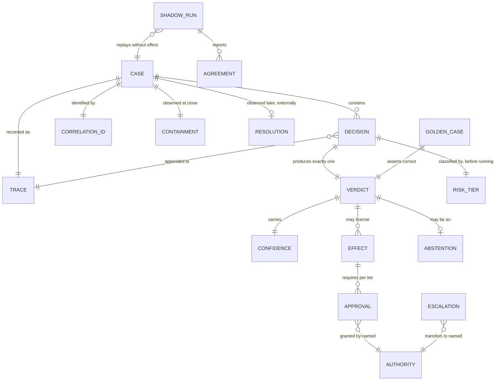

# Context: agent-ops-core

The ubiquitous language for the operational machinery shared by nineteen AI
decisioning applications. The applications differ entirely in domain — claims,
invoices, tickets, expenses, membership, underwriting. These words are the part
they hold in common, so these words have to be exact.

**This file is binding.** Code, comments, column names, metric names, log
fields, dashboards and both documentation tracks use these terms with these
meanings. If a term feels wrong, change it here first, then change the code. A
term that means one thing in `evals` and another in `audit` has already cost
more than it saved.

Several of these words overlap in ordinary speech. Where they do, the entry
says what the term is **not**, because the confusion is the expensive part.

---

## The unit of work

**Case**:
One instance of the thing the application exists to judge — a claim, an
invoice, a ticket, an expense report, a membership application. Owned by the
application; `agent-ops-core` knows only its identity, its tier, and its trace.
A case has a lifecycle and reaches exactly one terminal state.
_Avoid_: request, job, task, item, conversation, ticket (unless the domain is
literally ticketing).

**Correlation ID**:
The stable identifier that ties every decision, tool call, token, and effect
belonging to one case together across processes and retries. Assigned once, at
case creation, by the application.
_Avoid_: trace ID, request ID, session ID.

**Trace**:
The complete, ordered, append-only record of everything that happened under one
correlation ID, sufficient to replay the case. A trace is evidence, not a log —
it is written to be read years later by someone hostile.
_Avoid_: log, history, audit log (an audit log is a trace; call it a trace).

---

## The act of judging

**Decision**:
One recorded act of judgment: a bounded computation that takes a stated
question about a case, plus the evidence available at that instant, and
produces a verdict. A decision is an **event** — it has an identity, a
timestamp, inputs, an author (model or human), a cost, and exactly one verdict.
One case usually contains several decisions.
_Avoid_: inference, call, run, prediction, judgement (spelling), evaluation.

**Verdict**:
The **content** of a decision — what was concluded, plus the disposition that
follows from it. Decision is the *when, by whom, on what*; verdict is the
*what*. A verdict is immutable; a case that needs re-judging gets a new
decision with a new verdict, never an edited one.
_Avoid_: result, output, answer, outcome (outcome is reserved — see below).

> **Challenge.** If you do not want this event/content split, cut `verdict` and
> keep `decision` for both. Two words for one concept is worse than either word
> alone, and nineteen teams will each pick a different one. I think the split
> earns its place — replay compares verdicts while audit indexes decisions —
> but it is your call, and it is cheaper to make now than after nineteen
> schemas exist.

**Confidence**:
The system's own estimate of how likely its verdict is to be wrong. A property
of the verdict, produced by the decision.
_Avoid_: score, certainty, probability, trust.

**Effect**:
An action taken in the world outside the system as a consequence of a verdict —
a payment issued, an email sent, a policy cancelled, a record written to a
system of record. Effects are the only irreversible part of a case. A decision
without an effect can always be replayed; a decision with one cannot be undone
by replaying it.
_Avoid_: action, side effect, write, mutation.

---

## Dispositions

These three are routinely collapsed into one status field. They are
independent, and collapsing them destroys information you will need.

**Abstention**:
The system deliberately declining to produce a determination, because it judges
itself unfit to judge this case — evidence missing, question out of scope,
guardrail triggered, confidence beneath the tier's floor. An abstention is a
**successful outcome of a working system**, and is recorded as a verdict like
any other.
_Avoid_: failure, error, unknown, null, timeout, low confidence, punt.

**Not** an error: an error is the system breaking. An abstention is the system
working correctly and saying so. **Not** a low-confidence determination: in that
case the system did conclude, weakly. Abstention means it did not conclude at
all. **Not** an escalation: abstention is about the system's own epistemic
state; escalation is about who holds authority next.

**Escalation**:
Transfer of authority over a case from the system to a named human role,
because policy requires it or because the system abstained. Escalation changes
**who decides**, not what is decided.
_Avoid_: handoff, handover, transfer, routing, fallback, human-in-the-loop.

**Not** a notification: telling a human is not escalation unless authority moves
with the message. **Not** retrying on a more capable model: that is another
decision at higher cost, and calling it escalation makes "escalation rate" mean
two different things at once. Escalation crosses the human/machine line, or it
is not escalation.

**Approval**:
A recorded act by a named authority licensing an effect to take place. Approval
answers *may this happen*; a verdict answers *what is true*. Keeping them apart
is what lets a case be replayed without its payments being made twice.
_Avoid_: sign-off, authorisation, confirmation, gate, permission.

An authority may be a human, or — at low tiers only — an automated policy
holding explicitly delegated authority. Automated approval is still approval and
is still recorded with a named authority; "the system approved it" must never
appear in a trace without saying under whose delegation.

**Dual control**:
A requirement that two distinct authorities approve the same effect, where
distinctness is enforced structurally rather than checked. The second approver
must be unable to be the first.
_Avoid_: four-eyes, maker-checker, double approval.

> **Note the independence.** Abstention does not imply escalation: a system may
> abstain and terminate on a default with no human involved. Escalation does not
> imply abstention: a verdict may be highly confident and still require a human
> because the effect is worth £2M. If these ever become one field, both meanings
> are lost.

---

## Routing

**Risk tier**:
A classification of the **consequence of being wrong**, assigned before
execution, which selects the execution path: which model, which guardrails,
whether a human gate applies, whether dual control applies, what the abstention
floor is.
_Avoid_: severity, priority, criticality, risk level, risk score.

Two constraints follow from the definition and both are load-bearing:

1. **A tier must be computable before the expensive work runs.** Anything that
   needs the model's output to compute is not a tier — it is a post-hoc score,
   and it cannot gate what has already happened.
2. **Tier is consequence; confidence is likelihood.** They must never be
   multiplied into one number. Collapsing them makes it impossible to say "we
   are 99% sure and it still needs two humans, because it is £2M."

> **Challenge — risk tier of *what*?** You wrote "risk tiers that select an
> execution path", which reads as one tier per case. I think that is wrong, and
> it is the kind of wrong that is very expensive to undo at nineteen call sites.
>
> Reading an invoice is low risk. Paying it is high risk. Same case, same
> minute. If the tier attaches to the case, every step in a high-value case runs
> under maximum guardrails at maximum cost, and teams will start splitting cases
> to get their latency back — which fragments the trace.
>
> I recommend **tier attaches to a decision-and-its-effect**, not to a case. A
> case then has a tier profile rather than a tier: extraction at low,
> determination at medium, disbursement at high. This is a real fork with a real
> trade-off — per-case is genuinely simpler to reason about and to explain to an
> auditor — so I am flagging it rather than deciding it.

**Kill switch**:
A control that stops effects from being taken, system-wide or per tier, without
a deploy and without stopping decisions from being made. Decisions continuing
while effects stop is the point: it preserves the evidence of what the system
*would* have done during the incident.
_Avoid_: circuit breaker, feature flag, disable, panic button.

---

## Outcomes — and the one distinction that matters most

**Containment** and **resolution** are conflated across this entire industry,
and the conflation hides real failures. They are separate fields, computed from
separate data, available at separate times.

**Containment**:
A case reached a terminal state without authority over it transferring to a
human. It measures **human effort avoided**. It is a property of the path the
system took, and it is fully observable from your own trace at the moment the
case closes.
_Avoid_: automation rate, deflection, self-service rate, success.

**Resolution**:
The party whose problem it was received the outcome they were entitled to. It
measures **whether the system was any good**. It is a property of the outcome
judged against a standard external to the run, and it is **not knowable when the
case closes** — it requires evidence gathered afterwards.
_Avoid_: success, accuracy, correctness, completion, closure, CSAT.

### Why they get conflated, and why it flatters you

Containment is cheap: it falls out of your own logs, immediately, for free.
Resolution is expensive: it needs an entitlement standard, an external evidence
source, and a waiting period. So teams measure containment, name it resolution,
and report it.

The failure is not merely that this is imprecise. It is that **the error runs in
the flattering direction**. A customer who abandons a conversation in
frustration is contained — nobody escalated, the case closed, the metric
improved. They are not resolved. The worse your system is at the moment of
abandonment, the better your containment number looks.

The mirror case is just as bad and gets discussed far less. A case escalated to
a human who then fixes it correctly is **resolved but not contained** — a
success the containment metric scores as a failure. A team optimising
containment is therefore being paid to suppress correct escalations. That is not
a hypothetical incentive; it is the predictable result of shipping one number.

The four states, all of which occur:

| | **Resolved** | **Not resolved** |
|---|---|---|
| **Contained** | The goal. | **The dangerous quadrant.** Abandonment; wrong-but-unchallenged; a silent default after an abstention nobody saw. Looks like your best cases. |
| **Not contained** | Escalation working exactly as designed. Costs a human. Counts as failure under containment. | The most expensive: a human was spent and it was still wrong. |

### Rules this imposes on the code

1. **Never a single `success` boolean.** Containment and resolution are two
   fields with two provenances and two timestamps.
2. **Resolution must never be computed from data available at case close.** If
   it can be, it is containment wearing a different name. This is a review
   check, not a guideline.
3. **A metric named `resolution_rate` derived from trace data alone is a bug**,
   and should be treated as one.
4. **Abstention is not containment's enemy or friend.** An abstention that
   terminates on a default with no human is contained. It is very unlikely to be
   resolved. This path deserves its own alert.

> **Challenge — I need this from you, per application.** Resolution is undefined
> until you name, for each of the nineteen: the **entitlement standard** (what
> the right answer is and who says so), the **evidence source** (reopen within
> 30 days? auditor sample agreeing? no clawback in 90 days? no complaint?), and
> the **observation window**.
>
> Without those three, `resolution` is a word in a document and every
> application will quietly degrade it back into containment, because containment
> is the only thing they can actually compute. I would rather ship a library
> that refuses to record a resolution than one that lets each team invent one.

---

## Measurement

**Golden case**:
A case with a known-correct verdict, adjudicated deliberately, held under
version control, used to detect regression. Correct **by construction** —
someone decided what the right answer is and wrote it down.
_Avoid_: test case, fixture, ground truth, benchmark, eval case.

Golden cases are frozen while production traffic drifts. That is simultaneously
their value — a stable regression signal, so a change in the number means a
change in the system rather than a change in the weather — and their limit: they
go stale, and a passing golden set is not evidence that today's traffic is being
handled well.

**Shadow run**:
Executing the system against real cases with its verdicts having **no effect**,
in order to compare them against the decisions humans actually made. The absence
of effect is structural — a shadow run is given a client that cannot write — not
a flag someone remembered to set.
_Avoid_: dry run, canary, A/B test, backtest, replay.

**Not** an evaluation: an evaluation compares against a curated correct answer
(a golden case); a shadow run compares against whatever a human happened to do.
**Not** an A/B test: both arms of an A/B test have effects.

**Agreement**:
The rate at which a shadow run's verdicts match the recorded human decisions.
_Avoid_: accuracy, correctness, match rate, precision.

**Agreement is not accuracy, and this is the trap.** The baseline is human
behaviour including human error. If your reviewers are wrong 8% of the time,
then a system in perfect agreement with them is wrong 8% of the time — and a
system that disagrees on exactly those cases scores 92% while being right. Every
disagreement in a shadow report is a case for adjudication, never a defect.
Treat "97% agreement" as "97% agreement" in every document, dashboard, and
conversation with a stakeholder.

---

## How the language fits together

Read the two outcome edges carefully: `CASE ||--|| CONTAINMENT` is mandatory and
immediate; `CASE ||--o| RESOLUTION` is optional and later. That asymmetry is the
whole point, and it is why they cannot share a column.

---

## Open questions

Recorded here rather than resolved, because they are yours to decide:

1. **Does `verdict` survive as a separate term from `decision`?**
2. **Does risk tier attach to a case, or to a decision-and-its-effect?** I
   recommend the latter; I acknowledge the former is simpler to explain.
3. **What is the resolution evidence source and observation window for each of
   the nineteen applications?** Until this is answered, resolution cannot be
   recorded honestly.
4. **Who are the named authorities**, and does an automated low-tier approval
   carry a delegation identity in the trace?

These are tracked as ADRs once decided. Nothing in this file is settled by me
alone — but nothing in the code may contradict it while it stands.
