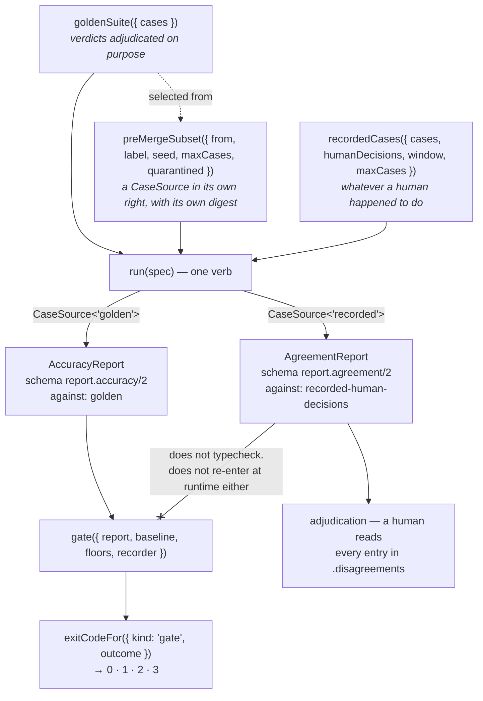
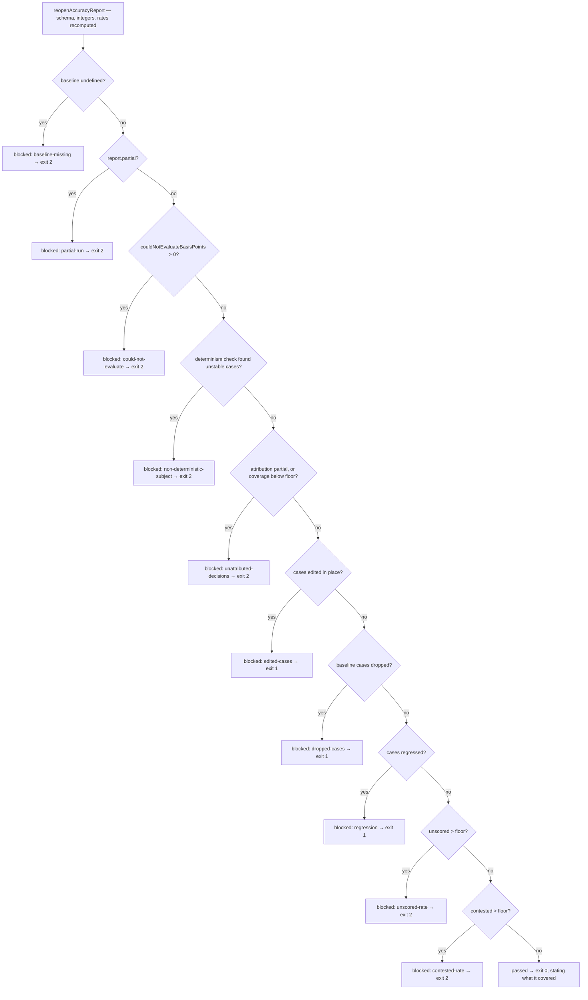
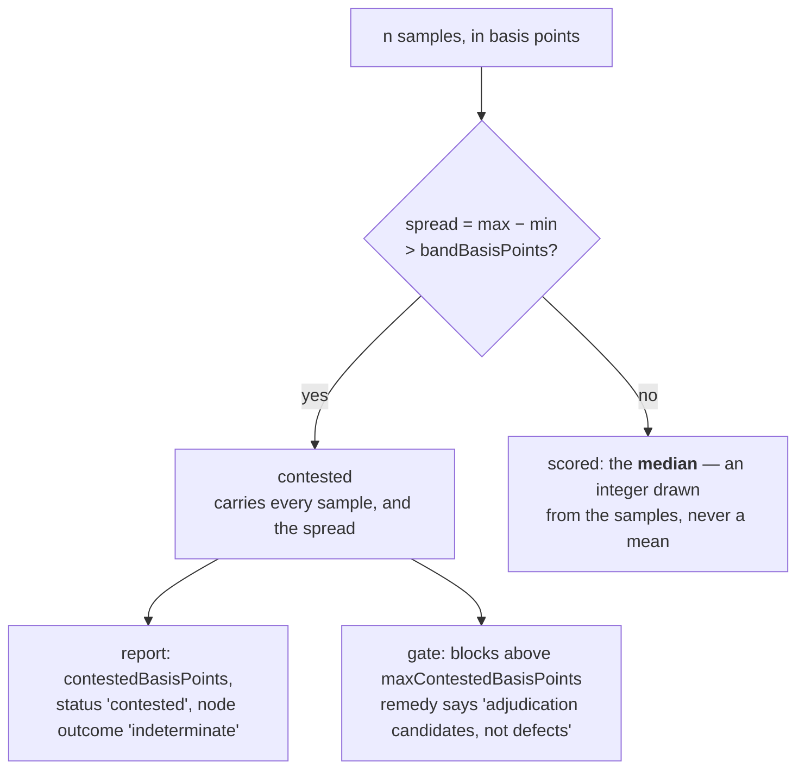

# EVALUATION

How quality is measured with the shipped `evals` module: golden cases, shadow
runs, judge panels, the continuous-integration gate, and the exit codes a
command-line adapter returns.

Written from the code that exists in `packages/agent-ops-core/src/evals/`, not
from `docs/design/`. Where they diverge, the code is the truth and §10 says
where. The vocabulary is `docs/CONTEXT.md`'s and is binding: a **golden case** is
correct by construction, a **shadow run** compares against whatever a human
happened to do, and **agreement is not accuracy**.

---

## 1. What this module measures, in one page

Two executing entry points, plus a gate.

| Entry point | What it does | Records nodes? |
|---|---|---|
| `run(spec)` | Executes a subject against a case source and produces a report | Yes — a whole graph |
| `gate(input)` | The continuous-integration regression verdict over an `AccuracyReport` | Yes — its own run, its own `gate` node |

Everything else exported — `accept`, `goldenSuite`, `preMergeSubset`,
`defineSubject`, `exactVerdict`, `judgePanel`, `runKeyOf`, `exitCodeFor`,
`mintCompletedRun`, `reopenAccuracyReport`, `reopenAgreementReport` — constructs
an argument type or reads an artefact. A third *executing* entry point is a
signal to split the module, not to extend it.

**One exception, and the module names it against itself.** `recordedCases` is
`async`, calls `humanDecisions.decisionFor` once per case, and the shipped
`humanDecisionsFromAuditTrace` adapter replays against the **audit** store — so
it performs up to `maxCases` sequential round trips before any run exists. It
opens no node, because no run is open yet and a trace never spans both stores.
`run` therefore writes a `source` node carrying what it found: the named adapter,
the window, how many cases were considered, how many were dropped. `index.ts`
used to list it among the pure constructors and now says so plainly:

> *saying otherwise was a claim about the strongest constraint in this project
> that the code did not deliver.*

### The report type follows the case source, never the verb



There is no `runShadow` and no `mode: "shadow"` flag. A shadow run is not a
different verb; it is a run whose cases came from production. `ReportOf<K>` is a
conditional type over the source kind, so nobody has to remember which function
to call and nobody can call the wrong one.

---

## 2. Golden cases versus shadow runs

| | **Golden suite** | **Shadow run** |
|---|---|---|
| Adapter | `goldenSuite` | `recordedCases` |
| Source kind | `"golden"` | `"recorded"` |
| What a case asserts | `kind: "correct-by-construction"` — a verdict, `adjudicatedBy`, `adjudicatedAt`. *A golden case with no author is folklore* | `kind: "recorded-human-decision"` — a verdict, `correlationId`, `authority` |
| Where the standard comes from | Somebody decided what the right answer is and wrote it down | Whatever a human happened to do at the time |
| Report | `AccuracyReport` | `AgreementReport` |
| Headline figure | `correctBasisPoints` | `agreementBasisPoints` |
| Case field for the standard | `expected` | `humanVerdict` — *not "expected"; nobody adjudicated it* |
| Provenance required on the report | `suiteDigest` | `humanDecisionSource`, `window`, `withoutHumanDecision`, `cohortDigest` |
| May gate a build | **Yes** | **No — it does not typecheck, and it does not re-enter at runtime** |
| Effects | none | none, and structurally: a subject can only hold a `Client<"read">` |
| Goes stale | Yes, and that is also its value | No — it is this week's traffic |

**Why golden cases are frozen and why that cuts both ways.** `CONTEXT.md`:
*they are frozen while production traffic drifts. That is simultaneously their
value — a stable regression signal, so a change in the number means a change in
the system rather than a change in the weather — and their limit: they go stale,
and a passing golden set is not evidence that today's traffic is being handled
well.*

**Why a shadow run has no effects, structurally.** `Client<"read">` and
`Client<"write">` are disjoint in both directions — neither is a subtype of the
other, because the literal types of a phantom non-exported `unique symbol`
property are incompatible. A `decide` that asks for a write-capable client is a
compile error, asserted by
`evals/tests/fixtures/subject-cannot-write.ts`. As `clients.ts` puts it: *a
shadow run has no effects because the thing it runs cannot express one, not
because a flag was set.* The runtime backstop, for a subject assembled through
`any`, is a poisoned `write` that records an error node and aborts the whole run
with `SubjectAttemptedWrite` — an incident, never an outcome.

The shipped `HumanDecisionSource` adapters are two, which is what makes the seam
real:

- `humanDecisionsFromAuditTrace({ replay, payloadKind })` — reads the decision out
  of the case's own `audit` trace. Last matching node wins, because a case
  re-judged appends a new decision and never edits the old one.
- `legacyReviewerExport` — because every one of the nineteen applications has a
  *first* shadow run, and at that point the reviewers' decisions were never in
  `audit`.

A case with no human decision inside the window is **dropped rather than scored
against nothing**, and the count travels: `provenance.withoutHumanDecision` and
`provenance.considered` on the source, a `source` node under the run, and
`AgreementReport.withoutHumanDecision` on the artefact. An agreement figure of
97% over a cohort that started at 900 cases and finished at 90 reads very
differently, and the denominator's history belongs next to the number.

---

## 3. Why the two reports are deliberately incompatible types

This is not a naming convention. It is a consequence of provenance, and it is
enforced four ways.

**1. Phantom brands.** `AccuracyReport` and `AgreementReport` each carry a
non-exported `unique symbol` key. Neither is assignable to the other in either
direction — not by structural accident, not by a widening cast that looks
innocent in review, and not even if the field sets coincided.

**2. The tempting names are absent.** `AgreementReport` carries no field called
`correct`, `accuracy` or `score`. `AccuracyReport` carries no field called
`agreement`. `report.ts` states the mechanism: *the vocabulary separation is
enforced by the absence of the tempting name, not by a comment asking people not
to use it.* The fixture asserts both absences compile-error:

```ts
// @ts-expect-error there is no `correct` on an agreement report; the name is absent on purpose
void agreement.correctBasisPoints;
// @ts-expect-error and no `agreement` on an accuracy report
void accuracy.agreementBasisPoints;
// @ts-expect-error you cannot build a continuous-integration gate on agreement data
void gate({ report: agreement, baseline, floors, recorder });
```

**3. A literal `interpretation` field on every agreement report.** Literal-typed,
so it survives every `JSON.stringify`, every dump and every dashboard that
renders the object naively:

> *agreement is not accuracy — the baseline is human behaviour including human
> error; every disagreement is a case for adjudication, not a defect*

**4. A validating re-entry, because brands do not survive JSON.** The flow the
gate exists for is: run in job A, write JSON, gate in job B. A phantom symbol
does not cross a process line, so that flow could previously only re-enter
through a cast — at which point nothing was checked at all. `reopenAccuracyReport`
does four things a cast does not:

1. checks the literal `schema` and `against`, so an agreement report's JSON is
   refused by *value* and not only by type;
2. checks every figure is a safe integer, so no IEEE-754 sneaks in through a
   round trip;
3. **recomputes the four rates from the cases** and refuses a mismatch — a
   report whose headline numbers do not follow from its own contents is the
   cheapest possible forgery and the one worth catching;
4. refuses a report with no cases, which is the zero-case suite wearing a
   different hat.

`gate` runs it on whatever it is handed, so a cast-in report is refused at
runtime too.

**What re-entry does not prove, stated rather than implied:** that the run
happened. It establishes that an artefact is of the right kind and internally
consistent. Establishing that it came from a real run means reading the trace out
of the eval store by `runId` and recomputing `traceDigest` — which needs the
store, and is what an auditor does rather than what a gate does.

`reopenAgreementReport` exists for the same round-trip reason (the ledger stores
reports as JSON) and — deliberately — **there is no gate that accepts what it
returns.**

---

## 4. Agreement is not accuracy: the arithmetic

`CONTEXT.md` states the trap; here is the number.

Take a shadow cohort of **200 cases**. Your reviewers are wrong **8%** of the
time — 16 cases. Assume, for the arithmetic, that where a system is wrong and
where the reviewers are wrong are disjoint sets.

| | Agrees with reviewers | Agreement | Actually correct | Accuracy |
|---|---|---|---|---|
| **System A** — reproduces the reviewers exactly | 200 / 200 | **100.00%** | 184 / 200 | **92%** |
| **System B** — right on every case | 184 / 200 | **92.00%** | 200 / 200 | **100%** |
| **System C** — wrong on a *different* 8% | 168 / 200 | **84.00%** | 184 / 200 | **92%** |

Read the first two rows against each other. System A is the worse system and
scores eight points higher. **Perfect agreement is exactly as wrong as your
reviewers are** — if they are wrong 8% of the time, a system in perfect
agreement with them is wrong 8% of the time, and a system that disagrees on
precisely those cases scores 92% while being right.

Three consequences the code carries:

- **`gate` accepts only an `AccuracyReport`.** There is no way to turn "94.12%
  agreement with our reviewers" into a passing build — not by accident and not on
  purpose. The baseline of a shadow run is human behaviour including human error;
  every disagreement in it is a case for adjudication, and adjudication is not
  something a gate can do.
- **The field is `disagreements`, and it is enumerated rather than summarised.**
  `report.ts`: *"Every one is a case for **adjudication**, never a defect — the
  field is not called `failures` and it never will be."* Each entry carries the
  reference, the correlation identifier, the tier, the human verdict, the system
  verdict, the named authority and the node.
- **Say "97% agreement" in every document, dashboard and conversation.** Not
  "97% accurate". Not "97% correct". The `interpretation` field travels with the
  artefact so the sentence survives being copied into a slide.

What a high agreement figure *is* good for: it is a cheap, current signal that a
system behaves like the people currently doing the job, over this week's traffic
rather than over a frozen suite. It is a starting point for adjudication and a
poor finishing point for anything.

---

## 5. The gate

```ts
gate({ report, baseline, floors, recorder }): Promise<GateOutcome>
```

`GateOutcome` has exactly two kinds: `passed` and `blocked`. **There is no
`warned`.** A gate with a warning level is a gate that is off.

`baseline: Baseline | undefined` is a value you have to supply, not a parameter
you can omit — *the first continuous-integration run of any of the nineteen
applications is exactly the run where a silent pass is most tempting and most
damaging.*

### `accept` — turning a report into the standard

```ts
accept({ report, by, at }): Baseline
```

A `Baseline` carries `acceptedBy` and `acceptedAt` because *the question an
auditor asks is not "what is the baseline" but "who decided that these numbers
are the standard, and when"*. It carries a per-case content address as well as a
reference, and a `suiteDigest`.

It refuses four things, and each refusal names what accepting it would bake in:

| Refused | Why |
|---|---|
| A `partial` report | Everything measured afterwards would be measured against a run that did not finish |
| An `attribution: "partial"` report | …against a run whose thinking happened somewhere nobody can see |
| A report over a **subset** | A subset never advances the baseline. Accepting one silently shrinks what every later run is measured against, and the cases it never selected stop being compared at all |
| A report with `couldNotEvaluateBasisPoints > 0` | A provider outage is not a standard |

### The floors

```ts
export const DEFAULT_FLOORS: GateFloors = {
  attributionFloorBasisPoints: 10_000,   // every decision attributed
  maxUnscoredBasisPoints: 0,             // an unscored case is never a passed case
  maxContestedBasisPoints: 500,          // 5%
};
```

Nothing else about the gate is configurable. There is no `continueOnError`,
*because that is precisely the flag that turns a gate into decoration.*

### The decision order, as the code evaluates it



The order is not arbitrary. `baseline-missing` is first because *a gate that
silently passes because it had nothing to compare against is worse than no gate*.
`could-not-evaluate` sits ahead of every quality signal because if the provider
would not serve part of this run, nothing downstream of it is a statement about
the subject — *reporting one of those first would be reporting the weather as a
regression*. The determinism check is next because every number below that line —
the baseline, the comparison, the replay — assumes running the same thing twice
gives the same answer.

Every blocked outcome carries a `remedy`: *what to do about it, on the failure
line rather than in a wiki.*

### The two ways to make a gate green by editing the evidence

Both are blocked, and the second was the cheaper one until it was closed.

- **`dropped-cases`** — delete the failing golden case. Detected by comparing
  the run's cases against the baseline's.
- **`edited-cases`** — keep the reference and rewrite the expected verdict to
  match whatever the subject now says. `accept` had been recording a per-case
  digest that nothing read; matching was on `CaseRef` alone, so an in-place edit
  moved the case digest and the gate compared like for like and passed. Matching
  is now on reference **and** content address: *a reference is an identity; the
  digest is what makes two things with the same identity the same thing.*

### Coverage, so a green subset build says what it covered

`GateCoverage` is on both outcome kinds — `kind: "full" | "subset"`, `label`,
`casesRun`, `suiteSize`, and `notCovered` **enumerated, not counted**. A count
cannot tell "the author deleted this golden case" from "the pre-merge subset did
not run it", and those are the same absence. Only the recorded `notSelected`
list distinguishes them, which is why `SubsetSelection` enumerates it.

`preMergeSubset` pins every high-tier case and every quarantined one *before*
the budget is consulted, and never drops them to fit it. If the pinned cases
alone exceed `maxCases` the subset runs over budget and says so in `overBudget`,
*because dropping the high-tier cases to hit a time target is exactly the trade
nobody would defend out loud.*

The gate decision is itself a recorded node, under its own run, with its own
`runId` — so gating the same report twice records two decisions rather than
colliding, and each is replayable on its own.

---

## 6. Exit codes

`exitCodeFor` is a library function so the decision is testable without spawning
a process. A `bin` wrapper over it is four lines; **none ships today.**

| Code | Kind | Line prefix | Meaning |
|---|---|---|---|
| `0` | `pass` | `PASS` | Passed on evidence |
| `1` | `evidence-failure` | `FAIL` | The change made something worse, or removed the evidence that would have shown it |
| `2` | `could-not-evaluate` | `INDETERMINATE` | Nothing was established, in either direction |
| `3` | `integrity-failure` | `INTEGRITY` | The machinery is wrong. Never retried automatically |

The two in the middle are the point. Conflating `2` with `0` is the silent pass
this module exists to prevent. Conflating `2` with `1` teaches people to ignore
`1`, and then a real regression goes past unread.

Two rules hold for every input:

- **Could-not-evaluate never looks like a pass.** There is no path through
  `exitCodeFor` returning `0` for anything but a gate that passed —
  `exit-codes.test.ts` asserts it over every block reason.
- **An unrecognised failure is `3`, never `1`.** A thrown value this module does
  not name is a fault in the machinery until proven otherwise; reporting it as an
  ordinary regression puts it in the queue of things engineers triage by
  re-running. A `TypeError`, a bare string and the number `42` all exit `3`.

### The full mapping

`classifyBlock` is a `switch` with no `default` over `GateBlockReason` returning
a non-optional type, so **adding a block reason without classifying it does not
compile** — which is the only part of the file that has to stay true as the gate
grows.

| Gate block reason | Code |
|---|---|
| `regression` | 1 |
| `dropped-cases` | 1 |
| `edited-cases` | 1 |
| `baseline-missing` | 2 |
| `partial-run` | 2 |
| `unattributed-decisions` | 2 |
| `unscored-rate` | 2 |
| `contested-rate` | 2 |
| `could-not-evaluate` | 2 |
| `non-deterministic-subject` | 2 |

Deleting a golden case and rewriting one in place are the author acting on the
evidence, so they are evidence failures rather than machinery faults.

Thrown errors are classified from `EvalsError.incident`, which the module already
maintains, rather than from a second list that could drift:

| Thrown | Code |
|---|---|
| `EvalStoreUnavailable`, `RecorderNotMinted`, `StoreNotMinted`, `LedgerNotMinted`, `LedgerCorrupt`, `MemoisedCaseMismatch`, `NodeSettledTwice`, `UnreadableEnvelope`, `SubjectAttemptedWrite` (`incident: true`) | 3 |
| `SuiteUnversioned`, `SuiteVersionMismatch`, `SuiteEmpty`, `ReportRefused`, `LimitOutOfRange`, `PanelMisdeclared`, `DuplicateCaseRef`, `UnserialisablePayload`, `SubsetUnselectable`, `NoSuchRun`, `LedgerUnavailable` | 3 — configuration and artefact faults, not quality signals |
| `ProviderUnavailable`, `RunBudgetExhausted`, `BaselineRefused`, `RunNotMemoisable` | 2 — nothing established, nothing broken |
| Anything else | 3 |

The pass line states coverage where somebody merging at 07:40 will read it —
coverage on the **pass** line, not only the failure line:

```
PASS run <runId> — covered 200 case(s), full suite
PASS run <runId> — covered 61 of 214 case(s), subset "pre-merge"
FAIL run <runId> — regression: 3 case(s) went from correct to not correct: … — covered 200 case(s), full suite
INDETERMINATE run <runId> — could-not-evaluate: 1500bp of cases could not be evaluated … — covered 200 case(s), full suite
```

A `runId` is the last sixteen characters of the run key, the opening instant in
hexadecimal, and a per-recorder counter — derived from the **injected clock**, so
a run is reproducible under a manual clock. `Math.random()` does not appear in
this module.

---

## 7. Scorers

Two adapters ship, and they differ in determinism, cost, latency and error mode
— which is exactly why a judge is an adapter and not a feature of the runner.

### `exactVerdict` — deterministic

Compares disposition and conclusion. Full marks or nothing. It deliberately does
**not** special-case an abstention: per `CONTEXT.md` an abstention is a verdict
and a successful outcome of a working system, so a golden case may assert that
abstaining is the correct answer, and a subject that abstains where the case says
abstain scores 10 000 basis points.

### `judgePanel` — a model as judge, non-deterministic and saying so

```ts
judgePanel({ model, promptVersion, panelSize, bandBasisPoints, rubric })
```

Constraints enforced at construction, before a run exists and before any spend —
`PanelMisdeclared` for each:

- `panelSize` **odd, 3..7**. A single judge call is an opinion; an even panel has
  no majority.
- `bandBasisPoints` within 0..10 000.
- The rubric text is content-addressed into the scorer digest, so "which judge
  produced this number" is answerable from the trace in three years rather than
  from somebody's memory.

Each sample opens its own node through `ctx.node.child`, and the model call
inside it goes through the node-bound client — *so a judge scorer that wants to
call a model has no client to call it with except the one that records.* The
scoring node carries `judgeModel`, `judgePromptVersion`, `panelSize` and
`determinism: "non-deterministic"`.

### Disagreement is surfaced, never averaged



A panel splitting 10000 / 10000 / 0 has a mean of 6667, which *looks like a
mediocre pass*. It is not a mediocre pass. It is a ruler that disagrees with
itself, and `judges.test.ts` asserts that the string `6667` appears nowhere in
the case detail while `10000/10000/0` does. `contested` is a first-class case
status with its own rate on the report and its own gate reason.

The median rather than the mean, when the panel *is* within band, is also an
integer discipline: the value is drawn from the samples, so no float ever reaches
a payload.

### What happens when a scorer cannot score

| Situation | Outcome | Why |
|---|---|---|
| The judge answered something unparseable | `unscored: "judge-unparseable"` | A judge answers with an integer 0..10 000; anything else is unparseable |
| The judge could not be reached for an ordinary reason, after bounded retries | `unscored: "judge-unavailable"` | Unscored is **never** passed; it counts against the gate, because a case nobody could measure is not a case that went well |
| `ProviderUnavailable` — 429, 503, reset | rethrown → the case becomes `could-not-evaluate` | *A provider that would not serve the judge is not a judge that disagreed.* Otherwise a throttled panel arrives at the gate as `unscored-rate`, which is a statement about the subject, and the subject did nothing |
| Any `EvalsError` with `incident: true` — the store is down, a scorer reached for a write | rethrown, **aborts the run** | An incident is never downgraded to an outcome. This was a bare `catch {}` once, and a store failing only on `judge.sample` produced a green-looking report reading `unscored: judge-unavailable` — an unrecorded eval run presented as a measured one |

---

## 8. Determinism, attribution and idempotency

Three things the report carries that a reader is likely to over-read.

### Determinism: checked, not declared

`Determinism` has two halves and only one of them is evidence.

- `declared` comes from what the scorer adapters say about themselves. A judge
  panel declares itself non-deterministic and names the reason.
- `check` is a measurement this module performed: `Limits.determinismSampleCases`
  of the run's own cases are **re-executed under the identical seed** and the
  verdicts compared byte for byte in canonical form.

The declaration alone used to be the whole of it — and the half that varies in
practice is the **subject**: a temperature setting, an unseeded shuffle,
iteration over host-ordered keys, a cache warm on the second call. No scorer
descriptor knows about any of those.

`compared: "subject-verdict"` is stamped on the artefact so nobody reads more
into it. **The scorers are not re-run**: a judge panel is non-deterministic by
construction, re-running it would measure the judge's variance, which is a
different question, costs n times more, and is already surfaced as `contested`.

`DEFAULT_LIMITS.determinismSampleCases` is `2` — about 1% of a 200-case run's
spend to find out whether the other 99% means anything. Setting it to `0` gives
`{ kind: "not-checked", why }` on the report rather than falling back to the
claim. **A sample of 2 over 200 proves nothing about the other 198 and is not
claimed to.** What it catches is the common case: a subject that is
non-deterministic *everywhere*, caught on the first sample.

### Attribution: three values, because two of them used to be one

| Value | Meaning | Coverage |
|---|---|---|
| `complete` | Every decision subtree recorded at least one model call, and the subject declared `"calls-models"` | **Measured** |
| `partial` | At least one subtree contradicted its own declaration — `"calls-models"` with no call, or `"pure"` with one | Unscored, against the floor, fails the gate |
| `declared-pure` | The subject declared `"pure"` and recorded no model calls | **`0`.** Nothing was attributed by evidence |

`declared-pure` is the honest one. A genuine rules engine and a subject that does
all of its thinking through a provider SDK look identical from here — this module
cannot tell them apart, so it stopped claiming it can. It used to report
`complete` with coverage `10 000`, which reads as "we verified where the thinking
happened". Nothing had been verified. `declared-pure` is exempt from the coverage
floor and from nothing else; the gate node records the purity declaration so a
reader can see the run rests on an assertion by the subject's author.

### Idempotency and resume

`run` is content-addressed by `runKeyOf(spec)` — source digest, subject version
and purity, scorer digests, seed, price-table version and **every** limit (a
limit added to `Limits` enters the key automatically). The label is *not* in it,
so `"nightly"` and `"pre-merge"` over the same suite are one question asked
twice.

- Re-running a completed key **returns the original report and executes
  nothing**: the original `runId`, `startedAt` and `traceDigest`, not a fresh run
  that happens to agree.
- An interrupted run **resumes**. 200 cases dying at 180 pays for 20, and the 180
  arrive as `case` nodes stamped with the run and node they came from, plus a
  `resume` node — so the trace says they were not observed today.
  `Memoisation` on the report says `resumed` and names the runs, because a reader
  comparing two reports of the same suite and finding one at a tenth of the cost
  is looking at a resume.
- **A partial run is never memoised as complete.** `mintCompletedRun` is the only
  producer of the ledger's write type and refuses a partial, unattributed or
  could-not-evaluate report, so a budget-exceeded run cannot become a permanent,
  free, biased pass. `LedgerCorrupt` is the read-side backstop for a row written
  by an older build or edited by hand.
- **There is no `force: true`.** To re-execute, change something the key is made
  of.

`LedgerUnavailable` is **fail-open** — the run re-executes and the report says
`memoisation: { kind: "ledger-unavailable" }`. It is the only fail-open policy in
the module, and it is visible because *a fail-open policy nobody can see is
indistinguishable from a bug*. `EvalStoreUnavailable` is the opposite:
fail-closed at every tier with no configuration key, on every path including
scoring, because an unrecorded eval run produces a number nobody can check.

---

## 9. What a passing golden suite does and does not prove

### It proves

- Every case in the suite was executed by this subject version, under this seed,
  under this pinned price table, with these limits — all of it content-addressed
  into a `runKey` anyone can recompute.
- No case that was correct against the accepted baseline became incorrect
  (`regression`).
- No baseline case was deleted (`dropped-cases`) or rewritten in place under the
  same reference (`edited-cases`).
- Every decision subtree recorded at least one model call, or the subject
  declared itself pure and the report says `declared-pure` with coverage `0`.
- The unscored rate is within its floor (`0` by default) and the contested rate
  within its (500 bp).
- On a sampled subset of cases, the subject answered the same way when
  re-executed under the same seed.
- The whole run is a node graph in the eval store with a byte-stable
  `traceDigest`, and the gate decision is itself a node.
- A human named in `acceptedBy` decided, at `acceptedAt`, that these numbers are
  the standard.

### It does not prove

1. **That today's traffic is handled well.** Golden cases are frozen while
   production drifts. A green suite is a regression signal, not a fitness
   report. That is what a shadow run is for — and a shadow run produces a number
   that cannot gate anything.
2. **That the thinking happened where the trace says.** The guarantee is
   *unrepresentable through `evals`*, not *unrepresentable*. A subject's `decide`
   is application code holding its own closure: it can import a provider SDK and
   call a model directly, and no type in this package reaches outside this
   package. Every report and run header carries
   `capturedVia: "injected-client-only"` so a reader in 2033 learns the limit
   from the evidence.
3. **That the attribution check is more than a floor of one.** A single recorded
   three-token call satisfies `"calls-models"`. That is not fixable, so it is made
   visible instead: `modelCalls` and `costTenthCents` are on every case result,
   and *"high-tier underwriting determination, 1 call, 3 tokens, 0 tenth-cents"*
   is a shape a reviewer can see without having to allege anything.
4. **That a `"pure"` subject is pure.** It is a declaration this module cannot
   verify. The one thing that *is* checkable — a `"pure"` subject that does record
   calls — is a misdeclaration and fails the gate.
5. **That the whole suite ran.** A subset gate states its coverage on the pass
   line, and a subset never advances a baseline — but a green `PASS … 61 of 214`
   is not the claim a green `PASS … full suite` is.
6. **That the artefact came from a real run.** `reopenAccuracyReport` proves
   internal consistency and kind. Proving provenance means reading the trace out
   of the store by `runId` and recomputing `traceDigest`.
7. **That the golden verdicts are right.** They are correct *by construction* —
   someone decided and wrote it down, with a name and a date on it. A suite of
   confidently wrong adjudications passes every gate in this module.
8. **That the subject is deterministic.** The check samples 2 cases by default.
9. **That the subject completed its work.** JavaScript cannot bound a promise
   nothing holds. Both wall clocks race the subject and the scorers, so a subject
   that ignores `ctx.signal` bounds the *run* instead of hanging it — the run
   terminates, the node is settled `timeout`, the report is `partial`, **and the
   abandoned work runs on**. The module states this rather than implying
   otherwise.

### And the one thing it is never allowed to prove

**A golden suite says nothing about unassisted containment or resolution.**
Unassisted containment is a cost measure recorded from the trace at case close;
resolution requires a named evidence source (quiet, reviewed or reversed) and a
window, and is not knowable when the case closes. Neither is computed here, this
module carries no target for either, and a metric named `resolution_rate` derived
from trace data alone is a bug. See `docs/CONTEXT.md`.

---

## 10. Divergences, and what is not finished

Written from the code.

**Not finished:**

1. **No `bin` wrapper.** `exitCodeFor` is exported and nothing calls it from a
   process. Each of the nineteen applications writes its own four lines; what
   none of them should be doing is re-deriving in shell whether a rate-limit
   storm is a regression.
2. **`ModelBackend` has one shipped adapter**, `scriptedModelBackend`, and
   nineteen unshipped ones — the applications' own provider clients. `index.ts`
   counts the seam as real on that basis and flags it rather than dressing it up.
3. **No `Groundedness` → `Scorer` adapter.** `guardrails` implements groundedness
   once and shapes it so `evals` could consume it as a scorer; nothing converts
   one into the other today.
4. **`docs/RUNBOOK.md` §10 item 1:** `AlertCondition` declares
   `measure: "abstention" | "fail-closed-screening"` and **no module watches the
   abstention rate**. `CONTEXT.md` lists "abstention rate, or fail-closed
   screening rate, moves sharply" as one of the eight silent conditions; half of
   that sentence is unimplemented, and an application relying on abstention-rate
   alerting must compute it itself.
5. **`under-recording-detected` alerting is optional.** `RecorderDeps.alerting`
   is `?`, because nineteen applications cannot be recompiled at once. Its absence
   is not silent — the run's `under-recording` node records
   `alerted: "not-configured"` — but it is a deployment in which nobody is told.
6. **No test in this package exercises the eval store's schema.** See
   `docs/TESTING.md` §7. `migrations/0004_eval_store.sql` and
   `0005_eval_ledger.sql` are applied by `npm run db:up` and verified
   operationally, not in continuous integration.

**Design documents versus code:**

7. **`docs/design/OPEN-ITEMS-RESOLVED.md` item 4 is implemented as written** —
   `evals` nodes go to their own physical store with `expireBefore`, which
   `audit`'s `TraceStore` refuses to have, and a trace never spans both. The
   `expireBefore` batch limit is required and range-checked 1..10 000; the
   design document did not specify a bound, and the code is stricter than the
   design rather than looser.
9. **Comment drift inside `gate.ts`.** Two ordering comments name positions that
   moved: `could-not-evaluate` is annotated *"Second on purpose"* and is
   evaluated third, and the determinism check is annotated *"Third"* and is
   evaluated fourth. The order in §5 above is the order the code executes;
   `partial-run` sits between `baseline-missing` and `could-not-evaluate`.
10. **`docs/RUNBOOK.md` §10 item 8 calls `README.md` stale** on the grounds that
    it says there is no implementation code. The `README.md` in this repository
    today describes five shipped modules; the runbook's note is the thing that is
    out of date.

---

## 11. Wiring one, end to end

The shape of a run, drawn from the shipped interface. Every dependency is a
parameter; nothing here constructs a client, a pool, a clock or a timer.

```ts
import {
  DEFAULT_FLOORS, DEFAULT_LIMITS, accept, createEvalRecorder, defineSubject,
  determine, exactVerdict, exitCodeFor, gate, goldenSuite, inMemoryEvalNodeStore,
  inMemoryRunLedger, run, systemTimers,
} from "agent-ops-core";

// 1. The witness, wired at the composition root — never through the subject.
const recorder = createEvalRecorder({
  store: inMemoryEvalNodeStore(),   // or sqlEvalNodeStore(executor)
  ledger: inMemoryRunLedger(),      // or sqlRunLedger(executor)
  clock, redact, timers: systemTimers(), alerting,
});

// 2. The suite, content-addressed at construction. `expectDigest` makes an
//    unversioned edit a hard error before the first model call.
const cases = goldenSuite({
  cases: [{ ref: "INV-0001", tier: "high",
            input: { supplier: "acme", amountMinorUnits: 4_720_000 },
            expected: determine("duplicate", 9_000),
            adjudicatedBy: "a.reviewer", adjudicatedAt: 1_690_000_000_000 }],
});

// 3. The subject. `decide` receives a Client<"read">; asking for a
//    write-capable one is a compile error.
const subject = defineSubject({
  version: subjectVersion("invoice-approval@2026-08-17"),
  purity: "calls-models",
  decide: async (ctx) => determine((await ctx.client.complete({ … })).text, 9_000),
});

// 4. Run. The report type follows `cases`, not the verb.
const report = await run({
  label: "nightly", cases, subject, scorers: [exactVerdict],
  models,                       // the only thing that can dial. No default.
  recorder, seed: seed("2026-08-17"), limits: DEFAULT_LIMITS, priceTable,
});

// 5. Gate, and let the library decide what the failure means.
const outcome = await gate({ report, baseline, floors: DEFAULT_FLOORS, recorder });
const decision = exitCodeFor({ kind: "gate", outcome });
console.log(decision.line);
process.exit(decision.code);
```

The shipped bounds, for reference:

```ts
export const DEFAULT_LIMITS: Limits = {
  concurrency: 8,               // 1..32.  200 cases / 8 = 25 waves × 12 s = 300 s
  perCaseMillis: 12_000,        // 1..600_000
  runMillis: 300_000,           // 1..7_200_000
  maxCaseFailures: 20,          // 0..1_000
  retries: 3,                   // 0..5.  Bounded, jittered, seeded, capped at 2 s;
                                //        a provider's Retry-After wins, capped at 30 s
  costCeilingTenthCents: 15_000,// 1..10_000_000. Checked after every recorded call
  determinismSampleCases: 2,    // 0..32
};
```

Every limit is range-checked before the first case runs (`LimitOutOfRange`), and
`DEFAULT_LIMITS` is a named value the caller passes **explicitly** rather than an
implicit default — *"who decided 61 cases were enough?" — "the convention did"* is
not an answer an auditor can use. A named constant is one token, appears in
`git blame`, and can be diffed.
