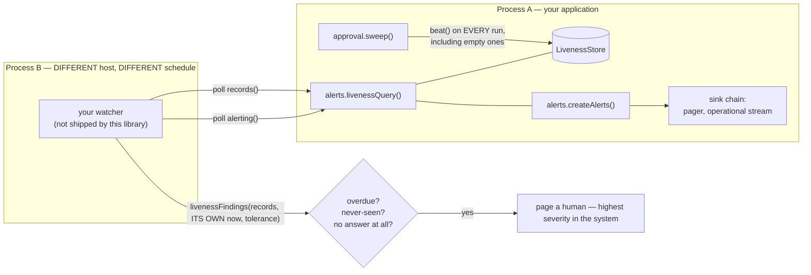
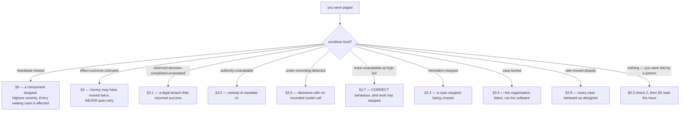
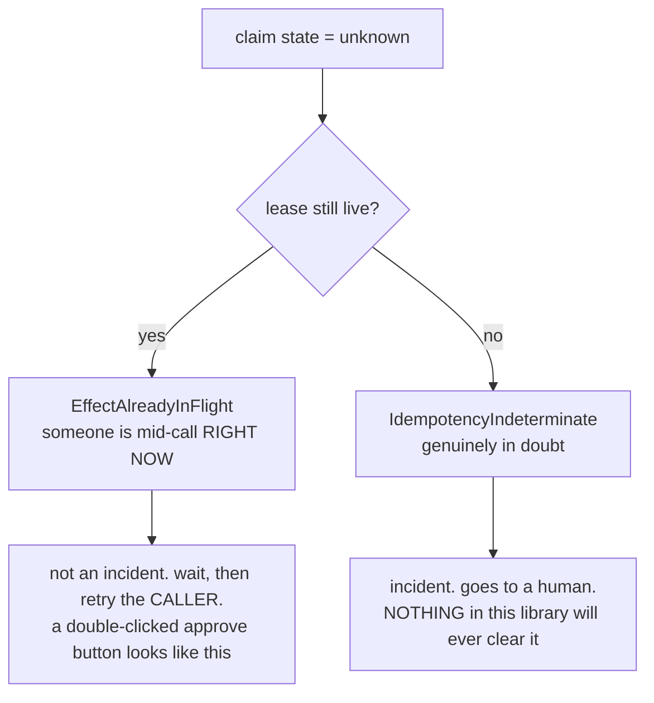

# RUNBOOK

For the engineer on call at 3am. Written from the code in
`packages/agent-ops-core/src/`, not from the design documents. Where the two
disagree, the code wins and this file says where — see
[§10, Divergences and what is not finished](#10-divergences-and-what-is-not-finished).

Every procedure here is a call you can find in a source file. Nothing in this
runbook describes an operational surface the library does not have.

---

# 0. READ THIS BEFORE ANYTHING ELSE: THE WATCHDOG IS OUTSIDE THIS LIBRARY

> **A watcher outside this process must poll `livenessQuery()` and alert on
> overdue, never-seen, and on the query failing to answer at all.
> `agent-ops-core` emits heartbeats and judges them; it cannot notice its own
> death. Deploying without an external watcher means a stopped sweeper stops
> chasing every waiting case, silently, until a customer telephones.**

That paragraph is not prose. It is
`alerts.EXTERNAL_WATCHDOG_REQUIREMENT`, a string constant exported from
`packages/agent-ops-core/src/alerts/lib/external-watchdog.ts`, carried here
verbatim so the runbook and the code cannot drift.

## 0.1 Why this is the most expensive thing on the page

`approval.sweep` is what fires reminders. It is the only thing that does.
Nothing else in this library owns a timer — `lib/ladder.ts` is pure arithmetic,
`guardrails` closes its rate windows lazily on arrival, and `alerts` has no
scheduler at all.

So if the sweeper stops:

- nobody is chased;
- nothing throws;
- no request fails;
- every dashboard stays green;
- every case awaiting an authority sits there for as long as the outage lasts,
  and `awaiting_authority` is neither terminal nor counted in
  `unassisted_containment`, so nothing reconciles to a number that looks wrong.

The first person to find out is a customer with a telephone.

**A watchdog that depends on the thing it watches fails silently at the exact
moment it is needed.** If the process hosting the sweeper dies, an in-process
check dies with it. If the event loop is blocked, the check does not run and
does not report that it did not run. If the container is OOM-killed, the
alerting chain, the journal and the ledger go with it — including the record
that they went.



## 0.2 What to configure — five steps, all of them required

**1. Watch the sweeper before it beats.** `beat` on an unwatched component
throws `ComponentNotWatched`. Do this once, at the composition root, at start-up:

```ts
import {
  DEFAULT_SWEEPER_COMPONENT,          // "approval.sweeper"
} from "agent-ops-core/approval";
import {
  createHeartbeat, inMemoryLivenessStore, systemClock,
} from "agent-ops-core/alerts";

const livenessStore = inMemoryLivenessStore();
const clock = systemClock;

// expectedEveryMs = how often YOU actually schedule sweep(). Say what is true.
await livenessStore.watch(DEFAULT_SWEEPER_COMPONENT, 60_000, clock.now());

const heartbeat = createHeartbeat({ store: livenessStore, clock });
```

If more than one sweeper process runs against one store, give each its own name
via `ApprovalDeps.sweeperComponent`. Two processes beating under one name are
indistinguishable from one process beating twice as often, and the survivor of a
half-dead fleet keeps the name alive.

**2. Pass the heartbeat into `approval`.** `ApprovalDeps.heartbeat` is optional.
Where it is absent, every `SweepReport.heartbeat` reads `"not-configured"`, which
means nothing is watching this sweeper at all.

**3. Assert the alerting chain is real, at the composition root.**

```ts
import { assertProductionAlerting, createAlerts, pagingAlertSink,
         operationalStreamAlertSink, systemAlertTimers } from "agent-ops-core/alerts";
import type { AlertSinkId, OperatorRotaId } from "agent-ops-core/alerts";

// AlertSinkId and OperatorRotaId are branded strings; the library mints no
// helper for them, so a composition root asserts them once and passes them on.
const sinks = [
  pagingAlertSink({ id: "sink_pager" as AlertSinkId, rota: "rota_ops" as OperatorRotaId, transport }),
  operationalStreamAlertSink({ id: "sink_stream" as AlertSinkId, stream }),
] as const;

assertProductionAlerting(sinks);       // THROWS AlertingMisconfigured. Do not catch it.
const alerts = createAlerts({ sinks, clock, timers: systemAlertTimers });
```

`assertProductionAlerting` refuses four wirings that look healthy and reach
nobody: an in-memory sink in the chain, two sinks sharing an identifier, a
severity no sink accepts, and a chain in which nothing pages at `liveness-lost`.

**4. Expose the query.** `livenessQuery({ store, alerts })` returns two plain
reads — `records()` and `alerting()`. This library deliberately does not choose
how you expose them, because choosing would mean this package opening a socket.
An operational endpoint, a metrics scrape, or a file the scheduler reads are all
fine. It must be a **pull**: a watcher that had to be called back would depend on
this process being alive enough to call it.

**5. Run the watcher somewhere else.** Another process, another host, another
schedule. It does three things:

```ts
const records = await query.records();
const findings = livenessFindings(records, watchersOwnNow, { graceMs: 30_000 });
// anything "overdue" or "never-seen"  -> heartbeatMissedFrom(finding) -> page
const health = query.alerting();
// rising `undelivered`, rising `degradations`, or a non-empty `ledger` -> page
// AND: the query itself not answering -> page. No answer is the loudest answer.
```

Use the **watcher's own clock**, not the host's. `livenessFindings` takes `now`
as a parameter for exactly this reason: a host whose clock has jumped is
precisely the host you must not ask whether it is late.

`OPEN-ITEMS-RESOLVED.md` item 6 allows you to satisfy this with a scheduler you
already run and already alert on. That is an `AlertSink` adapter plus a watcher
you already own — the requirement is **satisfied, not waived**. What is never
acceptable is no watcher at all.

## 0.3 How to verify the watchdog is actually working

Run all four. Three of them pass on a deployment that is silently unmonitored.

| # | Check | Pass looks like | Fail looks like |
|---|---|---|---|
| 1 | Call `sweep({ limit: 1 })` on a quiet system and read the report | `heartbeat: "nothing-was-due"` | `"not-configured"` — no heartbeat wired. `"failed"` — the store refused the beat; usually `watch` was never called |
| 2 | From the watcher, call `records()` and check the **expected names are present** | a row for `approval.sweeper` | an empty array. **This is the trap — see below** |
| 3 | Stop the sweeper process. Wait `expectedEveryMs + graceMs`. Do not touch anything else | the watcher pages within one poll interval | nothing happens, forever |
| 4 | Break one sink deliberately (a transport that throws), raise any condition | `health().degradations` rises, `health().ledger` names the sink, the next sink took it | silence |

**Check 2 is the one that catches people out.** `LivenessStore.snapshot()`
returns rows only for components that were `watch`ed. `livenessFindings` maps
over the records it is given. A sweeper that was never watched produces **no
record**, therefore **no finding**, therefore **no alert** — the watcher reports
a clean bill of health for a component it has never heard of. Your watcher must
assert on an expected set of component names and page when one is *missing*, not
only when one is *overdue*.

## 0.4 Two known limits of the shipped liveness store, stated rather than discovered

- `inMemoryLivenessStore` is the **only** `LivenessStore` adapter that ships.
  `postgresLivenessStore` is named in the code and not built; there is no
  migration for it (`migrations/` has no liveness table). Beat history therefore
  **dies with the process**.
- Consequence: after a restart or a deploy the watcher sees `never-seen` rather
  than `beat`. That is the safe direction — it alerts — but it means a false
  alarm after every deploy until a durable adapter exists. Do not "fix" this by
  widening `graceMs` past the outage you are trying to detect.

---

# 1. What this library gives you at 3am, and what it does not

**It ships no command-line tool, no HTTP endpoint, no dashboard and no daemon.**
Every procedure below is a function call from your application's own operational
entry point, or SQL against the tables in `migrations/`. If you are looking for
`agent-ops-core --repair`, it does not exist and is not planned.

The operational surface, in full:

| Call | Module | What it is for |
|---|---|---|
| `approval.sweep({ limit })` | approval | Drives time: ladder steps, recurrence reminders, expiry, kill-switch hold release. Bounded, leased, idempotent, re-entrant. Beats |
| `approval.inDoubt()` | approval | The reconciliation queue for **effects** whose outcome is unrecorded |
| `approval.reconcile({ cases })` | approval | The reconciliation queue for the **link** between a suspension and its trace node |
| `approval.answer(id, answer, ctx)` | approval | What your approval surface calls when a human answers |
| `alerts.livenessQuery({ store, alerts })` | alerts | `records()` and `alerting()`. What the external watcher polls |
| `alerts.livenessFindings(records, now, tolerance)` | alerts | Pure verdict function. Safe to run in the watcher |
| `alerts.createLivenessCheck(...).check()` | alerts | An **in-process** second line of defence. Never the first |
| `audit.replay(correlationId)` | audit | The whole case, materialised, with the graph indexed |
| `audit.walk(correlationId, limits)` | audit | The same case a page at a time, for cases at the ceiling |
| `audit.witness(correlationId)` | audit | Publish a sealed case's digest. Idempotent. Recovery for the seal→publish window |
| `audit.verifyAgainstWitness(correlationId)` | audit | Recompute and compare against what the witness holds |
| `createArchivist(...).clearForRemoval(...)` | audit | Prepares a seven-year removal this library cannot perform |

## 1.1 Severity, and what each one means for you

Derived from the condition, never chosen by a caller
(`alerts/lib/severity.ts`). Ascending:

| Severity | Meaning | Response |
|---|---|---|
| `notice` | Something moved. Nothing is broken | Look at it in the morning |
| `degraded` | The machinery is not doing what it promised, for some cases | Hours, not days |
| `incident` | A guarantee this library exists to hold has already failed for a named case | Now |
| `liveness-lost` | A component that guards *every* waiting case is not running | Above all of the above |

`liveness-lost` outranking every per-case severity is a compile-time proof
(`LivenessOutranksEveryCaseAlert`), not a convention. One stalled case is one
customer; a stopped sweeper is every waiting case at once.

**An alert is not an escalation and must never share its channel.** Escalation
routes a *decision* to a business authority; it is routine and continuous. An
alert says the *machinery* is wrong; it is rare. Enforced in the types: an alert
is addressed to an `OperatorRotaId`, which an authority identifier does not
typecheck as, and an `Alert` carries no brief, no verdict and no effect.

## 1.2 What the alert node in the trace tells you

Detection sites spread `raiseAndRecord`'s result onto the node they were already
writing. When you open a trace, read `alerted`:

| `alerted` | Meaning |
|---|---|
| `delivered` | A sink accepted it. `alertBy` names which |
| `suppressed` | An identical fingerprint is inside its window. **Not silenced** — the window ends and the collapsed count rides on the next delivery |
| `undelivered` | The chain was walked and reached nobody. `alertReason` says why |
| `not-configured` | No `Alerts` was wired into that module. Nobody was told |
| `refused` | `raise` rejected the condition as malformed. A defect. `alertError` names it |

---

# 2. Triage: the page you just got



**Before you touch anything:** every one of these conditions is *silent*. Nothing
threw. The system is not "down". Restarting a process is almost never the fix
and in §4 it can make things permanently worse.

---

# 3. The eight silent conditions

These are the eight from `docs/CONTEXT.md`, in the order the code declares them
in `alerts/lib/conditions.ts`. Each returns success or returns nothing at all;
none is reachable by catching an exception.

## 3.1 `reserved-decision-completed-unassisted` — severity `incident`

**In plain terms.** A decision that the law or a standing policy says a person
must make was completed without one.

**Why it is invisible.** It **returns success**. The case closed. The caller got
a `Settled` verdict. A legal breach reported as a good outcome. Correct
`unassisted_containment` for a reserved decision is exactly zero, so this is a
breach and not a metric movement.

**Where it comes from.** `approval/lib/approval.ts`, the `settled` wrapper. Two
paths reach it in normal operation: the system **abstained** (a terminal verdict
with no human on a decision that required one), and the decision **proposed no
effect** (the system concluded there was nothing to do and ended the case — the
quietest possible breach, because no money moved so nothing downstream notices).

**Check first.**
1. Open the case: `audit.replay(correlationId)`. Find the
   `approval.reserved-completed-unassisted` node. It carries `pointId`, `rule`,
   `citation`, `policyVersion`, `tier` and `settlement`.
2. `settlement` tells you which path: `abstained` or `no-effect`.
3. Read the `approval.deciding` and `approval.abstained` nodes above it.
4. Confirm what the `ReservedPolicy` returned — the reserved screening node
   records the policy version.

**What to do.**
- Treat it as a compliance incident from the first minute. It alerts; it does
  **not** appear in a weekly average.
- Preserve the trace. Do not close, re-run or re-judge the case to "fix" it — a
  new run appends new nodes and does not erase the breach, but it does make the
  timeline harder to read for whoever has to explain it.
- Escalate to whoever owns the obligation named in `citation`. That is a person,
  not a queue.
- If the settlement was `no-effect`, the case ended with a decision made by the
  machine. That is the finding, whatever the machine decided.

**What NOT to do.**
- **Do not** look for a configuration key that suppresses this. There isn't one.
  Reserved status is a branch on a type the policy must return, not a setting.
- **Do not** argue from confidence. "The model was 99.8% sure" is not an
  argument; the obligation does not depend on the system's opinion of itself.
- **Do not** re-tier the decision point to make the alert stop. Reserved status
  is orthogonal to risk tier by construction, and re-tiering would hide the next
  one.

## 3.2 `effect-outcome-unknown` — severity `incident`

Covered in full in [§4](#4-an-effect-in-unknown). The short version: money may
have moved twice, nothing failed, and **it is never auto-retried**.

## 3.3 `reminders-stopped` — severity `degraded`

**In plain terms.** A case is waiting for a human, and the reminders that were
supposed to keep asking stopped arriving.

**Why it is invisible.** Nothing errored. The case simply stopped being chased.
The recurrence has no "stop" value and no maximum attempt count — the type cannot
express giving up — so reminders ceasing is never a legitimate state. It means
the thing that fires them was not firing them.

**How it is detected** (`approval/lib/approval.ts`, in `sweep`): a case arrives
at a visit more than one whole `recurrence.every` past its `nextDueAt`. That
window is when nothing swept it. A sweeper that was down for a fortnight and came
back is exactly this shape. Note the node carries `chasingResumed: true` — by the
time you read the alert, the sweep that detected it has already resumed chasing.

**Check first.**
1. **Is the sweeper alive now?** This is the same underlying failure as §0 seen
   from the other side. `livenessQuery().records()` and the last
   `SweepReport.heartbeat`.
2. `overdueByMs` on the alert tells you how long the gap was.
3. Look for other cases with the same gap. One case is a lease or a race; every
   case is a stopped sweeper.

```sql
-- how far behind is the queue right now (milliseconds since epoch)
SELECT state, count(*), min(next_due_at_ms), max(next_due_at_ms)
FROM agent_ops.approval_suspension
WHERE state IN ('awaiting', 'held')
GROUP BY state;
```

**What to do.**
- Restore the sweeper's schedule. That is the fix; the cases repair themselves on
  the next pass.
- Check that `nextDueAt` is being floored against `lastRemindedAt` as expected —
  the ladder deliberately does **not** replay a month of missed cycles at one
  instant. If you see a burst of reminders at a single millisecond, that is a
  defect, not the design.
- Tell whoever was supposed to be chased that the chasing stopped, especially for
  reserved decisions.

**What NOT to do.**
- **Do not** shorten `recurrence.every` to "catch up". The cadence is bounded and
  never accelerates for a reason: a flooded channel gets muted, and a muted
  channel makes the case *less* likely to be answered than silence would.
- **Do not** manually fire the missed reminders. The audience widens one cycle at
  a time so nobody is escalated past; firing by hand skips people.

## 3.4 `case-buried` — severity `degraded`

**In plain terms.** A case has used up every scheduled step of its escalation
ladder and is now in recurrence, still unanswered.

**Why it is invisible.** No component is down. Nothing is broken. This is the
organisation failing, not the software, and no health check has an opinion about
it.

**Note the severity deliberately is *not* `incident`.** `docs/CONTEXT.md` calls a
buried case an incident of the **organisation** and is right — but an alert
addresses an **operator**, and paging an engineer at 3am about a case a manager
must answer is how a channel gets muted. It is loud, it is recorded, and it is
not a page. If you are reading this at 3am because of a buried case, the routing
is wrong: fix the routing, not the case.

**The thing everyone gets wrong: buried does NOT mean the chasing stopped.**
Reminders continue on the recurrence for as long as the case is unanswered. A
buried case remains answerable indefinitely, never self-resolves, never
disappears from a queue, and never acquires a verdict by the passage of time. The
library refuses to close it; only an authority can.

**Check first.**
1. The alert carries `awaitingForMs`, `scheduledStepsSpent`, `recurrenceCycles`
   and `pool`.
2. Confirm reminders are still going out — look for `ladder.reminder` nodes on
   the case's trace, or `ladder.reminder-undeliverable` if delivery is failing.
3. Is `presentedAt` null? A case where the brief was never delivered has been
   escalated about a brief nobody received. The sweep retries presentation on
   every visit; if it keeps failing, the problem is the `BriefRenderer` or the
   `AuthorityDirectory`, not the approver.

```sql
SELECT id, correlation_id, pool, seat, steps_fired, cycles_fired,
       presented_at_ms, last_reminded_at_ms, next_due_at_ms
FROM agent_ops.approval_suspension
WHERE state = 'awaiting' AND cycles_fired > 0
ORDER BY awaiting_since_ms;
```

**What to do.**
- Get a human with authority in front of the brief. That is the only thing that
  closes it.
- If the pool has nobody in it, you have `authority-unavailable` as well — see
  §3.5, and treat that as the primary.
- Record the organisational failure where organisational failures go. The library
  has already recorded the technical half.

**What NOT to do.**
- **Do not** close the case. There is no verb for it and adding one would be
  deciding by exhaustion, which is the thing reserved decisions exist to prevent.
- **Do not** expect an expiry to rescue you on a reserved decision. The expiry
  branch is **deleted** for reserved decisions, not disabled — `DoNothing<Reserved>`
  is `{ ladder }` and nothing else.
- **Do not** treat "it's been buried for a month" as evidence nothing more is
  owed. A decision that needed a human yesterday still needs one next month.

## 3.5 `authority-unavailable` — severity `incident`

**In plain terms.** There is nobody to escalate to. The pool came back empty.

**Why it is invisible.** It looks like a queue with nothing in it. The offer
fails **soft**: the case stays suspended, the ladder keeps running, the next
sweep retries the offer, and nothing throws. `AuthorityUnavailable` is usually
*constructed and not thrown* — its name lands on a node while everything carries
on looking fine.

**For a reserved decision this is the failure the whole reserved-decision
doctrine exists to prevent: while it holds, no lawful terminal state exists.**

**Check first.**
1. The alert carries `pool`, `reserved` and `awaitingForMs`. `awaitingForMs` is
   the discriminator: four seconds means a directory that has not warmed up;
   eleven days means a rota with nobody on it.
2. Look for `approval.authority-unavailable` nodes on the case trace. They carry
   `retriedOnNextSweep: true`.
3. Look also for `approval.adapter-failed` with `seam: "authorities.candidates"`
   — a directory that *threw* is a different failure from a directory that
   returned an empty list, and both land near here.
4. For a second seat, remember the directory is deliberately narrowed by
   `excluding: [first approver]`. A pool of exactly one person cannot satisfy
   dual control, and that presents as this alert.

**What to do.**
- Put somebody on the rota. That is the fix.
- If the directory adapter is failing, fix the adapter; the cases resume on the
  next sweep with no intervention.
- Check whether the pool is genuinely empty or is being emptied by the
  dual-control exclusion.

**What NOT to do.**
- **Do not** fail open. There is no path here that lets the effect proceed, and
  building one in the application would recreate the flattering failure this
  library is arranged against — a case contained without being resolved.
- **Do not** widen the pool to everybody to make the alert stop. Dual-control
  distinctness is computed from the directory; a pool of "everyone" is how the
  second approver becomes structurally able to be the first.

## 3.6 `under-recording-detected` — severity `incident`

**In plain terms.** Decisions were recorded with no model call under them, and
the subject did not declare itself pure. Work happened out of band.

**Why it is invisible.** The build stays green unless something counts what is
missing. Nothing failed; there is simply less evidence than there should be.

**Where it comes from.** `evals/lib/run.ts`. Raised **once per run, not once per
case** — a subject that routes its model calls around `ctx.client` does it on
every case, so 200 alerts would be 200 pages about one defect. The floor is
`10_000` basis points (every decision attributed) and is **not** the gate's
configurable floor: a caller who lowers their own gate floor to get a build
through must not thereby change what an operator is told.

**Read the correlation identifier carefully.** For this condition it is the
**run** identifier, not a case identifier. An eval run has no case. Its evidence
lives in the eval node store (`agent_ops.eval_node`), which is deliberately a
different store from the seven-year archive — see `OPEN-ITEMS-RESOLVED.md` item 4.

**Check first.**
1. The alert carries `decisionsExamined`, `decisionsWithoutModelCall`,
   `coverageFloorBasisPoints` (always 10000) and `observedCoverageBasisPoints`.
2. Find the `under-recording` node in the eval store under that run identifier.
   It also carries `declaredPurity`.
3. If `declaredPurity` is `"pure"`, the subject claimed it makes no model calls;
   this alert would not have been raised. If it is not pure, the subject is
   making calls somewhere the recorder cannot see.

**What to do.**
- Find where the subject is getting its model client from. The recorder is
  supplied by the composition root and the subject receives only a
  `NodeContext` derived from it — a subject that has its own client got it from
  somewhere else.
- Treat existing evaluation numbers from that subject as unevidenced until fixed.

**What NOT to do.**
- **Do not** lower the attribution floor. It is a constant in `run.ts` and is not
  read from the gate's floors precisely so this cannot be tuned away.
- **Do not** declare the subject `pure` to silence it unless it genuinely makes
  no model calls. That converts a loud finding into a false statement in the
  archive.

## 3.7 `trace-unavailable-at-high-tier` — severity `incident`

## **This is the one that catches people out. Correct behaviour that has stopped the work is still stopped work.**

**In plain terms.** A high-tier decision could not be written to the trace, so it
did not proceed.

**Nothing is malfunctioning.** `UnavailabilityPolicy.high` is the literal type
`"fail-closed"` — it cannot be configured to anything else. A high-tier decision
that cannot be traced must not happen. The library is doing exactly what it was
built to do.

**And it is still an incident**, because correct behaviour that stops a £2M
disbursement is an outage with a clean conscience. The only outward sign is a
`TraceUnavailable` error, which is a well-named error that a retry loop will very
reasonably catch — and then nineteen applications are quietly not making
high-tier decisions while every dashboard stays green.

**Where the alert record lives is unusual and worth knowing.** Every other alert
in this library is recorded as a node on the case's own trace. This condition is
precisely the one where the trace could not be written, so there is no node. The
record travels on the thrown error itself: `TraceUnavailable.alerting`. A caller
holding the exception is holding the whole story.

**Raised only at high tier, and only where the write was refused rather than
degraded.** A degraded low- or medium-tier write is the policy working, and
paging about it would train you to ignore the channel that carries the other
seven conditions.

**Check first.**
1. `reason` on the alert: `store-failure`, `backpressure`, or `capacity`.
   - `store-failure` — the connection reset, the disk is full, the database is
     gone. Fix the database.
   - `backpressure` — the adapter is already holding `maxPendingWrites` writes
     and shed this one rather than queueing it behind pool connections. Shedding
     is how the backlog stays bounded. Look at throughput, not at the disk.
   - `capacity` — the case has hit its bounded node ceiling
     (`maxNodesPerCase`, 100,000), or the store its case ceiling. Not an outage:
     a case that large is usually a loop in the application.
2. Postgres: is `agent_ops.audit_trace_node` writable? Is the pool exhausted?
3. Are high-tier decisions being retried in a loop by the application? That is
   the shape that hides this for hours.

**What to do.**
- Restore the trace store. High-tier decisions resume on their own.
- Tell whoever is waiting on those decisions that they are not being made. That
  is the part the machinery cannot do for you.
- Check `ApprovalError` siblings too: `approval` fails closed at **every** tier
  on a node it needed to write (`TraceNodeNotRecorded`), which is stricter than
  `audit`'s own tiered policy, because every node in `approval` is part of the
  chain of evidence that an effect was licensed.

**What NOT to do.**
- **Do not** change `onTraceUnavailable.high`. It is not a `FailPolicy`; it is
  the literal `"fail-closed"` and will not compile as anything else.
- **Do not** let the application swallow `TraceUnavailable` in a generic retry.
  That is the mechanism by which this stays invisible.
- **Do not** treat the absence of errors as recovery. Confirm high-tier decisions
  are completing again, by count, not by silence.

## 3.8 `rate-moved-sharply` — severity `notice`

**In plain terms.** A population statistic moved: the fail-closed screening rate.

**Why it is invisible.** **Every individual case behaved exactly as designed.**
There is no case to look at. A classifier that started timing out at noon
produces two hundred screenings that each fail closed correctly, each recommend
`abstain` correctly, each write a correct node — and together mean this
deployment stopped making decisions and nobody was told.

It is the only condition with **no correlation identifier**: it is a property of
a window, not of a case. It is a `notice` on purpose — it wants a human to look,
not a human woken up.

**Where it comes from.** `guardrails/lib/rate-watch.ts`, and only when
`GuardrailsDeps.rateAlerting` is wired as one object with all three terms
(`windowMs`, `moveBasisPoints`, `minSample`). None has a default.

**Three properties of the detector you need before you interpret the number:**
- **The first two windows of a process's life raise nothing.** There is no
  baseline yet. A deployment that comes up already broken is not caught here.
- **Windows close lazily, on arrival.** A deployment that stops screening
  entirely never closes another window and never raises from here. That is
  correct: no screenings at all is not a rate movement, it is a stopped
  component, and the heartbeat is what detects that.
- **`decisionPoint` is not a decision point.** It is `input:high`,
  `output:low` — the finest partition `guardrails` can name truthfully, because
  the decision point is `approval`'s vocabulary, not theirs.

**Check first.**
1. `baselineBasisPoints` vs `observedBasisPoints`, and `sampleSize`. A move over
   eleven cases is noise; `minSample` is what your deployment declared.
2. Which partition moved — a model detector failing at high tier and not at low
   is a different incident from one failing at both.
3. Look for `detector-unavailable` grounds in recent screenings. That is what
   fail-closed means here: *we could not look, so we refused to say it was clean.*

**What to do.**
- Find the detector that stopped answering. The rate is a symptom.
- Note that the alert fires on an **absolute** move: a rate that *collapses* also
  raises, and that is either a fix or a detector set that quietly went missing.
  Decide which.

**What NOT to do.**
- **Do not** page on this. If it woke you, the routing is wrong — the default
  paging sink accepts `incident` and above precisely so a population statistic
  never wakes anybody.
- **Do not** raise `moveBasisPoints` until the alert stops. That is muting.

---

# 4. An effect in `unknown`

**The one rule: ambiguity resolves toward not paying twice.** A duplicated
payment is a clawback, a customer-trust incident and a regulatory conversation. A
delayed payment is a phone call. These costs are not symmetric and the default
does not pretend they are.

## 4.1 The three states

`approval` never collapses these into two (`approval/lib/types.ts`,
`migrations/0006_approval_store.sql`):

| State | Meaning | On retry |
|---|---|---|
| `not-attempted` | Key claimed, **no outbound call made** | Safe to execute. Reclaimable once the lease expires |
| `unknown` | **Outbound call made, outcome unrecorded** | **Never auto-retried. At any age. Ever** |
| `settled` | Outcome recorded | Returns the original outcome; does not re-execute |

The claim is written **before** the outbound call, with a lease and a TTL
(`idempotencyLeaseMs`, default ten minutes). If the process dies mid-call, what
survives says "we may have paid" rather than "we never tried".

## 4.2 Which error you are holding



`EffectAlreadyInFlight` and `IdempotencyIndeterminate` are deliberately different
errors. Raising an in-doubt incident for a double-clicked button would write a
seven-year reconciliation record describing an ambiguity that did not occur.

Note also: `instanceof KillSwitchUnreadable` never matches a thrown value — that
error is constructed and recorded, never thrown. Match on the held reason.

## 4.3 Reconciling by hand — the procedure

**1. Read the queue.** `approval.inDoubt()` returns at most
`limits.inDoubtBatch` (default 100) claims. Or:

```sql
SELECT key, correlation_id, claimed_at_ms, lease_until_ms, reason
FROM agent_ops.approval_idempotency
WHERE state = 'unknown'
ORDER BY claimed_at_ms;
```

**2. Open the trace.** `audit.replay(correlationId)`. The nodes you want, in
order: `approval.licence-minted` → `effect.attempting` → then one of
`effect.in-doubt` (this attempt created the ambiguity) or
`effect.blocked-in-doubt` (this attempt ran into an existing one). Each carries
`idempotencyKey`, `autoRetried: false` and `incident: true`.

**3. Ask the provider, not the database.** The idempotency key is stable and
derived from `correlationId`, `pointId`, `pointSchemaVersion`, `effectKind`,
`effectSchemaVersion` and the redacted payload. Go to the payment channel, the
system of record, the counterparty — whatever the effect touched — and establish
whether it happened. **This library cannot tell you.** That is the whole meaning
of `unknown`.

**4. Settle it in the application's own store, deliberately, by hand**, once you
have external evidence. There is no library verb that clears `unknown` and that
absence is the design.

**5. Record what you did.** The case's trace is append-only; a note appended
through the application is evidence, an edited row is not — and the trigger on
`audit_trace_node` will refuse the edit anyway.

## 4.4 What NOT to do

- **Do not auto-retry.** Not at any tier, not after any interval, not "because
  the lease expired". An expired lease on an `unknown` claim is **never**
  reclaimed for execution. The lease bounds how long "wait and retry" is the
  right advice for `EffectAlreadyInFlight`; it does not expire the doubt.
- **Do not** clear the row to make the alert stop. This alert is not a
  notification about work in progress — it is the **only** thing that starts the
  work.
- **Do not** replay the case to make the payment happen. Replay is for evidence.
  A decision without an effect can always be replayed; a decision with one cannot
  be undone by replaying it.
- **Do not** assume a restart resolves anything. The claim is durable and stays
  `unknown` across every restart, on purpose.

---

# 5. How to read a trace

A trace is the complete, ordered, append-only record of everything that happened
under one correlation identifier. It is evidence, not a log — written to be read
years later by someone hostile.

## 5.1 Two read paths, one set of checks

```ts
// The common path. A case holds tens of nodes; this materialises the graph.
const replayed = await audit.replay(correlationId);
replayed.nodes;            // every node, in store-assigned sequence order
replayed.closed;           // derived from the presence of a seal, never a flag
replayed.roots();          // nodes with no parent
replayed.childrenOf(id);   // direct children, in recorded order
replayed.digest();         // content digest over the whole trace
```

```ts
// For a case at the ceiling (maxNodesPerCase is 100_000). One page in memory.
for await (const node of audit.walk(correlationId)) { /* ... */ }
// The verdict is the generator's RETURN value and only a walk that runs to the
// end gets one. Break out early and you get the nodes and no verdict — a partial
// walk cannot verify a seal it never reached.
```

Both paths make the same checks on the same code (`audit/lib/stream.ts`).

## 5.2 What the node kinds mean when you are following a case

| Node kind | What it tells you |
|---|---|
| `approval.deciding` / `approval.abstained` | The judgment, and the spend that produced it |
| `approval.suspend.begin` | The trace-side half of the suspension link. Carries the suspension id |
| `approval.brief-undelivered` | Nobody received the brief. The approver is not ignoring you |
| `approval.authority-unavailable` | §3.5 |
| `ladder.reminder` | A reminder was **sent**. "We chased them" is evidence, not an assertion |
| `ladder.reminder-undeliverable` | Delivery failed; the ladder position did **not** advance |
| `approval.buried` | §3.4. Carries `stillAnswerable: true` |
| `approval.reminders-stopped` | §3.3. Carries `chasingResumed: true` |
| `approval.kill-switch-read` | Read at execute, never at classify. `engaged` and `readable` |
| `approval.hold-continues` / `approval.hold-released` | §7 |
| `approval.licence-minted` | An effect was licensed. `approvals` counts the seats |
| `effect.attempting` → `effect.done` / `effect.not-attempted` / `effect.in-doubt` | The outbound call and what became of it |
| `effect.idempotent-replay` | A repeat returned the original outcome. Not an error |
| `approval.adapter-failed` | A seam threw. `fatal` says whether it halted |
| `sweep.race-lost` | A concurrent writer won. Not an error; redone next pass |
| `case.*` | Reserved to the library. The seal |

## 5.3 What is deliberately not in a trace

- **No personal data.** Evidence is carried as a **handle**, never as content.
  The trace records that a handle was served and to whom; the renderer resolves
  it live against the application's own store.
- **An approver's own words** live in `agent_ops.approval_suspension`
  (`first_answer_json`, `final_answer_json`), under the application's retention —
  not in the trace, which has no un-writing. The trace carries a digest and a
  length.
- **Adapter error messages.** Only the exception's class name and a digest of its
  message reach a node. Third-party error text routinely carries credentials.
- **The sweeper's own lifecycle.** A trace is per correlation identifier and a
  sweep spans many cases, so there is no "sweep started" node anywhere. Every
  ladder firing is recorded on the case it belongs to; the sweeper's own life is
  in no trace. Its liveness lives in the `LivenessStore` instead.
- **`ApprovalOverloaded`.** The one failure in `approval` with no node, because
  recording it would mean opening a trace, which is the work being shed.

## 5.4 Raw SQL, when the application is not available

```sql
SELECT sequence, kind, tier, parent_sequence, at_ms
FROM agent_ops.audit_trace_node
WHERE correlation_id = $1
ORDER BY sequence;
```

`payload_canonical` and `node_canonical` are `text`, never `jsonb` — `jsonb`
reorders keys and normalises numbers, which would destroy the byte-stability
replay stands on. Read them; do not reformat them.

---

# 6. How to verify a digest

Three different questions. Do not confuse them.

## 6.1 "Do these rows still hash to what they claim?"

```ts
const replayed = await audit.replay(correlationId);
replayed.verify(expectedDigest);   // true if the trace still hashes to it
```

Replay itself raises `TraceTampered` on an edited row and `TraceIncoherent` on a
removed row, a row inserted after the seal, a duplicated sequence, or a rewritten
scope statement. `UnknownEnvelope` — never `TraceTampered` — is what you get for
a canonicalisation version this release does not implement: *"I dropped that
canonicaliser"* and *"somebody edited this row"* are different sentences to say
to an auditor.

**The ceiling of this check, stated plainly:** every one of those checks is
computed from the rows, and an adversary who rewrites the whole case and
recomputes the seal controls the rows. Self-verification does not catch a
consistent rewrite.

## 6.2 "Does this case still agree with what was published outside it?"

```ts
const verdict = await audit.verifyAgainstWitness(correlationId);
```

Four outcomes, and the three failures call for three different responses:

| Verdict | Meaning | What to do |
|---|---|---|
| `agrees: true` | The archive is the case that was published | Nothing |
| `digest-mismatch` | **The alarm.** The archive is not the case that was published | Incident. Preserve everything. Do not write to the case |
| `not-witnessed` | A gap, not a proof. The case was sealed and publication did not happen | `audit.witness(correlationId)` is the recovery for exactly this window, and it is idempotent |
| `not-closed` | An open case is evidence of nothing | Wait for the seal |

If no `Witness` was wired, this raises `WitnessUnavailable("not-configured")`
rather than quietly reporting agreement. A guarantee that depends on a line of
wiring nobody checks is not a guarantee.

```sql
SELECT correlation_id, digest, nodes_witnessed, witnessed_at_ms, witness_id
FROM agent_ops.audit_witness WHERE correlation_id = $1;
```

The digest string is `version:algorithm:hex` — the construction is named inside
the string, so a digest published in 2026 stays checkable by a 2033 binary that
has moved on.

**What the witness does not defeat, from `audit/lib/witness.ts`:** an adversary
holding both sets of credentials; a compromise of the host both tables sit on;
tampering that happened *before* the seal; and anything at all in the in-memory
adapter, which shares a process with the thing it witnesses. Crossing a real
trust boundary needs a witness under separate custody. That adapter is named in
the code and deliberately not shipped, because shipping it means choosing a
custodian for nineteen applications. If your deployment is regulated, you need
one and this library will not pretend otherwise.

## 6.3 "Is this archive copy faithful enough to clear a seven-year removal?"

`createArchivist(...).clearForRemoval(...)` re-reads the live case in full,
recomputes its digest, and clears it only if the archive copy **and** the
external witness both agree — checked on the day of the removal, not the day of
the export.

**The library then does not perform the removal, and cannot.** There is no
`expire`, no `delete`, no `purge`, and the trace tables grant no `DELETE` to any
role the migrations create — plus an immutability trigger that fires for
superusers where grants do not. `lib/invariants.ts` fails the build if a removing
verb is ever added. Removal is a separately-authorised operation run by a role
these migrations do not create, against a procedure a person signs.

---

# 7. The kill switch

## 7.1 What it is and where it lives

`KillSwitchReader` is `() => Promise<KillSwitchState>`, injected into
`ApprovalDeps.killSwitch`. **This library ships no kill switch.** There is no
adapter, no table, no flag file, no environment variable. The reader is yours;
engaging the switch means changing whatever your reader reads.

Find your composition root and read what you actually wired. Do this **before**
the incident, not during it.

## 7.2 What it stops

- **Effects.** The switch is read at **execute**, immediately before the licence
  is minted and before any idempotency claim is taken
  (`approval/lib/approval.ts`, `executeEffect`).
- Engaged: the case returns `{ kind: "held", reason: "kill-switch" }`.
- Unreadable: fail-closed. Treated as engaged, and the reason is recorded on the
  `approval.kill-switch-read` node rather than discarded by a bare `catch {}`.
  The held reason is `"kill-switch-unreadable"`, distinguishable from
  `"kill-switch"`.

## 7.3 What it does NOT stop

- **Decisions.** They keep being made and keep being recorded in full. That is
  the point: it preserves the evidence of what the system *would* have done
  during the incident.
- **The sweep.** A held suspension keeps a `nextDueAt`, and the sweep keeps
  visiting it. `held` is **not terminal**.
- **Reminders and escalation.** Cases still awaiting an authority carry on ageing.
- **Anything already in flight.** An effect whose outbound call has already been
  made is not recalled. If it lands in `unknown`, see §4.
- **Effects in other processes** that read a different reader. The switch is only
  as system-wide as your reader is.

## 7.4 Releasing it — read this before you disengage

When the sweep finds the switch disengaged for a `held` case:

1. The case returns to `awaiting`, **at the first seat**.
2. The sealed answers are cleared, `offeredTo` is emptied, `presentedAt` is reset
   to null, and the ladder restarts from zero.
3. The brief goes back out in the same visit.
4. **The effect is never taken on release.** `approval.hold-released` records
   `effectTaken: false`, `reApprovalRequired: true`.

That is a decision, not an omission: an approval given before an incident was
given against pre-incident evidence, and "the kill switch went off" is not a
lawful basis for moving money. Expect every held case to need approving again,
and tell the approvers before you disengage.

Two timing facts:
- The sweep reads the switch **once per sweep**, memoised. A switch disengaged
  mid-sweep is not seen until the next pass.
- A hold that continues pushes `nextDueAt` out by `recurrence.every`, so a
  week-long incident costs one switch read per case per interval, not one per
  second.

## 7.5 The scope field is recorded, not enforced

`KillSwitchState` carries `scope`, `by` and `at`, and all three are written onto
the `approval.kill-switch-read` node. **`scope` is never read by the library.**
`killSwitch()` takes no arguments — no tier, no effect kind, no correlation
identifier — so any `engaged: true` stops every effect this instance would take.

`docs/CONTEXT.md` describes the kill switch as working "system-wide or per tier".
Per-tier scoping is not implemented at this seam and cannot be, given the
reader's signature. If you need it, your reader must decide it, and it is not
told what it is being asked about. See §10.

---

# 8. A buried case, in one paragraph you can read to a manager

The case has used up every scheduled step of its escalation ladder and is now in
recurrence. **The chasing has not stopped.** Reminders continue at a steady,
non-accelerating interval, and each cycle adds a recipient — deputy, then line
manager, then the accountable executive — rather than shouting louder at the same
person. The case remains answerable indefinitely. It will never self-resolve,
never disappear from the queue, and never acquire a verdict by the passage of
time. The software has not failed; the organisation has not answered. Only an
authority can close it, and no amount of waiting will.

---

# 9. Concurrency and bounds you may hit under load

None of these is an incident on its own. All of them appear in reports and logs
during a busy hour and are commonly misread as one.

| What you see | What it means | Action |
|---|---|---|
| `SweepReport.skippedLeased > 0` | Another sweeper held a live lease. Two sweepers during a deploy is the normal case | None |
| `SweepReport.raceLost > 0` | A concurrent writer changed a suspension between the sweep's read and its write | None. Redone next pass |
| `SuspensionRaceLost` thrown | Compare-and-set lost. Safe to retry — `answer` commits out of `awaiting` **before** the outbound call, so no money moved | Bounded retry |
| `ApprovalOverloaded` | More than `limits.maxInFlight` (default 64) invocations in flight. Shed **before** anything started: nothing classified, recorded or paid | Retry with backoff. No node exists |
| `ApprovalStoreUnavailable("backpressure")` | The adapter shed a write rather than queueing it behind pool connections | Retry. Shedding is how the backlog stays bounded |
| `ApprovalStoreUnavailable("contract")` | The database refused the statement — schema drift from `APPROVAL_STORE_SCHEMA_SQL` | **Never retry.** Fix the schema |
| `health().ledger` non-empty | Alerts that reached nobody. `reason` is `every-sink-failed`, `declined-by-every-sink` or `delivery-queue-full` | Incident in the alerting itself. This is what the external watcher reads |
| `health().suppressionRepeatsLost > 0` | The bounded suppression table evicted a fingerprint and its pending count | Cosmetic. Eviction makes the next alert fire **immediately** — louder, never quieter |
| `SweepReport.heartbeat: "failed"` | The sweep completed; the beat did not store. This sweeper is alive and about to be declared dead | Fix before the watcher pages you about a healthy process |

`PointSchemaChanged`, `EffectDeclarationDrifted`, `GateDeclarationChanged` and
`UnknownDecisionPoint` all mean a deploy changed a declaration under waiting
cases. **The cases are not lost** — they stay suspended and answerable. The
recovery is a rollback of the declaration: redeclare the old version, let the
waiting cases drain, then deploy the new one under a new `pointId`. Ids carry
meaning; versions carry shape.

---

# 10. Divergences and what is not finished

Written from the code. Each item below is a place where the design documents, or
the natural reading of an interface, promise more than what ships.

**1. `rate-moved-sharply` has an `abstention` measure that nothing raises.**
`AlertCondition` declares `measure: "abstention" | "fail-closed-screening"`
(`alerts/lib/conditions.ts`). Only `fail-closed-screening` is ever produced, by
`guardrails/lib/rate-watch.ts`. **No module in this library watches the
abstention rate.** `docs/CONTEXT.md` lists "Abstention rate, or fail-closed
screening rate, moves sharply" as one of the eight conditions; half of that
sentence is unimplemented, and an application relying on abstention-rate alerting
must compute it itself.

**2. There is no durable `LivenessStore`.** `inMemoryLivenessStore` is the only
adapter and there is no migration for a liveness table. Beat history dies with
the process. See §0.4.

**3. There is no durable `AlertJournal`.** `inMemoryAlertJournal` ships; the
`audit`-backed adapter is named and deliberately not built. Journalled alerts do
not survive a restart. `health()` is likewise in-memory and monotonic **since
construction**, so a restart resets every counter the external watcher trends.

**4. Alerting is optional in every module.** `approval`, `audit`, `evals` and
`guardrails` each take `alerting?`. Where it is absent the detection still
happens and the node says `alerted: "not-configured"` — which is honest, and is
also a deployment in which nobody is told. Grep your composition root.

**5. Kill-switch scope is recorded and not enforced.** See §7.5. `CONTEXT.md`
says "system-wide or per tier"; the reader's signature admits no per-tier
question.

**6. Some `alert: true` fields on nodes are not deliveries.** On a node that
already threw — `approval.adapter-failed`, `approval.licence-expired`,
`approval.brief-undelivered`, `approval.hold-released` — `alert: true` is a query
hint meaning "an operator reading this trace should stop here". It says nothing
about whether a human was told. Only nodes carrying `alerted: …` describe a
delivery.

**7. The design documents live under `docs/design/`.** `FINDINGS.md` is at
`docs/design/design-it-twice/FINDINGS.md`, alongside `OPEN-ITEMS-RESOLVED.md`
and `PHASE-2-INTERFACE-REVIEW.md` one level up.

**9. There is no operational tooling.** No CLI, no HTTP endpoint, no dashboard,
no migration runner beyond `docker compose` applying `migrations/` on first
volume creation. Every procedure in this runbook is a function call from your own
process or SQL against your own database.

**10. The seven-year removal procedure is prepared and not performed**, by
design. §6.3. If your organisation has not written and authorised that
procedure, the library's preparation is not a substitute for it.

---

# 11. One-line summary for the top of the on-call channel

**If you configure exactly one thing on this page, configure the external
watchdog (§0). Everything else in this library detects failures for you; that one
failure it structurally cannot detect for itself.**
