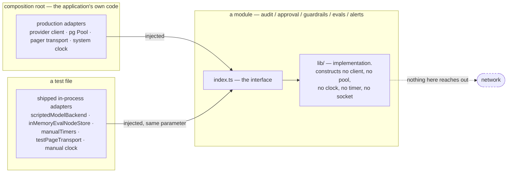
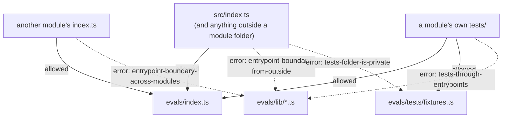

# TESTING

How this library is tested, why a test cannot reach a live model or a real
pager, and — stated as plainly as the guarantees themselves — what a green run
does **not** prove.

Written from the code that exists. Every claim below was checked against a file
in this repository on 2026-08-17, and where the design documents and the code
disagree, the code is what is written down and the divergence is named.

---

## 1. Run it

```bash
npm install
npm run check      # typecheck + module interface rules + tests
```

`npm run check` is three commands in `package.json`, and they are worth knowing
separately because they fail for different reasons:

| Command | What it runs | Fails when |
|---|---|---|
| `npm run typecheck` | `tsc --build --force` | A type-level guarantee has been weakened, or the code does not compile |
| `npm run lint:boundaries` | `depcruise packages/agent-ops-core/src` | A module became shallow — a caller reached past an interface |
| `npm test` | `vitest run --passWithNoTests` | A behavioural assertion failed |

Narrow the test run by path or by name:

```bash
npx vitest run packages/agent-ops-core/src/evals          # one module
npx vitest run .../src/evals/tests/judges.test.ts         # one file
npx vitest run -t "surfaces a split panel as contested"   # one test
npx vitest                                                # watch mode
```

The last full run in this repository:

```
Test Files  76 passed (76)
     Tests  707 passed (707)
  Duration  18.14s
```

and `depcruise` reported `no dependency violations found (185 modules, 461
dependencies cruised)`.

### There are no Postgres-dependent tests, and that is the design

**This is a place where the natural reading of the repository is wrong, so it is
stated first.** `docker-compose.yml`, `migrations/` and `npm run db:up` exist,
and none of them is needed to run the suite. No test in this package opens a
socket, reads a connection string, or imports a database driver — so there is
nothing to skip when no database is reachable, and no failure mode to describe.
Stop the container and the suite is unchanged: 76 files, 707 tests, green.

`npm run db:up` starts Postgres 16 on host port **5433** and applies everything
in `./migrations` in filename order the first time the volume is created. It is
for **running the system**, and for the operational verification in §7 — not for
`npm test`.

```bash
npm run db:up      # Postgres 16 + migrations, via docker compose
npm run db:reset   # drop the volume and re-apply the migrations from scratch
npm run db:down
```

The whole package imports four Node builtins, in seven files, and none of them
can dial:

| Builtin | Imported by | For |
|---|---|---|
| `node:crypto` | `audit/lib/canonical.ts`, `evals/lib/canonical.ts` | Digests. The only builtin in shipped code |
| `node:path`, `node:url` | the four `tests/typecheck.ts` harnesses, `alerts/tests/production.test.ts` | Resolving a fixture path |
| `node:fs` | `alerts/tests/production.test.ts` | Reading the module's own source to assert what is absent |

There is no `node:http`, no `node:net`, no `node:tls`, no `fetch(`, no
`child_process` and no `require(` anywhere in `src/` — shipped or test.

---

## 2. Hermeticity is structural, not conventional

`CLAUDE.md` states the rule and its enforcement in one sentence: *no module
constructs its own model client, clock, database handle, or HTTP client — every
one is a constructor parameter. A test must be unable to reach a live model even
with real credentials present in the environment.*

The mechanism is that **the things that can dial do not exist inside a module**.
They arrive as parameters, from a composition root, and every module ships at
least one adapter that satisfies the parameter without leaving the process.



What each module takes, and what a test supplies instead:

| Module | Constructor | Injected dependency that could otherwise dial | Shipped in-process adapter |
|---|---|---|---|
| `audit` | `createAudit({ store, clock, redact, onTraceUnavailable })` | `TraceStore` | `inMemoryTraceStore()`; `postgresTraceStore(executor)` takes an injected `SqlExecutor` and imports no driver |
| `approval` | `createApproval({ audit, store, clients, authorities, renderer, killSwitch, clock, … })` | `ApprovalStore`, `ClientFactory` | `inMemoryApprovalStore()`, `inMemoryClientFactory()`; `postgresApprovalStore(executor)` |
| `guardrails` | `createGuardrails({ audit, clock, timer, locale, detectorSets, limits, … })` | `Audit`, `Timer`, the model `Classifier` | in-memory `audit`; no `Classifier` ships at all |
| `evals` | `createEvalRecorder({ store, clock, redact, timers, ledger, alerting })`, then `run({ models, recorder, … })` | `ModelBackend`, `EvalNodeStore`, `RunLedger`, `Timers` | `scriptedModelBackend`, `inMemoryEvalNodeStore`, `inMemoryRunLedger`, `manualTimers` |
| `alerts` | `createAlerts({ sinks, clock, timers, journal? })` | `PageTransport` | `pagingAlertSink({ transport })` — the transport is a parameter with no default |

Two consequences worth naming.

**The in-memory adapters are deliverables, not mocks.** `inMemoryEvalNodeStore`,
`inMemoryRunLedger`, `scriptedModelBackend`, `manualTimers`, `inMemoryTraceStore`
and `inMemoryApprovalStore` are exported from `index.ts` and are what makes
hermeticity structural. `evals/lib/timers.ts` says it of `manualTimers`
outright: *"a shipped deliverable, not a mock, for the same reason
`inMemoryEvalNodeStore` and `scriptedModelBackend` are"*.

**The test-local fakes are mocks, and the code says so.** `approval`'s
`tests/fixtures/harness.ts` refuses the flattering reading of itself:

> *What they are **not** is "the second adapters that make the seams real". They
> are private test files, not exported from `index.ts`, and by this project's
> own standard — where the in-memory store and the in-memory client factory are
> shipped deliverables — that makes these mocks. The honest seam accounting is
> in `index.ts`, and it does not count these.*

### The three examples worth reading

**`evals/tests/fixtures.ts` — the whole harness is four injected values.**

```ts
export const harness = (
  redact: Redactor = passthroughRedactor,
  timers: Timers = systemTimers(),
  ledger: RunLedger = inMemoryRunLedger(),
  alerting?: AlertRaiser,
): Harness => {
  const store = inMemoryEvalNodeStore();
  const clock = manualClock();
  return { store, clock, ledger,
    recorder: createEvalRecorder({ store, clock, redact, timers, ledger, alerting }) };
};
```

`run` then takes `models` as a required parameter with no default. There is no
path by which a test could acquire a real provider client, because `evals`
contains nothing that constructs one. The file states the guarantee at its true
strength: *"`evals` contains nothing that can open a socket, and the one thing
that dials — `ModelBackend` — is a required parameter of `run` with no default."*

**`audit/tests/postgres-store.test.ts` — a database adapter, tested without a
database.** `postgresTraceStore` takes an injected `SqlExecutor`. The test
supplies a `recordingExecutor()` that understands exactly the six tagged
statements the adapter issues, and then asserts things a live database could not
tell you as cheaply: that no `UPDATE`, `DELETE` or `TRUNCATE` is ever issued
across the whole lifecycle; that the per-case advisory lock is taken before
every `MAX(sequence)` read; that a hostile correlation identifier round-trips as
a bound value rather than as SQL; and that the Postgres adapter and the
in-memory adapter produce **byte-identical** canonical bytes and the same digest.

**`approval/tests/fixtures/fake-sql.ts` — the test that needs the fake to be a
database and says what it is not.** Its whole point is durable suspension:
*"Build a suspension. Destroy every object in the process, including the store
and the executor. Rebuild from bytes. Answer the case."* `query` awaits a
microtask before doing anything, so two overlapping callers interleave *between*
statements while each statement stays atomic — which is Postgres's contract, and
is what gives the compare-and-set and idempotency-claim races their teeth. The
file's own honesty note then lists what it does **not** model: the schema's
guarantees, and transaction rollback.

---

## 3. Why there is no `SKIP_NETWORK` flag

`CLAUDE.md`: *"If you find yourself adding a `SKIP_NETWORK` flag or an
`if (process.env.CI)` branch to a test, the module's dependencies are wrong. Fix
the module."*

The argument is not about blast radius. A flag makes the guarantee conditional
on a value, and a value can be set. The guarantee this project wants is about
the call graph: **there is no code path in this package that can reach a
network**, so there is nothing for a flag to switch off and nothing a leaked
credential could reach.

This is not hypothetical here. `audit/tests/postgres-store.test.ts` ends with a
note about a test that used to exist and was deleted:

> *There used to be one: it read `AGENT_OPS_TEST_DATABASE_URL` and
> `AGENT_OPS_TEST_PG_MODULE`, dynamically imported a driver and constructed a
> pool in a top-level `await` that ran at collection time. With both variables
> set, `npx vitest run packages/agent-ops-core/src/audit` opened a socket. […]
> The old block argued that the guard was one-directional and therefore
> harmless. That argument is about *blast radius*, and the constraint is not
> about blast radius — it is about there being no code path in this package that
> can reach a network. There is now none, in shipped code or in test.*

`audit/lib/postgres-store.ts` says the same thing about itself: the guarantee
*"comes from the absence of a driver, never from a flag or an
`if (process.env.CI)`. […] an environment variable is convention with a longer
name."*

**And the absence is asserted, not assumed.**
`alerts/tests/production.test.ts` reads the module's own source text and fails
the build if any of it reappears:

```ts
it("constructs no HTTP client and opens no socket", () => {
  for (const file of sourceFiles()) {
    const code = codeOnly(file.text);
    for (const forbidden of ["fetch(", "XMLHttpRequest", "node:http", "node:https",
                             "node:net", "node:dgram", "node:tls", "child_process", "require("]) {
      expect(code, `${file.name} references ${forbidden}`).not.toContain(forbidden);
    }
  }
});

it("needs no flag and no environment variable to be safe", () => {
  const branch = /process\.env\.[A-Za-z_]/;
  const offenders = readdirSync(here)
    .filter((name) => name.endsWith(".ts"))
    .filter((name) => branch.test(readFileSync(join(here, name), "utf8")));
  expect(offenders).toEqual([]);
});
```

The second one polices the **tests** rather than the module: if any test file in
that folder ever grows an environment branch, the suite goes red. Its comment
states the rule in one line — *"If any test here ever needs an environment
branch, the module's dependencies are wrong and the module is what should
change."*

Across the whole of `src/`, `process.env` appears in exactly four places: three
prose comments explaining why it is absent, and one assertion that it is absent.
Zero reads.

### What to do instead, when you want the flag

| You want to… | Do this |
|---|---|
| Test against a real model | You cannot, from this suite. Wire a real `ModelBackend` at your composition root and run an eval from your own process |
| Test against a real database | Apply the migration and run `sqlExecutorContract` from an operational script — §7 |
| Make a slow test fast | Inject `manualTimers()` and advance virtual time. Nothing sleeps |
| Make a timing test deterministic | Inject a manual clock. `Date.now()` is forbidden inside a module and asserted absent |
| Stop a test paging someone | Nothing can. `PageTransport` is a required parameter of `pagingAlertSink` |

---

## 4. The module interface rules, and how to verify they bite

`.dependency-cruiser.cjs` is the structural half of the deep-module discipline:
it makes a shallow module — one whose callers must know its internals — fail the
build rather than merely look wrong in review.

The shape it enforces:

```
packages/agent-ops-core/src/
  index.ts            ← published entry point. Held to the rules like anyone else
  <module>/
    index.ts          ← the module's interface. Public
    lib/              ← implementation. Private
    tests/            ← tests + fixtures. Private
```



Five rules, all `severity: "error"`:

| Rule | What it forbids |
|---|---|
| `entrypoint-boundary-from-outside` | Code outside a module — *including* the published `src/index.ts` — importing anything in a module's subfolders |
| `entrypoint-boundary-across-modules` | A module reaching into another module's internals. Its own files import each other freely |
| `tests-through-entrypoints` | A module's tests reaching past **any** interface, including their own module's. Tests cross the same seam as callers |
| `tests-folder-is-private` | Shipped code importing a fixture |
| `no-circular` | Dependency cycles |

The configuration deliberately carries no `tsConfig`: the rules are path-based,
so they need no compiler options, and dependency-cruiser resolves a tsconfig's
`extends` relative to the process working directory rather than to the tsconfig
file, which breaks on this workspace layout.

### Proving the rules bite

A rule nobody has seen fail is a rule nobody knows is wired up. Three violations
were introduced into a throwaway copy of the tree — never into the repository —
and each was rejected by its own named rule.

The scratch tree is two modules and the published entry point, nothing else:

```
packages/agent-ops-core/src/index.ts
packages/agent-ops-core/src/alpha/index.ts
packages/agent-ops-core/src/alpha/lib/impl.ts
packages/agent-ops-core/src/alpha/tests/x.test.ts
packages/agent-ops-core/src/beta/index.ts
packages/agent-ops-core/src/beta/lib/impl.ts
```

The three violating lines:

```ts
// 1. src/index.ts — the published entry point reaches into a module's lib/
export { a } from "./alpha/lib/impl.js";

// 2. src/alpha/index.ts — one module reaches into another module's lib/
import { b } from "../beta/lib/impl.js";

// 3. src/alpha/tests/x.test.ts — a test reaches past its own module's interface
import { a } from "../lib/impl.js";
```

Running the repository's own configuration over that tree:

```
$ npx depcruise --config .dependency-cruiser.cjs packages/agent-ops-core/src

  error tests-through-entrypoints: packages/agent-ops-core/src/alpha/tests/x.test.ts
                                 → packages/agent-ops-core/src/alpha/lib/impl.ts
  error entrypoint-boundary-from-outside: packages/agent-ops-core/src/index.ts
                                 → packages/agent-ops-core/src/alpha/lib/impl.ts
  error entrypoint-boundary-across-modules: packages/agent-ops-core/src/alpha/index.ts
                                 → packages/agent-ops-core/src/beta/lib/impl.ts

x 3 dependency violations (3 errors, 0 warnings). 6 modules, 5 dependencies cruised.

$ echo $?
3
```

Non-zero exit, so `npm run check` stops there and `npm test` never runs. Rule 3
is the one people are most surprised by: a test importing its own module's
`lib/` is an error. If a test needs to reach past the interface, the module is
the wrong shape — and that is a design signal the build is willing to spend a
red run on.

Reproduce it yourself in a scratch directory; do not create violating files in
this repository, because other work may be running against it.

---

## 5. The type-level tests

Several of this library's strongest guarantees are compile-time facts:
`AccuracyReport` is not an `AgreementReport`; a subject cannot ask for a
write-capable client; a two-line object literal cannot be a recorder, a store, a
ledger, a `Screening`, an `Alert` or an `AlertSink`; a missed heartbeat cannot be
filed as a notice; there is no `outcome` field on an `AnswerReceipt` for a
dual-control screen to leak.

A compile-time guarantee asserted in prose is worthless — and this project has
the receipt for that. `evals/tests/typecheck.ts`: *"a design document quoted a
compile error it had never seen, and an adversary who ran `tsc` found the code
did not build at all."*

### The harness, and why the assertion cannot rot

Each module ships a `tests/typecheck.ts` that compiles fixtures from
`tests/fixtures/` with this repository's own TypeScript under this repository's
own strict settings, and returns the diagnostics:

```ts
const options: ts.CompilerOptions = {
  target: ts.ScriptTarget.ES2023,
  module: ts.ModuleKind.NodeNext, moduleResolution: ts.ModuleResolutionKind.NodeNext,
  strict: true,                    // strictFunctionTypes rides in on this
  noUncheckedIndexedAccess: true,
  exactOptionalPropertyTypes: true,
  noImplicitOverride: true,
  verbatimModuleSyntax: true,
  isolatedModules: true,
  skipLibCheck: true,
  noEmit: true,
};

export const compileFixture = (fixture: string): readonly Diagnostic[] => { … };
```

The convention is `@ts-expect-error`, which inverts the assertion in a way that
cannot rot:

- Every line expected to fail is marked `@ts-expect-error`.
- A fixture is therefore asserted to produce **zero** diagnostics:
  `expect(compileFixture("reports-are-disjoint.ts")).toEqual([])`.
- If a guarantee weakens and the line starts compiling, the directive becomes
  unused, TypeScript raises `TS2578: Unused '@ts-expect-error' directive`, the
  diagnostic list is non-empty, and the test fails.
- If a *new* error appears, the list is non-empty too. Drift in either
  direction is red.

Each fixture also carries at least one line that is expected to **compile**, so
the fixture proves a mechanism rather than a type that rejects everything.
`reports-are-disjoint.ts` gates a legitimate accuracy report;
`exhaustive.ts` includes the complete severity table and the switch that handles
all nine conditions.

The harness is hermetic in the same structural sense as everything else: it
reads files from disk and touches no network.

### What each fixture asserts

| Fixture | Asserted by | Claims |
|---|---|---|
| `evals/tests/fixtures/reports-are-disjoint.ts` | `evals/tests/reports.test.ts` | An `AgreementReport` is not an `AccuracyReport` **in either direction**; `gate` refuses agreement data; `agreement.correctBasisPoints` does not exist and neither does `accuracy.agreementBasisPoints` — the tempting names are absent, not merely discouraged |
| `evals/tests/fixtures/subject-cannot-write.ts` | `evals/tests/reports.test.ts` | A `decide` demanding a `WriteCapableClient` is not assignable; `ReadOnlyClient` and `WriteCapableClient` are mutually unassignable; a hand-rolled `EvalRecorder` does not typecheck; **and neither does a structurally complete `EvalNodeStore`**, which is where the forgery moved to once the recorder was branded |
| `alerts/tests/fixtures/exhaustive.ts` | `alerts/tests/exhaustive.test.ts` | The nine alert conditions are a closed union — a `Record<AlertConditionKind, AlertSeverity>` missing one does not compile, and a `switch` missing a branch leaves a residual that is not `never`; `liveness-lost` outranks every per-case severity, proved by a type that instantiates only to the literal `true`; `Alert`, `AlertSink`, `AlertJournal` and `LivenessStore` are all unforgeable; `{ ran: "nothing-was-due", itemsProcessed: 0 }` does not typecheck, so "I did nothing" cannot be spelled as "I did zero things"; `createAlerts({ sinks: [] })` does not compile; severity is not a parameter of `raise` |
| `guardrails/tests/fixtures/unforgeable.ts` | `guardrails/tests/unforgeable.test.ts` | A `Screening` cannot be assembled even by a caller holding every one of its parts, which is what makes `checkOutput`'s ordering constraint structural rather than documentary |
| `approval/tests/fixtures/capability-rejected.ts` | `approval/tests/capability.test.ts` **and** `approval/tests/ladder.test.ts` | No `decide` receives a write-capable client at any tier, and the reverse direction fails too; a structural impostor cannot name the phantom capability key; `DoNothing<Reserved>` has no `expire` branch, so *"nobody was on shift"* is inexpressible rather than merely forbidden; `EscalationLadder.recurrence` is mandatory, so the type has no `stop`, no `until` and no `maxAttempts` to reach for; `ReadOnlyClient` has no `write` property to reach for by accident |
| `approval/tests/fixtures/capability-accepted.ts` | `approval/tests/capability.test.ts` | The legitimate shapes compile |
| `approval/tests/fixtures/dual-control-rejected.ts` | `approval/tests/dual-control-and-brief.test.ts` | There is no `outcome`, `choice` or `approved` on an `AnswerReceipt`; `priorAnswer` is unreachable until `seat` narrows to `"second"`; there is no `recommendedChoice` and no `defaultAnswer`, so no answer can be pre-selected. *"the exclusion is a missing property, not a rule for whoever builds the screen"* |

`audit` has no typecheck harness and no fixtures folder; its guarantees are
behavioural (sequence assignment, seal, tamper detection, digest equality across
adapters) and are tested by driving the module.

**`tests/fixtures/` also holds ordinary fixtures.** `approval`'s folder mixes the
three compiled ones above with `harness.ts` (the in-memory wiring),
`points.ts` (decision-point declarations) and `fake-sql.ts` (the Postgres
stand-in). Only the files named in the table are handed to `compileFixture`.

**A note on the four harnesses.** `tests/typecheck.ts` is duplicated four times
across `evals`, `guardrails`, `alerts` and `approval`, with cosmetic differences
(`types: ["node"]` in `evals`, `types: []` elsewhere; reworded comments). It is
private to each module's `tests/` folder, so the rules in §4 forbid sharing it
without promoting it to somebody's interface — which would be worse. It is
duplication, it is deliberate, and it is named here rather than hidden.

### What the type-level tests do not prove

`evals/lib/clients.ts` states the limit itself: *"`any`, `as` and
`@ts-expect-error` defeat any type-level guarantee."* So each unforgeable type
has a runtime backstop, and the two are different mechanisms doing different
jobs:

| Type-level guarantee | Runtime backstop when someone casts past it |
|---|---|
| A subject cannot hold a write-capable client | The read-only client carries a poisoned `write` that records an error node and aborts the whole run with `SubjectAttemptedWrite` |
| An `EvalRecorder` cannot be hand-rolled | `RecorderNotMinted` |
| An `EvalNodeStore` cannot be hand-rolled | `StoreNotMinted` |
| A `RunLedger` cannot be hand-rolled | `LedgerNotMinted` |
| An `AccuracyReport` cannot be an `AgreementReport` | `reopenAccuracyReport` checks the literal `schema` and `against`, checks every figure is a safe integer, and recomputes the rates from the cases. `gate` runs it on whatever it is handed |

The report brands are a **compile-time, single-process** guarantee. They do not
survive `JSON.stringify`, which is exactly the flow the gate exists for. See
`EVALUATION.md` §3.

---

## 6. Production-grade assertions

### One test reads the module's own source

`alerts/tests/production.test.ts` is the only file in the package that does this,
and it says why up front: *"That claim cannot be proved by a test that calls a
sink and observes nothing happening; it is a claim about the **call graph**."*
Reading source text is not reaching past an interface — nothing in the file
imports `lib/` — and it is the same move `audit` makes when it insists the scope
of a guarantee be stamped on the artefact rather than asserted in a document.

It asserts, over `alerts/index.ts` and every file in `alerts/lib/`, with comments
stripped so a rule is about code and not about a paragraph explaining it:

- no HTTP client, no socket, no `child_process`, no `require(`
- no `process.env` in the module, and none in any test file beside it
- no import across a module edge — `alerts` is wired at the composition root
- `Date.now()` appears in exactly one file, `primitives.ts`, the one adapter that
  exists to own it: `expect(offenders).toEqual(["primitives.ts"])`
- the timer wheel is touched in exactly one file, the same one
- `setInterval` appears nowhere: nothing here schedules itself
- bare `containment` appears nowhere, per `docs/CONTEXT.md` rule 4
- the exported surface contains no `EscalationSink`, `NotificationSink`,
  `WarningSink` or `AlertNotification` — an alert is not an escalation and must
  not share its channel

### The other two `production.test.ts` files are behavioural

They assert the same properties by *driving* the module rather than by reading
it, which is the stronger form where it is available.

`guardrails/tests/production.test.ts` gives the module a manual clock, then a
scripted detector that advances that clock by 250 ms, and asserts the exact
recorded values: `screening.at === 1_000_250`, `latencyMicros === 250_000`, and
every node's `at` inside `[1_000_000, 1_000_250]`. A module calling `Date.now()`
anywhere would fail on the numbers, not on a regular expression. It then walks
every payload field of every node and asserts `Number.isSafeInteger` — *"writes
safe integers only, everywhere a number reaches the trace"*. It also asserts
recording is fail-closed at every tier, that an oversized payload is refused
rather than partly screened, and that detector concurrency never exceeds its
bound.

`approval/tests/production.test.ts` asserts a float is refused *before* it can
reach a trace, that money is written in minor units and confidence in basis
points, that every node carries a payload schema version, that the scope of the
guarantee is stamped onto the evidence itself, and that automated approval
records under whose delegation the system approved — *"the system approved it"
must never appear in a trace without saying under whose delegation.*

Vitest itself is configured with `restoreMocks: true`, so no stub leaks between
files.

---

## 7. What a green run does not prove

Stated as a list, because an overstated guarantee is a liability the first time
a regulator finds the gap.

**1. The Postgres schema's own guarantees are not exercised by any test here.**
The primary key, the one-seal partial unique index, the parent foreign key, the
`parent_sequence < sequence` check, the immutability triggers and the
`INSERT`-only grants are properties of Postgres. No test in this package opens a
socket, deliberately. `audit/tests/postgres-store.test.ts` says it without
hedging: *"A green run of this file is **not** evidence that append-only holds."*

That half is verified operationally:

```bash
npm run db:up      # applies migrations/0001..0006 in filename order
```

and then, from an application's own process against a live pool, the executable
contract `sqlExecutorContract` — exported from `audit/index.ts` — which checks
that an executor returns `rows` as an array, binds parameters rather than
interpolating them (round-tripping `'); DROP TABLE agent_ops.audit_trace_node; --`
verbatim), commits a transaction that resolves, runs a whole callback on one
connection, and rethrows. **Nothing runs it in continuous integration today**;
`README.md` says so and this document repeats it.

**2. The fakes prove statement discipline, not database behaviour.**
`recordingExecutor()` and `fakeSql()` understand exactly the tagged statements
their adapters issue. `fake-sql.ts` also does not model transaction rollback —
`transaction` runs the body on the same executor — so nothing in this package is
evidence that a partial transaction unwinds. Every conditional write in
`postgresApprovalStore` is a single statement precisely so that gap does not
matter to correctness.

**3. A type-level fixture proves a compile error, not an absence of `as`.**
See §5.

**4. `evals` records what it mediates, and cannot record what it does not.**
A subject's `decide` is application code holding its own closure; it can import a
provider SDK and call a model directly, and no type in this package reaches
outside this package. Detection is one-shaped and partial — see `EVALUATION.md`
§8. Every report and run header carries `capturedVia: "injected-client-only"` so
a reader learns the limit of the evidence from the evidence.

**5. `audit.record` is not idempotent.** A retry after a crash appends a second
node rather than returning the first. Deduplicating appends needs an
idempotency-key column and a partial unique index that
`migrations/0002_audit_trace.sql` does not have. At-most-once is about *effects*,
and `approval` owns that.

**6. The external watchdog is not here and cannot be tested here.** The sweeper
emits a heartbeat on every run including empty ones, and `alerts` ships the emit
side, the store, `livenessFindings` and `livenessQuery`. It does not ship the
watcher, because a watchdog that runs inside the process it watches fails
silently at the exact moment it is needed. `docs/RUNBOOK.md` §0 is the
instruction most likely to be skipped at deployment and the most expensive to
have skipped.

**7. Liveness records and the alert journal are in memory only.**
`inMemoryLivenessStore` and `inMemoryAlertJournal` are the only shipped adapters;
there is no migration for either. History dies with the process, so a watcher
polling across a restart sees `never-seen` rather than a real gap. That is the
safe direction and it is still a limit.

---

## 8. Conventions, if you are adding a test

- **Tests cross the same seam as callers.** Import only from `../index.js` and
  from your own module's `tests/` fixtures. Rule 3 in §4 enforces it.
- **TDD in vertical slices.** One seam, one test, one minimal implementation,
  repeat. Never write all the tests first — bulk tests verify imagined
  behaviour.
- **Collected files are `**/tests/**/*.test.ts`** under `packages/*/src/`.
  `fixtures.ts`, `typecheck.ts` and everything in `tests/fixtures/` are helpers
  and are not collected.
- **Never construct a dependency inside a module to make a test easier.** Add
  the parameter. That is the whole mechanism.
- **Never write `Date.now()` or `Math.random()` inside a module.** `evals`
  derives run identifiers from the injected clock plus a per-recorder counter for
  exactly this reason, and `hardening.test.ts` asserts a run is reproducible
  under a manual clock.
- **Integers only in payloads** — tenth-cents, micros, basis points. Byte-stable
  serialisation is what makes replay possible; floats are how it dies quietly,
  and `UnserialisablePayload` is raised before any write.
- **No personal data in traces.** Redaction runs before write, and — in `evals` —
  over reports as well as nodes, under the same policy, because reports outlive
  the node graph.
- **A behavioural claim gets a behavioural test; a type claim gets a fixture.**
  If you find yourself writing "this does not compile" in a comment, write the
  fixture instead.

---

## 9. Divergences between the design documents and the code

Written from the code. Each is a place where a document promises more than what
ships, or describes something that is not there.

1. **There are no Postgres-dependent tests.** The task that produced this
   document, and the presence of `docker-compose.yml` and `migrations/`, suggest
   a suite with a database-backed half. There is none, by design (§1, §7).
2. **`docs/RUNBOOK.md` §10 item 8 says `README.md` is stale** — that it states
   "there is no implementation code". The `README.md` in this repository today
   describes five shipped modules and 707 tests. The runbook's note is the thing
   that is out of date.
4. **`vitest.config.ts` points at this file before it existed** — *"See
   docs/TESTING.md once modules land."* It has landed; the comment is now
   accurate.
5. **`tests/typecheck.ts` is duplicated four times** with cosmetic drift. The
   rules in §4 make sharing it awkward, and the duplication is deliberate rather
   than accidental — but four copies of a harness will drift further, and this is
   where somebody will find out.
