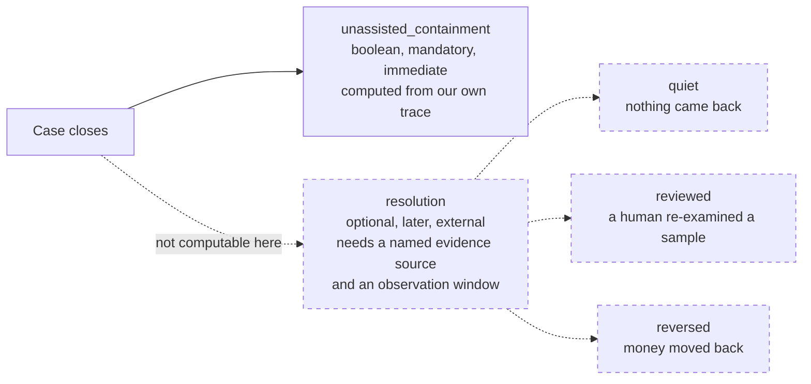

# 0002 — Unassisted containment and resolution are two fields, and the qualifier is mandatory

**Status:** Accepted
**Date:** 2026-08-17

## Context

`docs/CONTEXT.md` opens its outcome section with the claim that containment and
resolution are conflated across this entire industry, and that the conflation
hides real failures. The two are different in kind:

- **Unassisted containment** — the case reached a terminal state without
  authority transferring to a human. A *cost* measure. Fully observable from our
  own trace at the moment the case closes.
- **Resolution** — the party whose problem it was received the outcome they were
  entitled to. A *quality* measure. Not knowable at close; it requires an
  entitlement standard, an external evidence source, and a waiting period.

The error runs in the flattering direction. A customer who abandons in
frustration is contained and not resolved, and the worse the system was at the
moment of abandonment, the better the containment number looks. The mirror case
is as bad: a case escalated to a human who fixes it correctly is resolved and
not contained, so a team paid to raise containment is paid to suppress correct
escalations.

Nineteen applications inherit whatever field this library ships. One `success`
boolean would settle the argument in the wrong direction, permanently, in
nineteen schemas.

## Decision

**Two facts, two provenances, two timestamps — and only one of them exists in
the library today.**

1. `audit` records `unassistedContainment: boolean` at `close`, and nothing
   else about outcome. The type is `UnassistedContainment` and the field is
   `unassistedContainment` — the full two-word term in both. See
   `packages/agent-ops-core/src/audit/lib/types.ts` (the `UnassistedContainment`
   interface) and `CaseTrace.close(outcome: UnassistedContainment)`.
2. **There is no `success` field and no `resolution` field anywhere in the
   published surface.** Resolution is not merely stored separately — it has no
   representation at all. A grep for `Resolution` across
   `packages/agent-ops-core/src` returns a comment in `audit/lib/types.ts`
   explaining its absence, `evals`' `ObservationWindow` (which is a shadow-run
   cohort window, a different thing), and `clockResolutionUs` in `approval`.
   Nothing else.
3. `close` is **fail-closed at every tier**, unlike `record`, which is
   tier-policy driven. `audit/lib/types.ts` states the reason on the method: an
   unassisted-containment figure with no node behind it is an assertion rather
   than evidence.

The library therefore refuses to record resolution rather than let each of the
nineteen applications invent an evidence source. Per `docs/CONTEXT.md`, an
application supplies its own entitlement standard, its chosen evidence shape —
quiet, reviewed, or reversed — and its observation window. Until it does, its
resolution field stays empty, which is honest and visibly incomplete rather than
quietly wrong.

The qualifier is not decoration. Written bare, "containment" reads as though
human involvement were failure, which is how the industry misuses it. Written
as *unassisted containment*, it says what it records — nobody assisted — and
leaves whether that was good entirely open. The term carries **no target** in
this library: it is recorded, never optimised, and any per-application target
lives in that application next to its reserved-decision list, where the two can
be read together.

The dashed half of that diagram is **not implemented**. It is the vocabulary the
applications must fill in, recorded here so that nobody builds it on trace data
alone.

## Alternative rejected

**One `success` boolean, or a bare `containment` field with resolution derived
from it later.**

The case for it is genuine and it is the reason the industry does it:
containment is free. It falls out of the logs you already have, immediately, at
no cost. Resolution needs an entitlement standard nobody has written, an
external signal nobody is collecting, and a waiting period nobody wants. Given
one number and a deadline, every team ships the cheap one.

Rejected because the cheap number, given the expensive number's name, is worse
than no number. It hides three distinct things at once:

- abandonment scored as success;
- correct escalation scored as failure;
- **"no human was involved" silently including "nobody decided at all"** — a
  timeout, a default, or an abandonment counted identically to a case the system
  judged correctly.

`docs/CONTEXT.md` rule 3 goes further and is worth restating as a review check
rather than a guideline: *a metric named `resolution_rate` derived from trace
data alone is a bug.* If it can be computed at close, it is containment wearing
a different name.

## What would change our mind

Named, observable triggers:

1. **An application ships a defensible entitlement standard and a resolution
   evidence source.** At that point resolution becomes recordable and this
   library needs a `Resolution` type carrying its source and window — not a
   second boolean. One application clearing this bar means designing the type;
   three means shipping it.
2. **A regulator in any of these markets requires a single documented outcome
   field per case.** That is a presentation requirement, and it would be
   satisfied by deriving a reported figure from the two fields at the reporting
   edge — never by merging the columns.
3. **The term stops being recognised.** `unassisted containment` keeps the
   industry word so an auditor recognises it and adds the qualifier so a
   newcomer can read it. If auditors in these markets adopt a different term of
   art, the column name follows the audience, not our preference.

Nothing observable would justify a single `success` boolean. That one is closed.

## Where the code diverges from the design documents

Recorded because the code is the truth.

- **`CLAUDE.md` and `docs/CONTEXT.md` both call bare `containment` "a lint
  failure". There is no lint rule.** `npm run lint:boundaries` runs
  dependency-cruiser against `.dependency-cruiser.cjs`, which contains no
  identifier rules at all — it enforces module boundaries and cycles only.

  What actually enforces the qualifier is narrower and worth knowing exactly:
  - **One compile-time assertion**, in shipped code rather than in tests —
    `OutcomeCarriesTheQualifier` in
    `packages/agent-ops-core/src/audit/lib/invariants.ts`, asserting that
    `UnassistedContainment` carries `unassistedContainment` and not a bare
    field. Its comment gives the reason a type name matters more than a field
    name: it is in the signature nineteen callers must learn.
  - **Two tests** — `audit/tests/adversarial.test.ts`, which asserts `audit`'s
    exported surface has no bare `containment` key, and
    `alerts/tests/production.test.ts`, which scans `alerts`' own source files
    for the bare word.

  Together these cover `audit`'s outcome type, `audit`'s exported surface and
  `alerts`' source. `approval`, `evals` and `guardrails` source is scanned by
  none of them. The rule holds in practice today — the only non-`unassisted`
  occurrences in the package are the assertions and comments that state the rule
  — but across three of the five modules it holds by review rather than
  structurally, and that is a weaker guarantee than either document claims.
- **`docs/design/PHASE-2-INTERFACE-REVIEW.md` sketches
  `close(containment: Containment)`.** The shipped signature is
  `close(outcome: UnassistedContainment)`. The sketch predates rule 4 and is out
  of date, not authoritative.
