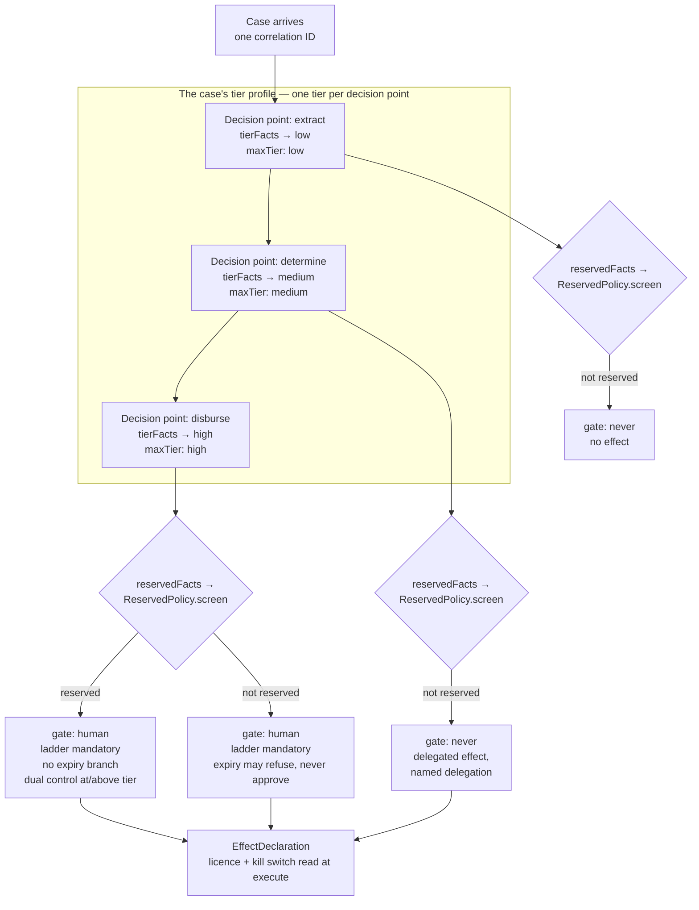

# 0004 — Risk tier attaches to a decision-and-its-effect, not to a case

**Status:** Accepted. **Reverses the brief as originally written.**
**Date:** 2026-08-17

## Context

The project brief described "risk tiers that select an execution path", which
reads as one tier per case. `docs/CONTEXT.md` challenged that at the time it was
written, `docs/design/PHASE-2-INTERFACE-REVIEW.md` listed it as fork 2 — one of
three forks it explicitly declined to decide — and
`docs/design/OPEN-ITEMS-RESOLVED.md` item 5 settled it once the declarative
skeleton made the consequence concrete.

The argument is one sentence long: **reading an invoice is low risk, paying it
is high risk, same case, same minute.**

If the tier attaches to the case, every step of a high-value case runs under
maximum guardrails at maximum cost and latency. `docs/CONTEXT.md`'s own note on
`guardrails` gives the number that makes this bite: a model-based detector is
roughly a doubling of decision latency and cost. Teams that lose their
throughput respond predictably — they split cases to get it back, which
fragments the trace. Fragmenting the trace to work around a tiering decision is
a bad trade in a library whose main product is the trace.

## Decision

**Tier is a property of a decision point, and a case has a *tier profile*
rather than a tier.**

Three places in the code carry it, and none of them is a case-level field:

1. **A `DecisionPointSpec` is declared per decision point.**
   `packages/agent-ops-core/src/approval/lib/types.ts` gives every spec its own
   `tierFacts`, its own `maxTier` ceiling, and its own effect declaration.
   Reading an invoice and paying it are two declarations and therefore carry two
   tiers naturally, with no extra concept.
2. **`audit.open` takes a correlation identifier and nothing else.** The tier
   travels on the node: `RecordedNode.tier` is documented as *"The tier this
   node ran under. Part of the case's tier profile."*, and
   `CaseTrace.record<T extends RiskTier>(payload, options: RecordOptions<T>)` is
   generic over the tier of that write. There is no place to put a case-level
   tier because the interface does not have one.
3. **The tier-dependent fail policy is per write, not per case.** `audit`'s
   `RecordResult<T>` is `Degraded`-capable below high tier and not at high tier,
   which only makes sense if tier is known per node.

`TierPolicy.classify` is pure and runs on facts only, before the expensive work
— `docs/CONTEXT.md`'s constraint that a tier must be computable before the work
it gates. `UngatedSpec.maxTier` is a fail-closed ceiling: a case classified
above it halts rather than proceeding at a tier the point never declared for.

Note the two independent axes in that flowchart. Tier selects the execution
path; reserved status is screened separately from separate facts and cannot be
reached by re-tiering. That separation is ADR 0003.

## Alternative rejected

**One tier per case — `classify(case): Tier` — set at intake.**

The case for it is not weak, and it was the brief's own reading. It is simpler
to reason about, simpler to configure, and — the part that carries real weight
in these industries — **simpler to explain to an auditor**. "This claim is a
high-risk claim" is a sentence an auditor can hold. "This claim's extraction was
low, its determination medium and its disbursement high" is a sentence that
needs a diagram.

`docs/design/OPEN-ITEMS-RESOLVED.md` item 5 concedes that point rather than
arguing it away, and the concession stands. The answer is that a tier profile is
explainable too, and it is explainable **truthfully** — which per-case stops
being, the moment teams start splitting cases to recover throughput. An
explanation that is simple because the underlying model is a fiction is worse
than one that needs a diagram.

## What would change our mind

Named, observable triggers:

1. **An auditor or regulator in any of these markets requires a single
   documented risk classification per case.** This is a presentation
   requirement, and we would satisfy it by deriving a **headline tier** — the
   maximum across the profile — for reporting, without changing the enforcement
   model underneath. It does not exist today; it is four lines when somebody
   asks for it.
2. **Profiles turn out to be degenerate.** If, across three or more
   applications sustained over a quarter, every decision point in a case
   carries the same tier as every other, the profile is a per-case tier written
   the long way and the extra concept is not earning its cost.
3. **Mid-case re-tiering becomes routine.** Already named as trigger 2 of
   ADR 0001. Cases needing their tier profile recomputed more than once
   mid-flight, in more than one application, would mean tiering ahead of
   execution is a fiction we are maintaining — and that undermines per-decision
   tiering as much as per-case.

What would *not* change our mind: the explanation being harder. That cost was
accepted knowingly and is recorded above.

## Where the code diverges from the design documents

- **`docs/design/PHASE-2-INTERFACE-REVIEW.md` §1 sketches
  `open(caseId: CorrelationId, profile: TierProfile)`.** The shipped signature
  is `open(correlationId: CorrelationId)` and there is **no `TierProfile`
  type in the package**. The profile is not a declared object; it is what you
  get by reading the `tier` field off the nodes of a case. That is a stronger
  form of the decision than the sketch — a declared profile could drift from the
  tiers actually used, and a derived one cannot — but it is not what the review
  described, and a reader coming from that document will look for a type that
  does not exist.
- **`docs/design/PHASE-2-INTERFACE-REVIEW.md` §2 sketches
  `register<T extends Tier>(tier: T, handler: (c: ClientFor<T>) => Verdict)`,
  with a `ClientFor<T>` conditional type giving a `WriteCapableClient` at low
  tier.** Neither survives. There is no `register` verb (ADR 0006) and **no
  `decide` receives a write-capable client at any tier** (ADR 0007) — the
  low-tier concession was deliberately dropped. `ClientFor` does not exist.
