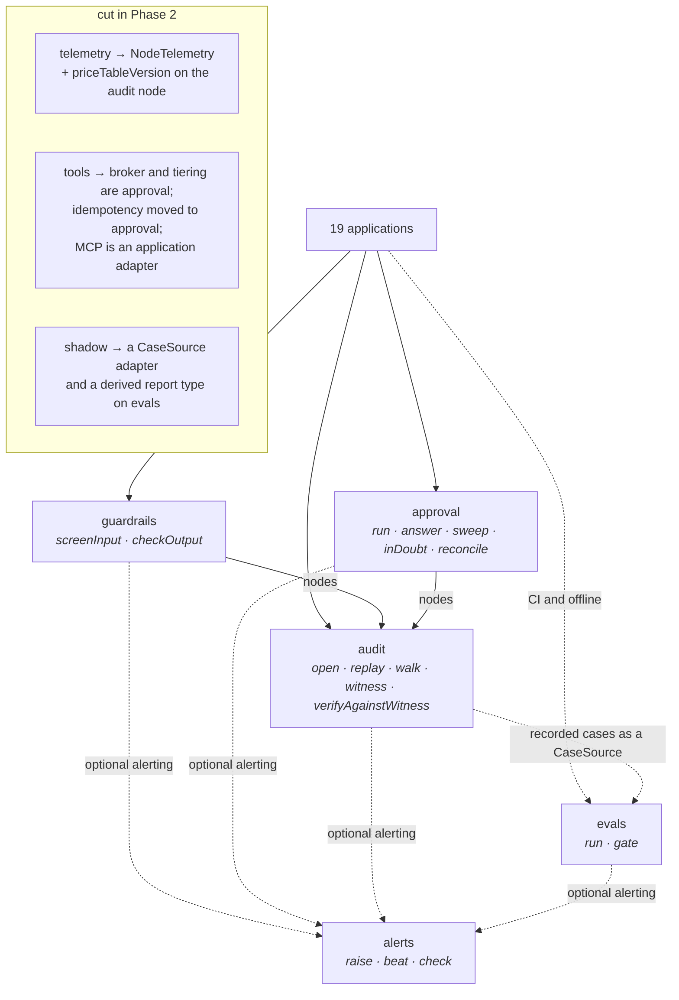

# 0005 — Four modules, not seven: `telemetry` cut, `tools` dissolved, `shadow` merged

**Status:** Accepted. A fifth module, `alerts`, was added afterwards — see
ADR 0012.
**Date:** 2026-08-17

## Context

`CLAUDE.md` states the constraint plainly: a wide, shallow interface poisons all
nineteen callers at once, and **four excellent modules beat seven mediocre
ones**. Seven candidates went into the Phase 2 interface review — `audit`,
`approval`, `evals`, `guardrails`, `telemetry`, `tools`, `shadow` — and each was
put to the two tests in `CLAUDE.md`:

- **The deletion test.** Delete the module: does complexity *vanish* (it was a
  pass-through) or *reappear* across nineteen callers (it earns its keep)?
- **The seam rule.** One adapter is a hypothetical seam. Two is a real one.

The review landed on exactly the four the constraint asked for, which
`docs/design/PHASE-2-INTERFACE-REVIEW.md` itself flags as grounds for suspicion
rather than satisfaction, and it wrote the strongest honest case *against* each
cut so the reasoning could be checked rather than the conclusion.

## Decision

**Three of the seven do not exist as modules.** `packages/agent-ops-core/src`
contains `audit`, `approval`, `evals`, `guardrails` and `alerts`, and nothing
else.

### `telemetry` — cut. It was the pass-through.

What it would have held: a price table (**data**), a stopwatch (**three lines**),
and a `GROUP BY` over the trace (**an `audit` query**). Delete it and complexity
does not reappear across nineteen callers — it *relocates* to `audit`, where a
decision's cost was always required to live for a replayed case to account for
itself.

One non-obvious thing survived the cut and is in the code:
`packages/agent-ops-core/src/audit/lib/types.ts` declares `NodeTelemetry` with
five integer fields — `costTenthCents`, `tokensIn`, `tokensOut`,
`latencyMicros`, and **`priceTableVersion`**. That last field is the whole
reason the review said "worth one field, not a module": without it, historical
cost-per-decision silently rewrites itself every time a provider changes prices,
and the year-over-year cost chart becomes fiction.

`NodeTelemetry` is optional per node and **all five fields are present or none
are**, because most nodes are not model calls and four recorded zeroes would
make "we spent nothing" indistinguishable from "we did not measure".
`guardrails` writes it on every node that measured a model call, and where a
detector could not say what it spent it records `costMeasured: false` rather
than a zero.

### `tools` — dissolved. Three of four responsibilities relocate.

| Responsibility | Where it went |
|---|---|
| Permission broker | `approval`. It *was* `approval`'s interface under a second name, and two modules deciding whether an effect may proceed is two places to get it wrong. |
| Risk-tiered tool registry | `approval`'s `TierPolicy`, restated. Two tierings means two answers when they disagree. |
| Idempotency | **Real**, and it moved to `approval`. See ADR 0010. |
| Model Context Protocol server | An adapter, and an application concern. Not in the package. |

Idempotency went to `approval` **specifically** and not to a small module of its
own, for a reason that is about the guarantee rather than about tidiness: the
thing that authorises an effect and the thing that hands you the write-capable
client must be the same module, or the guarantee leaks at the join. In the
shipped code, `approval`'s effect executor mints the claim, moves it to
`unknown` before the outbound call, and is the only thing that constructs a
write-capable client — all inside `lib/approval.ts`.

### `shadow` — merged into `evals`. The capability earns its keep; the module does not.

Delete the *capability* and complexity reappears: replaying recorded cases,
running a subject, diffing against what humans did, aggregating agreement.
Delete the *module* and almost nothing reappears, because `evals` already needs
the runner, the structural no-write on the subject, the baseline, and the case
source.

What is genuinely distinct is a case-source adapter and a report type — a seam
adapter and a return type are not a module.

The shipped form is stronger than the merge the review described, because of
graft 7 in `docs/design/design-it-twice/FINDINGS.md`: **the report type is
derived from the case source, not from which function you called.**
`packages/agent-ops-core/src/evals/lib/run.ts` declares
`ReportOf<K extends SourceKind>` — `"golden"` yields `AccuracyReport`,
`"recorded"` yields `AgreementReport` — and there is one executing verb, `run`.
There is no `runShadow` and no `mode: "shadow"` flag. Agreement-is-not-accuracy
becomes a consequence of provenance rather than a naming convention nineteen
teams must remember.

## Alternative rejected

**Keep all seven, and let each be thin.**

The case for keeping `telemetry` is the strongest of the three, and it is not
about cost aggregation: exporting to OpenTelemetry, controlling metric
cardinality and sampling high-volume traces are genuine, non-trivial problems.
They are also *generic observability* rather than agent-operations machinery,
they have mature libraries, and `CLAUDE.md` requires an ADR before adding a
dependency nineteen applications inherit — which is an argument for buying one
at the application edge, not for building a module.

The case for keeping `shadow` separate is the sharpest and deserves recording
because it was not dismissed. Agreement is not accuracy; humans are the baseline
*including their errors*; and somebody will eventually compute an accuracy
figure from a shadow run and put it in a board pack. Physical separation into
its own module is a real safeguard against that.

It was rejected on the grounds that **separate types are a stronger safeguard
than separate folders, and cost nothing**. Folders do not typecheck. The shipped
code goes further than the argument did: `AccuracyReport` and `AgreementReport`
are sealed with non-exported `unique symbol`s so neither is assignable to the
other, `gate` accepts only the first, and — because brands do not survive
`JSON.stringify`, and the flow this gate exists for is *run in job A, write
JSON, gate in job B* — `reopenAccuracyReport` is a validating re-entry that
refuses an agreement report's JSON by its literal `schema` field, refuses any
figure that is not a safe integer, and **recomputes every rate from the case
statuses** before letting it through — so a report whose headline numbers do not
follow from its own contents is refused rather than gated.

**The real cost of the merge, on the record:** `evals` becomes the module that
does everything, and modules that do everything drift shallow. The mitigation is
a review rule — *a third executing entry point on `evals` is a signal to split,
not to extend* — and `evals/index.ts` carries that rule at the top of its own
interface, along with an accounting of which exported functions are constructors
and readers rather than executing verbs. That accounting is stated plainly
because the distinction is exactly the one somebody will use next year to add
`generateSuite()` as "just a constructor".

## What would change our mind

Named, observable triggers, per cut:

1. **`telemetry`.** Nothing plausible. Its deletion test comes back clean with
   no argument on the other side: cost has to be on the audit node for replay to
   account for itself, the price table is data, and the aggregation is a query.
   The only trigger would be `audit` growing a second, incompatible cost
   representation — which would be a defect in `audit`, not evidence for a
   module.
2. **`tools`.** The verdict rests on a claim that can be falsified: that few of
   the nineteen need to expose their tools to an external model host over the
   Model Context Protocol. **If six or more of the nineteen need it**, it
   deserves reconsideration — as a shipped adapter, still not as a module.
3. **`shadow`.** A third *executing* entry point on `evals` is the trigger, and
   it is a trigger to **split**, not to extend. Constructors and artefact
   readers do not count; anything that opens a node, reaches a store or runs a
   subject does.

## Where the code diverges from the design documents

- **The four became five.** `alerts` was added after the review, from a question
  the user asked — *are the right engineers notified on failure, long before a
  client or an employee makes contact?* — whose honest answer was no.
  `packages/agent-ops-core/src/index.ts` says so in its header rather than
  quietly listing five where the review said four. See ADR 0012.
- **The verb lists in the review are all out of date.** The review sketched
  `audit` as *three verbs plus close*, `approval` as *classify · register ·
  execute*, and `evals` as *evaluate · shadow · gate*. The shipped surfaces are
  in the module diagram above and none of the three matches. Where those
  documents and the code disagree, the code is the truth.
- **`evals`' own module header is out of date about its artefact versions.**
  `evals/index.ts` names the artefact version as the literal `schema` field
  `"report.accuracy/1"` and `"report.agreement/1"`. The shipped code mints
  `"report.accuracy/2"` and `"report.agreement/2"`
  (`evals/lib/report.ts`), and `READABLE_ENVELOPES`/`READABLE_REPORT_SCHEMAS`
  list all four so a `/1` artefact is upcast on read rather than rewritten in
  place. The mechanism the header describes is exactly right; the version
  numbers in it are one release behind, which is precisely the drift the
  three-version scheme exists to make survivable. Read the code for the numbers.
- **`docs/design/PHASE-2-INTERFACE-REVIEW.md` §4 recommends groundedness be
  "implemented once, as a `Scorer`, and *used* by `guardrails`. One
  implementation, two callers."** It is implemented once — in `guardrails`, as
  `Groundedness`, with two adapters — but there is **one caller**. `evals`
  contains no reference to groundedness at all, and does not import
  `guardrails`. `guardrails/index.ts` states the intended direction
  (`evals` → `guardrails`); the import does not exist yet. This belongs in
  "what isn't finished", not in a claim that the reuse has happened.
