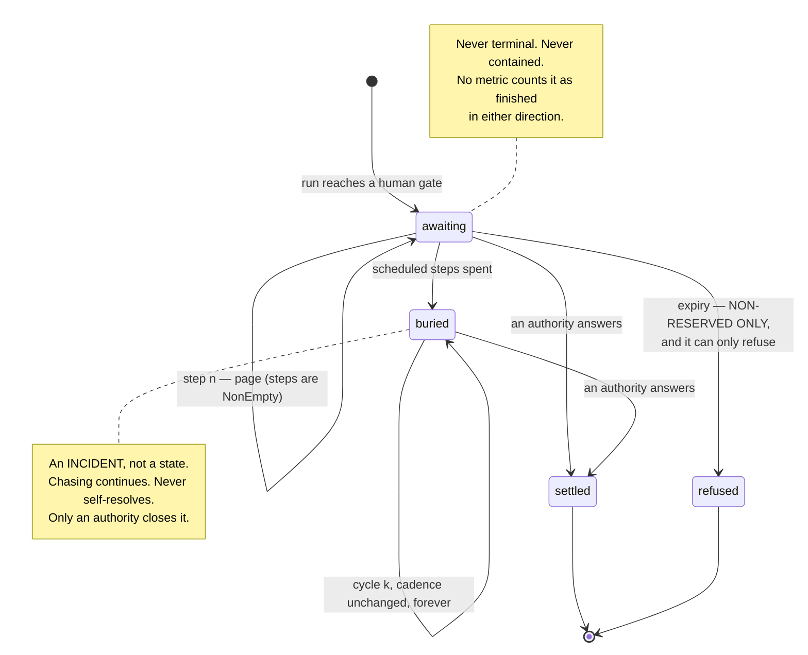

# 0008 — The escalation ladder cannot express giving up, and recurrence widens the audience rather than raising the volume

**Status:** Accepted. **Found by the user, and it corrected a defect in eight
designs at once.**
**Date:** 2026-08-17

## Context

This decision came from a question the user asked while reading the resolved
open items against the reserved-decision rule:

> *"does this mean that if somebody was meant to do something, say approve an AI
> automation so it can proceed, it will not, and just remain stale and the
> process ends there buried and unresolved?"*

**As designed: yes, and that was a defect.** Two correct rules had combined into
an incorrect system. `approval/flexible` correctly deleted the expiry branch for
reserved decisions, so a decision could not time out *into* a verdict — "nobody
was on shift" is not a lawful basis for an automated decision. But **nothing in
any of the eight designs drove ageing.** The case simply stopped. No error, no
red dashboard, no queue entry growing old. Silently un-decided.

That is `docs/CONTEXT.md`'s dangerous quadrant reached by a path nobody
designed: not resolved, not honestly contained, and invisible.

`docs/design/OPEN-ITEMS-RESOLVED.md` opens with this as item 0, ahead of the
five the design exercise had flagged, because it invalidated a guarantee the
others were built on top of.

## Decision

**Removing the expiry branch is necessary and was never sufficient. The rule is
two-sided and both sides are in the type.**

1. **A reserved decision has no terminal state reachable without an authority
   answering.** `DoNothing<Reserved>` is `{ ladder }` and nothing else — no
   expiry, no default, no threshold, no override. See ADR 0003.
2. **A gated decision cannot be declared without a non-empty ladder.**
   `GatedSpec.doNothing` is required, `EscalationLadder.steps` is
   `NonEmpty<EscalationStep>`, and `EscalationLadder.recurrence` is required
   inside it. Declaring a human gate without saying what happens as it ages does
   not compile.
3. **The ladder never terminates into silence.** `Recurrence` has **no `stop`
   value, no `maxAttempts` and no `until`.** The type cannot express giving up.
   `packages/agent-ops-core/src/approval/lib/ladder.ts` states the resulting
   invariant as a property of the state machine: *there is no position from
   which the next due time is `null`.* `nextDueAt` never returns `null`,
   `Infinity` or a sentinel.

Two production constraints follow, and the second is the one usually missed.

**Cadence is bounded and never accelerates.** `Recurrence.every` is a single
constant, and `ladder.ts` notes that the cadence cannot accelerate *by
construction* — there is no field that could make the interval shrink over time.
`assertLadderSound` runs on every `run` that reaches a gate, before anything is
suspended, and raises `LadderCadenceTooTight` if the scheduled steps are not
strictly increasing or the recurrence interval is below
`limits.minRecurrenceIntervalMs`. A recurrence that speeds up floods a channel,
the channel gets muted, and the case becomes *less* likely to be answered than
if nothing had been sent.

**Recurrence widens the audience, it does not raise the volume.** `firingAt`
takes cycle *n* and reaches the first *n* names on `widenTo` — deputy, then line
manager, then the accountable executive — while the interval stays exactly
`every`, bounded by `limits.maxRecipientsPerReminder`. The fifteenth reminder to
a person who has ignored fourteen is not a plan; reaching someone who *can*
answer is.

Four consequences are in the code:

- **`awaiting_authority` is not terminal and is never contained.** The terminal
  union excludes it, so no metric can count a waiting case as finished in either
  direction.
- **Ageing is recorded as nodes.** Every reminder sent is a node, so "we chased
  them" is evidence rather than an assertion. A case that waited eleven days and
  escalated four times has that written down, not implied by two timestamps.
- **A buried case is an incident.** `lib/approval.ts` writes an
  `approval.buried` node and raises the `case-buried` alert. It stays
  answerable indefinitely: it never self-resolves, never disappears from a
  queue, and never acquires a verdict from the passage of time. The library
  refuses to close it; only an authority can.
- **Reminders that stopped firing are themselves alertable.** An
  `approval.reminders-stopped` node and a `reminders-stopped` alert, because a
  case that stopped being chased throws nothing.

One further correction the code makes that the resolution document did not
anticipate: **a sweeper that was down does not catch up by firing everything at
once.** `nextDueAt` takes `lastRemindedAt` and floors the due time at
`lastRemindedAt + declaredGap`. Without it, every position of a ladder whose
schedule is already in the past is due *now*, so a sweeper down for a month
fires step 1, step 2 and twenty-nine recurrence cycles in a single millisecond —
escalating through deputy, line manager and accountable executive in one breath,
which is exactly the accelerating cadence the type claims is impossible. The
floor is slack in normal operation, so a declared cadence is followed exactly.
It deliberately does **not** skip missed cycles: the audience still widens one
cycle at a time, so nobody is escalated past.

## Alternative rejected

**A maximum attempt count, or a terminal "gave up" state, with a dead-letter
queue for what falls out.**

The case for it is operational and it is not silly. An unbounded reminder loop
against a pool that has been disbanded sends mail forever. A `maxAttempts` gives
operators a finite queue to drain, a clear signal that something needs human
intervention at the organisational level, and a bound on the resources one stuck
case can consume.

Rejected because the bound is on the wrong thing. **A system that stops asking
has decided by exhaustion, which is the precise thing reserved decisions exist
to prevent.** A decision that needed a human yesterday still needs one next
month, and the fact that fourteen reminders went unanswered is evidence about
the organisation, not about the case.

The operational concern is real and is answered differently: a buried case is
declared an **incident** with its own alert, the cadence is floored so the cost
of chasing forever is bounded and small, and `docs/CONTEXT.md` states that the
failure is of the organisation, not of the case. Draining the queue is a
management action, not a state transition the library performs on its own.

## What would change our mind

Named, observable triggers:

1. **A lawful basis for a reserved decision to complete without an authority.**
   `docs/design/OPEN-ITEMS-RESOLVED.md` item 0 says we are not aware of one and
   would want to see the statute. That is still the position.
2. **A recurrence channel that cannot be reached at all.** If an application
   demonstrates that its widened audience is structurally unreachable — the
   pool, the deputy and the executive all gone, a defunct department — the right
   answer is a `BriefRenderer`/`AuthorityDirectory` problem and an
   `AuthorityUnavailable` alert, which already exist. It would become a trigger
   to change the ladder only if the alert path proved unable to reach anyone
   either.
3. **Measured harm from the cadence floor.** If floored catch-up after downtime
   is shown to leave cases unchased for materially longer than their declared
   ladder intended, in production, the floor needs revisiting — not the
   never-give-up rule.

## Where the code diverges from the design documents

- **A buried case is an incident on the node and `degraded` in the alert, and
  the two words are doing different jobs.** `docs/CONTEXT.md` and
  `docs/design/OPEN-ITEMS-RESOLVED.md` both call a buried case an incident, and
  the `approval.buried` node carries `incident: true`. But `alerts` derives
  severity from the condition and does not let the raising site override it, and
  `SEVERITY_BY_CONDITION` maps `case-buried` to **`degraded`**, not `incident`.

  `lib/approval.ts` gives the reasoning at the raise site and it is worth
  quoting rather than paraphrasing: a buried case is an incident **of the
  organisation**, and is right to be called one — but an alert addresses an
  **operator**, and no part of the machinery is broken here. *Paging an engineer
  at 3am about a case a manager must answer is how a channel gets muted, which
  is the failure the escalation/alert separation exists to prevent. Loud,
  recorded, and not a page.*

  Anyone reading a dashboard should know that the trace and the pager disagree
  on the word, deliberately, and which one governs which audience.
- **`docs/design/OPEN-ITEMS-RESOLVED.md` item 0's sketch has `EscalationStep`
  and `Recurrence` exactly as shipped**, with one addition the sketch lacks:
  `assertLadderSound` and the `LadderCadenceTooTight` error, which turn "cadence
  is bounded" from a property of the documentation into a declaration-time
  refusal.
