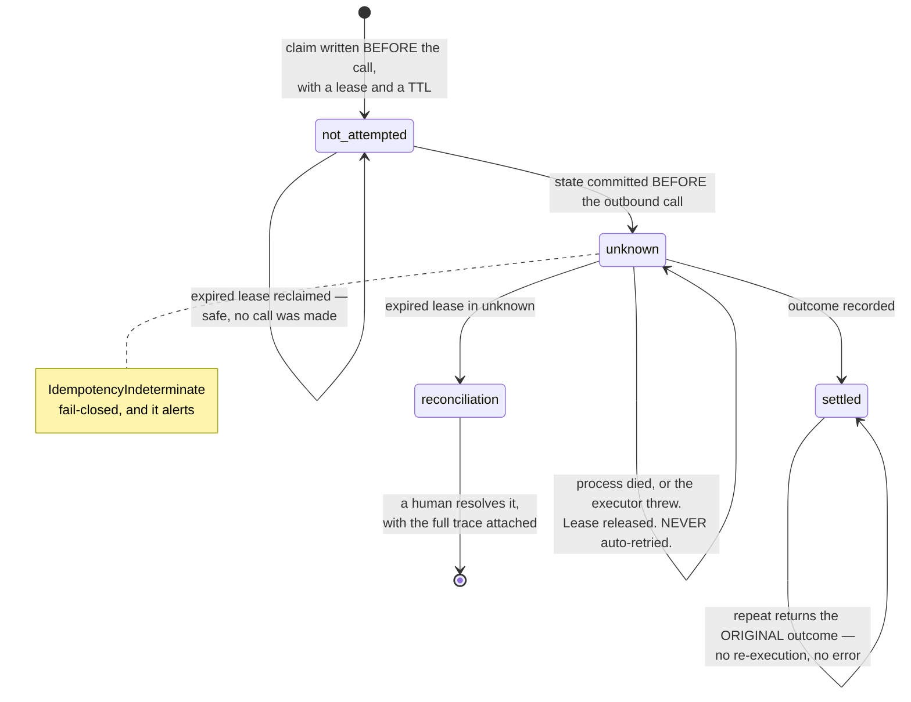

# 0010 — Three idempotency states, and ambiguity resolves toward not paying twice

**Status:** Accepted
**Date:** 2026-08-17

## Context

Neither winning design in `docs/design/design-it-twice/FINDINGS.md` had a policy
for process death *after* an idempotency key is claimed and *before* the outcome
is recorded. No lease, no TTL, no reaper, no dead-letter. It is the classic
distributed-systems hole, and here it is a payment.

With two states — claimed and settled — a process that dies mid-call leaves a
row that cannot distinguish two situations that demand opposite responses:

- the key was claimed and **no outbound call was made** — retrying is safe and
  correct;
- the outbound call **was made** and the outcome was never recorded — retrying
  may pay twice.

A two-state representation forces one answer for both, and whichever is chosen
is wrong half the time in a system that moves money.

## Decision

**Three states, not two. `not-attempted` and `unknown` must never share a
representation, because the distinction is what decides whether a retry is
safe.**

`packages/agent-ops-core/src/approval/lib/types.ts` declares
`type IdempotencyState = "not-attempted" | "unknown" | "settled"` with the
comment stating exactly that.

| State | Meaning | On retry |
|---|---|---|
| `not-attempted` | Key claimed, no outbound call made | Safe to execute |
| `unknown` | Outbound call made, outcome unrecorded | **Never auto-retry** |
| `settled` | Outcome recorded | Return the original outcome |

Five things in `lib/approval.ts` make it hold:

1. **The claim is written before the outbound call**, with a lease and a TTL.
2. **The claim moves to `unknown` before the outbound call**, in a committed
   write. The comment states the point: if this process dies mid-call, what
   survives says *"we may have paid"* rather than *"we never tried"*.
3. **An expired lease in `unknown` is never reclaimed for execution, at any
   age.** Reclamation is only ever reachable from `not-attempted`, where no
   outbound call was made, and the reclaim writes its own
   `effect.claim-reclaimed` node naming the state it came from.
4. **When the executor throws, the claim stays `unknown` and the lease is
   released.** Releasing the lease matters: a later attempt then sees a genuine
   in-doubt rather than "somebody is mid-flight". It is still never
   auto-retried.
5. **`IdempotencyIndeterminate` is a named error mode with `unknown` semantics,
   fail-closed, and it alerts** — `effect-outcome-unknown`, the second of
   `docs/CONTEXT.md`'s eight silent conditions, because an effect in `unknown`
   *did not fail*; something is merely unwitnessed.

The reconciliation queue is `approval.inDoubt()`, bounded by
`limits.inDoubtBatch`. A human resolves each entry with the full trace attached.
The library does not drain it.

**Ambiguity resolves toward not paying twice.** A duplicated payment is a
clawback, a customer-trust incident and a regulatory conversation; a delayed
payment is a phone call. These costs are not symmetric, and the default must not
pretend they are.

One refinement the code adds that the resolution document did not have: the
result of claiming a key is an **atomic transition, not a read**.
`IdempotencyClaimResult` carries `claimed: boolean` alongside the claim, because
without it the loser of a race reads `not-attempted`, cannot tell it did not
win, and manufactures a reconciliation incident **for a double-clicked button**.
A live lease held by somebody else is `EffectAlreadyInFlight` —
`alert: false, incident: false` — and it becomes in-doubt if and when the lease
runs out, which is the bound on how long "wait and retry" stays the right
advice.

## Alternative rejected

**Two states plus automatic retry with backoff, and a provider-side dedupe key.**

The case for it is that most effect channels *do* offer idempotency keys, and
where they do, `unknown` collapses to "ask the provider what happened" and the
whole reconciliation queue mostly empties. Automatic retry is also what
operators expect, and a human-resolved queue is real ongoing cost — somebody has
to work it, at 3am, with the trace open.

Rejected because the library cannot assume the channel. Nineteen applications
across claims, invoices, tickets, expenses, membership and underwriting will
integrate effect channels ranging from a modern payments provider with true
idempotency to a fax-adjacent legacy system with a nightly batch. A default that
is safe only where the provider is well-behaved is a default that pays twice in
the applications least able to absorb it.

`docs/design/OPEN-ITEMS-RESOLVED.md` item 3 records the counter-position as a
standing action rather than a closed door: **ask every effect channel we
integrate whether it offers a provider-side idempotency key we can pass
through.**

## What would change our mind

Named, observable triggers:

1. **An effect channel offering true exactly-once delivery with a provider-side
   idempotency key we can pass through.** Then `unknown` collapses to a provider
   query for that channel, and its reconciliation queue mostly empties. This is
   a per-channel change — it would be an `EffectDeclaration` that can answer
   "what happened to this key?", not a change to the three states.
2. **The queue never being worked.** If `inDoubt` entries accumulate unresolved
   across applications, the human-resolution policy has failed in practice and
   the honest response is to say so loudly, not to quietly start auto-retrying.
   Auto-retry on an unworked queue is a doubled payment with a paper trail
   showing we chose it.
3. **A measured asymmetry running the other way.** An application where a
   delayed payment is genuinely more costly than a duplicated one — a regulated
   deadline with a statutory penalty, say — would be a reason to let *that
   application* configure it. It is not a reason to move the library default,
   and it would still have to be a declared, recorded choice rather than a flag.

## Where the code diverges from the design documents

- **Nothing material.** The three states, the pre-call claim, the never-reclaim
  rule, the reconciliation queue and the fail-closed alerting are all as
  `docs/design/OPEN-ITEMS-RESOLVED.md` item 3 settled them.
- **Two additions the document does not describe**, both recorded above:
  `IdempotencyClaimResult.claimed` (so a lost race is not a manufactured
  incident) and the deliberate lease release on executor failure.
- **`docs/design/PHASE-2-INTERFACE-REVIEW.md` §2 lists `IdempotencyReplay` as an
  error mode.** It is not an error in the shipped code: a repeat on a `settled`
  key writes an `effect.idempotent-replay` node and **returns the original
  outcome**. It does not re-execute and does not throw. The review's own
  invariant list says this; its error table contradicted it.
