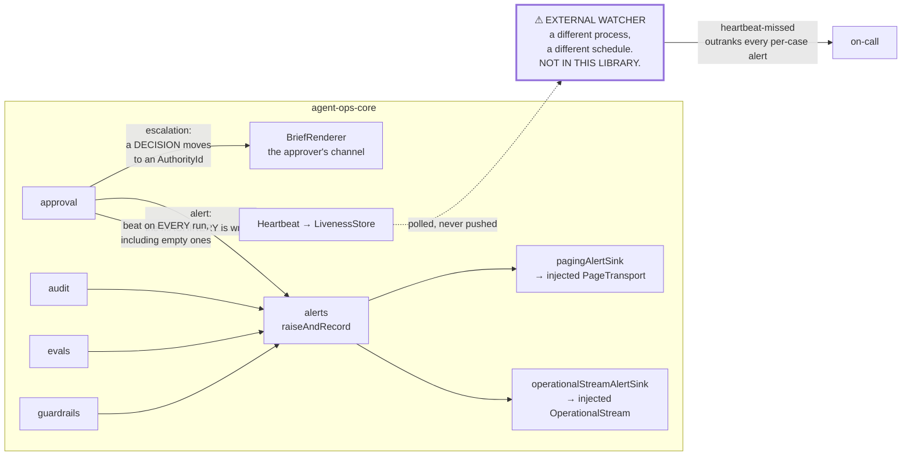

# 0012 — Alerting is its own module, never shares a channel with escalation, and its watchdog is external

**Status:** Accepted. **Found by the user, and it added a fifth module to a
four-module design.**
**Date:** 2026-08-17

## Context

The user asked a plain question: *are the right engineers notified on failure,
long before a client or an employee makes contact?*

**Honestly: not systematically, before this.** Alerts appeared in the error
tables of individual modules — `AuthorityUnavailable` alerts,
`IdempotencyIndeterminate` alerts — as scattered obligations rather than a
concept. There was no seam, no adapter, no severity model, and nothing at all
for the failures that never throw.

That last gap is the important one. `docs/CONTEXT.md` tabulates **eight silent
conditions**, and every one of them returns success or returns nothing at all:

| Condition | Why it is invisible |
|---|---|
| A reserved decision completed unassisted | Returns success. A legal breach reported as a good outcome. |
| An effect is in `unknown` | Possible double payment. Nothing failed; something is unwitnessed. |
| Reminders have stopped firing | Nothing errored. The case simply stopped being chased. |
| A case is buried | The organisation failed, not the software. No component is down. |
| `AuthorityUnavailable` | Looks like a queue with nothing in it. |
| Under-recording detected | The build stays green unless something counts what is missing. |
| Trace unavailable at high tier | Fail-closed is correct *and* means work has stopped. |
| Abstention or fail-closed screening rate moves sharply | Every individual case behaved exactly as designed. |

None is reachable by catching an exception. A system that alerts only on thrown
errors is monitoring the failures it was going to survive anyway.

## Decision

**`alerts` is a fifth module, with an `AlertSink` seam that never shares a
channel with any escalation path, and a liveness story whose watcher is outside
this library.**

### Separation, enforced in the types

An alert is not an escalation. Escalation routes a *decision* to a business
authority because the business requires a human judgement: expected, routine,
continuous. An alert says the *machinery* is wrong: unexpected, rare. Mixed into
one channel, the routine volume mutes the exceptional signal — which is the
recurrence-cadence failure of ADR 0008 repeated one level up.

`packages/agent-ops-core/src/alerts/` enforces it rather than documenting it: an
alert is addressed to an `OperatorRotaId`, a branded string that an
`AuthorityId` or `AuthorityPoolId` does not typecheck as, and an `Alert` carries
**no brief, no verdict and no effect**.

### Severity is derived, and its ordering is a compile-time proof

`docs/CONTEXT.md` says a missed heartbeat is the highest-severity alert in the
system, above any individual case failure. `lib/severity.ts` makes that a type
rather than a comment: `SEVERITY_ORDER` is a tuple where position *is* rank,
severity is derived from the condition and never passed as a parameter, and
`LivenessOutranksEveryCaseAlert` is an assertion built from type-level
arithmetic. Reorder the tuple so a per-case severity outranks `liveness-lost`
and **the file stops compiling**. Nothing has to remember to check it; it is
checked on every `tsc --build`.

### Nine conditions, closed union

The eight silent ones plus `heartbeat-missed`, exhaustively checked in four
places — the severity table, the correlation lookup, the fingerprint and the
payload. Adding a tenth without handling it does not compile.

### The sweeper's dead-man's switch, and why the watcher is external

The sweeper (ADR 0009) fires reminders. If it dies, nobody is chased, nothing
throws, and every waiting case rots in silence — the system doing exactly what
the never-give-up rule forbids while reporting no problem whatsoever.

- The sweeper **emits a heartbeat on every run, including empty ones**.
  `HeartbeatRun` has no field for "I did zero things" on the empty arm, on
  purpose: *"nothing was due"* and *"I did not run"* must not share a
  representation, for exactly the reason `not-attempted` and `unknown` do not
  (ADR 0010). The second is the **absence** of a beat and is not spellable.
- **The watcher sits outside the sweeper, and outside this library.** A watchdog
  that depends on the thing it watches fails silently at the exact moment it is
  needed. `alerts` ships the emit side, the store, the verdict
  (`livenessFindings`, a pure function of records and an instant) and the query
  (`livenessQuery`). It does **not** ship the watcher and will not pretend to.
  `createLivenessCheck` run inside the process it watches is a second line of
  defence and never the first.
- `EXTERNAL_WATCHDOG_REQUIREMENT` is a exported string constant so the runbook
  and the code cannot drift, and `approval/index.ts` re-exports it rather than
  restating it, *because a sentence this important that exists in two places
  will eventually exist in two versions.* `docs/RUNBOOK.md` must carry it
  verbatim. It is the single deployment instruction most likely to be skipped
  and the most expensive to have skipped.

Note the two arrows leaving `approval`. They never meet again.

### Failure to alert, and where the regress stops

A sink that throws does not take the case down and does not fail silently: it
degrades to the next sink in the chain, and the degradation is recorded on the
outcome, in the journal, and in `health()`. A chain that fails entirely returns
`outcome: "undelivered"`.

What this module does **not** do is raise an alert about the alerting through
the alerting — an infinite regress dressed up as thoroughness. **The regress
stops at the external watcher**, which reads `health()` alongside the liveness
records. That is the honest bottom, and it is stated rather than hidden behind a
retry loop.

### Two structural rules

- **The alert path is injected, so a test cannot page a real engineer.** No HTTP
  client is constructed and no URL, token or routing key is read from the
  environment. `lib/sinks.ts` puts it precisely: *a `SKIP_PAGING` environment
  variable would be a promise; this is a fact about the call graph.*
- **A chain that pages nobody must not look healthy.**
  `assertProductionAlerting` is called at the composition root and **refuses
  `recordingAlertSink` by name**, because a recording-only chain passes every
  test in this repository and delivers nothing forever.

### No personal data in an alert

No condition has a free-text field, so there is nowhere for a name or a
narrative to arrive. Sink failures record the exception's **name only** — never
its message, which routinely echoes the request that failed.

## Alternative rejected

**Leave alerting to each application's observability stack, and keep the
per-module error tables.**

The case for it is strong on paper. Every one of the nineteen already has
logging, metrics and a paging product; alerting is generic operational
machinery, not agent-operations machinery; and `CLAUDE.md` is explicit that
adding a dependency is nineteen applications' problem.

Rejected because the eight conditions are not generic. Every one of them is
visible **only from inside a module that knows the domain concept**: only
`approval` can see that a reserved decision completed unassisted, only `audit`
can see that a high-tier write was refused, only `guardrails` can see the
fail-closed screening rate move. An application's observability stack cannot
alert on a condition nothing tells it about, and a system that alerts only on
thrown errors would catch none of the eight.

Applying `CLAUDE.md`'s deletion test: delete `alerts` and complexity does not
vanish — nineteen applications each invent a severity model and a paging
integration, and eight silent conditions go unreported in most of them.

## What would change our mind

Named, observable triggers:

1. **An application whose deployment already runs a scheduler with its own
   liveness alerting that it would rather use.** That is an `AlertSink` adapter
   and an external watcher it already owns — **the requirement is satisfied, not
   waived.** What is never acceptable is no watcher at all.
2. **The alert volume proving to be routine.** If any condition fires often
   enough that an operator learns to ignore it, its severity is wrong or the
   condition is mis-specified. That is a trigger to fix the condition, not to
   merge the channel — a muted alert channel is the exact failure the separation
   exists to prevent.
3. **A tenth condition.** The union is closed and exhaustively checked in four
   places. Adding one is a deliberate act with a compile error attached, and it
   should come with the same accounting: what makes it silent, and what makes it
   detectable.

## Where the code diverges from the design documents

- **`alerts` is not in `docs/design/PHASE-2-INTERFACE-REVIEW.md`.** That review
  settled four modules; this is a fifth, added afterwards from a question rather
  than from the review. `packages/agent-ops-core/src/index.ts` says so in its
  header instead of quietly listing five where the review said four.
- **Two of `alerts`' own seams are hypothetical by this project's own rule, and
  the module reports it.** `AlertJournal` ships one adapter
  (`inMemoryAlertJournal`; the `audit`-backed one is named and deliberately not
  built, because wiring two modules is a composition-root decision).
  `LivenessStore` ships one adapter (`inMemoryLivenessStore`;
  `postgresLivenessStore` is named and not built, because it needs a migration
  that does not exist). The cost of the second is stated where the adapter is:
  **beat history dies with the process**, so a watcher polling across a restart
  sees `never` rather than `beat` — the safe direction, and still a limit. Any
  deployment that wants liveness to survive a restart needs that migration
  first.
- **`docs/design/OPEN-ITEMS-RESOLVED.md` item 6 says failure to alert is itself
  alertable.** The code implements the recording half — degradation on the
  outcome, in the journal, in `health()` — and explicitly declines the raising
  half, for the regress reason above. That is a narrower guarantee than the
  sentence suggests, and it is narrower on purpose.
