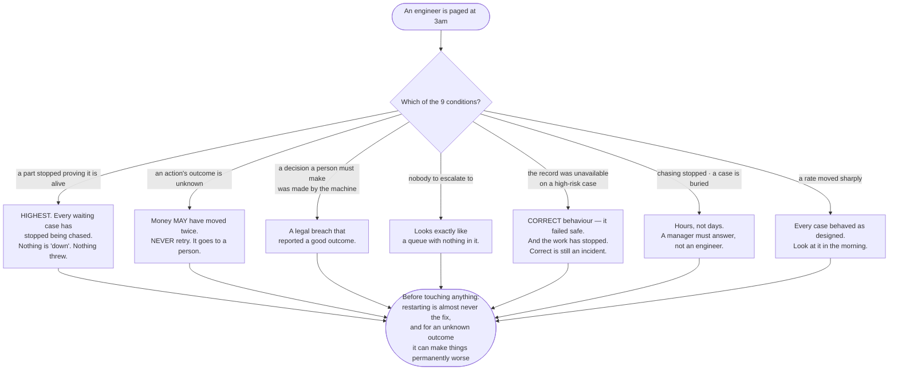

# Frequently asked questions

The questions a finance manager, a risk officer and an auditor actually ask.
Answered from the working software as it stood on 17 August 2026, not from the
plan. No technical background assumed. No code on this page. Every abbreviation
is spelled out the first time it appears.

**Some of these answers are uncomfortable.** They are here in full anyway. An
overstated guarantee is a liability the first time somebody finds the gap, and
the gap is always found by the person you least want to find it.

**Reading the numbers.** Unlabelled figures were counted or measured out of the
software on 17 August 2026. **(ESTIMATE)** marks a judgement. **(ILLUSTRATION)**
marks an invented figure used to demonstrate arithmetic, describing nothing about
this system.

**The single most important fact on this page:** this software has never run in
production. **0** applications use it live. **0** real cases have gone through
it. **0** real payments have been made under it. Every answer below describes
what the software *does*, verified by reading it and running its **825** tests —
never what it has been observed to achieve, because it has not yet been observed
achieving anything.

---

## The money questions

### Can it approve payments on its own?

**Yes, in one specific arrangement, and no in another. The difference is a
decision your business makes and writes down in advance.**

When your team declares a step in a process, they declare whether that step ever
transfers authority to a person. There are exactly two choices, and no third.

**If they declare "a person decides":** the software prepares the case and stops.
It cannot proceed. It has no route to the money without a recorded answer from a
named person drawn from your own directory of approvers.

**If they declare "no person decides":** the software may act — but only under a
**named standing delegation**. Three fields are compulsory and there is no way to
omit them: who the authority is, **who delegated it to them**, and a reference to
the written delegation itself. "The system approved it" cannot be recorded on its
own. That is enforced by the shape of the record, not by a policy.

Two hard limits sit on top of that, and both hold whatever the declaration says:

- **A decision your business has marked as one a person must make by law can
  never be taken automatically.** If such a decision reaches a step declared "no
  person decides", the software halts and raises an alarm. It is treated as an
  incident, not as a setting somebody may adjust. There is no override, no
  threshold, and no confidence figure that bypasses it.
- **Every step carries a ceiling on how bad being wrong could be.** A case
  graded above that ceiling halts and an engineer is told.

**The uncomfortable part.** The written vocabulary for this project says
automatic approval should be confined to the lowest risk grade. **The software
does not enforce that.** Your team could declare a high-risk step as "no person
decides", and the software would permit it, so long as the decision was not one
marked as requiring a person by law. The ceiling on that step is also your team's
declaration. **This is a control you hold, not one the software holds for you**,
and it should be on the list of things somebody reviews.

### Can it pay the same invoice twice?

**Not through a repeat that the software initiated. It will never automatically
retry an action whose outcome it does not know.**

There are **3** states, not 2, and the third is the one that matters:

| State | What it means | What happens next |
|---|---|---|
| Never attempted | The reference was reserved, no outbound instruction was sent | Safe to run |
| **Unknown** | **The instruction went out and the result was never recorded** | **Never retried automatically. It goes to a person, with the full case record attached** |
| Settled | The result was recorded | The original result is returned. Nothing runs again |

The reasoning is written into the software: **a duplicated payment is a clawback,
a customer-trust incident and a regulatory conversation. A delayed payment is a
telephone call.** Those costs are not symmetric and the default does not pretend
they are. Ambiguity resolves towards not paying twice.

An unknown outcome also raises an alarm in the second-highest severity band — the
one meaning a guarantee has already failed for a named case. Nothing failed and
nothing threw an error. Something is merely unwitnessed, which is why it must be
looked for rather than caught.

**Where this stops.** The software cannot prevent a payment your own code made
directly, outside the declared route. No part of this library reaches outside
this library. Its record stamps its own scope onto every entry, so a reader in
2033 learns the limit of the evidence from the evidence itself.

### What does it cost us?

See `IMPACT.md` in this folder for the full accounting. The three cost lines
people miss:

1. **It does not remove the approval time you are legally required to spend.**
   For a decision a person must make by law, the correct share handled without a
   person is exactly **zero**. Not low. Nil.
2. **Above the risk level you set for two-person sign-off, it requires two
   people, not one.** That is more approver time, not less.
3. **Measuring whether people actually got what they were owed costs real
   money.** A re-checked sample sized for a 2-percentage-point margin needs about
   **460 cases per measurement period**, which at 12 minutes each
   (ILLUSTRATION) is about **92 hours of skilled reviewer time**, on cases
   nobody complained about. The library refuses to record that figure without a
   named evidence source and window. It does not fund the sampling.

The library itself adds **0** outside software at runtime and contains **0**
artificial intelligence suppliers — you hand yours in, and you pay their bill,
not one this library adds.

---

## The "what if it goes wrong" questions

### What if it is wrong?

Separate three different things, because they have three different answers.

**If the judgment is wrong.** The library does not make judgments. It is the
machinery around them. A wrong verdict is recorded faithfully, in order, and kept
for **2,557 days**. What the library contributes is that the wrongness is
*findable*: the case can be replayed years later and will produce the identical
record, so what was concluded, from what evidence, at what cost, is answerable
rather than argued about.

**If the software judges itself unfit.** It says so. Declining to answer is a
recorded, successful outcome — not an error, not a crash, not a low-confidence
guess. It is one of the **6** possible endings for a decision. A system that
never declines is guessing on the cases it should have handed over.

**If the machinery is broken.** It raises an alarm to an engineer, on a channel
that never carries approval traffic. See the 3am question below.

**The honest limit.** The library detects; it does not undo. If a decision a
person was legally required to make was made by the machine, the alarm tells you
it happened. Nothing unwinds it.

### What happens if it breaks at 3am?

**First, the part that surprises people: the dangerous failures do not look like
breakage.** They return success. Nothing throws an error, no request fails, and
no dashboard turns red. That is why the library raises alarms on things that did
**not** happen, not only on things that failed.

It names **9** alarm conditions. **Not one of the 9 can be found by catching an
error.** Eight of them return success or return nothing at all.

There are **4** severity bands:

| Band | What it means | Response |
|---|---|---|
| A part stopped proving it is alive | Every waiting case at once is affected | Above everything else |
| A guarantee has already failed for a named case | A legal breach, a possibly-doubled payment, evidence that is not there | Now |
| The machinery is not doing what it promised | For some cases | Hours, not days |
| Something moved; nothing is broken | A population figure changed | Look in the morning |

**5** of the **9** conditions sit in the second band. **1** sits alone in the
first, above all of them, and the software proves that ranking with its compiler
rather than asserting it in a comment. The reasoning: one stalled case is one
customer; a stopped chaser is every waiting case at once.

**What the library gives an engineer at 3am, stated plainly:** it ships **no**
command-line repair tool, **no** web page, **no** dashboard and **no**
always-running program. Every procedure is a call your own operational tooling
makes, or direct queries against the tables. If somebody is looking for a repair
command, it does not exist and is not planned.

**And the part most likely to be skipped at deployment.** One part of the
library fires every reminder to every waiting approver. If it stops, nobody is
chased, nothing fails, and every waiting case sits untouched until a customer
telephones. A watchdog that runs inside the thing it watches dies with it. So
that part proves it is alive on **every** run, **including runs with nothing to
do** — "nothing was due" and "I did not run" are deliberately different records —
and **something outside the library must watch for that proof**. That watcher is
**not supplied**. It is item **1** of the **12** unfinished items the project
lists about itself. Deploy without it and the chasing can stop in complete
silence.

### What if the artificial intelligence supplier goes down?

The library contains **0** suppliers and **0** passwords. Yours is handed in as a
parameter. If it fails, that failure surfaces as one of the **86** named failure
states, each of which carries a written policy of whether it stops the work or
lets it continue, and a written reason for that choice.

The default direction is to stop rather than proceed. **Exactly 1** failure state
in the whole record-keeping part may ever continue in a degraded form, and even
that one is limited by the shape of the software: **at the highest risk grade it
is pinned to stop, and no setting can unpin it.** At the two lower grades your
own team chooses, and must choose — there is no default, because a library that
picks one has decided on your behalf whether a decision may proceed unrecorded.

An unavailable record at the highest grade is itself one of the **9** alarm
conditions, because correct fail-safe behaviour that has halted your work is
still something somebody needs to know about tonight.

---

## The "is it working" questions

### How do we know it is working?

**Two numbers, never one, and they are not interchangeable.**

**The cheap one: did the case finish without a person being asked to decide.**
Free, immediate, straight out of your own records. It measures **staff effort
avoided**. It is a cost figure and nothing else. The library records it — it is
compulsory when a case closes and there is nowhere else to hide it — and sets
**no target on it anywhere**. No default, no configurable goal.

**The expensive one: did the person whose problem it was actually get what they
were owed.** This is the one you care about, and **it is not knowable when the
case closes**. It needs evidence from outside the system and a waiting period.

**The library records the second one nowhere.** There is no such field in
**59,245** lines of source. Not empty — absent. Recording it requires naming one
of **3** evidence sources and stating the window: nothing came back; somebody
re-checked a sample; or money went back. The library refuses to record a figure
it cannot stand behind rather than let each team invent one.

**Why this matters more than it sounds.** The two get merged constantly, and the
error always runs in the flattering direction. A customer who gives up in
frustration halfway through is counted as finished without a person. Nobody
escalated. The case closed. The number improved. The worse your system behaves at
the moment they give up, the better the number looks. See `THE-PROBLEM.md` in
this folder — that conflation is the reason this library exists.

### Somebody showed me "97% accurate". Should I believe it?

**Ask what it was measured against, and do not accept the word "accurate" until
you have the answer.**

There are two kinds of measurement here and they are not the same claim:

- **Against known-correct cases** — somebody decided in advance what the right
  answer was and wrote it down. This is the stronger claim. Its weakness is that
  those cases are frozen while real work moves on. Passing them proves you have
  not gone backwards. It does not prove today's work is being handled well.
- **Against what people actually did** — this is **agreement**, and it is not
  accuracy. The yardstick is human behaviour **including human error**. If your
  reviewers are wrong 8% of the time (ILLUSTRATION), a system agreeing with them
  perfectly is also wrong 8% of the time. And a system that disagrees on exactly
  those cases scores 92% while being completely right.

The software enforces the distinction rather than trusting anybody to remember
it: the two kinds of report are different shapes, and handing the wrong one to
the quality gate **does not build**. Every disagreement is a case for somebody to
adjudicate, never a defect.

### How do you stop people gaming the numbers?

Four mechanisms, all structural, all cheap:

1. **No target is set on the cheap figure.** Pay a team to raise "finished
   without a person" and you have paid them to stop handing hard cases to
   people. The library records it and refuses to optimise it. Any target lives
   in your application, next to your own list of decisions a person must make by
   law, where the two can be read together.
2. **"Nobody decided at all" is its own ending.** Running out of time with nobody
   answering is a separate one of the **6** endings from a person refusing. They
   are different facts. Collapsing them is exactly how a system that has quietly
   stopped thinking produces the same number as one that is working.
3. **Waiting is not an ending.** A case sitting with an approver is not among the
   **6**, so no report can count it as finished in either direction.
4. **Rubber-stamping is measured, not alleged.** Time taken is recorded on every
   approval, measured from the moment the request actually reached somebody — and
   recorded as **"not measurable"** rather than as an invented number when that
   moment is unknown. A queue averaging 1.2 seconds per approval (ILLUSTRATION)
   is visible in the data without anybody having to accuse a colleague. The
   library sets **no** threshold: a £200 expense and a £2 million payment do not
   share a believable reading time.

There are also two ways to make the quality gate pass by editing the evidence
rather than fixing the system. The software names both rather than pretending
they do not exist, and reports what a partial run actually covered so a green
result cannot silently mean "we only ran the easy ones".

---

## The people questions

### What if nobody approves something?

**Then it waits. Indefinitely, loudly, and it never quietly resolves itself.**

This is the answer the project treats most seriously, because the obvious design
is wrong in a way that looks safe.

- **A decision a person must make by law has no time limit at all.** The
  time-limit branch is deleted from its type. Writing one is a build failure, not
  a policy somebody is trusted to follow. "Nobody was on shift" is not a lawful
  basis for a decision.
- **But removing the time limit on its own would be worse than useless.** The
  case would sit in silence forever, nothing would fail, no dashboard would turn
  red, and nobody would find out. So a step needing a person **cannot be declared
  without a chasing plan**: who is told, after how long, and what repeats
  afterwards. Declaring the person and omitting the plan does not build.
- **The chasing plan cannot express giving up.** There is no "stop" value and no
  maximum number of attempts anywhere in it. A decision that needed a person
  yesterday still needs one next month, and a system that stops asking has
  decided by exhaustion.
- **Reminders widen the audience; they never get louder.** Each cycle adds
  recipients — deputy, then line manager, then the accountable executive — at a
  steady pace. The shipped settings put a **floor of 1 hour** between reminders
  and a **ceiling of 12 recipients** on each. A plan asking for a tighter cadence
  than the floor is refused by name. The reasoning: a flooded channel gets muted,
  and a muted channel makes the case *less* likely to be answered than silence
  would. The fifteenth reminder to somebody who ignored fourteen is not a plan.
- **Every reminder sent is written into the record.** "We chased them" is
  evidence, not an assertion.

**When the scheduled steps run out, the case is called buried.** Read this
paragraph to a manager as it stands: the chasing **has not stopped**. Reminders
continue at a steady interval, widening each cycle. The case remains answerable
indefinitely. It will never self-resolve, never disappear from a queue, and never
acquire an answer through the passage of time. **The software has not failed. The
organisation has not answered.** Only a person can close it.

A buried case raises an alarm in the third band — hours, not days — deliberately
**not** the band that wakes an engineer. The reasoning is written into the code:
paging an engineer at 3am for a case a manager must answer trains that engineer
to ignore the channel, which is the exact failure the separation of alarms from
approvals exists to prevent.

### Who is accountable?

**The software's contribution is that the question always has a written answer.
It does not decide the answer for you.**

- **Every approval names an authority.** There is no anonymous approval and no
  way to record one.
- **An automatic approval must name who delegated the authority**, plus a
  reference to the written delegation. That field cannot be omitted.
- **Escalation means authority actually moved to a named person.** Telling
  somebody is not escalation. Asking a bigger, more expensive machine is not
  escalation either. The software will not let those three be recorded as the
  same thing.
- **Your chasing plan names the accountable executive** as a recipient in the
  repeating cycle, so an unanswered case eventually reaches somebody senior by
  design rather than by luck.
- **Alarms go to an on-call engineer, never to a business approver, and never on
  the same channel.** That is enforced by the shape of the records: an alarm is
  addressed to an operator rota, which an approver's identity cannot be. An alarm
  carries no case brief, no verdict and no action.

**What the library cannot do:** supply your directory of approvers, your
delegations or your escalation hierarchy. It ships **0** of them. It enforces
that they exist and that every one of them is recorded.

### Does personal data end up in the permanent record?

**Some may, and the software tells you how much rather than claiming it caught
everything.**

- Personal data is removed **before anything is written**, not after — because
  there is no un-writing.
- **The removal covers what it recognises.** A name, an address or a diagnosis in
  a shape no rule matched is written down in full, capped at **512 characters**
  per field. The library does not claim to have closed this. It makes it visible
  instead: every check reports how much text was examined, how much was masked
  and how much went into the record unmasked. "We found and masked three items"
  and "we found nothing and wrote all 4,812 characters down" are different rows.
- **Evidence in an approval brief is carried as a reference, never as content.**
  The record proves what was shown to whom; your own systems resolve the
  reference. Seven years later the record proves what was shown without being a
  copy of it.
- **No personal data can reach an alarm at all.** Not one of the **9** conditions
  has a free-text field for it to arrive in, and a failed alarm records the
  error's name only — never its message, which routinely echoes the request that
  failed.

---

## The control questions

### Can we switch it off?

**Three different "off" switches. They stop three different things, and only two
of them exist in this library.**

**1. The kill switch — stops actions in the real world, keeps thinking.** During
an incident you engage it. Payments stop. **Decisions carry on being made and
recorded in full**, which is the point: it preserves the evidence of what the
system *would* have done during the incident. If the switch cannot be read at
all, it is treated as engaged. That is fail-safe, and the reason is recorded
rather than swallowed.

Four things it does **not** stop, and every one of them catches somebody out:

- The chasing. Waiting cases carry on ageing and being reminded.
- Anything already in flight. An instruction already sent is not recalled.
- Actions in another process reading a different switch. **It is only as
  system-wide as your switch is.**
- Being partially engaged. The written vocabulary describes a switch that works
  "system-wide **or per risk grade**". **Per-grade is recorded, not enforced.**
  It is a label written into the record, and the record will faithfully report
  whatever it is told. You have an all-or-nothing switch.

**Read this before you disengage it.** When the switch goes off, every held case
goes back to the **first** approver, the sealed answers are cleared, and the
chasing sequence restarts from zero. **The action is never taken on release.**
That is a decision, not an omission: an approval given before an incident was
given against pre-incident evidence, and "the kill switch went off" is not a
lawful basis for moving money. **Expect every held case to need approving again,
and tell the approvers before you disengage.**

**2. Turning off a safeguard by editing a setting.** Some you can. One you
cannot.

- Two-person sign-off **can** be switched off by your own declaration. It is a
  risk level you choose, and choosing "never" is permitted.
- The requirement for a person on a decision **your business has marked as one a
  person must make by law cannot be switched off at all**. There is no setting,
  no threshold and no override. It is enforced by the shape of the software,
  because if it could be switched off by editing a file it would not be a legal
  obligation — it would be a preference, and preferences get changed at 4pm on a
  Friday by somebody chasing a throughput target.

**3. Removing the library entirely.** Nothing prevents it. It ships **0** runtime
dependencies and stores its records in your own database, in **10** tables
created by **6** documented setup files, all of which you can read with ordinary
queries. The lock-in is the vocabulary and the shape of the record, not a
contract.

### Can somebody edit or delete the record?

**Through this software: no. There is no action to do it. Through the database
directly: that depends on grants this library sets up but does not test.**

- The record is **add-only**. There is no edit, no delete and no amend — not in
  what the software offers and not in the database permissions it sets up.
  Re-judging a case adds a new entry. It never changes an old one.
- Closing a case adds a **seal** covering everything before it. Reading the case
  back **re-checks the seal rather than trusting it**. An edited entry, a removed
  entry, an entry inserted after the seal and a duplicated sequence are each
  detected and each reported by their own name.
- The seal can be **published outside the case**, which moves the ceiling
  further: it defeats a consistent rewrite of the whole case, a case restored
  from an edited backup, and back-dating.

**Three limits, stated because an auditor will find them:**

1. **An adversary holding both sets of credentials defeats both checks.** The
   published copy currently sits inside our own custody. Crossing a real trust
   line needs a custodian outside this organisation. That is named and
   deliberately **not built**, because shipping it means choosing a custodian on
   behalf of nineteen applications.
2. **Tampering before the seal is not caught by any of this.**
3. **This used to be the largest untested surface, and it is now tested.** Most
   of the tests — 786 of them — cannot open a network connection at all, which
   is what makes them unable to reach a live supplier or page a real engineer
   even with real credentials present. That is a strength, but it left a gap: a
   test that cannot reach the database cannot check that the *database* refuses
   edits, and add-only is a promise the database makes, not the software.

   Thirty-nine further tests now close that gap. They run only when somebody
   points them at a throwaway copy of the database, they are switched off by
   default, and they work by *attacking* the record — trying to edit a sealed
   entry, trying to delete one, trying to seal a case twice — and checking that
   each attempt was refused, and refused for the stated reason. They run
   automatically on every change. The tooling treats a skipped check as a
   failure, so a run that quietly does nothing cannot be mistaken for a pass.

### How long is it kept, and can we delete on request?

The library publishes **2,557 days** as its seven-year figure. The retention
period itself is **required from your application with no default**, because a
library that quietly picks one has decided when nineteen applications may destroy
evidence.

**The library prepares a removal and cannot perform one.** It can list sealed
cases past their retention and prove an archive copy faithful. Every action
available on both is a **read**, and the build fails if a removing action is
added. The removal itself is a procedure carried out by a separately authorised
person against a written runbook they sign — because giving the software a delete
action means nineteen applications holding the power to delete all day, every
day.

Quality-measurement records are kept in a **separate** store with its own
retention and its own permissions, so keeping test data cheap never requires
granting anyone the power to delete real case records.

---

## The regulator question

### How do we prove any of this to a regulator?

**Four things you can put in front of them, and one you cannot.**

**1. The complete record of any single case.** Ordered, add-only, replayable
years later. It shows what was concluded, from what evidence, by whom or by which
model, at what cost, in what time, and — for every approval — who authorised it
and how long they took. Closing the case sealed it, and reading it back re-checks
that seal.

**2. That the controls are structural, not procedural.** This is the strongest
material you have, because it converts "we have a policy" into "the software will
not build otherwise":

- A decision a person must make by law has no time limit. Writing one is a build
  failure.
- A step needing a person cannot be declared without a chasing plan.
- The chasing plan cannot express giving up.
- The part that thinks is never handed the power to write.
- The second of two approvers cannot be the first, and is not shown what the
  first decided.
- Every number in the record is a whole number, so a case replayed years later
  produces the identical record rather than a nearly-identical one.

**3. That the failure modes were enumerated in advance.** **86** named failure
states, each with a written policy of whether it stops the work or lets it
continue, and a written reason. **9** alarm conditions across **4** severity
bands, of which **8** describe failures that report success and cannot be found
by catching an error.

**4. That the gaps are written down by us rather than found by them.** The
project lists **12** numbered unfinished items about itself, and both
documentation sets carry a table of every place the design papers and the built
software disagree. Volunteering the gap list is worth more in that room than any
of the above.

**And the one you cannot prove from this library.** Two things, both stated
plainly rather than smoothed over:

- **Whether the database itself refuses edits and deletions is not tested by
  anything that runs.** The permissions are set up. Nothing verifies them
  automatically.
- **The record covers what came through the declared route.** Application code
  can hold its own connection and call a payments provider directly, with no
  entry of any kind. Every entry stamps its own scope onto itself for exactly
  this reason, so the honest claim is "not possible through this route", never
  "not possible". A reader in 2033 learns the limit of the evidence from the
  evidence.

### What would you say to a regulator who asked whether this system has been proven?

**That it has not, and that nobody should say otherwise.**

**0** applications run it in production. **0** real cases have gone through it.
Its **825** tests all pass and are evidence that the software behaves as
described. They are **not** evidence that the arrangement works in an
organisation, that people answer their approvals, or that the outside watcher was
deployed. Those are facts about your operation, and the only honest way to obtain
them is to run one application first, collect the two quality figures separately
under their own names, and fund the re-checked sample. `IMPACT.md` in this folder
sets out that sequence step by step.

---

## Anything missing?

If you asked something in a meeting that is not here, it belongs here. Add it or
ask for it. A frequently-asked-questions page that people stop trusting because
it dodged the hard one is worse than no page at all, because they stop reading it
and start guessing.
