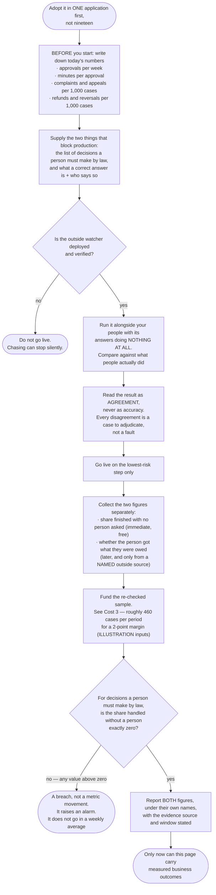

# Impact — what changes, what it costs, and what nobody yet knows

For anyone. No technical background assumed. No code on this page. Every
abbreviation is spelled out the first time it appears.

**About the numbers on this page.** There are three kinds, and they are labelled
throughout so you never have to guess which you are reading:

- **Unlabelled figures are measurements.** Every one was counted out of the
  working software, or produced by running its build and its tests, on
  17 August 2026. The commands are listed at the bottom so you can repeat them.
- **(ESTIMATE)** marks a judgement about the future. Every estimate on this page
  shows its reasoning and its inputs, so you can disagree with the inputs rather
  than with the number.
- **(ILLUSTRATION)** marks a figure invented to demonstrate arithmetic. It
  describes nothing about this system and must never be quoted as though it did.

---

## Read this first

**This software has never run in production. Not once.**

- Applications using it in production: **0**
- Real cases it has processed: **0**
- Real money it has moved: **0**
- Real approvals it has collected from a real person: **0**
- Measured business outcomes of any kind: **0**

So there are **no** figures on this page for money saved, staff hours removed,
errors prevented, or claims processed faster. Not conservative ones. Not
directional ones. None. Any such figure would have to be invented, and an
invented number in a document a regulator may later read is a liability, not a
selling point.

What follows is therefore in three strictly separated parts: **what is
measurably true of the software today**, **what would plausibly change if it
were adopted** (all estimates, reasoning shown), and **what it costs** — which
is the part that usually goes missing, and which includes several costs this
library deliberately adds rather than removes.

---

## Part 1 — What is measurably true today

### The software itself

| What | Count | How it was counted |
|---|---|---|
| Parts making up the library | 5 | Folders under the source directory |
| Lines a developer must read to use it | 2,411 | Line count of the five published files plus the entry point |
| Lines of machinery behind them | 30,986 | Line count of the private implementation files |
| Lines of automated tests | 25,848 | Line count of the test files |
| Total lines of source | 59,245 | All of the above together |
| Automated tests | 825, in 87 files | Running the test suite |
| Tests passing on 17 August 2026 | 825 of 825 | Running the test suite: 786 need nothing but the code, and 39 need a throwaway copy of the database |
| Time for the whole suite to run | about 25 seconds | Running the test suite |
| Outside pieces of software the published library depends on at runtime | **0** | Its manifest lists no runtime dependencies |
| Outside tools used only to build and test it | 4 | Its manifest lists four development tools |
| Database setup files | 8 | Files in the migrations folder |
| Written decision records | 17 | Files in the decision-record folder |
| Numbered items the project itself lists as unfinished | 12 | The project's own read-me file. Eight of the twelve listed a month ago are now finished and have been struck out; four new ones have been added, because a list that only ever grows shorter is a list nobody is checking |

The ratio in the first three rows is the argument for building this once rather
than nineteen times: **about 12.9 lines of machinery for every line anybody has
to learn** (30,986 divided by 2,411). A team adopting the library reads the
small number and inherits the large one.

Tests by part, all passing:

| Part | Test files | Tests |
|---|---|---|
| Audit — the permanent record | 16 | 203 |
| Approval — everything before money moves | 18 | 163 |
| Evaluations — is it any good | 17 | 159 |
| Alerts — telling an engineer | 14 | 151 |
| Guardrails — checks before and after | 22 | 149 |
| **Total** | **87** | **825** |

### Things the software makes impossible rather than discouraged

This is the honest form of "impact" for a library that has never been deployed:
not outcomes, but the set of mistakes that can no longer be made. Each of the
following was checked against the source on 17 August 2026, and each is enforced
by the shape of the software — the build fails, or the type refuses — rather
than by a rule somebody is trusted to follow.

1. **A decision a person must make by law cannot run out of time.** The
   time-limit branch is deleted from its type. Writing one is a build failure.
2. **A decision needing a person cannot be declared without a chasing plan.**
   Who is told, after how long, and what repeats afterwards are all compulsory.
   Declaring the person and omitting the plan does not build.
3. **The chasing plan cannot express giving up.** There is no "stop" value and
   no maximum number of attempts anywhere in it.
4. **A case waiting for a person cannot be counted as finished.** There are
   exactly **6** endings for a decision, and "waiting" is not one of them.
5. **"Ran out of time with nobody answering" is a separate ending from "a person
   refused".** They are 2 of the 6, and they cannot be collapsed into one.
6. **There is no general-purpose "success" field, anywhere.**
7. **There is no resolution field anywhere in 59,245 lines of source.** Not
   empty — absent. Whether the person actually got what they were owed cannot be
   recorded without a named outside evidence source and a stated waiting period,
   and the library will not invent either on your behalf.
8. **Recording whether a person was involved is compulsory when a case closes.**
   It cannot be omitted and there is nowhere to hide it.
9. **The part of the software that thinks is never handed the power to write.**
   Giving it that power is a build failure in both directions.
10. **An action whose outcome is unknown is never retried automatically.** There
    are 3 states — never attempted, unknown, and settled — and only the first is
    safe to repeat. Ambiguity resolves towards not paying twice.
11. **The second of two approvers cannot be the first.** The second person is
    drawn from a list the first has been removed from, so it is not a check that
    could pass by mistake.
12. **The second approver is not shown what the first decided.** There is no
    field for it to arrive in.
13. **An automatic approval must name the person who delegated the authority.**
    "The system approved it" cannot be written down on its own.
14. **Money never moves in fractions of a penny that a computer rounded.** Every
    number in the permanent record is a whole number — money in the smallest
    unit, time in millionths of a second, confidence in hundredths of a percent.
    This is what lets a case be replayed years later and produce the identical
    record.
15. **The machine clock is read in exactly 2 places**, both of them small pieces
    of wiring connected up at start-up. Nothing else in the library can ask what
    time it is. That is what makes an eleven-day chasing sequence testable in a
    millisecond.

### Things the software makes visible that are normally invisible

The library raises the alarm on things that did **not** happen, not only on
things that failed. It names **9 alarm conditions**, and **not one of the 9 can
be found by catching an error**. Eight of them return success or return nothing
at all.

There are **4 severity bands**. The split, read straight out of the code:

| Band | Meaning | Conditions in it |
|---|---|---|
| A part has stopped proving it is alive | Every waiting case at once | 1 |
| A guarantee has already failed for a named case | Wake somebody | 5 |
| The machinery is not doing what it promised | Hours, not days | 2 |
| Something moved; nothing is broken | Look in the morning | 1 |

The single highest condition — a part that stopped proving it is running —
outranking all 5 of the per-case ones is checked by the compiler, not written in
a comment. The reasoning is stated in the code: one stalled case is one
customer, and a stopped chaser is every waiting case at once.

### Things the trace will support if a regulator asks

- Every case is a complete, ordered, add-only record, replayable years later.
- Closing a case adds a seal covering everything before it, and reading the case
  back **re-checks the seal rather than trusting it**.
- The seal can be published outside the case, so a later consistent rewrite of
  the whole case is detectable.
- **86 named failure states**, each with a written policy of whether it stops the
  work or lets it continue, and a written reason for that choice.
- Personal data is removed before anything is written, not after — because there
  is no un-writing.
- **No personal data can reach an alarm at all**: not one of the 9 conditions
  has a free-text field for it to arrive in, and a failed alarm records the
  error's name only, never its message.

---

## Part 2 — What would change if it were adopted (ESTIMATE)

Everything in this part is a judgement. The reasoning is shown so you can attack
the reasoning.

### The duplication that would not be built (ESTIMATE)

**The claim.** Nineteen applications each need a permanent record, risk
grading, a sign-off step, a chasing sequence, protection against paying twice, a
quality measurement, and an alarm path. Built separately, that is nineteen
versions of the same 30,986 lines of machinery.

**The reasoning.** This is the strongest available argument and it is still
weaker than it sounds, for two reasons worth stating:

- Nobody rebuilding this would write 30,986 lines. Most teams would write a much
  smaller version that handles the ordinary path and none of the 86 failure
  states. So the honest comparison is not "19 × 30,986 lines saved". It is "19
  smaller, cheaper, less careful versions **avoided**" — and the value of that
  depends entirely on whether the careful parts ever matter, which is unproven
  because nothing has run.
- The count of nineteen is **not measured**. It is the stated scope of the
  project, taken from its own instructions file. No code counts them.

**The number.** There isn't one. A saving figure here would be the invented
number this whole document exists to avoid.

### The failures that would be caught earlier (ESTIMATE)

**The claim.** Eight of the 9 alarm conditions describe failures that report
success. Without something looking for them, they are found when a customer
telephones.

**The reasoning.** Consider one of the eight: a decision a person was legally
required to make, which the machine made instead. Nothing throws. The record
says the case went well. Today, in a system without this check, the realistic
discovery route is a complaint, an appeal or an audit — (ESTIMATE) weeks to
months later, and only for the subset that anyone challenges. With the check, it
raises an alarm at the moment it happens.

**The honest limit.** "Earlier" is not "prevented". The library detects that the
breach occurred; it does not undo it. And the detection depends on the
application correctly declaring which decisions are reserved — a list the
library ships **none** of, because it cannot know your statutes.

### The measurement that would stop flattering you (ESTIMATE)

**The claim.** The cheap figure — the case finished without a person being asked
to decide — will not be reported as though it were the expensive one.

**The reasoning.** This is structural rather than estimated, so the confidence is
higher than elsewhere on this page. There is no resolution field to fill in
wrongly and no "success" field to blur the two. What is an estimate is the
*organisational* effect: whether a team, denied the flattering number, goes and
buys the honest one, or simply reports the cheap number under its correct name
and carries on. (ESTIMATE) The library makes the second outcome visible; it
cannot make the first happen.

---

## Part 3 — What it costs

This is the part usually left out. Three of these costs are ones the library
**adds**.

### Cost 1 — Engineering time to adopt (ESTIMATE)

The library ships no subject matter, so each application must supply 6 things,
and the library ships no version of 4 of them:

1. The risk-grading rule — which of your steps are low, medium and high.
2. The list of decisions a person must make by law or policy. **The library
   ships no list at all.**
3. The directory of named people who may approve, and their deputies.
4. The approval screen. The library fixes the **7** items that must be on it and
   fixes none of the layout.
5. The artificial intelligence supplier, the database connection and the paging
   product. None is built in.
6. What a correct answer actually is, who says so, and the outside evidence
   source and waiting period for judging it later.

Items 2 and 6 block production use rather than the build. Until they are
supplied, the relevant fields stay empty rather than being filled with a guess.

**(ESTIMATE) The time.** A developer must read 2,411 lines of interface and
write the six things above. There is no measured figure, because **zero
applications have adopted it**. Any range offered here would be a guess dressed
as a plan, so treat the shape of the work — six named deliverables, four of them
requiring a business decision rather than code — as the estimate, and get a
figure from the first team that actually does it. That first team's number is
worth more than anything on this page.

### Cost 2 — The human approval time it does NOT remove

This is a cost the library **adds**, on purpose, and it is the one most likely
to surprise a budget holder.

- **For a decision a person must make by law, the correct share handled without
  a person is exactly zero.** Not low. Nil. The library cannot reduce that
  workload and will not let you pretend it has.
- **Above the risk level you set for two-person sign-off, the library requires
  two people, not one.** That is more approver time than a single sign-off, not
  less.
- **The approval screen must carry all 7 required items**, including what the
  system is unsure about, what it could not check, and what happens if the
  approver does nothing. Item 3 is compulsory and cannot be empty — saying
  nothing is treated as a claim. (ESTIMATE) A brief containing the doubts takes
  longer to read than one containing only the recommendation. That is the
  intended trade: the whole point of the item is that the approver weighs the
  contrary evidence.
- **Approving is deliberately never the low-effort path.** No answer is
  pre-selected, there is no default button and no "approve all". (ESTIMATE)
  Removing the fast path costs seconds per approval and is the difference
  between an approval and a rubber stamp.

**Worked illustration of the third and fourth points.** Take a queue of 400
approvals a week (ILLUSTRATION). Add 45 seconds per approval for reading the
doubts and the unchecked items and making a deliberate choice (ILLUSTRATION).
That is 400 × 45 seconds = 18,000 seconds = **5 hours a week of approver time
that a rubber-stamping design would not have spent**. Both inputs are invented.
The arithmetic is not, and the shape of the answer — hours, not minutes — is the
point.

The library records time taken on every approval so this is measurable rather
than argued about. It records **"not measurable"** rather than an invented number
when the moment the request reached a person is unknown. It sets **no
threshold**: a £200 expense and a £2 million payment do not share a believable
reading time, and only your business knows which is which.

### Cost 3 — Measuring resolution honestly

The cheap figure is free. The one you care about is not, and this is what it
costs.

Three evidence sources are named. Their costs differ by an order of magnitude:

| Source | What it is | Cost |
|---|---|---|
| Nothing came back | No reopen, no complaint, no appeal within an agreed period | Nearly free; usually already in your systems. **Weakest** — somebody who gave up is also silent |
| Money went back | A refund, reversal or clawback | Nearly free; finance already records it. Only exists where money moves |
| Somebody re-checked | A person re-examined a sample of finished cases | **Real money. The only one that catches quiet wrongness, and the first one cut when budgets tighten** |

**Worked estimate of the re-checking cost.** Every input below is an
illustration; the arithmetic is standard.

- Suppose you want to detect a wrongness rate near 5% (ILLUSTRATION) to within
  plus or minus 2 percentage points, at the usual 95% confidence.
- The standard sample-size arithmetic for a proportion gives
  1.96² × 0.05 × 0.95 ÷ 0.02², which is **about 456 cases** — call it 460 per
  measurement period.
- At 12 minutes to re-examine one closed case (ILLUSTRATION), that is
  460 × 12 minutes = 5,520 minutes = **92 hours of skilled reviewer time per
  measurement period**.
- Measured quarterly, that is roughly **368 hours a year**, on cases nobody
  complained about.

Two things follow, and both are uncomfortable:

- **That cost buys the only honest quality figure you will have.** The other two
  sources cannot see a case that was wrong and never challenged.
- **Tighten the margin and the cost rises steeply.** Halving the margin to plus
  or minus 1 percentage point multiplies the sample by 4 — about 1,824 cases,
  roughly 365 hours per period. Precision is bought by the square.

The library does not perform this sampling. It refuses to record a resolution
figure without a named source and window, which is a refusal, not a feature. The
sampling is yours to fund.

### Cost 4 — Something you must deploy that this library does not ship

One part of the library fires every reminder to every waiting approver. It runs
on a schedule. **If it stops, nobody is chased, nothing fails, no dashboard turns
red, and every waiting case sits untouched until a customer telephones.**

A watchdog running inside the thing it watches dies with it. So the library
proves it is alive on every run, **including runs with nothing to do** — "nothing
was due" and "I did not run" are deliberately different records — and something
outside it must watch. That watcher is **not supplied**, and it is item 1 of the
12 unfinished items.

The liveness records can now be stored durably. There are 2 shipped ways to
store them: in memory, and in the database, the second using the 8th database
setup file. Stored in the database, a watcher that polls across a restart sees a
real gap with a real "last seen" time and a real count of how many times the
machinery reported in — proven against a real database on 17 August 2026, along
with 50 simultaneous reports arriving at once and being counted exactly once
each.

The remaining limit is stated rather than discovered later: stored in memory,
the history still dies with the process, and after a restart the watcher sees
"never seen" rather than a real gap. That errs towards raising the alarm, which
is the safe direction. It is now a deployment choice rather than the only
option.

(ESTIMATE) The engineering cost of the watcher is small — it polls two published
queries. The cost of **not** deploying it is every waiting case, silently, and
that is why it appears here as a cost line rather than as a footnote.

### Cost 5 — Running cost

- **The library adds no outside software at runtime: 0 dependencies.** It adds
  no supplier bills of its own, because it contains no artificial intelligence
  supplier — you hand yours in.
- The permanent record is add-only and kept for **2,557 days**, the figure the
  library publishes for seven years. The retention period itself is required
  from the application with **no default**, because a library that quietly picks
  one has decided when nineteen applications may destroy evidence.
- (ESTIMATE) Storage grows with cases and never shrinks, by design. Nobody has
  measured it, because nothing has run.
- Quality-measurement records are kept in a **separate** store with its own
  retention, so keeping test data cheap never requires granting anyone the power
  to delete real case records.

---

## What does not change

Stated plainly, because a document that only lists benefits is advocacy.

- **It does not make the judgments.** It is everything around the judging. If
  your model is wrong about invoices, this library records the wrongness
  faithfully, in order, for seven years.
- **It does not tell you which decisions a person must make by law.** It ships
  **0** such rules. It enforces only that the question is asked on every case and
  answered in the record either way — because "we checked and it is not
  reserved" and "nobody thought about it" must not be the same row in an archive
  somebody reads in 2033.
- **It sets no target on the share of cases handled without a person.** Recorded,
  never optimised. No default, no configurable goal.
- **It does not perform the seven-year removal.** It prepares one and proves an
  archive copy faithful; every action available is a read, and the build fails if
  a removing action is added. The removal itself is a procedure for a separately
  authorised person against a written runbook.
- **It does not close a buried case.** A case that has used up its scheduled
  chasing steps stays answerable indefinitely, keeps being chased at a steady
  interval, and never acquires an answer through the passage of time. Only a
  person can close it.
- **A green test run is not evidence the database refuses edits.** No test here
  opens a network connection, deliberately. The database's own protections are
  checked by **nothing that runs automatically today**. This is the largest
  untested surface in the repository and the project says so itself.

---

## How you would find out whether it actually worked

Since there are no outcomes yet, the useful thing this document can offer is the
measurement plan — what to collect, and in what order, so that a year from now
this page can be rewritten with real numbers instead of estimates.

Two rules on that plan are worth repeating because they are the ones usually
broken:

- **Never report the immediate figure under the later figure's name.** They are
  two measurements, at two moments, with two costs to produce.
- **Never write or say "97% accurate" when the measurement was against what
  people happened to do.** If your reviewers are wrong 8% of the time
  (ILLUSTRATION), a system agreeing with them perfectly is also wrong 8% of the
  time, and one that disagrees on exactly those cases scores 92% while being
  right. The software enforces this: the two kinds of report are different
  shapes, and handing the wrong one to the quality gate does not build.

---

## Where the design papers and the built software disagree

Both were read on 17 August 2026. Where they differ, **the software is the
truth**. These are the differences that change what a manager should expect. All
of them run in the honest direction — the software does *less* than the paper
described — except the last, where a written statement is unnecessarily
pessimistic.

| # | The paper said | The software does | Why it matters here |
|---|---|---|---|
| 1 | Four parts would survive the design review | **Five.** Alerts was added afterwards, from the question "are the right engineers told before a customer telephones?" The honest answer at the time was no | The counts on this page are of 5 parts, not 4 |
| 2 | The alarm on "a rate moved sharply" covers 2 rates | **1 of the 2 is built.** The share of safety checks that failed safe is watched. The share of cases where the system declined to judge is watched by **nothing** | An application that needs the second must compute it itself |
| 3 | The kill switch stops actions "system-wide or per tier" | **Both are now enforced.** The switch states either "everything" or a named list of risk levels, and the software — not the setting it reads — decides whether the switch covers the action in hand. A switch it cannot read stops every risk level | You may budget for a per-risk-level kill switch. Note it is a breaking change for anything already reading the old switch |
| 4 | Every recorder would be impossible to counterfeit | **Most carry an anti-counterfeit mark; the one the guardrails part writes through does not.** It can still be satisfied by something that acknowledges every write and stores nothing | The software compensates by re-reading its own first record before doing any work, and names the real fix as unmade rather than closed |
| 5 | The schema's own protections "are verified by applying the setup file to a real database and running assertions against it" | **No such assertion set exists.** Nothing runs it | The largest untested surface in the repository. A green test run is evidence about the software, never about the database |
| 6 | Decisions "are tracked as written records once decided" | **7 settled decisions are still awaiting promotion** into the 13 records that exist | The design papers remain the only written record of those seven |
| 7 | The project's own read-me says the machine clock is read "in exactly one place" | **Two places** — one small piece of wiring in the record-keeping part and one in the alarms part, both connected up at start-up | The guarantee itself still holds: nothing else in the library can ask what time it is. The count in the read-me is simply one too low |
| 8 | The problem statement in this folder says the ban on the shortened one-word form of "unassisted containment" is "held by review, not by any automated check" | **Two automated checks do exist**, each covering one part: one scans that part's source files, one scans the published names of another. There is still no check covering all five parts | The rule is better enforced than that page claims, and less than fully enforced |

---

## How we know these numbers

Every quantitative statement above came from one of four places, and none of it
came from a plan.

1. **Counted from the source files** on 17 August 2026: 5 parts; 2,411 lines of
   interface; 30,986 lines of implementation; 25,848 lines of tests; 59,245
   lines in total; 9 alarm conditions; 4 severity bands split 1 / 5 / 2 / 1;
   6 endings for a decision; 7 required items in an approval brief; 3 idempotency
   states; 6 database setup files; 13 written decision records; 2 places that
   read the machine clock; 0 runtime dependencies and 4 development tools.
2. **Summed from the source files**: 93 named failure states — 25 in the approval
   part, 24 in evaluations, 20 in the record-keeping part, 14 in guardrails and
   10 in alerts.
3. **Measured by running the build and the tests** on 17 August 2026: the type
   checker completed with no errors, and 825 tests in 87 files all passed in
   about 25 seconds. Of those, 786 ran against nothing but the code; the other
   39 ran against a throwaway copy of the database, created and thrown away for
   the purpose. The per-part split was produced by running each part's tests
   separately: 203, 163, 159, 151 and 149, which sum to 825.
4. **Read out of the shipped default settings**, every one of which a deployment
   may change within limits the code enforces: a floor of 1 hour between
   reminders; at most 12 recipients per reminder; at most 200 waiting cases
   visited per pass; at most 512 characters of a masked field written into the
   record; 2,557 days published as the seven-year figure.

Two figures on this page are **not** measured, and both are labelled where they
appear: the count of **nineteen applications**, which is the stated scope of the
project taken from its own instructions and which nothing in the code counts;
and every figure marked **(ESTIMATE)** or **(ILLUSTRATION)**.

To repeat the measurements yourself, the project's own commands are in its
read-me file. The test count and pass state come from running its test suite;
the line counts from counting lines in the source folders; every other figure
from reading the file named beside it in `docs/ARCHITECTURE.md`.
