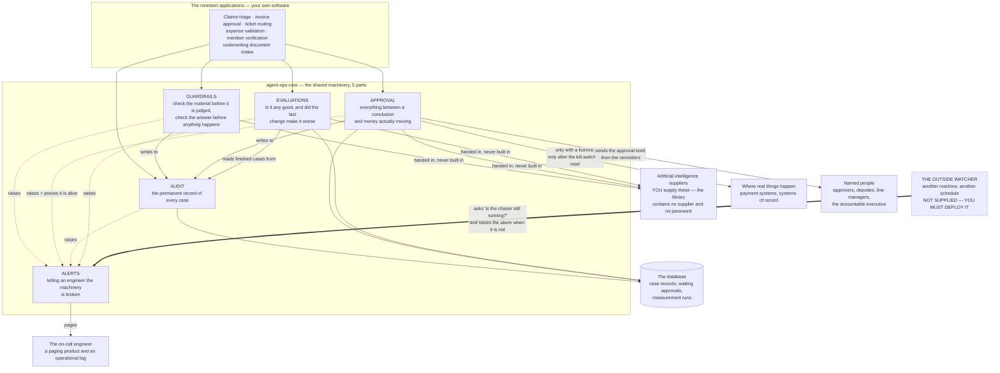
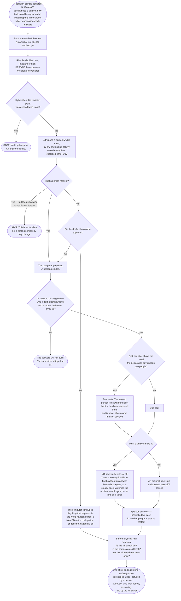

# Overview — what this is, and who it is for

For anyone. No technical background assumed. No code on this page. Every
abbreviation is spelled out the first time it appears.

**About the numbers on this page.** Every figure below was read out of the
working software on 17 August 2026, not out of a plan. Where something is a
judgement rather than a measurement, it says **(estimate)**. Where the design
papers and the built software disagree, the built software wins, and the
disagreement is listed near the bottom rather than tidied away.

---

## In one paragraph

Nineteen separate pieces of software in this organisation use artificial
intelligence (AI) to judge things: insurance claims, supplier invoices, support
tickets, expense reports, membership applications, underwriting documents. They
have almost nothing in common in subject matter. They have almost everything in
common in *plumbing* — keeping a permanent record, deciding how risky each step
is, getting a person to sign off where a person is required, chasing that person
until they answer, stopping short of doing anything twice, measuring whether the
answers are any good, and telling an engineer when the machinery breaks. This
library is that plumbing, built once. It is not the judging. It is everything
around the judging.

The count of nineteen is the stated scope of the project, taken from the
project's own instructions file, not measured from anything.

---

## Who reads this, and why

- **A finance or operations manager** who has been asked to approve, budget for,
  or explain an AI project. This page and the next four in this folder are
  written so you can explain the system to your own boss afterwards.
- **A risk or compliance officer** who needs to know what evidence exists seven
  years from now, and exactly where the evidence stops.
- **An engineer** deciding whether to build this again in their own team. The
  matching technical documents are in the folder above this one.

---

## The one-sentence version

It is the record-keeping, the safety catches, the chasing and the alarm system
for software that makes judgments — built once, so that nineteen teams do not
each build a slightly different version, nineteen times, with nineteen different
sets of mistakes.

---

## How it sits in the world

Everything inside the dotted box is this library. Everything outside it is
either your own software, a supplier, or a person.

Three things this picture is arguing, in plain words.

**Every arrow leaving the library is something you hand in.** The library
contains no artificial intelligence supplier, no database driver, no paging
product and no password. Those arrive as parameters. That is why the 786
automated tests cannot accidentally telephone a supplier or page a real engineer
even when real credentials are sitting in the environment: there is no route
from this software to a network to be switched off, which is a fact about how
the code is wired rather than a promise about a setting.

**The five parts write into one of them.** Guardrails and approval both write
their record into audit. Evaluations reads finished cases out of it. That is why
there is one story per case rather than five.

**The watcher on the right is not supplied, and it is the single most important
thing to deploy.** One part of this library — the chaser that fires every
reminder to every waiting approver — runs on a schedule. If it stops, nobody is
chased, nothing fails, no dashboard turns red, and every waiting case sits
untouched until a customer telephones. A watchdog running inside the thing it
watches dies with it. So the library proves it is alive on every run, including
runs with nothing to do, and something outside must be watching. This is item 1
of the 12 unfinished items listed in the project's own read-me file, and it is
the one most likely to be skipped at deployment.

---

## The five parts

Each part is deliberately *small to learn and large to use*. Measured on
17 August 2026: the five parts together present 2,156 lines of interface — the
part a developer has to read — over 30,986 lines of implementation. That is
about 12.9 lines of machinery for every line anybody has to learn.

| Part | What it gives you | Learn / get |
|---|---|---|
| **Audit** | A permanent, add-only record of every case, replayable years later, sealed when the case closes and countersigned so a later edit is detectable | 386 / 5,404 lines |
| **Approval** | Everything between "the computer concluded X" and money actually leaving: risk tiers, decisions a person must make by law, the sign-off, the chasing, two-person sign-off, surviving a restart, never paying twice, the kill switch | 385 / 6,690 |
| **Guardrails** | Checks on the material before it is judged and on the answer before anything happens, including removing personal data before it is written down | 467 / 5,512 |
| **Evaluations** | Measuring quality: frozen known-correct cases, dress rehearsals against real work with the doors locked, and a gate that blocks a change that made things worse | 601 / 7,378 |
| **Alerts** | Nine named conditions, a severity order, an ordered chain of ways to reach somebody, and a heartbeat for the outside watcher | 345 / 3,194 |

**Why five and not one.** Splitting them means an invoice team learns the one
part it needs. Merging them would mean every team learning all five. There is a
second reason, and it is not cosmetic: four of the five define a setting called
"the default limits", and each means a completely different thing — the size of
one record, how many jobs run at once, how much text is written down, how long
to wait before repeating an alarm. Merged into one, one team's limit silently
becomes another team's number.

---

## What happens to a single decision

This is the routing rule, and it is the same picture that appears in the
engineering documents. Read it as: *the safeguards are chosen before the
expensive work runs, not after it.*

Four things in that picture are worth reading twice.

**"Reserved" decisions have no time limit — the software will not let one
exist.** A decision a person must make by law cannot finish by running out of
time, because "nobody was on shift" is not a lawful basis for a decision. The
time-limit branch is deleted from the type of a reserved decision, so writing
one is a build failure rather than a policy somebody is trusted to follow.

**A chasing plan is compulsory.** Removing the time limit on its own would be
worse than useless: the case would sit silent forever, nothing would fail, and
nobody would find out. So a decision that needs a person cannot be declared
without saying who gets told, after how long, and what repeats afterwards. The
repeat has no "stop" value and no maximum number of attempts. The shipped
settings put a floor of 1 hour between reminders and a ceiling of 12 recipients
on each one — reminders widen the audience rather than getting louder, because
the fifteenth reminder to somebody who ignored fourteen is not a plan.

**Six endings, not five.** "Ran out of time with nobody answering" is its own
ending, kept separate from "a person refused". They are different facts, and
collapsing them is precisely how "nobody decided at all" gets counted as a good
outcome. See `THE-PROBLEM.md` in this folder — that conflation is the reason
this library exists.

**"Waiting for a person" is not one of the six.** A case waiting on an approver
has not finished, in either direction, and no report may count it as finished.

---

## What you have to supply

The library ships no subject matter, deliberately. Six things must come from the
application using it:

1. **The risk-tier rule** — which of your steps are low, medium and high.
2. **The reserved-decision list** — which decisions a person must make by law or
   policy. The library ships no list at all, on purpose: it cannot know your
   statutes, and a guessed list is quietly wrong. What it does enforce is that
   the question is asked on every case and answered in the record either way —
   a decision point that hands over nothing to screen is refused by name,
   because "we checked and it is not reserved" and "nobody thought about it"
   must never look the same to an auditor in 2033.
3. **The directory of named people** who may approve, and their deputies.
4. **The approval screen.** The library fixes what must be on it — 7 required
   items, including what the system is unsure about, what it could not check,
   and what happens if the approver does nothing. It does not fix the layout.
5. **The artificial intelligence supplier**, the database connection and the
   paging product. None is built in.
6. **The entitlement standard** — what a correct answer actually is, and who
   says so — plus the evidence source and waiting period for judging it later.

Items 2 and 6 block production use, not the build. Until they are supplied, the
relevant fields stay empty rather than being filled in with a guess.

---

## What is not finished

Stated near the top rather than in a footnote, because an overstated guarantee
is a liability the first time a regulator finds the gap. The project's read-me
file lists 12 numbered items. The four that matter to a non-engineer:

1. **The outside watcher is not supplied** (see the picture above). Deploy
   without it and the chasing can stop silently.
2. **The liveness history can now be stored durably**, and only dies with the
   process if you choose the in-memory option. Stored in the database, a watcher
   polling across a restart sees a real gap rather than "never seen".
3. **The record's protection is now proven against the database as well as the
   software.** 39 tests attack a throwaway copy of the real database — trying
   to edit a sealed entry, delete one, or seal a case twice — and check each
   attempt was refused for the stated reason. They run on every change. What
   they still cannot prove is your own deployment's settings, which has to
   checked against a real database by an operational script, and nothing runs it
   automatically today.
4. **Personal data is removed where it is recognised.** A name or an address in
   a shape no rule matched is written down in full, up to 512 characters per
   field. The library does not claim to have closed this. It makes it visible
   instead: every screening reports how much text was examined, how much was
   masked and how much went into the record unmasked.

The companion document `WHAT-IT-WILL-NOT-DO.md` covers this in full.

---

## Where the design papers and the built software disagree

Both were read on 17 August 2026. Where they differ, the software is the truth.
Six differences, all of them in the honest direction — the software claims
*less* than the paper did:

| # | The design paper said | The software does |
|---|---|---|
| 1 | Four parts would survive the design review | **Five.** A fifth, alerts, was added afterwards, from the question "are the right engineers told before a customer telephones?" The honest answer at the time was no |
| 2 | Out-of-band work would be "detected, not merely regretted" | **Detected in one shape only.** If a piece of application software declares itself as doing no artificial-intelligence work, the check is switched off entirely and the reported figure is that author's assertion, not a measurement. The software says so on the artefact |
| 3 | The chaser would be told the current time by its caller | **It reads its own injected clock.** A part with two sources of time has two clocks, and they disagree on the day it matters |
| 4 | The alarm on "the rate moved sharply" covers two rates | **One of the two is built.** The share of screenings that failed safe is watched. The share of cases where the system declined to judge is **not** watched by anything |
| 5 | The kill switch stops actions "system-wide or per tier" | **Both are now enforced.** The switch names either "everything" or a list of risk levels, and the software decides whether it covers the action in hand |
| 6 | Every recorder would be impossible to counterfeit | **Most carry an anti-counterfeit mark; the one guardrails writes through does not.** It can still be satisfied by something that acknowledges every write and stores nothing. The software compensates by re-reading its own first record before it does any work, and names the real fix as unmade rather than closed |

---

## How we know these numbers

Everything quantitative on this page came from one of three places, and none of
it came from a plan:

- **Counted from the source files** on 17 August 2026: five parts; 2,156 lines
  of interface over 30,986 lines of implementation; nine alert conditions; six
  database setup files; six possible endings for a decision.
- **Measured by running the build and the tests** on 17 August 2026: the type
  checker completed with no errors, and 825 tests in 87 files all passed, in
  about 25 seconds (24.6 seconds on the run recorded here).
- **Read out of the shipped settings in the code** — every one of them is a
  default a deployment may change, within limits the code enforces: a floor of
  1 hour between reminders; at most 12 recipients per reminder; at most 200
  waiting cases visited per sweep; at most 512 characters of a masked field
  written into the record;
  the seven-year retention figure the library publishes is 2,557 days. The
  retention period itself is required from the application, with no default,
  because a library that quietly picks one has decided when nineteen
  applications may destroy evidence.

The one number that is not measured is **nineteen applications**. That is the
stated scope of the project, from its own instructions, and nothing in the code
counts them.
