# What it will not do

For anyone. No technical background assumed. No code on this page. Every
abbreviation is spelled out the first time it appears.

**About the numbers on this page.** Every statement below was checked against
the source files on 17 August 2026. On that date the type checker completed with
no errors, and 825 automated tests across 87 files all passed, in about 25 seconds.
Figures used to illustrate an argument rather than to describe this system are
marked **(illustration)**. Judgements rather than measurements are marked
**(estimate)**.

---

## Why this is the most important page in this folder

An overstated guarantee is a liability the first time a regulator finds the gap.
Every other document in this folder describes what the software does. This one
describes what it refuses to do, and what it has not finished.

Three kinds of thing are listed, and they are different kinds:

- **6 refusals stated in full**, and **6 more stated briefly.** These are
  deliberate. They will not be fixed, because they are not faults. A system that
  did these things would be worse.
- **6 things the software will not supply**, which your own application must.
- **12 numbered items that are not built yet**, checked one by one against the
  code on 17 August 2026, plus **6 places where the design papers and the built
  software disagree.** Where they disagree, the software is the truth, and in
  all 6 cases the software claims *less* than the paper did.

Nothing below is in a footnote.

---

# Part 1 — The six refusals, in full

## 1. It will not decide anything a person must decide by law

There is a class of decision that a person must make, by law or by standing
policy. Refusing a claim. Denying credit. Anything the affected person has a
legal right to appeal. This project calls these **reserved decisions**, and the
software will not make one, however sure it is.

The refusal is not a setting. There is no configuration file, no threshold and
no override that turns it off. A decision recorded as reserved has **no
time-limit branch at all** — the branch is deleted from its type, so a
programmer who writes one gets a build failure rather than a warning. It cannot
be edited back in at 4pm on a Friday by somebody chasing a throughput target.

Three consequences worth being clear about:

- **Confidence is never an argument.** "The system was 99.8% certain"
  (illustration) does not matter, because the obligation never depended on the
  system's opinion of itself.
- **The correct number of reserved decisions handled without a person is
  exactly zero.** Not low. Nil. Any other figure is a breach, and the software
  raises the alarm on it rather than putting it in a weekly average.
- **The software cannot tell you which of your decisions are reserved.** See
  Part 2, item 2. It ships no list of statutes, because it does not know your
  jurisdiction. What it does enforce is that the question is asked on every
  single case and answered in the record either way. There are exactly 2 ways to
  answer — reserved under a named rule, or not reserved for a stated reason —
  and no third way meaning "nobody thought about it".

**What the refusal costs you.** Every reserved decision costs a person's time,
every time, forever. That is the price of the obligation, and this software will
not help you avoid it.

---

## 2. It will not tell you whether an outcome was right

This is the refusal people find hardest, and it is the one worth understanding
best.

The software can tell you, immediately and for free, whether a case finished
without a person being asked to decide. That measure is called **unassisted
containment** and it is recorded on every closed case. It counts staff effort
avoided. It is a cost figure.

It cannot tell you whether the person whose problem it was actually got what
they were entitled to. That measure is called **resolution**, and it is the one
you care about. It is not knowable when the case closes. It needs evidence from
outside the system, gathered later.

So the software does not record it. **There is no resolution field anywhere in
the library.** Not empty — absent, across all 59,245 lines of source, verified
on 17 August 2026. This is a refusal, not an omission. A figure the library
invented would have no named source and no stated waiting period, and a figure
whose origin is unknown cannot be audited and is therefore evidence of nothing.

Recording resolution needs 3 things, and the business supplies all 3:

1. **An entitlement standard** — what the right answer is, and who says so.
2. **An evidence source**, named. There are exactly 3 shapes, and no fourth:
   - **Quiet** — nothing came back inside an agreed period. Cheapest. Weakest:
     silence is not agreement, and somebody who gave up in disgust is also
     silent. Never acceptable on its own for a reserved decision.
   - **Reviewed** — a person re-checked a sample of finished cases. The only
     source that catches quiet wrongness, and the first cut when budgets tighten.
   - **Reversed** — money went back. A refund, a reversal, a clawback. The
     hardest evidence, and finance already records it. Only exists where money
     moves, so it suits invoices and claims and not ticket sorting.
3. **A window** — how long you wait before looking.

Until all 3 are supplied, the field stays empty. That is honest and visibly
incomplete, rather than quietly wrong.

**One place the same discipline is built in.** When the system is run against
real cases to compare its answers with what people actually did, that comparison
requires a named source of those human decisions and a named observation window,
both compulsory. Cases with no human decision inside the window are dropped and
counted, rather than quietly scored against nothing. And the result of that
comparison is called **agreement**, never accuracy — because if your reviewers
are wrong 8% of the time (illustration), a system that agrees with them
perfectly is also wrong 8% of the time.

---

## 3. It cannot see work done outside it — and it stamps that on the record

The record is complete for everything that went through the library. It is
silent about everything that did not, and it cannot tell the difference between
"nothing else happened" and "something else happened where I could not see it".

So it does not claim to. Every case carries a **scope statement** written onto
the record at the moment the case opens, and copied into the seal when the case
closes, so it sits inside the tamper-detection and cannot be rewritten
afterwards on a sealed case. In plain words, that stamp says: *everything that
went through this library's own connection points is here, and I make no claim
about anything else.* There are 3 such stamps, written by 3 different parts of
the library, and each names a different and narrower scope.

```mermaid
flowchart LR
    subgraph IN["Inside the record — captured, ordered, sealed"]
        A["Every safety screening,<br/>and what each check examined"]
        B["Every conclusion,<br/>with its evidence and its cost"]
        C["Every risk classification,<br/>decided before the work ran"]
        D["Every approval:<br/>who, when, how long they took"]
        E["Every reminder actually sent"]
        F["Every payment licensed<br/>through the library"]
    end

    subgraph OUT["Outside the record — invisible, and said to be"]
        G["Application code calling a<br/>payment provider directly"]
        H["A conclusion reached in a<br/>spreadsheet and typed in"]
        I["An email approval given<br/>outside the approval screen"]
        J["Anything at all in the<br/>nineteen applications' own code"]
    end

    IN -->|"the case carries a scope statement<br/>naming this line"| OUT
```

**Why this matters to a regulator.** A record that claimed to be complete, and
was not, is worse than one that states its own boundary. A reader in 2033 learns
the limit of the evidence *from the evidence*, not from a wiki that no longer
exists.

**A second, smaller version of the same limit.** The library checks the material
before a judgment and checks the answer before anything happens in the world.
But those are two separate parts of the library, and it is the application that
puts them in the right order. The library enforces that the after-check cannot
run without a before-check having happened. It cannot enforce that the
application did not simply send the original text somewhere else, unscreened.

---

## 4. It does not watch itself

One part of this library runs on a schedule. It is the chaser: the thing that
fires every reminder to every waiting approver. If it stops, nobody is chased.
Nothing fails. Nothing throws an error. No dashboard turns red. Every waiting
case sits untouched until a customer telephones.

A watchdog running inside the process it watches dies with it, silently, at the
exact moment it is needed. So this library will not pretend to supply one.

What it does supply is the proof of life. The chaser records a beat on **every**
run, including runs that found nothing to do — because *"nothing was due"* and
*"I did not run"* must not look the same, and only the second is a disaster. The
library ships the recording of beats, the storage, the rule for judging them,
and the question an outside watcher asks. It does not ship the watcher.

**You must deploy something this library does not contain: a separate process,
on a separate schedule, that asks whether the chaser is still beating and raises
the alarm when it is not.**

A missed beat is the single highest-severity condition in the whole system.
There are 4 severity bands, and it sits alone in the top one, above every
per-case failure. That ranking is proved by the compiler rather than written in
a comment. One stalled case is one customer. A stopped chaser is every waiting
case at once.

This is item 1 of the 12 unfinished items in Part 3, and it is the deployment
instruction most likely to be skipped and the most expensive to have skipped.

---

## 5. It does not make anybody answer

The software cannot make a busy manager open their approval queue. It has no
power over people at all.

What it guarantees is narrower, and it is worth stating exactly: **the asking
never stops.**

- A decision that needs a person cannot be declared without a chasing plan. A
  programmer who declares the human step and omits the plan gets a build
  failure. This is not a review comment.
- The plan has **no "stop" value and no maximum number of attempts.** The
  software cannot express giving up. A decision that needed a person yesterday
  still needs one next month.
- Reminders **widen the audience rather than getting louder.** Each cycle adds a
  recipient — deputy, then line manager, then the accountable executive — and
  the interval stays exactly as declared. The shipped ceiling is 12 recipients
  per reminder.
- The cadence **never accelerates**, and cannot. The shipped floor is 1 hour
  between reminders, and a plan declaring anything tighter is refused by name at
  the moment it is declared. A reminder stream that speeds up floods a channel,
  the channel gets muted, and the case becomes *less* likely to be answered than
  if nothing had been sent.
- Every reminder actually sent is written into the record. "We chased them" is
  evidence, not an assertion.

**When the chasing plan has run out of steps and nobody has answered, the case
is called buried.** That is an incident of the *organisation*, not of the
software — no machinery is broken. The chasing continues. The case stays
answerable indefinitely. It never self-resolves, never disappears from a queue,
and never acquires a verdict from the passage of time. The library refuses to
close it. Only a person can.

Note the deliberate restraint here: a buried case is raised at the second of 4
severity bands, not the top one. Waking an engineer at 3am about a case a
manager must answer is how a channel gets muted, which is the same failure one
level up.

---

## 6. It sets no targets

There is no target figure in the library. No default. No configurable goal.
Nothing to tune.

**Unassisted containment carries no target anywhere in the 59,245 lines.** It is
recorded and never optimised. This is deliberate, and the reason is arithmetic
rather than principle.

A case the system correctly handed to a person, who then fixed it correctly, is
a success. The unassisted-containment figure scores it as a miss. Make that
figure a target and you have told a team, in the only language an organisation
actually speaks, that handing hard cases to people is what they are marked down
for. Nobody has to be dishonest to respond: lower a confidence threshold here,
widen an automatic path there, retire a rule that "fires too often". Each change
is defensible alone. Together they move cases that genuinely needed a person
into the box where nobody looked at them, and that box looks identical to the
box holding your best cases.

The library also sets no threshold for **rubber-stamping** — approving without
looking. It records the signal and refuses to judge it. Time taken is recorded
on every approval, measured from the moment the request was actually put in
front of somebody. Where that moment is unknown, the field records "not
measurable" rather than an invented zero, because a zero would read as the
fastest possible approval in the one measure that exists to catch this. A queue
averaging 1.2 seconds per approval (illustration) is then visible in your own
data without anybody having to accuse a colleague. What counts as too fast is
your business's call: a £200 expense and a £2 million payment do not share a
believable reading time.

Any target you want belongs in your own application, next to your own list of
decisions a person must make by law, where the two can be read together. That is
the only place either of them makes sense.

---

# Part 2 — Six things it will not supply

The library ships no subject matter, on purpose. Six things must come from the
application using it. Items 2 and 6 block production use rather than the build:
until they are supplied, the relevant fields stay empty.

1. **The risk-tier rule.** Which of your steps are low, medium and high
   consequence. There are exactly 3 tiers.
2. **The list of decisions a person must make by law.** The library ships no
   list at all. It cannot know your statutes, and a guessed list is quietly
   wrong. It enforces only that the question is asked and answered on every case.
3. **The directory of named people** who may approve, and their deputies.
4. **The approval screen.** The library fixes what must be on it — 7 required
   items — and fixes nothing about the layout. See Part 4.
5. **The artificial intelligence supplier, the database connection, and the
   paging product.** None is built in. All 3 arrive as parameters.
6. **The entitlement standard, the evidence source and the window** for judging
   outcomes later. See refusal 2.

**Why this matters more than it sounds.** Because none of these is built in,
786 of the 825 automated tests cannot telephone a supplier, reach a database, or
page a real engineer — even with real credentials sitting in the environment.
There is no route from this software to a network to be switched off. That is a
fact about how the code is wired, not a promise about a setting.

The other 39 tests can reach one thing: a throwaway copy of the database, and
only when somebody deliberately points them at one. They still cannot reach a
supplier, a payment channel or a real engineer's telephone, because no such
connection can be built from anything they can see. A separate check reads the
source files and confirms that only those four files can reach a database at
all — so the promise in this paragraph is itself tested, rather than being a
sentence somebody has to keep true by remembering to.

---

# Part 3 — Six more refusals, briefly

**It will not delete anything.** There is no edit verb, no delete verb and no
amend verb, in the software or in the database permissions. Re-judging a case
adds an entry; it never changes one. Even at the end of the retention period,
the library only *prepares* a removal: it lists the cases that are old enough
and proves an archive copy faithful. Every one of those steps is a read, and the
build fails if a removing step is ever added. The removal itself is a written
procedure run by a separately authorised person. A delete verb would mean
nineteen applications holding, all day and every day, the one permission the
whole design exists to withhold.

**It will not retry a payment whose outcome is unknown.** There are 3 states for
an action in the world, not 2: not attempted, unknown, and settled. "Not
attempted" is safe to retry. "Unknown" is **never** retried automatically, at
any age, whatever the lease has expired. It goes to a queue for a person, with
the full record attached. Ambiguity resolves toward not paying twice, because a
duplicated payment is a clawback, a trust incident and a regulatory
conversation, while a delayed payment is a phone call. Those costs are not
symmetric and the software does not pretend they are.

**It will not remove personal data it did not recognise.** Masking covers
detected sites only. A name, address or diagnosis written in a shape no rule
matched is recorded in full, up to a ceiling of 512 characters per field. The
library does not claim to have closed this. It makes it visible instead: every
screening reports how much text was examined, how many characters were masked,
and how many went into the record unmasked. "We found and masked 3 items" and
"we found nothing and wrote all 4,812 characters down" (illustration) are
different rows in the record, not the same one.

**It will stop actions for one risk level only — this refusal has been
withdrawn.** The kill switch now states either "everything" or a named list of
risk levels, and the software decides whether the switch covers the action in
hand rather than trusting the setting to describe itself. A switch that cannot
be read stops every risk level. This is recorded as a change of position rather
than deleted, because a reader who planned around the old answer needs to know
it moved.

**It will not put personal data in an alarm.** There are 9 alarm conditions and
not one of them has a free-text field, so there is nowhere for a customer name
or a narrative to arrive. When a way of reaching an engineer fails, the record
of that failure carries the error's **name only** — never its message, which
routinely echoes the request that failed.

**It will not de-duplicate its own record entries.** If the process dies after
writing an entry and the work is retried, a second entry is written rather than
the first being returned. Two appends genuinely happened, and the record is
evidence of what happened. The at-most-once guarantee is about *payments*, and a
different part of the library owns that.

---

# Part 4 — The 12 things that are not built yet

Checked one by one against the code on 17 August 2026.

1. **The outside watcher is not supplied.** Refusal 4. Deploy without it and the
   chasing can stop in silence.
2. **The proof-of-life records can be stored durably.** There are now 2 shipped
   ways to store them: in memory, and in the database. Stored in the database,
   the history survives a restart and a watcher sees a real gap rather than
   "never seen". Stored in memory it still dies with the process — that is now
   a deployment choice rather than the only option.
3. **The alarm diary also has 2 ways to store it**: in memory, and written into
   the permanent record of the case the alarm is about.
4. **Record entries are de-duplicated on retry where the caller names the
   attempt.** If the caller supplies a name for an attempt, a retry after a
   crash returns the original entry and writes nothing, and the answer says
   plainly that it was a duplicate. Without such a name, a retry still adds a
   second entry — the software will not guess that two entries which happen to
   look alike are the same event, because a record that loses a real event to
   make a retry cheaper is not evidence.
5. **The database's own protections are not tested here.** The primary key, the
   one-seal rule, the parent link, the edit-blocking triggers and the
   insert-only permissions are properties of the database. **0 tests in this
   package open a network connection**, deliberately. So a green test run is
   evidence about the software's behaviour and is **not** evidence that the
   database itself refuses edits and deletions. A runnable check exists for this;
   nothing runs it automatically today.
6. **The countersigner that would cross a trust boundary is not shipped.** There
   are 2 shipped ways to countersign the record, and both sit inside this
   organisation's own custody, so an adversary holding both sets of credentials
   defeats both. The 3rd — a custodian outside this organisation — is named and
   deliberately unbuilt, because shipping it means choosing a custodian on behalf
   of nineteen applications.
7. **Retention is prepared, never performed.** See Part 3. The published
   seven-year figure is 2,557 days. The retention period itself is required from
   the application with no default, because a library that quietly picks one has
   decided when nineteen applications may destroy evidence.
8. **One of the recorders is not counterfeit-proof.** 4 of them carry an
   anti-counterfeit mark that only the library can mint, so an impostor does not
   compile. The one the safety-screening part writes through does not, and can
   still be satisfied by something that acknowledges every write and stores
   nothing. The software compensates by re-reading its own first entry before it
   does any work, and names the real fix as unmade rather than closed.
9. **Personal data masking covers what was recognised.** See Part 3.
10. **A slow safety check is still possible.** Rules capable of catastrophic
    exponential blow-up are refused at the moment they are written, with no
    override. What remains is a polynomial worst case: one rule against one field
    can cost on the order of the square of 32,768 character comparisons, which is
    roughly one second of one processor core **(estimate)**. Nothing in this
    runtime can interrupt it. The bound is computable; true interruption needs a
    separate worker thread.
11. **Half of one alarm is not built.** The rule as written watches 2 rates
    moving sharply: the share of safety screenings that failed safe, and the
    share of cases where the system declined to judge. Only the first is produced
    by any code. Verified on 17 August 2026: the second appears in the software
    only as a test fixture, never in the library itself. A case where the system
    declined to judge and then fell to an automatic default is contained, is very
    unlikely to be resolved, and is meant to have its own alarm. Today it does
    not.
12. **The kill switch's per-tier scope is recorded, not enforced.** See Part 3.

---

# Part 5 — Where the design papers and the built software disagree

Both were read on 17 August 2026. Where they differ, **the software is the
truth**. There are 6 differences and all 6 run in the honest direction: the
software claims *less* than the paper did.

| # | The design paper said | The software does |
|---|---|---|
| 1 | 4 parts would survive the design review | **5.** A fifth, alerts, was added afterwards from the question "are the right engineers told before a customer telephones?" The honest answer at the time was no |
| 2 | Work done out of band would be "detected, not merely regretted" | **Detected in one shape only.** An application declaring that it calls no artificial intelligence switches the check off entirely, and the figure reported is that author's assertion. The software labels it as a declaration rather than as a measurement |
| 3 | The chaser would be told the current time by its caller | **It reads its own injected clock.** A part with 2 sources of time has 2 clocks, and they disagree on the day it matters |
| 4 | The alarm on "a rate moved sharply" covers 2 rates | **1 of the 2 is built.** See item 11 above |
| 5 | The kill switch stops actions "system-wide or per tier" | **System-wide is enforced; per tier is recorded, not enforced** |
| 6 | Every recorder would be impossible to counterfeit | **4 carry the mark; 1 does not.** See item 8 above |

---

## What to do with this page

Three suggestions, and the first is not optional.

1. **Before deploying anything, confirm the outside watcher exists.** It is a
   separate process, on a separate schedule, asking whether the chaser is still
   beating. Refusal 4 and item 1. Nothing else on this page can hurt you as
   quickly.
2. **Before going to production, supply the reserved-decision list and the
   entitlement standard.** Part 2, items 2 and 6. Neither blocks the build, and
   both block honest reporting.
3. **When somebody presents an outcome figure, ask 2 questions.** *Measured
   against what standard?* and *observed how long after the case closed?* A
   figure produced at the moment of closing cannot be an answer about quality,
   whatever it is called.

The companion documents are `OVERVIEW.md` (what it is), `THE-PROBLEM.md` (why it
exists), `WORKED-EXAMPLE.md` (one invoice, followed end to end, including the
week nobody answers) and `GLOSSARY.md` (every term, in plain words).
