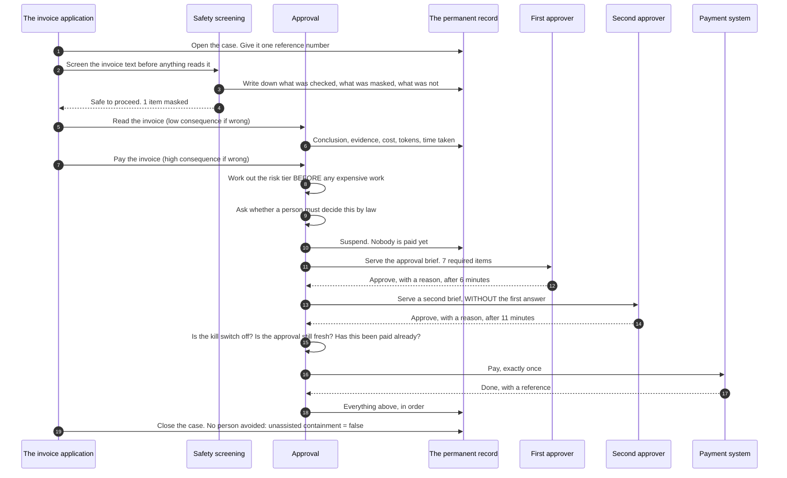
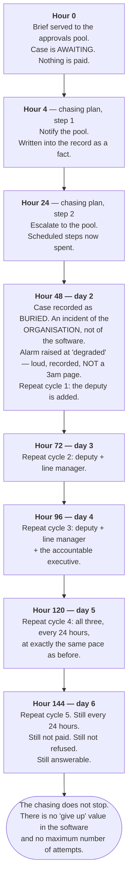

# One invoice, followed end to end

For anyone. No technical background assumed. No code on this page. Every
abbreviation is spelled out the first time it appears.

**About the numbers on this page.** The invoice itself is an **(illustration)**.
Its figures are taken from the worked example shipped with the software and from
the software's own test material, so that everything below can be checked. Every
*mechanism* described — what is checked, in what order, what is written down,
what happens when nobody answers — was verified against the source files on
17 August 2026. On that date the type checker completed with no errors and 825
automated tests across 87 files all passed, in about 25 seconds. Judgements rather
than measurements are marked **(estimate)**.

---

## The invoice

An invoice arrives from a supplier. **(Illustration.)**

| | |
|---|---|
| Reference | `inv_88214` |
| Amount | **£47,200** |
| Lines | 14 |
| Supplier | a supplier already on file |
| Paid from | account 8812 |

That is one **case**: one piece of work to be judged. It will pass through
several separate **decisions** before it is finished. Reading it is one
decision. Deciding whether it is legitimate is another. Deciding whether to pay
it is a third. Each is recorded separately, because they carry very different
consequences.

---

## Before the invoice arrived: what was written down in advance

Nothing below is decided in the moment. Each decision point in the system is
**declared in advance**, and the declaration must answer four questions before
the software will build at all:

1. **What facts decide how risky this is?** These must be readable off the case
   without any artificial intelligence being involved, because the risk level has
   to be known *before* the expensive work runs. A risk level computed from the
   answer cannot gate what has already happened.
2. **Does a person have to decide this one?** A separate question, fed by a
   separate set of facts, on purpose. Merging the two would let a change to a
   risk threshold quietly delete a legal obligation.
3. **What actually happens in the world, and how is it recorded safely?** For a
   payment, this includes how the destination account number is masked before
   anything is written down. This is not optional. There is no un-writing.
4. **What happens if nobody answers?** This is the chasing plan. A decision that
   needs a person cannot be declared without one, and a build failure is what
   you get if you try.

For this invoice, the team declared this chasing plan **(illustration)**:

- After **4 hours** — notify the approvals pool.
- After **24 hours** — escalate to the approvals pool.
- Thereafter — **every 24 hours**, widening the audience by one person each
  time: the deputy, then the line manager, then the accountable executive.

They also declared that at the high risk tier, **two people must approve**, and
that an approval goes stale after **24 hours**.

---

## The main path, in one picture

---

## Stage by stage

### 1. Arrival

The application opens a case and gives it one reference number — the
**correlation identifier** — which ties every later piece together. Every entry
about this invoice carries that number, for the whole of the retention period
your business sets. It is assigned once and never changes. (The library
publishes 2,557 days as the seven-year figure, and requires the actual period
from the application with no default, because a library that quietly picks one
has decided when nineteen applications may destroy evidence.)

At the same moment, a **scope statement** is written onto the case. In plain
words it says: *everything that went through this library is recorded here, and
I make no claim about anything else.* When the case closes, that statement is
copied into the seal, so it cannot be quietly rewritten afterwards.

### 2. Safety screening — before anything reads the invoice

The invoice text is screened **before** any judgment happens. Three things are
looked for: personal data, hidden instructions aimed at manipulating the system,
and prohibited content.

Three outcomes are possible for each finding: it is noted, it is masked, or the
whole thing is stopped. On this invoice, one item is masked.

Two properties of this stage are worth knowing:

- **A check that fails, times out, or says it is unavailable always recommends
  declining to judge. Never allowing.** At every risk tier. There is no setting
  that changes this, because there is no tier at which "we did not check, so we
  allowed it" is defensible.
- **The screening reports its own coverage.** Not its confidence — its coverage.
  How much text was examined, how many characters were masked, and how many went
  into the record unmasked. Text in a shape no rule matched is written down in
  full, up to 512 characters per field. The system does not claim to have caught
  everything. It tells you how much it looked at.

Every one of these facts is written into the permanent record as its own entry,
**before** anything else runs, and the software then re-reads that entry to prove
it was really written. Only then is the screened invoice released to the next
stage.

### 3. The reading — low consequence

The system reads the 14 lines and matches them against the purchase order. This
step is classified **low** consequence: reading an invoice wrongly is cheap to
discover and cheap to fix.

The record captures the conclusion, the evidence it rested on, and what it cost.
**(Illustration:)** cost recorded as the whole number 412, in tenths of the
smallest currency unit — 41.2 pence — with 3,180 units of text in, 240 out,
1.284 seconds elapsed, priced against a price table named `prices-2026-08`.

Note the units. Money in pence. Cost in tenths of a penny. Time in millionths of
a second. Confidence in hundredths of a percent. **Every number is a whole
number**, deliberately, because a record that does not reproduce exactly is not
evidence, and fractional numbers are how that fails quietly years later.

Note also that the cost figure is **required**, not optional. A decision point
that calls no artificial intelligence at all still has to state that it spent
nothing. An optional field would be missing on exactly the decisions nobody
instrumented.

### 4. The risk classification — before the expensive work, never after

Paying the invoice is a different decision from reading it. Same case, same
minute, and **high** consequence: £47,200 leaving an account is not cheap to
discover and not cheap to fix.

This is why a case has a *risk profile* rather than a single risk level.
Classifying the whole case as high would run every step under maximum safeguards
at maximum cost, and teams would respond by splitting cases up to get their
speed back — which fragments the record, which is the one thing this library
exists to keep whole.

Two rules apply here and both are load-bearing:

- The tier is worked out **before** the expensive work runs. Anything that needs
  the answer to compute is not a tier; it is a score after the fact, and it
  cannot gate what has already happened.
- **Consequence and confidence are never multiplied together.** Confidence is how
  likely we are to be wrong. Tier is how much it costs us to be wrong. Collapsing
  them into one number destroys the ability to say "we are 97.00% sure and it
  still needs two signatures, because it is £47,200."

The declaration also states a ceiling. A case classified above the ceiling the
decision point was ever allowed to reach **stops**, nothing happens, and an
engineer is told.

### 5. The reserved question — asked every time

The system now asks whether *this* decision is one a person must make by law or
standing policy. It asks on every single case, and the answer is written into the
record either way.

There are exactly two ways to answer. Reserved, naming the rule and the citation.
Or not reserved, stating the reason it does not apply. **There is no third answer
meaning "nobody thought about it"** — the software has no way to represent one, so
"we checked and it is not reserved" and silence cannot end up as the same row in
an archive somebody reads in 2033.

For this invoice, the answer is **not reserved**. Paying a matched supplier
invoice is not a decision the law hands to a named person. (A refusal of a
customer's claim usually is. See the box at the end of the unhappy path for what
changes when the answer is yes.)

### 6. The approval — and what the approver actually sees

The case is now **suspended**. Nothing has been paid. The system has prepared a
recommendation; a person will decide.

The suspension is stored as plain data. Nothing needed to resume it is held in
the memory of a running program, so the process can be restarted, redeployed, or
killed outright between the question and the answer. The software's own tests
prove this by writing the whole database to bytes, throwing away every object,
rebuilding from those bytes alone, and answering the case.

**The approver is served a brief. There are 7 items, and none may be omitted —
the request cannot even be constructed without all 7.**

| # | Item | On this invoice **(illustration)** |
|---|---|---|
| 1 | What will actually happen, in your units | "£47,200 leaves account 8812 today." Not "payment authorised" |
| 2 | What the system concluded, with the evidence **reachable** | "Invoice matches purchase order." The purchase order itself is one click away, not summarised into a sentence |
| 3 | **What the system is unsure about** | "Line 4 unit price is 11% above the purchase-order rate. The rate card returned two rates for this stock code" |
| 3b | **Contrary evidence, or a statement of the search that found none** | "Searched: payments to this supplier within 5% of this amount in the last 90 days. None found" |
| 4 | **What it could not check**, and why | Stated explicitly. Absence of a finding is not a finding |
| 5 | Whether a person must decide this by law, and under which rule | Not reserved, with the reason recorded |
| 6 | **What happens if you do nothing** | The chasing plan, in full: 4 hours, 24 hours, then every 24 hours widening |
| 7 | The case reference | So the entire record is one step away |

Items 3, 3b, 4 and 6 are the ones usually missing from an approval screen, and
they are the reason this list is fixed. **A brief that presents only the case for
saying yes is advocacy, not a brief.** And an approver who does not know the cost
of waiting cannot weigh whether to wait.

Two more properties, both structural rather than advisory:

- **No answer is pre-selected.** There is no default button, no highlighted
  option, no "approve all". The screen has nothing to pre-highlight because the
  software hands it nothing to pre-highlight with. The approver's first action is
  a choice.
- **Time taken is recorded on every approval**, measured from the moment the
  brief was actually delivered. If it was never delivered — a directory outage,
  an on-call gap — the field records "not measurable" rather than an invented
  zero, because a zero would read as the fastest possible approval in the one
  measure that exists to catch approving without looking.

The first approver approves after 6 minutes, with a reason in their own words.

### 7. The second approver — who is not told what the first said

£47,200 is above the threshold this team set for **two-person approval**, so a
second brief goes out.

Two things make this real rather than decorative:

- **The second person cannot be the first.** The list of candidates for the
  second seat is built from a directory with the first approver already removed.
  It is not a name comparison that could be got wrong. The second approver is
  *unable* to be the first.
- **The second person is not shown what the first decided.** The brief they
  receive carries who answered and when — and there is no field on it for the
  outcome, and no way to add one from outside the library. A screen saying "Jane
  approved this" does not produce two decisions; it produces Jane's decision and
  somebody agreeing with Jane.

The second approver approves after 11 minutes.

**The approval clock runs from the earliest approval, not the latest.** An
approver who signed on Monday signed against Monday's evidence. If the second
seat had arrived 25 hours later, the approval would have gone stale, no money
would have moved, and the case would have returned to the first seat with the
chasing plan restarted — still answerable, nothing lost.

### 8. The payment

Three questions are asked at the last possible moment, immediately before money
moves:

1. **Is the kill switch off?** The kill switch stops actions in the world without
   stopping the system from thinking. It is read *here*, at the moment of acting,
   not earlier — so that during an incident the record still shows what the
   system *would* have done, which is exactly what you need afterwards.
2. **Is the approval still fresh?** Checked twice: once when the answer arrives,
   and once again against the clock at the instant of paying.
3. **Has this already been done?** A claim on this payment is written down
   **before** the outbound call, not after. That ordering is the whole mechanism.

The payment is made. It returns a reference. The case closes.

At close, exactly one outcome field is compulsory: **unassisted containment** —
did this case finish without a person being asked to decide? Here the answer is
**false**. Two people decided. That is not a failure; it is the safety net
working exactly as designed, and it cost two salaries' worth of minutes.

There is no "success" field to record instead. There is no resolution field
anywhere in the library.

---

## What the record now holds

Closing appends a **seal**: a fingerprint of everything before it, the count of
what it sealed, and the case's scope statement. Reading the case back re-reads
the seal rather than trusting it, and the fingerprint is published to a
countersigner so a later edit is detectable.

Where that protection stops, stated plainly: an adversary holding **both** sets
of credentials defeats both shipped countersigners, because both sit inside this
organisation's own custody. The countersigner that would cross a real trust
boundary — one held outside this organisation — is named in the software and
deliberately not shipped, because shipping it means choosing a custodian on
behalf of nineteen applications.

---

## Weeks later: somebody asks whether it was right

This is the question the whole design turns on, and the honest answer has two
halves.

**What the record answers immediately, in full, from its own entries:**

- Every step, in order, with the parent of each step named — so the shape of the
  work is a graph, not a flat list.
- What was screened, what was masked, and how much text went in unmasked.
- What the system concluded, on what evidence, at 97.00% confidence.
- That the payment was classified high consequence, **before** the work ran.
- That the reserved question was asked, and answered "no", with the reason.
- Exactly what both approvers were shown — including what the system was unsure
  about and what it could not check.
- Who approved, when, and that they took 6 and 11 minutes.
- That the second approver was drawn from a list the first had been removed from.
- That the payment happened once, with its reference.
- That no person was avoided: unassisted containment is false.
- What the whole thing cost, priced against a named price table, so the figure
  can be re-derived in 2033.

**What the record does not answer, and will not:**

Whether paying that invoice was the right thing to do.

That is **resolution** — whether the party whose problem it was got what they
were entitled to — and it is not knowable at the moment a case closes. It needs
evidence from outside the system, gathered afterwards. So the library records
none, and holds that line by having no such field at all across its 59,245 lines
of source.

For an invoice, the business has all 3 evidence shapes available and should say
which one it is using:

- **Quiet** — no dispute, no reopen, no complaint from the supplier within an
  agreed window. Cheapest, and the weakest: a supplier who gave up chasing a
  short payment is also quiet.
- **Reviewed** — somebody re-checks a sample of paid invoices against the
  purchase orders. The only source that catches quiet wrongness.
- **Reversed** — the money came back: a clawback, a reversal, a refund. The
  hardest evidence of the three, and finance already records it.

Whichever is chosen, the source and the window are named, and the record says
**which** source and **which** window produced the figure. A resolution number
whose origin is unknown cannot be audited and is therefore evidence of nothing.

**One more limit, and it is the one a regulator will find.** The record covers
what went through the library. If somebody in the finance team had telephoned
the bank directly, no entry would exist — and the record does not pretend
otherwise. That is why the scope statement is stamped onto every case and sealed
into it at close.

---

# The unhappy path: nobody answers for six days

Same invoice. Same brief. This time the first approver is on leave, and the
approvals pool is busy.

## What happens on day six

**The reminders are still going out, at exactly the same pace.** Not faster. The
cadence declared was 24 hours and it never accelerates — the software has no
field that could make it shrink. A reminder stream that speeds up floods a
channel, the channel gets muted, and the case becomes *less* likely to be
answered than if nothing had been sent at all. The library's own floor is 1 hour,
and a plan declaring anything tighter is refused by name at the moment it is
declared.

**The audience has widened, not the volume.** Deputy, then line manager, then
accountable executive — one more person per cycle, up to a shipped ceiling of 12
recipients per reminder. The fifteenth reminder to somebody who has ignored
fourteen is not a plan. Reaching somebody who *can* answer is.

**Every reminder that was actually sent is in the record**, as its own entry with
a parent. Six days later, "we chased them" is evidence rather than an assertion,
and the case that waited six days and was chased 7 times has that written down,
not merely implied by two timestamps.

## What has *not* happened on day six

This list is the point of the whole document.

- **The invoice has not been paid.** No amount of waiting licenses money to move.
- **The invoice has not been refused.** Nobody decided against it.
- **No default was applied.** The case has acquired no verdict from the passage
  of time.
- **The case is not counted as finished — in either direction.** There are
  exactly 6 possible endings for a decision, and "waiting for a person" is not
  among them. No report can count this case as complete, and no measure can score
  it as a success or a failure.
- **The case has not fallen out of any queue.** It never self-resolves, never
  disappears, and only a person can close it.
- **The reminders have not stopped.** There is no stop value and no maximum
  attempt count. A decision that needed a person yesterday still needs one next
  month.

## If the invoice *had* declared an expiry

This invoice's declaration allowed one, because it is not reserved. Suppose it
had said: after 7 days, refuse.

On day 7 the case would end — and its ending would be recorded as **"ran out of
time with nobody answering"**, which is its own separate ending, never folded
into "a person refused". Those are different facts. Collapsing them is precisely
how "nobody decided at all" gets counted alongside "the system judged it
correctly", which is the conflation this whole library exists to prevent.

An expiry can never license an action. There is exactly one thing it may settle
into, and it is not "approve". "Nobody was on shift" is not a lawful basis for
moving £47,200.

> **If this decision had been reserved** — one a person must make by law — there
> would be **no expiry at all**. Not a longer one. None. The time-limit branch is
> deleted from the type of a reserved decision, so a programmer writing one gets
> a build failure. The chasing would continue indefinitely, widening every 24
> hours, until a named person answered. For a reserved decision, the correct
> number of cases finished without a person is **exactly zero**, and any other
> figure is a breach rather than an efficiency.

## The one thing that could still go wrong in silence

Suppose that on day 3, the process that fires all these reminders died.

Nothing would throw an error. No request would fail. No dashboard would turn red.
The invoice would simply stop being chased, and so would every other waiting case
in all nineteen applications at once.

There are two protections, and the second is the one you must deploy yourself.

1. **When the chaser comes back, it notices.** A case arriving at a visit more
   than one full interval later than it was due cannot have been chased properly,
   because the cadence never accelerates and never stops. The software records
   that gap and raises the alarm on it. Note the honest limit: this only works
   once the chaser is running again.
2. **The chaser proves it is alive on every run, including runs that found
   nothing to do** — because *"nothing was due"* and *"I did not run"* must not
   look the same, and only the second is a disaster. **The thing that watches for
   a missing beat is not supplied by this library and must run in a separate
   process.** A watchdog inside the thing it watches dies with it, silently, at
   the exact moment it is needed.

A missed beat is the highest-severity condition in the entire system, alone in
the top of 4 severity bands, above every per-case failure. The ranking is proved
by the compiler rather than written in a comment. One stalled case is one
supplier waiting for £47,200. A stopped chaser is every waiting case at once, and
nobody finds out until somebody telephones.

---

## The four things to take away

1. **The safeguards are chosen before the expensive work runs**, not after it.
   Risk tier and the reserved question are both settled before anything costly
   happens, because a check that runs afterwards cannot gate what has already
   happened.
2. **The approver sees what the system is unsure about, what it could not check,
   and what waiting costs.** All 7 items, or the request cannot be built.
3. **Waiting is legitimate. Waiting silently is not.** The case gets louder over
   time, never quieter, and never finishes by itself.
4. **The record tells you exactly what happened, and refuses to tell you whether
   it was right.** That second question needs evidence from outside, gathered
   later, from a source your business names. See `WHAT-IT-WILL-NOT-DO.md`.
