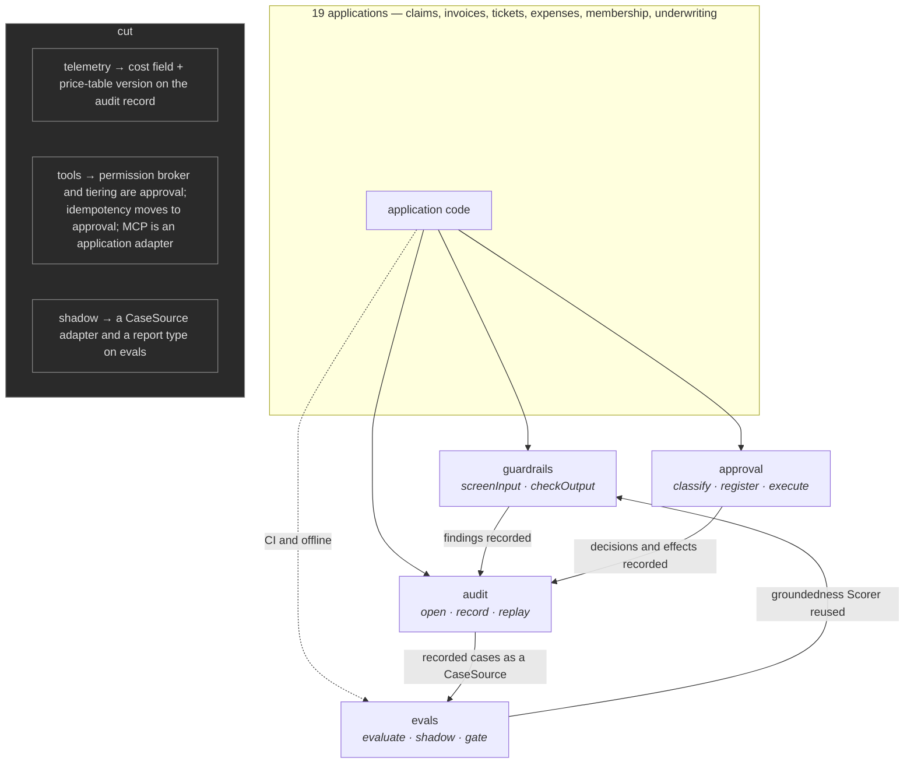

# Phase 2 — Interface review of the seven candidate modules

**Status:** findings, awaiting decision. No implementation code exists.

Vocabulary per `CLAUDE.md`: module, interface, seam, adapter, depth, leverage,
locality. Interface means everything a caller must know to use the module
correctly — signature, invariants, ordering constraints, error modes, required
configuration, performance characteristics — not the type signature alone.

**Headline: four of the seven survive.** `telemetry` is a pass-through and
should not exist. `tools` is three-quarters a restatement of `approval` and
should be dissolved. `shadow` is a real capability but not a real module, and
should merge into `evals`.

That lands on exactly the "four excellent modules rather than seven mediocre"
you asked for, which is close enough to what you wanted that you should treat
it with suspicion. I have written the strongest honest case *against* each cut
in its own section so you can check my reasoning rather than my conclusion.

---

## 1. `audit` — append-only decision trace, replayable by correlation ID

**Verdict: keep. The deepest of the seven, and the one to build first.**

### Interface

```ts
interface Audit {
  open(caseId: CorrelationId, profile: TierProfile): Promise<CaseTrace>;
  replay(caseId: CorrelationId): Promise<ReplayedCase>;
}

interface CaseTrace {
  record(entry: DecisionRecord): Promise<Sequenced<DecisionRecord>>;
  close(containment: Containment): Promise<void>;
}
```

Three verbs a caller learns. Everything else is invariant.

**Invariants**

- Append-only. There is no `update` and no `delete`, and the database grants
  withhold `UPDATE`/`DELETE` on trace tables — so the guarantee holds even
  against someone with a psql prompt, not only against someone using this
  interface.
- Sequence numbers are assigned by the store, never by the caller, and are
  monotonic and gapless within a correlation ID. A caller-assigned sequence is
  a caller-assigned lie under concurrency.
- Records are immutable once acknowledged. Re-judging a case appends a new
  decision; it never edits the old one.
- **Serialisation is byte-stable**: the same logical record produces identical
  bytes on every host and every version. Without this, replay cannot diff, and
  the module's entire promise collapses. This is the single hardest thing in
  the module and the least visible.
- Redaction is applied *before* write. There is no un-writing personal data.

**Ordering constraints**

- `record` is totally ordered within a correlation ID, including under
  concurrent writers. No ordering is promised across correlation IDs.
- `close` is terminal. Recording after close is an error, not a no-op.
- `replay` reflects acknowledged records only — never in-flight ones.

**Error modes**

- `TraceUnavailable` — and this is the interface's most consequential fact:
  **the fail policy is set by tier, not by the module.** At high tier an
  unrecordable decision must not proceed; no trace means no effect. At low tier
  the caller may degrade and continue. A module that picks one policy for all
  nineteen callers is wrong for most of them, so the policy is required
  configuration and has no default.
- `SequenceConflict` — transient, retry-safe.
- `AlreadyClosed`, `IncompleteTrace` (replay found records but a required one
  is absent — distinct from "no such case").

**Required configuration:** store adapter, redaction policy, clock (injected —
never `Date.now()` inside the module), retention window, per-tier fail policy.

**Performance characteristics:** `record` is on the hot path of every decision.
Target: O(1) append, p99 under 10ms, batching supported for multi-record steps.
Expect 5–50 records per case. `replay` is off the hot path and may take
seconds; it is allowed to be slow and must never be called from a request path.

### Deletion test

Complexity reappears nineteen times, and — worse — *divergently*. Nineteen
trace schemas means no shared incident tooling, no shared compliance story, and
no cross-application review. Byte-stable serialisation would be got subtly
wrong in most of them, and the symptom (replay diffs that are noise) appears
months later. **Earns its keep, overwhelmingly.**

### Seam rule

- **`TraceStore`** — Adapter 1: Postgres. Adapter 2: in-memory. The in-memory
  adapter is a shipped deliverable rather than a test mock: it is what makes
  hermetic testing structural instead of conventional. **Real seam.**
- A third adapter — append-only object storage for long retention in regulated
  industries — is plausible and **speculative**. Do not build for it. If
  underwriting demands seven-year retention, that is when the seam earns a
  third adapter.

---

## 2. `approval` — risk tiers, human gate, dual control, kill switch

**Verdict: keep. The highest-leverage module of the seven.**

Absorbs `tools`' permission broker and idempotency (see §6).

### Interface

The load-bearing part is type-level, so the signature carries real weight here.

```ts
// Capability, as a type. A handler receives exactly what its tier permits.
type ClientFor<T extends Tier> = T extends "high" ? ReadOnlyClient
                               : T extends "medium" ? ReadOnlyClient
                               : WriteCapableClient;

register<T extends Tier>(tier: T, handler: (c: ClientFor<T>) => Verdict): void;

// An effect cannot execute without a token, and the token cannot be
// constructed except by the gate.
execute(auth: Authorisation<Tier>, effect: Effect, key: IdempotencyKey)
  : Promise<EffectOutcome>;
```

Registering a handler that wants a `WriteCapableClient` at tier `"high"` is a
compile error. Not a runtime check, not a lint rule, not a review convention —
the program does not typecheck. That is the constraint you specified, and it is
the reason this module has more leverage than any other: one interface makes a
whole class of mistake unrepresentable across nineteen applications.

**Invariants**

- Tier is assigned before the handler runs and is never derived from handler
  output. A tier computed from a verdict cannot gate the work that produced it.
- An effect executes at most once per idempotency key. A repeat returns the
  *original* outcome — it does not re-execute and does not error.
- Dual control's two authorities are distinct, and the second approval is
  unable to be granted by the first approver's identity.
- The kill switch stops effects and does not stop decisions. Preserving the
  evidence of what the system would have done during an incident is the point.

**Ordering constraints**

Strictly: classify → handle → authorise → execute. An effect executed before
its authorisation is unrepresentable, because `execute` requires a token only
the gate can mint. The kill switch is checked at `execute`, not at `classify`.

**Error modes**

- `Escalated` — a disposition, returned, never thrown. Escalation is not a
  failure.
- `KillSwitchEngaged`, `DualControlSelfApproval`, `IdempotencyReplay`.
- `AuthorityUnavailable` — **the dangerous one.** No human to escalate to. This
  path silently becomes containment-without-resolution, which is the flattering
  failure `CONTEXT.md` warns about. It must be a distinct, alertable error and
  never fold into a generic timeout.

**Required configuration:** `TierPolicy` (per application), authority directory,
idempotency store, kill-switch source, dual-control thresholds.

**Performance characteristics — and one fact that reshapes the whole module:**
`classify` runs on every decision and must be pure and sub-millisecond, with no
I/O. **The human gate is unbounded** — hours, days. Therefore approval cannot be
a promise you await in-process: the process will be redeployed before a reviewer
answers. The interface must be *durable and resumable*, with the case suspended
and rehydrated, not blocked. Any design that models approval as `await
approve()` is wrong, and this is the kind of thing that is discovered in week
six and costs a rewrite.

### Deletion test

Nineteen applications each write tier routing, and each gets the
write-capability constraint wrong in a different way *at runtime*, in systems
that move money. **Earns its keep overwhelmingly** — this is the module I would
keep if I could keep only one.

### Seam rule

- **`TierPolicy`** — nineteen real adapters, one per application. This is the
  most obviously real seam in the project.
- **`Authority`** — Adapter 1: human, via a task queue. Adapter 2: delegated
  automated policy at low tier (still recorded with a named delegation, per
  `CONTEXT.md`). **Real seam.**
- **`IdempotencyStore`** — Adapter 1: Postgres. Adapter 2: in-memory.
  **Real seam.**

---

## 3. `evals` — golden-dataset runner, metrics, judge, CI gate

**Verdict: keep, with `shadow` merged in (see §7).**

### Interface

Two entry points that deliberately return two incompatible types:

```ts
evaluate(suite: GoldenSuite, subject: Subject, scorer: Scorer)
  : Promise<AccuracyReport>;

shadow(cases: RecordedCases, subject: Subject, scorer: Scorer)
  : Promise<AgreementReport>;

gate(report: AccuracyReport, baseline: Baseline, thresholds: Thresholds)
  : GateOutcome;
```

`AgreementReport` is not assignable to `AccuracyReport`. That is the type-level
defence of the `CONTEXT.md` distinction: agreement with humans is not accuracy,
and someone *will* try to report it as such. `gate` accepting only
`AccuracyReport` means a CI gate cannot be built on agreement data by accident.

**Invariants**

- The subject is injected and structurally cannot write. This is the same
  mechanism that gives `shadow` its no-effect guarantee — which is the single
  strongest argument for the merge.
- Suites are versioned and content-addressed. A report names its suite version;
  a report against an unversioned suite is meaningless and is refused.
- A run is deterministic given (suite version, subject version, scorer, seed) —
  or the report explicitly declares that it is not.
- Judge scorers are non-deterministic by nature. Reports must record the judge
  model and prompt version, and must aggregate over n > 1. A single judge call
  is an opinion, not a measurement.

**Ordering constraints:** none between cases — embarrassingly parallel. `gate`
runs after a complete run; gating a partial run is an error, not a warning.

**Error modes**

- `SuiteVersionMismatch`, `ScorerDisagreement` (judge panel split beyond
  threshold — surfaced, never averaged away).
- `BaselineMissing` — first CI run. Must be explicit and must not silently pass;
  a gate that quietly succeeds because it had nothing to compare against is
  worse than no gate.
- `SubjectAttemptedWrite` — a runtime backstop for dynamically constructed
  subjects. The compile-time guarantee is primary; this catches what types
  cannot see.

**Required configuration:** concurrency bound, seed, judge model + prompt
version, thresholds, baseline store.

**Performance characteristics:** dominated by the subject, so concurrency must
be bounded and configurable — an unbounded runner will rate-limit the provider
and produce failures that look like regressions. Stated target: 200 golden cases
under 5 minutes at concurrency 8. The gate must support a subset pre-merge and
the full suite nightly, or it will be disabled for being slow.

### Deletion test

Nineteen applications each build: dataset loading, a bounded-concurrency runner,
a scorer registry, report diffing, baseline storage, and judge-flakiness
handling. None of that is domain-specific. **Earns its keep.**

Per ADR 0001, this module also carries a second job: it is the only thing that
will ever produce evidence that the workflows-not-agents stance should be
reversed. Cutting it would make that decision unfalsifiable.

### Seam rule

- **`Scorer`** — Adapter 1: deterministic/structural comparison. Adapter 2:
  LLM-as-judge. **Real seam**, and the reason judge is an adapter rather than a
  feature of the runner.
- **`CaseSource`** — Adapter 1: versioned golden suite on disk. Adapter 2:
  recorded production cases read from `audit`. **Real seam** — and it is
  precisely this second adapter that makes `shadow` a case source rather than a
  module.
- **`BaselineStore`** — Adapter 1: a file in the repository. A second adapter is
  **speculative**; do not build the seam.

---

## 4. `guardrails` — redaction, injection screening, groundedness

**Verdict: keep, narrowed.** Abstention leaves its scope; groundedness is
shared with `evals` rather than reimplemented.

### Interface

```ts
screenInput(payload: Payload, tier: Tier): Screening;
checkOutput(output: Output, sources: Sources, tier: Tier): Screening;
```

`Screening` is findings plus a recommended disposition (allow, redact-and-allow,
abstain, escalate).

**The scope correction:** you listed abstention inside `guardrails`. Per
`CONTEXT.md`, abstention is a *verdict disposition* — the system declining to
conclude. Guardrails produce findings and *recommend*; the decision records the
abstention. If guardrails could abstain directly, there would be two places in
the codebase that produce verdicts, and the audit trace would have entries with
no decision behind them. Small correction, but it is the kind that is very
cheap now and very expensive at nineteen call sites.

**Invariants**

- Redaction is irreversible within the trace: the redacted form is what is
  recorded, and the original is never persisted.
- **Fail-closed.** A detector that errors yields abstain, never allow. Note this
  is deliberately the opposite of `audit`'s tiered fail policy: an unrecordable
  decision may proceed at low tier, but an unscreened payload may not proceed at
  any tier. The asymmetry is intentional and should be stated in both modules'
  documentation, because a reader who learns one will assume the other.
- No detector may produce an effect. Detectors are pure with respect to the
  payload.

**Ordering constraints:** `screenInput` strictly before the decision;
`checkOutput` strictly after the decision and strictly before approval. A
groundedness check that runs after an effect is theatre.

**Error modes:** `DetectorUnavailable` → fail closed. `SourcesMissing` for
groundedness → abstain, never pass. "We could not check, so we allowed it" is
the failure mode this module exists to prevent.

**Required configuration:** detector set per tier, redaction policy, and
**locale** — personal-data patterns are jurisdictional, and a library serving
nineteen applications across several markets that hardcodes one country's
formats is a compliance incident waiting for a date.

**Performance characteristics:** on the hot path, twice per decision.
Deterministic detectors must be sub-millisecond. A model-based detector adds a
full model call, roughly doubling decision latency and cost — so tier must be
able to select cheap-only detector sets, or low-tier throughput dies.

### Deletion test

Nineteen applications each implement personal-data redaction. Getting it wrong
is not a bug, it is a notifiable incident. **Earns its keep on redaction alone**,
before injection screening is considered.

### Seam rule

- **`Detector`** — Adapter 1: deterministic (patterns, dictionaries). Adapter 2:
  model-based classifier. **Real seam.**

**One honest overlap.** Groundedness — comparing an output against reference
material — is the same shape as an `evals` `Scorer`. If both modules implement
it independently, we have built the same thing twice and produced exactly the
mediocrity this exercise is meant to avoid. Recommendation: groundedness is
implemented once, as a `Scorer`, and *used* by guardrails. One implementation,
two callers.

---

## 5. `telemetry` — tokens, cost, latency, cost-per-decision

**Verdict: cut. This is the pass-through.**

### The interface it would have

`wrap(call)` recording tokens, cost and latency; `costPerDecision(caseId)`
aggregating them.

### Deletion test

`CONTEXT.md` defines a decision as carrying a cost — it has to, or a replayed
case cannot account for itself. So cost is already a required field on a
`DecisionRecord` in `audit`. What remains in `telemetry` is:

1. a price table — **data**, not a module;
2. a stopwatch — three lines;
3. a `GROUP BY` over the trace — **an `audit` query**.

Delete `telemetry` and complexity does not reappear across nineteen callers. It
*relocates* to `audit`, where it was always required to live. That is the
textbook definition of a pass-through, and the deletion test is unambiguous.

### The honest case against cutting

Real observability problems exist here: exporting to OpenTelemetry, controlling
metric cardinality, sampling high-volume traces. Those are genuine and
non-trivial. They are also generic observability rather than agent-operations
machinery, they have mature libraries, and buying one beats building a module —
particularly given your instruction to keep dependencies minimal *and* the
nineteen-caller cost of a shallow interface.

### What survives the cut

One non-obvious thing, and it should be preserved in `audit`'s record shape:
**the trace must record which price-table version priced a decision.** Otherwise
historical cost-per-decision silently rewrites itself every time a provider
changes prices, and your year-over-year cost chart becomes fiction. That is a
data-versioning fact worth one field — it is not worth a module.

### Seam rule

The second adapter would be a second telemetry backend. Since the aggregation
belongs to `audit` and the export belongs to a library, there is nothing behind
the seam. **Speculative, and moot.**

---

## 6. `tools` — permission broker, tiered registry, idempotency, MCP server

**Verdict: dissolve. Three of its four responsibilities are restatements or
adapters; one is real and moves to `approval`.**

### Responsibility by responsibility

| Responsibility | Assessment |
|---|---|
| Permission broker | This *is* `approval`'s interface, under a second name. Two modules deciding whether an effect may proceed is two places to get it wrong. |
| Risk-tiered tool registry | This is `approval`'s `TierPolicy`, restated. Tiering in two modules means two answers when they disagree. |
| Idempotency | **Real.** Moves to `approval`. |
| MCP server | An adapter, and an application concern. |

### Deletion test

Three of four responsibilities *relocate* rather than reappear. That is the
pass-through signature again — this time not because the module is thin, but
because it overlaps a module that already exists.

### Why idempotency goes to `approval` specifically

It looks like it could be its own small module — authorisation and execution are
conceptually distinct. But the type-level guarantee is what settles it: the
thing that authorises an effect and the thing that hands you the write-capable
client must be the same module, or the guarantee leaks at the join. `execute`
requiring an `Authorisation` token is only airtight if `execute` lives behind
the same interface that mints the token.

### On the Model Context Protocol server

Exposing tools over MCP is a per-application decision, and my read is that few
of nineteen internal decisioning applications need to expose their tools to an
external model host at all. Building it into shared machinery is speculative
work for an unnamed caller. **If I am wrong about that, tell me how many of the
nineteen actually need it** — if the answer is six or more, it deserves
reconsideration as an adapter, though still not as a module.

### Seam rule

The second adapter for a tool transport would be a non-MCP transport. Nobody has
asked for one. **Speculative — there is no real seam here.**

---

## 7. `shadow` — silent runs against recorded human decisions

**Verdict: merge into `evals`. The capability earns its keep; the module does
not.**

### Deletion test — and this one is genuinely mixed

Delete the *capability* and complexity reappears: replaying recorded cases,
running a subject, diffing against what humans did, aggregating agreement.
Delete the *module* and almost nothing reappears, because `evals` already needs
every part of it:

| Shadow needs | `evals` already has |
|---|---|
| Iterate cases, run subject, score, aggregate | The runner |
| Guaranteed no effects | Structural no-write on the subject |
| A baseline to compare against | Baseline comparison |
| A case source | The `CaseSource` seam |

What is actually distinct is two things: a `CaseSource` adapter reading recorded
production cases from `audit`, and an `AgreementReport` type whose semantics
differ from `AccuracyReport`. A seam adapter and a return type are not a module.

### The honest case against merging

The semantic difference is severe. Agreement is not accuracy, humans are the
baseline *including their errors*, and someone will eventually compute an
accuracy figure from a shadow run and put it in a board pack. Physical
separation into its own module is a real safeguard against that.

My answer is that separate *types* are a stronger safeguard than separate
*folders*, and cost nothing: `AgreementReport` is not assignable to
`AccuracyReport`, and `gate` accepts only the latter. Folders do not typecheck.

**The real cost of merging**, which I want on the record: `evals` becomes the
module that does everything, and modules that do everything drift shallow.
Mitigation is two entry points, two report types, one runner — and a review rule
that a third entry point on `evals` is a signal to split, not to extend.

### Seam rule

- **`CaseSource`** — Adapter 1: golden suite on disk. Adapter 2: recorded cases
  from `audit`. **Real seam**, and the reason to merge rather than to split.

---

## What survives



Four modules. Note that `audit` has no dependency on the others — it is the
foundation and should be built first. `evals` reads from `audit` but is off the
hot path entirely.

### Summary table

| Module | Deletion test | Real seams | Verdict |
|---|---|---|---|
| `audit` | Reappears 19× and divergently; byte-stable serialisation got wrong repeatedly | `TraceStore` (Postgres, in-memory) | **Keep — build first** |
| `approval` | Reappears 19×, wrong at runtime, in systems that move money | `TierPolicy` (19), `Authority` (human, delegated), `IdempotencyStore` | **Keep — highest leverage** |
| `evals` | Runner, scorers, baselines, judge flakiness reappear 19× | `Scorer` (deterministic, judge), `CaseSource` (golden, recorded) | **Keep — absorbs `shadow`** |
| `guardrails` | Redaction reappears 19×; wrong is an incident, not a bug | `Detector` (deterministic, model-based) | **Keep — narrowed** |
| `telemetry` | Relocates to `audit`; does not reappear | none — speculative | **Cut** |
| `tools` | 3 of 4 relocate to `approval` | none — speculative | **Dissolve** |
| `shadow` | Capability reappears; module does not | `CaseSource` — the reason to merge | **Merge into `evals`** |

---

## If forced to cut exactly one: `telemetry`

It is the only one of the seven where the deletion test comes back clean with no
argument on the other side. Cost already has to live on the audit record for
replay to account for itself; the price table is data; the aggregation is a
query. Everything else in it is generic observability that a dependency does
better than we will.

The next one I would cut is `tools`, but that verdict rests on a claim you can
falsify — that few of the nineteen need to expose tools over the Model Context
Protocol. `telemetry`'s verdict rests on nothing you have to tell me.

---

## Three forks I have not decided

Per the standing rule, these are yours:

1. **Does `evals` absorbing `shadow` go too far?** I have argued yes-merge and
   given the case against. If you would rather have five modules with `shadow`
   standing alone, that is a defensible reading and the cost is one duplicated
   runner. Tell me and I will build it that way.

2. **Risk tier per case, or per decision-and-its-effect?** Raised in
   `CONTEXT.md` and still open. It changes `approval`'s interface materially:
   per-case gives `classify(case): Tier`, per-decision gives
   `classify(decision, effect): Tier` and a tier *profile* on the case. I
   recommend per-decision. Per-case is simpler to explain to an auditor, which
   is not nothing in these industries.

3. **Is `approval`'s durable-resumable requirement acceptable?** Human gates run
   for days, so approval cannot be an awaited promise — the case must suspend
   and rehydrate. This is the single biggest implementation cost in the four
   surviving modules, and it will show up in every caller's architecture. The
   alternative is to declare human gates out of scope and hand callers an
   escalation *event* to handle themselves, which is a much smaller module and a
   much larger nineteen-fold duplication. I lean towards keeping it in, but this
   is a genuine fork and it is expensive either way.

---

## What I need before writing code

- Your ruling on the four survivors, and on fork 1.
- Fork 2 — it changes `approval`'s interface, not just its implementation.
- Fork 3 — it changes the size of the project.
- From `CONTEXT.md`, still outstanding: whether `verdict` survives as distinct
  from `decision`, and the resolution evidence source and observation window per
  application.

Then: Design It Twice on `evals` and `approval` — four sub-agents, four
radically different interfaces (minimal / flexible / common-case-optimised /
ports-and-adapters), compared on depth, locality and seam placement. Seams
agreed before a single test is written. Then TDD in vertical slices.
