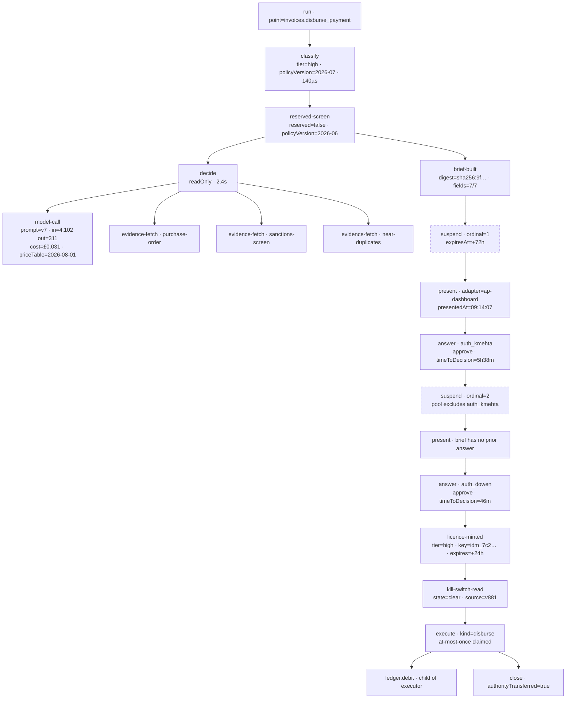

# `approval` — common-case-optimised

**Design It Twice, shape 3 of 4.** One of eight parallel designs. This one is
deliberately pushed to its extreme and does not hedge toward the minimal,
flexible, or ports-and-adapters shapes.

---

## 0. The caller I optimised for, and why I believe they are the majority

**The common caller is one declared decision point that produces one verdict and
at most one effect, on one case, at whatever risk tier the application's policy
assigns.**

That is the whole claim, and everything below is spent on it. Concretely, the
common caller writes five fields once at boot and one line at the call site:

```ts
const result = await approval.run(RouteTicket, ticket, { correlationId });
```

No tier argument. No brief. No idempotency key. No authority. No approval token.
No `execute`. No recorder plumbing. Those are not defaults the caller may
override — several of them are **not expressible at the call site at all**, which
is what makes C1 hold.

### Why I believe this caller is the majority

Two different counts, and they agree. Both are **estimates**, marked as such,
derived from the six named domains in `CLAUDE.md` (claims triage, invoice
approval, ticket routing, expense validation, member verification, underwriting
document intake).

**By declared decision point.** Taking `docs/CONTEXT.md`'s recommendation that
risk tier attaches to a decision-and-its-effect rather than to a case, a typical
application declares six to ten decision points and gates one or two of them:

| Application | Decision points (estimate) | Points that can reach a human gate |
|---|---|---|
| Insurance claims triage | intake extraction, duplicate check, coverage determination, fraud screen, reserve setting, disbursement | 2 — reserve setting, disbursement |
| Invoice approval | field extraction, purchase-order match, tax-code validation, duplicate detection, payment authorisation, payment scheduling | 1 — payment authorisation |
| Support ticket routing | language detection, intent classification, queue selection, priority assignment, auto-reply drafting | 0–1 |
| Expense validation | receipt extraction, policy match, duplicate check, reimbursement | 1 |
| Member verification | document extraction, identity match, sanctions screen, eligibility determination | 1 — eligibility (frequently reserved) |
| Underwriting intake | document classification, field extraction, completeness check, referral determination | 1 |

Roughly **8 in 10 declared decision points never reach a human gate**.

**By execution volume, the ratio is far more lopsided.** Ungated points run on
every case; the gated point runs only on the subset that gets that far, and a
gated point that suspends occupies the caller for exactly one `run` call
regardless of how long the human takes. A claims application processing 100,000
cases a month runs extraction and duplicate checking 100,000 times each and
disburses perhaps 30,000 times, with a human gate on maybe 4,000 of those.
**Estimate: 15 ungated decisions for every gated one.**

So the common caller is the *ungated, non-reserved, single-effect-or-no-effect
step*. Everything in §1 is arranged so that caller writes almost nothing.

### What the minority is, stated up front

The minority is not "high-tier callers" — a high-tier gated disbursement is
still one `run` call in this design. The minority is **callers whose work is not
step-shaped**:

- one approval licensing many effects (an accounts-payable clerk clearing 60
  invoices in one sitting);
- one approval covering many cases (a batch payment run);
- an approval requested by a human with no preceding decision (retroactive
  authorisation);
- an effect that must be decided in stages (write, observe, then decide the
  next write);
- a case where new evidence arrives while an approver is still holding it.

Every one of those is named in §6 with exactly what it now costs. Two of them
this design refuses outright.

---

## 1. The interface

Four exported things. Two of them run once at boot; one runs on every decision;
one is called by the application's approval surface when a human answers.

```
packages/agent-ops-core/src/approval/
  index.ts     ← everything below. Public.
  lib/         ← classifier, gate, licence mint, suspension codec, journal
                 protocol, idempotency. Private.
  tests/       ← tests + in-memory adapters as fixtures. Private.
```

```ts
export function createApproval(deps: ApprovalDeps): Approval;
export function defineDecisionPoint(spec: DecisionPointSpec): DecisionPoint;

export interface Approval {
  run(point, input, ctx): Promise<Settled | Suspended>;
  answer(suspension, answer, ctx): Promise<Settled | Suspended>;
}
```

There is **no** `classify`, no `handle`, no `authorise`, no `execute`, no
`suspend`, no `resume`, no `record`. Those phases exist, they are strictly
ordered, and every one of them writes a node — but none of them is reachable
from outside the module. That absence is the C1 mechanism, not an omission.

### 1.1 Capability, as a type

This is the highest-leverage requirement in the library and it is the first
thing in `index.ts`.

```ts
declare const CAPABILITY: unique symbol;      // NOT exported

export type Capability = "read" | "write";

export interface Client<C extends Capability> {
  /** Phantom. Present at the type level only; the runtime object has no
   *  such property. Its literal type is what makes the two clients
   *  structurally disjoint. */
  readonly [CAPABILITY]: C;
  read<E>(query: EvidenceQuery<E>): Promise<E>;
}

export type ReadOnlyClient     = Client<"read">;
export type WriteCapableClient = Client<"write">;

export type Tier = "low" | "medium" | "high";

/** Exactly the PHASE-2 shape. Low-tier decisions may decide-and-do;
 *  medium and high may not touch a write-capable client at all. */
export type ClientFor<T extends Tier> =
  T extends "low" ? WriteCapableClient : ReadOnlyClient;
```

**The trap this avoids, stated explicitly because it is the usual way this
guarantee is lost.** If `WriteCapableClient extends ReadOnlyClient`, then a
write-capable client is assignable everywhere a read-only one is expected and
the whole constraint evaporates under structural subtyping. The two client types
here are **disjoint in both directions** — `Client<"write">` is not assignable
to `Client<"read">` and `Client<"read">` is not assignable to `Client<"write">`,
because the literal types of the phantom property are incompatible. Neither is a
subtype of the other. That is the entire mechanism.

**Two compilation facts this depends on, and both are load-bearing:**

1. `strictFunctionTypes` must be on (it is, via `strict: true` in
   `tsconfig.base.json`). Without it, function parameters are checked
   bivariantly and the error does not fire.
2. `decide` is declared as a **property with a function type**, never as a
   method signature. TypeScript checks method-shorthand parameters bivariantly
   even under `strict`. Writing `decide(client: Client<"write">, ...)` in the
   interface instead of `decide: (client: Client<"write">, ...) => ...` silently
   deletes the guarantee. This belongs in a code comment beside the declaration
   in `index.ts`.

The compile error, in full:

```ts
export const DisburseInvoicePayment = defineDecisionPoint({
  id: "invoices.disburse_payment",
  maxTier: "high",
  tierFacts: (inv) => ({ moneyAtRiskMinor: inv.amountMinor, currency: inv.ccy }),

  decide: async (client: WriteCapableClient, inv) => { /* … */ },
  //             ~~~~~~
  // error TS2322: Type '(client: Client<"write">, inv: Invoice) => …' is not
  //   assignable to type '(client: Client<"read">, input: Invoice) => …'.
  //   Types of parameters 'client' and 'client' are incompatible.
  //     Type 'Client<"read">' is not assignable to type 'Client<"write">'.
  //       Types of property '[CAPABILITY]' are incompatible.
  //         Type '"read"' is not assignable to type '"write"'.
  …
});
```

**What defeats it, and the backstops.** `any`, `as`, and `@ts-expect-error`
defeat any type-level guarantee, and there is no honest way to claim otherwise.
Two backstops:

- **Runtime shape.** The read-only client the module mints has no write method
  on it at all. An `any`-typed handler that calls `client.write(...)` throws
  `TypeError` and the module records an error node. The type is the guarantee;
  the object shape is what happens when someone bypasses the type.
- **Lint.** `dependency-cruiser` plus an ESLint rule forbidding `any` and
  `as`-casts of `Client` inside `defineDecisionPoint` call sites. This is a
  convention and I am labelling it one — it is the weakest layer of the three.

### 1.2 The licence

A `Licence<T>` is the witness that an approval exists. It cannot be constructed
outside the module, and — a deliberate reversal of the PHASE-2 sketch — the
module exposes **no public `execute`** that would take one.

```ts
declare const LICENCE: unique symbol;         // NOT exported

export interface Licence<T extends Tier> {
  readonly [LICENCE]: T;
  readonly correlationId: CorrelationId;
  readonly approvals: readonly [ApprovalRecord, ...ApprovalRecord[]];
  readonly nodeId: NodeId;             // the approval node this descends from
  readonly idempotencyKey: IdempotencyKey;
  readonly expiresAt: Instant;
  /** Opens a child node for work done inside an effect executor.
   *  This is how a compound effect keeps its trace granularity. */
  child(kind: string, payload: RedactedPayload): NodeHandle;
}
```

Because `LICENCE` is an unexported `unique symbol`, no external code can write
an object literal satisfying `Licence<T>`. A cast can produce one; the module's
runtime check rejects it, because a licence carries a nonce minted by the
`Journal` and the executor is invoked only through a call frame the module
controls.

**Naming note, and a conflict I had to resolve.** `docs/CONTEXT.md` lists
*authorisation* under _Avoid_ for **Approval**. `BRIEF.md` nonetheless uses
"authorise" for the third ordering phase. I have kept **authorise** as the name
of a *phase* and refused it as the name of a *type*. The type is `Licence`,
taken directly from CONTEXT's own definition — "a recorded act by a named
authority **licensing** an effect to take place". An approval is the act; a
licence is what the act produces. This is a new term and I am flagging it as one
for `CONTEXT.md`.

### 1.3 Declaring a decision point

`DecisionPointSpec` is a **discriminated union on `maxTier`**, so the compiler
demands different fields of a gated point and an ungated one. This is where the
common caller's terseness comes from and it is not achievable with optional
fields.

```ts
export type DecisionPointSpec<In, V, E extends EffectMap> =
  | UngatedSpec<In, V, E>
  | GatedSpec<In, V, E>;

interface CommonSpec<In> {
  /** Stable for the life of the application. A semantic change requires a NEW
   *  id, never a version bump — versions are for payload shape, ids are for
   *  meaning. Traces written today are read in 2033 against this id. */
  readonly id: string;
  readonly schemaVersion?: number;                 // defaults to 1

  /** Pure, sub-millisecond, no I/O. This is what lets classify be pure:
   *  the application extracts the facts, the TierPolicy adapter maps facts
   *  to a tier, and neither touches the network. */
  readonly tierFacts: (input: In) => TierFacts;
}

interface UngatedSpec<In, V, E> extends CommonSpec<In> {
  readonly maxTier: "low";
  /** ClientFor<"low"> = WriteCapableClient. A low-tier point may
   *  decide-and-do; the module mints the delegated licence and reads the
   *  kill switch BEFORE handing this client over, so ordering still holds. */
  readonly decide: (client: ClientFor<"low">, input: In)
    => Promise<Determination<V, E>>;
  readonly effects?: E;              // absent for a no-effect point
  // No brief. No doNothing. An ungated point cannot suspend, so neither
  // field would have a meaning, and neither is in the type.
}

interface GatedSpec<In, V, E> extends CommonSpec<In> {
  readonly maxTier: "medium" | "high";
  /** ClientFor<"medium" | "high"> = ReadOnlyClient. Writing here is the
   *  compile error in §1.1. */
  readonly decide: (client: ReadOnlyClient, input: In)
    => Promise<Determination<V, E>>;
  readonly effects: E;                             // required: a gate gates something
  readonly brief: BriefBuilder<In, V, E>;          // required, non-optional
  readonly doNothing: DoNothingConsequence;        // required brief field (7 of 7)
}
```

`maxTier` is a **declared ceiling**, not an assignment. The `TierPolicy` adapter
may classify at or below it. If the policy classifies **above** the ceiling —
a £2M invoice arriving at a point declared `medium` — the run halts with
`TierCeilingExceeded`, fail-closed and alertable. It never proceeds at the lower
tier, and it never proceeds at the higher tier without a brief it does not have.

`maxTier` **cannot cap reserved status.** A reserved decision arriving at a
`maxTier: "low"` point is `ReservedStepMisdeclared` — halt, alert, incident. See
§1.7.

### 1.4 The determination, and what the module derives from it

```ts
export type Determination<V, E extends EffectMap> =
  | {
      readonly kind: "concluded";
      readonly verdict: V;
      readonly confidence: Confidence;
      readonly evidence: readonly EvidenceHandle[];
      readonly proposes: ProposedEffect<E> | null;   // null = verdict licenses nothing
    }
  | {
      readonly kind: "abstained";                     // a verdict, not an error
      readonly reason: AbstentionReason;
      readonly evidence: readonly EvidenceHandle[];
    };

export type ProposedEffect<E extends EffectMap> =
  { [K in keyof E]: { readonly kind: K; readonly payload: PayloadOf<E[K]> } }[keyof E];

export interface EffectDeclaration<P> {
  readonly schemaVersion: number;
  /** Non-optional. A decision point that does not declare how its effect
   *  payload is redacted does not compile. There is no un-writing. */
  readonly redact: (payload: P) => RedactedPayload;
  /** Invoked ONLY by the module, ONLY with a licence in hand, ONLY after the
   *  kill switch has been read. This is the only place a write-capable client
   *  exists in a gated flow. */
  readonly execute: <T extends Tier>(
    licence: Licence<T>,
    client: WriteCapableClient,
    payload: P,
  ) => Promise<EffectOutcome>;
}

export type EffectOutcome =
  | { readonly kind: "done"; readonly reference: string; readonly costMinor?: bigint }
  | { readonly kind: "not-attempted"; readonly reason: string }   // licence NOT consumed
  | { readonly kind: "unknown"; readonly reason: string };        // licence IS consumed
```

`not-attempted` versus `unknown` is the ambiguity policy for money, made
explicit in the type rather than buried in a retry helper: if the executor knows
nothing happened, the licence survives and a retry is legitimate; if it cannot
tell, the licence is consumed and no automatic retry occurs. Ambiguity resolves
toward *not paying twice*.

**The caller never supplies an idempotency key.** The module derives it:

```
key = H( correlationId ‖ pointId ‖ pointSchemaVersion ‖ effectKind ‖ canonical(redact(payload)) )
```

Deterministic, stable across redeploys, impossible to get wrong, and impossible
to omit. Its cost is in §6.3.

### 1.5 The approval brief — the library owns the contents, the application owns the screen

Every one of CONTEXT's seven required contents is non-optional. Three of them are
expressed as **non-empty tuple types** or **explicit unions**, because a
`readonly T[]` that is allowed to be `[]` is an optional field wearing a
required field's clothes.

```ts
export interface BriefBody {
  /** 1. The effect in concrete terms, in the approver's units.
   *     "£47,200 leaves account 8812 today", not "payment authorised". */
  readonly effectInConcreteTerms: string;

  /** 2. What the system concluded, with evidence REACHABLE, not summarised.
   *     Handles resolve live at render time — see §3 on why handles. */
  readonly concluded: {
    readonly statement: string;
    readonly evidence: readonly [EvidenceHandle, ...EvidenceHandle[]];
  };

  /** 3. What the system is unsure about. Non-empty tuple: you must say
   *     something, and "nothing material" is a claim you make, not a default
   *     you fall into. */
  readonly unsureAbout: readonly [Uncertainty, ...Uncertainty[]];

  /** 3b. Contrary evidence. A brief presenting only the supporting case is
   *      advocacy. "None" must be an assertion about a search performed. */
  readonly contrary:
    | { readonly found: readonly [EvidenceHandle, ...EvidenceHandle[]] }
    | { readonly searchedAndFoundNone: { readonly searched: string } };

  /** 4. What it could not check, and why. Absence of a finding is not a
   *     finding, so "nothing" is again an assertion. */
  readonly couldNotCheck:
    | { readonly items: readonly [UncheckedItem, ...UncheckedItem[]] }
    | { readonly everythingRequiredWasChecked: { readonly checklist: string } };
}

export type Uncertainty =
  | { readonly kind: "open-question"; readonly question: string; readonly why: string }
  | { readonly kind: "nothing-material"; readonly because: string };

export type BriefBuilder<In, V, E> = (args: {
  readonly input: In;
  readonly verdict: V;
  readonly confidence: Confidence;
  readonly effect: ProposedEffect<E>;
  readonly evidence: readonly EvidenceHandle[];
  readonly tier: Tier;
  readonly reserved: ReservedStatus;
}) => BriefBody;
```

The module assembles the served brief and fills in what only it knows —
CONTEXT's items 5, 6 and 7:

```ts
export interface ApprovalBrief extends BriefBody {
  readonly reserved: ReservedStatus;         // 5. and under which rule or statute
  readonly doNothing: DoNothingConsequence;  // 6. expiry / escalation / indefinite hold
  readonly correlationId: CorrelationId;     // 7. the full trace is one step away
  readonly tier: Tier;
  readonly presentedAt: Instant;             // minted by the module's clock
}
```

**Dual control's structural exclusion.** `ApprovalBrief` has **no field that
can carry a prior approver's answer.** The first answer is stored as an
unexported `SealedAnswer` that never appears in any type crossing the
`BriefRenderer` seam. A renderer cannot display "Jane approved this" because it
is never handed it — the exclusion is a property of the type served, not a rule
for whoever builds the screen. At the store level the second-approver read is a
projection that does not select the first-answer column, so the exclusion holds
even for someone querying Postgres directly.

**Anti-rubber-stamping, all three countermeasures:**

- **Time-to-decision.** `presentedAt` is stamped by the module's injected clock
  when it calls `renderer.present(brief)`; `answeredAt` is stamped when `answer`
  arrives. The caller reports neither. The module records the difference on
  every approval node and **sets no threshold** — a £200 expense and a £2M
  disbursement do not share a plausible reading time, and only the application
  knows which it is. *Honest limit: this measures time since notification, not
  time on screen. A dashboard adapter can narrow the gap by calling `present`
  lazily at first view; an email adapter cannot.*
- **No pre-selection.** `ApprovalBrief` carries no `recommendedChoice`,
  `defaultAnswer` or `systemSuggests` field, so a renderer has nothing to
  pre-highlight, and `ApproverAnswer` (§1.6) has no default constructor.
- **Approving is not the low-effort path.** Both branches of `ApproverAnswer`
  require a `reason: string`. Approve and refuse cost the same keystrokes.

### 1.6 Running and answering

```ts
export interface CaseContext {
  readonly correlationId: CorrelationId;
  /** Optional. Omit and this run's nodes hang off the case root. Supply it to
   *  record fan-out structure explicitly. See §4.4 for the one honest
   *  concession in this design. */
  readonly parent?: NodeId;
}

export interface Approval {
  run<In, V, E extends EffectMap>(
    point: DecisionPoint<In, V, E>,
    input: In,
    ctx: CaseContext,
  ): Promise<Settled<V> | Suspended>;

  answer(
    suspension: SuspensionId,
    answer: ApproverAnswer,
    ctx: AnsweringContext,
  ): Promise<Settled<unknown> | Suspended>;
}

export type ApproverAnswer =
  | { readonly choice: "approve"; readonly reason: string }
  | { readonly choice: "refuse";  readonly reason: string };

export interface AnsweringContext {
  readonly authority: Authority;      // who is answering, per §1.7
  readonly servingId: ServingId;      // returned by renderer.present; ties the
                                      // answer to the exact brief that was shown
}

export type Settled<V> =
  | { kind: "executed";  verdict: V; effect: EffectOutcome; authorityTransferred: boolean; node: NodeId }
  | { kind: "no-effect"; verdict: V; authorityTransferred: boolean; node: NodeId }
  | { kind: "abstained"; reason: AbstentionReason; authorityTransferred: boolean; node: NodeId }
  | { kind: "refused";   by: AuthorityId; reason: string; node: NodeId }
  | { kind: "halted";    error: ApprovalError; node: NodeId };

export interface Suspended {
  readonly kind: "suspended";
  readonly suspension: SuspensionId;
  readonly awaiting: { readonly pool: AuthorityPoolId; readonly ordinal: 1 | 2 };
  readonly expiresAt: Instant | null;              // null = indefinite hold
  readonly doNothing: DoNothingConsequence;
  readonly node: NodeId;
}
```

**A vocabulary point I want on the record.** `Settled` reports
`authorityTransferred`, **not** `unassistedContainment`. Unassisted containment
is a property of a *case* observed at close, not of a step; naming it here would
be exactly the conflation `CONTEXT.md` spends four pages preventing. This module
records the raw fact — did authority over this decision move to a human — and
`audit` computes `unassisted_containment` when the case closes.

`answer` returns `Suspended` again when dual control's second approver is still
needed. The application's approval surface handles the two identically.

### 1.7 Authorities, delegation, and reserved decisions

```ts
export type Authority =
  | { readonly kind: "human"; readonly id: AuthorityId; readonly role: string }
  | { readonly kind: "delegated";
      readonly id: AuthorityId;
      /** Non-optional. "The system approved it" cannot be recorded without
       *  saying under whose delegation. */
      readonly delegatedBy: AuthorityId;
      readonly delegationRef: string;
      readonly grantedAt: Instant };

export type HumanAuthority = Extract<Authority, { kind: "human" }>;

export type ReservedStatus =
  | { readonly reserved: false }
  | { readonly reserved: true; readonly rule: RuleCitation };  // statute or standing policy
```

**Reserved is enforced structurally, in four places, none of which is a setting:**

1. `ReservedPolicy` is a **separate seam** from `TierPolicy`. Merging them is
   what would let a business delete a legal obligation by adjusting a risk
   threshold. Two seams, on purpose, against the usual instinct to unify.
2. The internal licence-minting function for a reserved decision is typed
   `mintReserved(approvals: readonly [HumanApproval, ...HumanApproval[]])`. A
   `delegated` authority does not satisfy `HumanApproval`. There is no automatic
   branch to return; "the system decided it" does not typecheck **inside the
   module**, which is where it matters, since callers cannot mint licences at
   all.
3. `maxTier` cannot cap reserved status. Reserved at an ungated point is
   `ReservedStepMisdeclared`: halt, alert, incident. There is no configuration
   key, threshold, override, or confidence value that changes this.
4. `AuthorityUnavailable` on a reserved decision **holds indefinitely**.
   `expiresAt` is forced to `null` and `doNothing` is forced to
   `{ kind: "indefinite-hold" }` regardless of what the point declared. "Nobody
   was on shift" is not a lawful basis for an automated decision.

The reserved list is required configuration and **defaults to empty**. Empty
means "this application has declared no legal obligations yet" — honest and
visibly incomplete rather than quietly wrong. `createApproval` accepts an empty
list; a pre-flight assertion the application calls at startup
(`assertProductionReady`) fails on one. That belongs in the application's boot
sequence, not in a code review.

### 1.8 Dependencies, all injected

```ts
export interface ApprovalDeps {
  readonly journal: Journal;                  // seam — trace nodes + suspensions + idempotency
  readonly tierPolicy: TierPolicy;            // seam — 19 adapters
  readonly reservedPolicy: ReservedPolicy;    // seam — 19 adapters
  readonly authorities: AuthorityDirectory;   // seam — human queue / delegated policy
  readonly renderer: BriefRenderer;           // seam — dashboard / email-chat
  readonly clients: ClientFactory;            // seam — live / in-memory fixture

  readonly killSwitch: () => Promise<KillSwitchState>;   // injected, not a seam (§5)
  readonly clock: Clock;                                 // injected, not a seam (§5)

  readonly limits: Limits;                    // required, no defaults on the money ones
  readonly failPolicy: { readonly recorderUnavailable: Record<Tier, "halt" | "degrade"> };
  readonly priceTableVersion: string;         // recorded on every node (§2.6)
  readonly reservedListDeclared: boolean;     // pre-flight signal, see §1.7
}

export interface Clock { now(): Instant; }    // Instant = branded integer ms UTC
```

`ClientFactory` is the **only** way a `Client<C>` comes into existence. There is
no exported constructor, no `new`, no default. This is what makes C3 structural:
in a test you pass the in-memory factory and there is no code path from a
decision point to a socket, credentials in the environment or not.

### 1.9 Invariants

1. **Ordering is strictly classify → handle → authorise → execute**, and it is
   internal. An effect executing before its licence is unrepresentable because
   effect executors are invoked only from the module's own execute frame, with a
   licence that only the mint produces.
2. **A write-capable client exists only after a licence exists and the kill
   switch has been read**, at every tier including low.
3. **Tier is computed from `tierFacts(input)` before `decide` runs** and is
   never derived from `decide`'s output.
4. **A reserved decision cannot complete unassisted.** §1.7, four mechanisms.
5. **An approval request cannot be constructed without a complete brief.**
   §1.5, non-optional fields, non-empty tuples, explicit "none" assertions.
6. **The second approver's brief structurally excludes the first's answer.**
7. **Time-to-decision is recorded on every approval; no answer is pre-selected;
   approving is not the low-effort path.** The library sets no threshold.
8. **An effect executes at most once per derived key.** A repeat returns the
   original `EffectOutcome` — it does not re-execute and does not error.
9. **The kill switch stops effects, never decisions.** Read at execute. A
   killed run still records the full decision, so the evidence of what the
   system *would* have done during the incident is preserved.
10. **Every node's payload is redacted before it crosses the `Journal` seam.**
    There is no un-writing.
11. **Ordering within a correlation ID is assigned by the `Journal`, never by
    the caller.**
12. **`Instant` is an integer, never a `Date`.** `Date` does not serialise
    byte-stably across runtimes.

### 1.10 Error modes, each with a fail policy and a reason

| Error | Policy | Reason |
|---|---|---|
| `RecorderUnavailable` | **Tier-set, no default.** high/medium: fail-closed. low: per config. | Matches `audit`'s tiered policy. At high tier, no trace means no effect. A module that picks one policy for nineteen callers is wrong for most of them. |
| `PolicyUnavailable` (tier or reserved) | **Fail-closed at every tier.** | Cannot classify → cannot proceed. Deliberately stricter than `RecorderUnavailable`; the asymmetry mirrors `guardrails` and is stated in both. |
| `TierCeilingExceeded` | **Fail-closed**, halt, alert. | Policy says higher than the point declared, so no brief exists for the tier reached. Never silently downgrade. |
| `ReservedStepMisdeclared` | **Fail-closed**, halt, **incident**. | A reserved decision reached an ungated point. This is a breach, not a metric movement. |
| `ReservedDelegationAttempt` | **Fail-closed**, halt, **incident**. | A delegated authority answered a reserved decision. |
| `AuthorityUnavailable` | **Never fail-open.** Non-reserved: stay suspended to `expiresAt`, then apply `doNothing` (expire or escalate — never execute). Reserved: hold indefinitely, alert. | The dangerous one. This path is how a case becomes contained-without-resolution — the flattering failure. It is distinct and alertable and never folds into a generic timeout. |
| `DualControlSelfApproval` | **Fail-closed** on that answer; record the attempt; re-serve to a different authority. | Distinctness is enforced by the pool query *and* checked on answer. |
| `KillSwitchEngaged` | **Fail-closed on the effect only.** Decision recorded, licence recorded, effect not executed. Returns `halted`. | Preserving the evidence is the point of the kill switch. |
| `KillSwitchUnreadable` | **Fail-closed.** | An unreadable kill switch is treated as engaged. Cheap; the alternative is paying during an incident. |
| `IdempotencyReplay` | **Not an error.** Returns the original `EffectOutcome`. | At most once per key; a repeat returns the original outcome rather than re-executing or erroring. |
| `EffectExecutorFailed` | Fail-closed. Licence survives on `not-attempted`; consumed on `unknown`. | Ambiguity resolves toward not paying twice. |
| `LicenceExpired` | **Fail-closed.** Requires a fresh brief and a fresh approval. | A stale approval is not approval. An approver who said yes to a fact pattern from nine days ago did not say yes to today's. |
| `SuspensionAlreadyAnswered` | **Not an error for the same authority** — returns the original `Settled`. Error for a different authority. | `answer` is idempotent per `(suspensionId, authorityId)`; approval surfaces retry webhooks. |
| `SuspensionNotFound` | Fail-closed. | Distinct from already-answered; means a lost or forged suspension id. |
| `BriefUndeliverable` | **Fail-closed.** Case stays suspended; bounded backoff; alert after 6 attempts. | Never approve automatically because we could not ask. |
| `ClientOutOfScope` | Fail-closed, error node. | A client stashed and used after its node closed. |
| `TraceWriteConflict` | Transient; bounded retry with jitter. | Store-assigned sequencing under concurrent writers. |

Nothing in this table throws for an **abstention** or an **escalation**. An
abstention is a verdict and a successful outcome of a working system; an
escalation is a change in who holds authority. Both are returned, never thrown.

### 1.11 Performance characteristics

| Phase | Target | Note |
|---|---|---|
| classify (`tierFacts` + `TierPolicy` + `ReservedPolicy`) | **p99 < 200µs, zero I/O** | All three are pure functions. This is the fact that makes them pure functions. |
| `run` overhead for an ungated point, excluding `decide` | p99 < 25ms | Two journal appends. |
| `run` reaching a gate, up to `Suspended` | p99 < 50ms | Returns as soon as the suspension is durable. **Never blocks on the human.** |
| `answer`, excluding the executor | p99 < 40ms | One conditional update, one licence mint, one kill-switch read. |
| Journal append | p99 < 10ms | `audit`'s stated number; this module inherits it. |
| Nodes written per `run` | 4 (ungated, no effect) to ~14 (high tier, dual control) | 2–4× a design that logs only the verdict. That multiplier is the price of C1 and it is not negotiable away. |

**Bounded resources** — every one of these is a number, and the ones touching
money have no default:

| Bound | Default | Rationale |
|---|---|---|
| Concurrent `run` per process | 32 | Semaphore; excess waits, it does not queue unboundedly. |
| Concurrent effect executions | 8 | Money moves slowly on purpose. |
| Effect retries | **0, no default override** | The executor may set `retryable`; the module caps at 2 with jitter. |
| Suspensions per case | 16 | Prevents an approval loop from consuming an approver queue. |
| Brief delivery attempts | 6, exponential backoff, then dead-letter + alert | Bounded. |
| Renderer outbox depth | 1,000 per pool, backpressure surfaced | The run still suspends — state is durable — delivery catches up. |
| Node payload size | 64KB, rejected above | A 4MB payload in a trace is a retention bill, not evidence. |

**No lock is ever held across the human gate.** Concurrency on a suspension is
resolved by a conditional state transition (`serving → answered`) in the
`Journal`, not by a row lock held for three days.

---

## 2. Usage example — invoice approval, end to end

### 2.1 Boot, once

```ts
// apps/invoice-approval/src/approval.ts
import { createApproval } from "@acme/agent-ops-core/approval";
import { postgresJournal } from "./adapters/journal.js";
import { invoiceTierPolicy, invoiceReservedPolicy } from "./policy.js";

export const approval = createApproval({
  journal:        postgresJournal(pool),
  tierPolicy:     invoiceTierPolicy,
  reservedPolicy: invoiceReservedPolicy,
  authorities:    financeAuthorityDirectory,
  renderer:       apDashboardRenderer,
  clients:        ledgerClientFactory,
  killSwitch:     () => readKillSwitch(pool),
  clock:          systemClock,
  limits:         { concurrentRuns: 24, concurrentEffects: 4, ...DEFAULT_LIMITS },
  failPolicy:     { recorderUnavailable: { low: "degrade", medium: "halt", high: "halt" } },
  priceTableVersion: "2026-08-01",
  reservedListDeclared: true,
});
```

### 2.2 The common caller — an ungated point, five fields

This is the shape of roughly eight in ten declared decision points.

```ts
export const ExtractInvoiceFields = defineDecisionPoint({
  id: "invoices.extract_fields",
  maxTier: "low",
  tierFacts: () => ({ moneyAtRiskMinor: 0n, subjectKind: "document" }),
  decide: async (client, doc: ScannedInvoice) => {
    const fields = await client.read(extractionQuery(doc.blobRef));
    return fields.confidence < 0.6
      ? abstained("fields-illegible", [handleFor(doc.blobRef)])
      : concluded(fields.value, fields.confidence, [handleFor(doc.blobRef)], null);
  },
});
```

No brief. No `doNothing`. No `effects`. No `redact` — there is no effect payload
to redact, and the type does not ask for one. No idempotency key. No recorder
argument. No tier argument.

Call site, on every invoice:

```ts
const r = await approval.run(ExtractInvoiceFields, doc, { correlationId });
if (r.kind === "abstained") return routeToManualKeying(correlationId, r.reason);
```

Eleven nodes' worth of trace — classify, reserved-screen, decide, the model call
inside `decide` with its tokens, cost, latency and price-table version — written
without the caller naming any of it.

### 2.3 The gated point — high tier, dual control above £250k, sometimes reserved

```ts
export const DisburseInvoicePayment = defineDecisionPoint({
  id: "invoices.disburse_payment",
  schemaVersion: 3,
  maxTier: "high",

  tierFacts: (inv: MatchedInvoice) => ({
    moneyAtRiskMinor: inv.amountMinor,
    currency: inv.currency,
    counterpartyCountry: inv.supplier.country,
    firstPaymentToCounterparty: inv.supplier.priorPayments === 0,
  }),

  // ReadOnlyClient. A write here does not compile — see §1.1.
  decide: async (client, inv) => {
    const [po, dupes, sanctions] = await Promise.all([
      client.read(purchaseOrder(inv.poRef)),
      client.read(nearDuplicatePayments(inv.supplier.id, inv.amountMinor)),
      client.read(sanctionsScreen(inv.supplier.id)),
    ]);
    if (sanctions.status === "indeterminate") {
      return abstained("sanctions-screen-indeterminate",
        [handleFor(sanctions.ref), handleFor(inv.ref)]);
    }
    return concluded(
      { pay: true, amountMinor: inv.amountMinor, account: inv.supplier.accountRef },
      po.matched && dupes.length === 0 ? 0.97 : 0.71,
      [handleFor(po.ref), handleFor(sanctions.ref), ...dupes.map((d) => handleFor(d.ref))],
      { kind: "disburse", payload: {
          amountMinor: inv.amountMinor, currency: inv.currency,
          fromAccount: "8812", toAccount: inv.supplier.accountRef,
          valueDate: inv.dueDate } },
    );
  },

  effects: {
    disburse: {
      schemaVersion: 2,
      redact: (p) => ({
        amountMinor: p.amountMinor, currency: p.currency,
        fromAccount: p.fromAccount,
        toAccount: hashRef(p.toAccount),          // never the raw account in a trace
        valueDate: p.valueDate,
      }),
      execute: async (licence, client, p) => {
        const n = licence.child("ledger.debit", { amountMinor: p.amountMinor });
        const debit = await client.write(ledgerDebit(p, licence.idempotencyKey));
        n.close({ outcome: debit.status });
        if (debit.status === "rejected") {
          return { kind: "not-attempted", reason: debit.code };   // licence survives
        }
        return { kind: "done", reference: debit.paymentRef };
      },
    },
  },

  doNothing: { kind: "expires", after: hours(72), then: "escalate-to-controller" },

  brief: ({ verdict, confidence, effect, evidence, reserved }) => ({
    effectInConcreteTerms:
      `£${money(effect.payload.amountMinor)} leaves account 8812 on ` +
      `${effect.payload.valueDate}, to ${supplierName(effect.payload.toAccount)}.`,
    concluded: {
      statement: `Invoice matches purchase order and is not a near-duplicate. ` +
                 `Confidence ${pct(confidence)}.`,
      evidence: nonEmpty(evidence),
    },
    unsureAbout: confidence < 0.9
      ? [{ kind: "open-question",
           question: "Line 4 unit price is 11% above the PO rate.",
           why: "Rate card lookup returned two rates for this SKU." }]
      : [{ kind: "nothing-material",
           because: "PO matched on all lines and supplier is long-standing." }],
    contrary: nearDupes.length
      ? { found: nonEmpty(nearDupes.map(handleFor)) }
      : { searchedAndFoundNone: {
            searched: "payments to this supplier ±5% of this amount, last 90 days" } },
    couldNotCheck: { items: [{
      what: "Supplier bank account ownership",
      why: "Account verification provider returned 503 at 09:14 and 09:17." }] },
  }),
});
```

### 2.4 The happy path, across a redeploy

```ts
// Worker process A, 09:14
const r = await approval.run(DisburseInvoicePayment, matched, { correlationId });
// → { kind: "suspended", suspension: "sus_01J...", awaiting: { pool: "ap-approvers", ordinal: 1 },
//     expiresAt: 1755513240000, doNothing: { kind: "expires", … } }
//
// The suspension row AND its trace node were written in ONE transaction.
// The brief has been handed to apDashboardRenderer. Process A may now die.
```

Process A is redeployed at 09:40. Nothing is lost, because nothing was in
memory: the suspension carries the point id, the point schema version, the
verdict, the redacted proposed effect, the derived idempotency key, the brief
digest and the tier — all of it plain data.

```ts
// Web process B, 14:52, from the approval dashboard's POST handler
const r2 = await approval.answer("sus_01J...", { choice: "approve", reason: "PO checked with buyer." },
  { authority: { kind: "human", id: "auth_kmehta", role: "ap-approver" }, servingId });
// £310k → dual control. → { kind: "suspended", awaiting: { pool: "ap-approvers", ordinal: 2 } }
// The second brief is built fresh. It contains no trace of K. Mehta's answer.
// The second approver is drawn from the pool EXCLUDING auth_kmehta.

// Web process C, 15:38
const r3 = await approval.answer("sus_01J...", { choice: "approve", reason: "Rate variance accepted." },
  { authority: { kind: "human", id: "auth_dowen", role: "financial-controller" }, servingId2 });
// → { kind: "executed", verdict: { pay: true, … }, effect: { kind: "done", reference: "pay_88213" },
//     authorityTransferred: true, node: "nod_01J…" }
```

Between `r2` and `r3` the module: minted a `Licence<"high">`, read the kill
switch, derived the idempotency key, claimed it, invoked the executor with a
`WriteCapableClient`, recorded the child `ledger.debit` node, recorded the
effect outcome, and closed the node. The caller wrote none of that and cannot
skip any of it.

### 2.5 The unhappy paths

**Kill switch engaged mid-wait.** The second approval arrives at 15:38 during a
payments incident.

```ts
// → { kind: "halted", error: { name: "KillSwitchEngaged", scope: "tier:high",
//      engagedAt: 1755527400000, by: "auth_ops_lead" }, node: "nod_01J…" }
```

The decision is recorded. Both approvals are recorded. The licence is recorded
and **not consumed**. No money moved. When the switch clears, the application
re-runs `answer` with the same `servingId`; if the licence has not expired the
effect executes against the same derived key. If it has expired,
`LicenceExpired` forces a fresh brief and fresh approvals — which is correct, and
is the reason licences expire.

**Self-approval.** K. Mehta's session answers the second gate:

```ts
// → throws DualControlSelfApproval { first: "auth_kmehta", attempted: "auth_kmehta" }
```

Recorded as a node. The suspension stays open and is re-served to a different
authority. Two layers caught it: the pool query excluded the id, and the answer
check compared it.

**Reserved decision, nobody on shift.** A payment to a counterparty in a
sanctioned jurisdiction is flagged reserved by `invoiceReservedPolicy`. The
`ap-approvers` pool is empty at 02:00.

```ts
// → { kind: "suspended", awaiting: { pool: "sanctions-officers", ordinal: 1 },
//     expiresAt: null, doNothing: { kind: "indefinite-hold" } }
```

The point declared `expires after 72h, then escalate-to-controller`. The module
**overrode it**, because for a reserved decision an expiry is a route to an
unassisted outcome and the correct unassisted containment for a reserved
decision is exactly zero. `AuthorityUnavailable` alerts. The case waits.

**The mistake that does not compile.** A contributor, under deadline, tries to
have the disbursement point write directly and skip the effect declaration:

```ts
decide: async (client: WriteCapableClient, inv) => { … }
//              ~~~~~~ TS2322 — see §1.1 for the full message
```

They then try the runtime route instead:

```ts
decide: async (client, inv) => { await (client as any).write(ledgerDebit(inv)); … }
// TypeError: client.write is not a function
// Recorded as node kind "error", subkind "capability-violation", on the case.
```

---

## 3. What the implementation hides

Everything between a verdict and an effect. Specifically, and this is the
deletion test in list form — delete this module and each of the following
reappears in nineteen places, differently:

- **The phase machine** — classify, reserved screen, decide, brief build,
  suspend, present, answer, dual-control second round, licence mint, kill-switch
  read, idempotency claim, execute, close — and the fact that it is strictly
  ordered and that ordering is not an argument the caller can get wrong.
- **Durable suspension and rehydration.** Serialising a paused decision to
  plain data, restoring it in a different process on a different release, and
  keeping the trace continuous across the gap. Per PHASE-2 this is a cliff
  rather than a slope: surviving one restart and surviving a week cost the same,
  so nineteen partial implementations are strictly worse than one complete one.
- **Idempotency key derivation and the at-most-once claim**, including the
  `not-attempted` / `unknown` policy that decides whether a licence survives a
  failed executor.
- **Licence minting, expiry, and unforgeability.**
- **Dual-control pool exclusion and the sealed first answer**, including the
  store projection that keeps the exclusion true against a psql prompt.
- **Brief assembly** — the three fields only the module knows (reserved status
  and rule, do-nothing consequence, correlation identifier), the `presentedAt`
  stamp, and the delivery outbox with bounded backoff and dead-lettering.
- **Node emission**: identity, parentage, ordering, timing, cost, tokens,
  latency, price-table version, redaction, payload versioning, byte-stable
  encoding, and the transactional coupling between a suspension and its node.
- **Client minting and scoping** — including that a client is dead once its
  node closes.
- **The evidence-handle indirection.** This is the least obvious thing hidden
  here and it resolves a genuine conflict between two constraints. CONTEXT
  demands the brief's evidence be *reachable, not summarised away*. C2 forbids
  personal data in traces. Both hold because the trace records **handles and
  digests**, never content; the `BriefRenderer` resolves handles live against
  the application's own store at render time; and the trace records *that the
  handle was served and to whom*. Seven years later the trace proves what was
  shown without itself being a copy of it.
- **Backpressure, semaphores, and every bound in §1.11.**

What it does **not** hide, deliberately: the tier ladder (`TierPolicy`, an
adapter per application), the legal obligations (`ReservedPolicy`, likewise),
and the screen (`BriefRenderer`). The library refuses to build nineteen user
interfaces and refuses to let any of them omit a field.

---

## 4. How C1 is satisfied

### 4.1 The node graph for one gated run



The dashed nodes are where the process may die. Everything to the right of them
happens in a different process, on a different release, and hangs off the same
parents.

Every node carries:

```ts
interface Node {
  readonly nodeId: NodeId;
  readonly parentNodeId: NodeId | null;      // recorded, never inferred
  readonly correlationId: CorrelationId;
  readonly kind: NodeKind;                   // open string, see §4.5
  readonly nodeSchemaVersion: number;
  readonly pointId: string;
  readonly pointSchemaVersion: number;
  readonly startedAt: Instant;               // injected clock
  readonly endedAt: Instant | null;
  readonly outcome: NodeOutcome;
  readonly cost: { readonly minor: bigint; readonly currency: string;
                   readonly priceTableVersion: string };
  readonly tokens: { readonly in: number; readonly out: number } | null;
  readonly latencyMs: number | null;
  readonly payload: RedactedPayload;         // redacted before write, always
  readonly payloadDigest: string;            // over the canonical encoding
  // sequence is assigned by the Journal, and is not in this shape
}
```

Parentage makes it a directed acyclic graph, not a list: `decide` has three
sibling evidence fetches and one model call, all recorded as its children.

### 4.2 Why an unrecorded execution is unrepresentable

Five mechanisms, in decreasing order of strength.

**1. The phases are not in the interface.** There is no `classify`, no `handle`,
no `authorise`, no `execute`. `run` and `answer` are the only ways in, and both
write the boundary nodes of every phase they cross. A caller cannot construct a
decision path that skips recording because a caller cannot construct a decision
path at all — they declare one and hand it over. **This is the single biggest
advantage of the common-case shape and the reason I would defend this shape on
C1 grounds specifically:** the more the caller is reduced to one call, the less
of the graph they can fail to emit.

**2. Clients are minted per node and die with it.** A `Client<C>` cannot be
constructed by application code — no exported constructor, no `new`, the only
source is the injected `ClientFactory` and the only consumer is the module. Each
minted client is bound to the node that owns it; the module closes that binding
when the node closes, and use afterwards raises `ClientOutOfScope` and records
an error node. There is no way to hold a client and use it "outside" the graph.

**3. `Licence` is unconstructible and `execute` is unreachable.** The licence's
brand is an unexported `unique symbol`, so no external object literal satisfies
it. A cast produces a value the module rejects, because the licence carries a
`Journal`-minted nonce. And there is no public `execute` to pass a forged one
to — effect executors are invoked only by the module. *This is a named reversal
of the PHASE-2 sketch, which had `execute(auth, effect, key)` public. Removing
it strengthens the guarantee: a public unconstructible type is a type someone
will eventually try to construct.*

**4. Suspension and its node are one write.** This is the sharpest point and it
had a design consequence. A crash between "the case is durably suspended" and
"the suspend node is recorded" produces exactly the C1 failure — a case in a
state with no record of entering it. The only way to close that window is for
the suspension state and the trace node to share a transaction. So they share a
**seam**: the `Journal` port owns trace nodes, suspension state, **and** the
idempotency claim, in one interface, with one transaction. *This is a second
named reversal: PHASE-2 listed `CaseStore` and `IdempotencyStore` as separate
seams from the recorder. I have collapsed all three, because an effect executed
without its node recorded is the same failure as an effect executed twice, and
both are prevented by the same transaction.*

**5. There is no null recorder.** `createApproval` requires a `journal`. The
module ships an in-memory adapter (a deliverable, not a mock) and a Postgres
adapter. It does not ship a no-op. When the journal is unavailable, the
configured tier fail policy applies, and at medium and high tier that is
fail-closed.

### 4.3 Replay

Replay by correlation identifier reproduces the **graph**, not the answer. Node
payloads are encoded canonically — sorted keys, integers not `Date`s, no
floating-point in identity positions, explicit `null` — so the same logical node
produces identical bytes on every host and every release. `audit.replay` walks
parentage and sequence; the graph in §4.1 comes back with the same shape,
including the two suspensions, both `present` nodes, both `answer` nodes and
their time-to-decision figures. Payload digests let a replay diff without
reading the payloads.

### 4.4 The one honest concession

**Fan-out parentage is caller-supplied and defaults to flat.** If an application
runs three decision points in parallel under one orchestrating step and does not
pass `ctx.parent`, all three hang off the case root rather than off the
orchestrating node. Nothing goes **unrecorded** — every node is written, with
its own children, and ordering and timing are intact — but one level of the DAG
is flatter than reality.

I could have removed the concession by requiring a parent on every `run`, and I
chose not to, because it would put a mandatory identifier at the call site of
the common caller and that is the one thing this shape is spending everything to
avoid. The trade is: full node capture is guaranteed; full *structural* capture
of caller-side fan-out is opt-in with one optional field.

That is the only place in this design where C1 is satisfied by the caller
remembering something, and I would rather name it than let a reader discover it.

### 4.5 Schema evolution over seven years

- Every node carries `nodeSchemaVersion`, `pointId`, `pointSchemaVersion` and
  `priceTableVersion`.
- **Fields may be added. Never removed, never retyped, never re-meaninged.**
- **`pointId` is immutable.** A semantic change to a decision point requires a
  new id, not a version bump. Versions describe payload *shape*; ids carry
  *meaning*. Reusing an id for a changed meaning is how a 2033 auditor reads a
  2026 trace wrongly.
- **`NodeKind` and `Tier` are open at the wire level** — `string`, against a
  documented registry — so a 2026 trace containing a tier that no longer exists
  still parses in 2033 rather than throwing at the decoder.
- Readers are written against the oldest version they must read, and the module
  ships a decoder test fixture per historical version in `tests/`.
- `bigint` for money, always. No floats anywhere near an amount.

---

## 5. Seams and adapters — C5 applied to my own design

| Seam | Adapter 1 | Adapter 2 | Ruling |
|---|---|---|---|
| **`TierPolicy`** | claims triage's tier ladder | invoice approval's tier ladder (and seventeen more) | **Real.** The most obviously real seam in the project. Pure function, `TierFacts → Tier`. |
| **`ReservedPolicy`** | member verification's statutory list | claims triage's regulator-mandated list (and seventeen more) | **Real — and deliberately separate from `TierPolicy`.** Merging them would let a business delete a legal obligation by adjusting a risk threshold. Two seams, on purpose. |
| **`Journal`** | Postgres, via `audit` | in-memory, a shipped deliverable that makes hermetic tests structural rather than conventional | **Real.** Absorbs PHASE-2's `CaseStore` and `IdempotencyStore` — see §4.2 mechanism 4 for why that is a correctness argument, not a tidiness one. |
| **`AuthorityDirectory`** | human approvers via a task queue | delegated automated policy at low tier, recorded with a named delegation | **Real.** CONTEXT's own two shapes of authority. |
| **`BriefRenderer`** | web dashboard | email or chat with all seven required fields inline | **Real.** This is the reason the brief is data rather than a screen. |
| **`ClientFactory`** | the application's live evidence client | in-memory fixture client for tests | **Real**, by the same precedent as `Journal`: the second adapter is what makes C3 structural. |
| **`Clock`** | system clock | fake clock in tests | **Injected dependency, not a seam.** See the note below. |
| **`KillSwitch`** | a Postgres row polled with a TTL | — | **Speculative. Do not build the seam.** A hosted feature-flag service is the only second adapter anyone has proposed, and nobody has asked for it. It is injected as a plain function for C3, and I am explicitly declining to call that a seam. |

**A distinction I want to make explicit, because it is where seam counts get
inflated.** *Injected* and *seamed* are not the same thing. `Clock` and
`KillSwitch` are injected because C3 requires it and because `Date.now()` inside
a module is forbidden — that is a hermeticism requirement, not evidence that
behaviour varies across a seam. `Journal` and `ClientFactory` are genuinely
seamed, because the in-memory adapter is a shipped deliverable with its own
implementation that nineteen applications' tests depend on, not a one-line
double. Counting a fake clock as an adapter would let anyone claim any injected
dependency is a real seam, and then C5 stops meaning anything.

**Seams I considered and declined:**

- **`IdempotencyStore` as its own seam** — collapsed into `Journal`. §4.2.
- **`EffectTransport`** (a generic effect-dispatch seam, the ghost of the
  dissolved `tools` module) — **speculative, do not build.** Effects are
  application code; the executor *is* the adapter. Adding a transport seam would
  reintroduce the permission-broker overlap PHASE-2 dissolved.
- **`SuspensionCodec`** (pluggable serialisation of suspended state) —
  **speculative, do not build.** One encoding, byte-stable, versioned. Making it
  pluggable would put byte-stability — the hardest guarantee in the project — in
  nineteen applications' hands.
- **`RubberStampingDetector`** — **speculative and wrong.** The library records
  the signal and sets no threshold. A seam here would invite nineteen thresholds
  and the first one set at zero.

---

## 6. Trade-offs — where the leverage is, and who suffers

### 6.1 Where the leverage is very high

- **The common caller's total interface is five spec fields and one call.** They
  get: tier classification, reserved screening, delegated approval with a named
  delegation, kill-switch enforcement, idempotency, redaction, cost and token
  accounting with a price-table version, an eight-to-fourteen-node trace, and a
  compile error if they try to write from a gated decision. That ratio of
  behaviour to interface learned is the highest in this design and it is the
  whole point of the shape.
- **C1 is stronger here than any shape that exposes phases.** Not by
  discipline — by absence. There is nothing to skip.
- **Locality.** Ordering, idempotency, suspension, licence lifetime and node
  emission all live in one `lib/`. Nineteen applications get a fix once.

### 6.2 Where the leverage is thin

- **`TierPolicy` and `ReservedPolicy` are nineteen adapters each.** The module
  hides none of that work; it only makes the two impossible to merge. That is
  the correct trade and it is also the reason `approval` is not as deep as it
  looks on the tiering axis.
- **The `BriefBuilder` is real work per gated point** — seven fields, two of
  which force a written assertion when the answer is "nothing". Deliberate: a
  thin brief manufactures the paperwork of human oversight without the
  substance. But it is work, it will be resented in week three, and the
  temptation to write `{ kind: "nothing-material", because: "n/a" }` is real.
  The library cannot detect that. Only the time-to-decision figure will.

### 6.3 What this shape makes hard, and exactly who suffers

**1. Batch approval — the largest cost, and the one I am most likely wrong
about.** An accounts-payable clerk clearing 60 invoices in one sitting gets 60
suspensions and 60 briefs. The library will not batch, because a batch approval
is one approval record covering 60 effects and CONTEXT's brief requires the
effect in concrete terms *per effect*. The AP-heavy application has two options,
both bad: accept 60 interactions (and the time-to-decision figure will
correctly show 4 seconds each, correctly flagging it as rubber-stamping, which
is arguably the right answer and will still be reported as a library defect); or
model the batch as one composite effect and lose per-invoice trace granularity.
**Who suffers: invoice approval and expense validation, the two highest-volume
domains of the nineteen.**

**2. Multi-effect decisions.** A determination proposes **at most one** effect.
Underwriting intake writing to a policy system, a document store and a broker
notification must declare one composite effect and do all three inside one
executor. `licence.child()` recovers the trace granularity, but idempotency is
all-or-nothing at the composite level: a crash after write two leaves the key
claimed and writes one and two done. The executor owns that reconciliation.
**Who suffers: underwriting document intake, member verification.**

**3. Derived idempotency keys collapse legitimate duplicates.** Two identical
payments to one supplier on one case — a genuine recurring charge — hash to the
same key and the second silently returns the first's outcome. The rare caller
must add a discriminator to the effect payload, and must reason about a hash
they never see and cannot inspect. This is the clearest case of the common
caller's convenience becoming the rare caller's trap.

**4. Retroactive and human-initiated approvals: refused.** An approval with no
preceding decision cannot be expressed. There is no `requestApproval(brief)`.
Applications that need it keep their own machinery and get none of the
guarantees. I think this refusal is right — an approval without a decision has
no verdict to license and no trace to hang from — but it is a refusal, not an
oversight.

**5. Batch or standing approvals across cases: refused.** "Approve all payments
to this supplier this week" is a policy change, not an approval, and the library
says so by having nowhere to put it.

**6. Staged effects need two decision points.** Write A, observe, then decide B
means two points, with B's `decide` reading A's outcome through the read client.
That is architecturally correct and it is more code than a caller expects.

**7. There is no way to withdraw a suspension.** New evidence arrives while an
approver holds the case for three days; the application cannot cancel. It must
let the suspension expire (or hold indefinitely) and then run the point again,
producing a new decision with a new verdict — which is correct per CONTEXT, and
is also a three-day wait for a case everyone knows is stale. **This is the
strongest argument for a third method, and I declined to add it**, because a
`withdraw` reachable by the application is a way for the system to close a
reserved decision without a human, and I could not find a shape of it that was
safe at high tier. Named as a gap.

**8. `maxTier` halts are an outage in the eyes of the business.** A ceiling
declared too tightly turns a £2M invoice into a stopped case at 4pm on a Friday.
Correct, fail-closed, and unpopular. The mitigation — declare ceilings
generously and write briefs for points that gate once a quarter — pushes brief
work onto points that almost never need it, which partially undoes the common
caller's win.

---

## 7. The strongest argument against this design

*Written by me. A design whose author cannot attack it has not been examined.*

### The headline: I optimised the case that needed the least help

Common-case optimisation optimises for **frequency**. This module's entire value
is in the **tail**.

The low-tier, ungated, no-effect decision point — the one I built the whole
interface around, the one that is fifteen out of every sixteen executions — is
also the one where getting it wrong costs almost nothing. A mis-extracted
invoice field is re-keyed. A mis-routed ticket is re-routed. Nobody is
short-changed, no regulator writes a letter, no money moves in the wrong
direction. Meanwhile the £2M disbursement runs perhaps once a week, and it is
the only reason `approval` exists rather than being nineteen `if` statements.

I have spent the interface's entire simplicity budget on the callers who would
have been fine, and I can prove it by listing where the budget went:

- `maxTier` exists so ungated points need no brief.
- The discriminated `DecisionPointSpec` union exists so ungated points need no
  `doNothing` and no `effects`.
- The derived idempotency key exists so ungated callers never see one.
- `ctx.parent` is optional so the common call site is one line — and that is
  the one place C1 leans on caller memory (§4.4).

**Every one of those four mechanisms must also be learned by the high-tier
caller.** The ceiling that saves the extraction point from writing a brief is
the same ceiling that halts the disbursement point at 4pm on a Friday. The
derived key that the routing point never thinks about is the same key that
silently swallows a legitimate second payment. So my claim in §0 — "the rare
caller works considerably harder" — is understated in the worst way: **the rare
caller does not merely work harder, they must understand machinery that exists
solely for someone else's convenience, and that machinery's failure modes land
on them.** That is the specific charge, and I do not have a clean answer to it.

A shape that inverted the priority — verbose, explicit, phase-by-phase at high
tier, and let extraction points be verbose too — would protect more value per
unit of interface complexity, in a library whose stated purpose is regulated
industries and real money.

**The strongest thing I can say back**, and I do not think it fully answers the
charge: the high-tier path in this design is also one call, the type-level
capability constraint holds identically at every tier, and the reserved
mechanisms are unaffected by any of the four common-case mechanisms above. The
optimisation cost the rare caller *concepts*, not *guarantees*.

### Second: `maxTier` is a configuration key I said I would not add

`CONTEXT.md` is emphatic that reserved status must not be defeatable by
configuration, and I honoured that — `maxTier` cannot cap reserved. But `maxTier`
**is** a per-point declaration, editable by any developer, that changes routing.
Set it too low and the case halts. That is fail-closed and I was pleased with it.

Here is the problem I did not see until I wrote §6.3: **a loud halt is a strong
incentive to edit the `TierPolicy` instead.** The developer on call at 4pm on a
Friday, facing a stopped £2M payment and a `TierCeilingExceeded` alert, has two
ways to clear it — write the brief, or lower the tier threshold. One takes an
afternoon and a review; the other takes a line. I have made the wrong path
faster by making the right path louder. Reserved decisions remain protected.
Tier does not, and I added a second lever that makes re-tiering the path of least
resistance.

### Third: the interface cannot demonstrate its own ordering guarantee

The ordering — classify → handle → authorise → execute — is real, structural,
and completely invisible from outside. An auditor who asks "prove no effect ran
before its approval" is handed a trace and a claim about a module they cannot
see into. In the ports-and-adapters shape those phases are named artefacts a
caller can hold, count and show. Here they are an implementation detail I am
asking a regulator to take on trust.

I think the trace is genuinely better evidence than an interface shape. But
"trust the module" is a worse sentence to write in a regulated industry than
"here is the licence, minted at 15:38, and here is the effect, executed at
15:38:04, and here is the type that makes the reverse order not compile" — and I
have made the first sentence the only one available.
