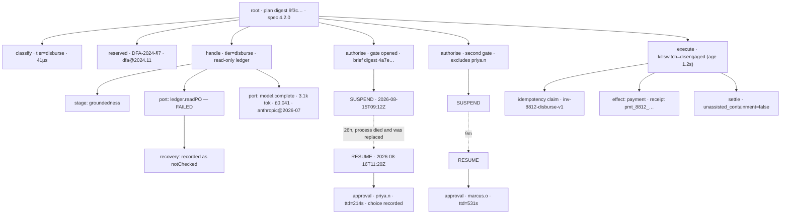

# `approval` — the flexible shape

**Shape:** maximum extensibility. Explicit extension points everywhere.
**Author's position:** this shape is pushed to its honest extreme below. It ends
somewhere uncomfortable, and §6 and §7 say exactly where and who pays.

The organising idea is one sentence: **the spine is fixed and typed; the ribs
are pluggable.**

`classify → handle → authorise → execute` is not an extension point and never
will be — it is four opaque token types, each mintable only by the phase before
it, and no adapter, stage, hook or configuration key can reorder them. Almost
everything *inside* those four phases is a declared extension: the tier ladder
itself, the capability grants attached to each rung, who counts as an authority,
how a brief reaches a human, what an effect physically is, how state is stored,
how payloads version, what happens on resume when the code has changed
underneath a case that has been asleep for nine days.

Sixteen named extension points. Eleven I would build. Five I mark **speculative
— do not build**, per C5, and the fact that removing those five collapses this
design most of the way towards the minimal shape is the single most instructive
thing in this document.

---

## 1. The interface

### 1.0 The vocabulary this module adds

Everything is from `docs/CONTEXT.md` except four terms, each justified:

| New term | Why it is not already in `CONTEXT.md` |
|---|---|
| **Lattice** | The per-application declaration of tier names *and* the capability granted at each. `CONTEXT.md` has **risk tier**; it has no word for the whole ladder-plus-grants object nineteen applications each declare. |
| **Mandate** | Which kind of authority licensed an effect: `delegated`, `human`, `dual`. `CONTEXT.md` distinguishes these in prose ("an authority may be a human, or — at low tiers only — an automated policy"); this is the type that carries the distinction. |
| **Plan** | The compiled, content-addressed form of an `ApprovalSpec`. Needed because a case can suspend for nine days and resume against different code; the plan digest is what makes that detectable. |
| **Stage** | A caller-registered extension that runs *within* one phase. This is the flagship extension point and the one I attack hardest in §7. |

`risk tier` attaches to **a decision-and-its-effect**, not to a case (fork 2 in
the interface review, recommendation taken). Reading an invoice and paying it
are separately classified. A case therefore has a tier profile, and the trace
records a tier per phase-run, not one per case.

### 1.1 Capability, as a type — the load-bearing part

Two brands that are mutually non-assignable. Not a supertype/subtype pair: a
write-capable client is *not* a read-only client with extra methods, because
structural subtyping would then quietly allow it wherever a reader is expected.

```ts
declare const CAPABILITY: unique symbol;

type Read  = { readonly [CAPABILITY]: "read" };
type Write = { readonly [CAPABILITY]: "read-write" };
// Read and Write are assignable in neither direction. This is deliberate.

type Capability = "read" | "read-write";
```

The **Lattice** is a type-level extension point. Each application declares its
own tier names, its own grants, and its own client shapes. The library is
generic over it and ships no tier ladder of its own.

```ts
interface Lattice<
  Tier   extends string                    = string,
  Grant  extends Record<Tier, Capability>  = Record<Tier, Capability>,
  Reader                                   = unknown,
  Writer                                   = unknown,
> {
  readonly tier:   Tier;
  readonly grant:  Grant;
  readonly reader: Reader;
  readonly writer: Writer;
}

type ClientFor<L extends Lattice, T extends L["tier"]> =
  L["grant"][T] extends "read-write" ? L["writer"] & Write
                                     : L["reader"] & Read;
```

An application declares:

```ts
interface InvoiceLattice extends Lattice<
  "extract" | "match" | "disburse",
  { extract: "read-write"; match: "read"; disburse: "read" },
  LedgerReader,
  LedgerWriter
> {}
```

A handler is registered as a **function-typed property**, never a method — this
matters, because TypeScript compares method parameters bivariantly and function
properties contravariantly under `strictFunctionTypes` (which `strict` turns
on). The compile error depends on it:

```ts
type Handler<L extends Lattice, T extends L["tier"], V> = {
  readonly run: (client: ClientFor<L, T>, subject: Subject) => Promise<V> | V;
};

spec.handler("disburse", {
  run: (ledger: LedgerWriter & Write, subject) => decide(ledger, subject),
});
// ^ Type '(client: LedgerWriter & Write, ...) => ...' is not assignable to
//   '(client: LedgerReader & Read, ...) => ...'.
//   Types of parameters are incompatible.
//   Property '[CAPABILITY]' types are incompatible: '"read"' vs '"read-write"'.
```

That is the compile error C-fact 1 demands. Three further facts make it
airtight rather than merely present:

1. **No writer is constructible by application code.** `LedgerWriter & Write`
   has no exported constructor, no factory, no cast helper. The only value of
   that type in the whole program is minted by the kernel inside `execute` and
   handed to an `EffectExecutor`. So there is nothing in scope at handle time
   for a handler to close over — which is the hole a type system alone cannot
   plug.
2. **The grant map is a type, not configuration.** Moving `disburse` to
   `"read-write"` is a source change in the application's own lattice
   declaration, visible in a diff, reviewable, and it re-typechecks every
   handler at that tier. There is no key in a YAML file that does it.
3. **`as any` defeats it.** Stated here rather than hidden: the guarantee is
   only as strong as the repository's ban on assertions at this seam. §7 argues
   this is the design's most likely real-world failure.

### 1.2 The four phase tokens

Opaque, branded, no exported constructors. Each is minted only by the kernel,
only after the previous phase's node has been acknowledged by the recorder.

```ts
declare const PHASE: unique symbol;

type Classification<L extends Lattice> = { readonly [PHASE]: "classified" } & {
  readonly tier:        L["tier"];
  readonly reserved:    ReservedStatus;
  readonly dualControl: boolean;
  readonly draft:       NodeDraft;      // recorded by begin(); see §4.1
  readonly planDigest:  PlanDigest;
};

type Determination<L extends Lattice, T extends L["tier"]> =
  { readonly [PHASE]: "determined" } & {
    readonly tier: T;
    readonly verdict: Verdict;          // may be an Abstention
    readonly node: NodeId;
    readonly proposedEffect: EffectRequest<L, T> | null;
  };

type Mandate = "delegated" | "human" | "dual";

type Authorisation<L extends Lattice, T extends L["tier"], M extends Mandate> =
  { readonly [PHASE]: "authorised" } & {
    readonly mandate: M;
    readonly tier: T;
    readonly effect: EffectRequest<L, T>;   // the effect is *inside* the token
    readonly granted: readonly ApprovalReceipt[];
    readonly node: NodeId;
  };
```

**The effect lives inside the authorisation token.** `execute` therefore takes
one argument. There is no way to authorise effect A and execute effect B,
because there is no second parameter to disagree with the first. This is the
one place where I chose depth over flexibility and I want it noted: the
interface-review sketch was `execute(auth, effect, key)`; three parameters
admits a mismatch that then needs a runtime `AuthorisationEffectMismatch`
error. Collapsing to `execute(auth)` deletes the error mode.

The idempotency key is carried by `EffectRequest`, constructed at the point the
effect is proposed, so it is stable across every retry and every rehydration.

### 1.3 Reserved decisions — a separate seam, expressed in types

```ts
type ReservedStatus =
  | { readonly reserved: true;  readonly rule: RuleId; readonly citation: string;
      readonly policyVersion: PolicyVersion }
  | { readonly reserved: false; readonly basis: string;
      readonly policyVersion: PolicyVersion };
```

There is no `undefined` branch and no boolean. A `ReservedPolicy` that finds no
matching rule must return an **explicit, versioned assertion** that none
matched, and that assertion is recorded as a node. "Nobody thought about it"
and "we checked and it is not reserved" are different facts, and this type
refuses to let them share a representation.

The structural enforcement is in the mandate:

```ts
type MandateFor<R extends ReservedStatus> =
  R extends { reserved: true } ? "human" | "dual" : Mandate;

interface DelegatedAuthority<L extends Lattice> {
  // Note the parameter type. A reserved classification is not assignable here.
  readonly authorise: <T extends L["tier"]>(
    determination: Determination<L, T>,
    classification: Classification<L> & { reserved: { reserved: false } },
  ) => Promise<Authorisation<L, T, "delegated">>;
}
```

Handing a reserved classification to a delegated authority does not typecheck.
No configuration key exists that changes this, because no configuration key is
consulted — the branch is chosen by a type. And `ReservedPolicy` sits on its
own seam, evaluated by the kernel independently of `TierPolicy`, so a team
lowering a risk threshold cannot touch it.

### 1.4 The approval brief — every field non-optional

```ts
interface Brief<L extends Lattice, R extends ReservedStatus> {
  /** 1. The effect in the approver's units. "£47,200 leaves account 8812 today." */
  readonly effect: ConcreteEffect;

  /** 2. What the system concluded, with evidence reachable — refs, not prose. */
  readonly conclusion: {
    readonly verdict: Verdict;
    readonly confidence: Confidence;
    readonly evidence: readonly [EvidenceRef, ...EvidenceRef[]];
  };

  /** 3. What it is unsure about, INCLUDING contrary evidence. */
  readonly uncertainty: {
    readonly statedDoubts: readonly string[];
    readonly contrary:
      | readonly [ContraryFinding, ...ContraryFinding[]]
      | { readonly none: "asserted"; readonly by: PolicyVersion };
  };

  /** 4. What it could not check, and why. Absence of a finding is not a finding. */
  readonly notChecked: readonly NotChecked[];

  /** 5. Whether the decision is reserved, and under which rule. */
  readonly reserved: R;

  /** 6. What happens if the approver does nothing. */
  readonly doNothing: DoNothing<R>;

  /** 7. The correlation identifier. */
  readonly correlationId: CorrelationId;

  /** Anti-rubber-stamping: at least two options, and no field for a default. */
  readonly options: readonly [Option, Option, ...Option[]];
}
```

Four details that are the whole point:

- `contrary` cannot be silently empty. Either at least one finding, or an
  explicit versioned assertion that there is none. An empty array does not
  typecheck. A brief that presents only the supporting case is advocacy.
- `options` is a tuple of length ≥ 2 and **`Option` has no `default`,
  `selected`, `recommended` or `primary` field**. A pre-selected answer is not
  expressible in the type, so no `BriefChannel` adapter can render one from
  library data.
- `DoNothing` narrows on reserved status:

```ts
type DoNothing<R extends ReservedStatus> =
  R extends { reserved: true }
    ? { kind: "hold-indefinitely" }
    | { kind: "escalate"; to: RoleId; after: Duration }
    : { kind: "hold-indefinitely" }
    | { kind: "escalate"; to: RoleId; after: Duration }
    | { kind: "expire"; after: Duration; then: DefaultDisposition };
```

  A reserved decision has no `expire` branch. A timeout cannot fall through to
  a default, because there is no default to fall through to. "Nobody was on
  shift" is not a lawful basis.

- **Dual control's second brief excludes the first's verdict structurally:**

```ts
interface FirstApprovalReceipt {
  readonly authorityId: AuthorityId;
  readonly at: Instant;
  // There is no `choice`. There is no `outcome`. There is no `comment`.
}

type SecondBrief<L extends Lattice, R extends ReservedStatus> =
  Brief<L, R> & { readonly first: FirstApprovalReceipt };
```

  The kernel builds `SecondBrief` from the case, never from the first answer,
  and the receipt type has no field that could carry it. A `BriefChannel`
  adapter cannot display "Jane approved this" because the value is not in its
  argument. Distinctness of the two authorities is checked once, at mint time,
  inside the kernel — the token cannot be forged elsewhere — and violation is
  `DualControlSelfApproval`, fail-closed.

### 1.5 The spec: sixteen extension points

This is the flexible shape's real surface, and it is large. Every field is
required unless annotated. **Nothing has a default that performs I/O**, which
is how C3 is satisfied: a spec that has not been given a store cannot be
constructed, so a test cannot accidentally get a live one.

```ts
interface ApprovalSpec<L extends Lattice> {
  // --- identity & versioning -------------------------------------------
  readonly lattice: LatticeDescriptor<L>;   // runtime mirror of the type
  readonly specVersion: SemVer;

  // --- routing (two seams, deliberately not one) ------------------------
  readonly tierPolicy: TierPolicy<L>;           // pure, sub-ms, no I/O
  readonly reservedPolicy: ReservedPolicy;      // pure, sub-ms, no I/O
  readonly dualControlPolicy: DualControlPolicy<L>;

  // --- the work ---------------------------------------------------------
  readonly handlers: { readonly [T in L["tier"]]: Handler<L, T, Verdict> };
  readonly effects: readonly EffectKind<L, L["tier"]>[];

  // --- humans -----------------------------------------------------------
  readonly authorities: readonly (HumanAuthority<L> | DelegatedAuthority<L>)[];
  readonly channels: readonly BriefChannel<L>[];

  // --- durability -------------------------------------------------------
  readonly caseStore: CaseStore;
  readonly idempotencyStore: IdempotencyStore;
  readonly timer: Timer;
  readonly resumeCompatibility: ResumeCompatibility;

  // --- controls ---------------------------------------------------------
  readonly killSwitch: KillSwitchSource;
  readonly killSwitchStaleness: Duration;   // max age of a cached reading
  readonly failPolicy: { readonly [T in L["tier"]]: "open" | "closed" };  // no default

  // --- recording (C1) ---------------------------------------------------
  readonly recorder: Recorder;              // audit's CaseTrace. Non-optional.
  readonly redactor: Redactor;              // guardrails'. Non-optional.
  readonly clock: Clock;                    // injected. No Date.now(), ever.
  readonly priceTable: PriceTableVersion;
  readonly codecs: CodecRegistry;           // schema versions + upgrade chains

  // --- bounded resources ------------------------------------------------
  readonly limits: {
    readonly executeConcurrency: number;    // in-flight effects per process
    readonly queueDepth: number;            // beyond which: Backpressure
    readonly maxAttempts: number;           // per stage, per effect
    readonly maxNodesPerCase: number;       // beyond which: NodeBudgetExhausted
  };

  // --- the flagship extension point (see §5 for the C5 verdict) ---------
  readonly stages?: {
    readonly classify?: readonly Stage<"classify", L>[];
    readonly handle?:   readonly Stage<"handle", L>[];
    readonly authorise?: readonly Stage<"authorise", L>[];
    readonly execute?:  readonly Stage<"execute", L>[];
  };
}

declare function defineApproval<L extends Lattice>(
  spec: ApprovalSpec<L>,
): Approval<L>;
```

### 1.6 The entry points

```ts
interface Approval<L extends Lattice> {
  /** Pure. Sub-millisecond. No I/O. Runs on every decision. */
  classify(subject: Subject): Classification<L>;

  /** Durable. Runs handle + authorise, then either settles or suspends. */
  begin(c: Classification<L>, input: CaseInput): Promise<Progress<L>>;

  /** Rehydrates a suspended case when an approver answers. Days later. */
  resume(token: ResumeToken, answer: Answer): Promise<Progress<L>>;

  /** Requires a token only `begin`/`resume` can mint. Kill switch checked here. */
  execute<T extends L["tier"], M extends Mandate>(
    auth: Authorisation<L, T, M>,
  ): Promise<EffectOutcome>;

  /** The compiled plan and its digest. Introspection, and the C1 root node. */
  inspect(): Plan;
}

type Progress<L extends Lattice> =
  | { kind: "settled";   outcome: EffectOutcome; unassistedContainment: boolean }
  | { kind: "abstained"; verdict: Abstention }        // a working system, not an error
  | { kind: "escalated"; to: RoleId }                 // a disposition, not an error
  | { kind: "suspended"; resume: ResumeToken; awaiting: PendingApproval;
                         expiresAt: Instant | null }
  | { kind: "refused";   error: ApprovalError };      // named, never thrown
```

Five entry points, and then roughly fifty further names a caller must learn —
sixteen extension-point types, eleven shipped adapters, the lattice machinery,
the brief types, the error taxonomy. **Call it sixty names.** That number is
the honest price of this shape and I return to it in §6.

### 1.7 Invariants

1. Tier is assigned before the handler runs and is never derived from handler
   output.
2. `classify` performs no I/O and allocates one object. It cannot record; see
   §4.1 for the consequence, which I do not hide.
3. A reserved decision's mandate excludes `delegated`, by type.
4. An `Authorisation` exists only if its node was acknowledged by the recorder
   (subject to the tier's fail policy — see §1.9).
5. An effect executes at most once per idempotency key. A repeat returns the
   **original** outcome; it does not re-execute and does not error.
6. The kill switch is read in `execute` and nowhere else. Decisions continue
   while effects stop — that is the point.
7. Time-to-decision is computed by the kernel from `presentedAt` and
   `answeredAt`, both from the injected clock, both recorded, neither
   caller-supplied.
8. Redaction is applied by the kernel before every write. Extensions never
   touch the recorder, so they cannot write unredacted payloads.
9. Sequence numbers come from the store. A caller-assigned sequence is a lie
   under concurrency.
10. Stages run within a phase and cannot mint a phase token.

### 1.8 Ordering constraints

Strictly `classify → handle → authorise → execute`, enforced by token types
rather than by discipline. Concretely: `begin` will not accept anything but a
`Classification`, `execute` will not accept anything but an `Authorisation`, and
neither type has an exported constructor. An effect executing before its
authorisation is unrepresentable because there is no value of the required type.

Within `execute`: idempotency claim → kill switch → effect → settle. The claim
precedes the kill-switch read so that a repeat after an engagement returns the
original outcome rather than being newly refused.

### 1.9 Error modes, each with a policy and a reason

| Error | Policy | Reason |
|---|---|---|
| `Escalated` | disposition, returned | Escalation is not a failure. Authority moved; that is the system working. |
| `Abstained` | disposition, returned | An abstention is a successful outcome of a working system. |
| `Suspended` | disposition, returned | The gate is unbounded. Suspension is the normal path, not an exception. |
| `TraceUnavailable` | **per tier, required config, no default** | At high tier: no trace, no effect. At low tier a caller may degrade. One policy for nineteen callers is wrong for most. Mirrors `audit`. |
| `KillSwitchEngaged` | fail-closed | The switch exists to stop effects. |
| `KillSwitchUnreadable` | fail-closed **past `killSwitchStaleness`** | A cached reading is honoured for its staleness window so a control-plane blip is not an outage; past it, an unreadable switch is treated as engaged. This is a real trade-off and the window is required configuration. |
| `AuthorityUnavailable` | fail-closed, **alertable, never a timeout** | This is the dangerous one. Folded into a timeout it becomes containment-without-resolution — the flattering failure. For a **reserved** decision the case holds indefinitely and never defaults. |
| `DualControlSelfApproval` | fail-closed | Two authorities or none. |
| `IdempotencyReplay` | not an error — returns the original outcome | Repeats are normal under retry. |
| `IdempotencyIndeterminate` | fail-closed, **requires human reconciliation** | The key was claimed and the process died before the outcome was recorded. The money may or may not have moved. Retrying is the wrong answer and so is giving up; only a human can close this. Distinct error, distinct alert. |
| `PlanDigestMismatch` | per `ResumeCompatibility` adapter | A case asleep for nine days resuming against redeployed code. See §5. |
| `LatticeMismatch` | fail-closed | Tier names changed while a case was suspended. Cannot be resumed automatically. |
| `SchemaUnreadable` | fail-closed | No codec registered for a stored payload version. Refusing beats guessing. |
| `StageFailure` | fail-closed by default; per-stage override, bounded attempts | An extension threw. Recorded as a node plus a recovery node. |
| `Backpressure` | fail-closed | Beyond `queueDepth`. Refusing is safer than an unbounded queue in a system that moves money. |
| `NodeBudgetExhausted` | fail-closed | A case producing more than `maxNodesPerCase` nodes is a loop, not a workflow. |
| `AnswerRaced` | not an error — returns the settled outcome | Two approvers answered simultaneously. Conditional update; the loser gets the winner's result. |

Nothing in this table is thrown. `Progress.refused` carries it, so an
exhaustive `switch` is the caller's obligation and the compiler checks it.

### 1.10 Performance characteristics

- `classify`: pure, target < 50 µs, no I/O, no allocation beyond one object. It
  runs on every decision in nineteen applications.
- `begin`: one case-store write, one batched node write per stage, plus the
  handler. Dominated by the handler.
- `execute`: one conditional idempotency claim, one cached kill-switch read
  (network read only past staleness), the effect, one settle. Target p99 under
  40 ms excluding the effect.
- Suspension holds **no** process resource: no timer thread, no open promise,
  no connection. That is the whole reason it is durable rather than awaited.
- Bounded: `executeConcurrency` in flight, `queueDepth` queued, `maxAttempts`
  retries, `maxNodesPerCase` nodes. Every one is required configuration with no
  default, because a default here is nineteen applications inheriting a number
  that suits none of them.

---

## 2. Usage example — invoice approval, end to end

A supplier invoice for £47,200. Extraction is low consequence; matching is
medium; disbursement moves money and, above £25,000, is reserved under the
company's delegated-authority policy and requires dual control.

### 2.1 Declaring the lattice and the spec

```ts
interface InvoiceLattice extends Lattice<
  "extract" | "match" | "disburse",
  { extract: "read-write"; match: "read"; disburse: "read" },
  LedgerReader,
  LedgerWriter
> {}

const approval = defineApproval<InvoiceLattice>({
  lattice: invoiceLatticeDescriptor,
  specVersion: "4.2.0",

  tierPolicy: {
    // Pure. Runs on every decision. No I/O, no model, no lookup.
    classify: (subject) =>
      subject.step === "extract"  ? "extract"
    : subject.step === "match"    ? "match"
    :                               "disburse",
  },

  reservedPolicy: {
    // A separate seam. A tier-threshold change cannot reach this function.
    evaluate: (subject) =>
      subject.step === "disburse" && subject.amountMinor >= 2_500_000
        ? { reserved: true, rule: "DFA-2024-§7", policyVersion: "dfa@2024.11",
            citation: "Delegated Financial Authority policy, section 7" }
        : { reserved: false, basis: "below §7 threshold and not a listed payee",
            policyVersion: "dfa@2024.11" },
  },

  dualControlPolicy: {
    required: (c) => c.tier === "disburse" && c.reserved.reserved,
  },

  handlers: {
    extract:  { run: (ledger /* LedgerWriter & Write */, s) => extractFields(ledger, s) },
    match:    { run: (ledger /* LedgerReader & Read  */, s) => matchToPO(ledger, s) },
    disburse: { run: (ledger /* LedgerReader & Read  */, s) => proposePayment(ledger, s) },
  },

  effects: [paymentEffect],           // see below
  authorities: [financeApprovers, treasuryApprovers, lowTierDelegation],
  channels: [webDashboard, emailApproval],

  caseStore: postgresCaseStore(pool),
  idempotencyStore: postgresIdempotencyStore(pool),
  timer: postgresTimer(pool),
  resumeCompatibility: pinnedToRecordedPlan(planArchive),

  killSwitch: postgresKillSwitch(pool),
  killSwitchStaleness: seconds(5),
  failPolicy: { extract: "open", match: "closed", disburse: "closed" },

  recorder: auditRecorder(trace),     // audit's CaseTrace. Non-optional.
  redactor: guardrailsRedactor({ locale: "en-GB" }),
  clock: systemClock(),
  priceTable: "anthropic@2026-07",
  codecs: invoiceCodecs,

  limits: { executeConcurrency: 16, queueDepth: 128, maxAttempts: 3,
            maxNodesPerCase: 500 },

  stages: {
    handle: [groundednessStage, costCeilingStage],
  },
});
```

The effect kind is where the writer appears — and the only place:

```ts
const paymentEffect: EffectKind<InvoiceLattice, "disburse"> = {
  kind: "payment",
  schema: "invoice.payment", version: 3,
  // The kernel mints the writer. Application code never holds one.
  execute: async (ledger: LedgerWriter & Write, req) => {
    const receipt = await ledger.disburse(req.accountId, req.amountMinor);
    return { receiptId: receipt.id, movedMinor: receipt.amountMinor };
  },
};
```

### 2.2 The happy path, across a redeploy

```ts
// Request 1, on pod A.
const classification = approval.classify(subject);
// { tier: "disburse", reserved: { reserved: true, rule: "DFA-2024-§7", ... },
//   dualControl: true }

const first = await approval.begin(classification, { correlationId, subject });

switch (first.kind) {
  case "suspended":
    // The handler ran with a READ-ONLY ledger and proposed a payment.
    // A brief was built and handed to `webDashboard`. Nothing awaits.
    await queue.remember(correlationId, first.resume);
    return http(202, { status: "awaiting approval", correlationId });
  // ... other branches
}
```

Pod A is redeployed. Twenty-six hours pass. Priya in Finance opens the
dashboard, reads the brief — including the two contrary findings and the note
that the purchase-order line-item match could not be checked because the PO
system was unreachable — and chooses **Approve**. The channel calls back:

```ts
// Request 2, on pod F, running spec 4.2.1. Different process, different code.
const second = await approval.resume(token, {
  authorityId: "priya.n", choice: "approve", presentedAt, answeredAt,
});
// -> { kind: "suspended", awaiting: { role: "treasury", second: true } }
```

Because dual control applies, `resume` did not settle. It minted a
`SecondBrief` **from the case**, carrying `first: { authorityId: "priya.n", at }`
and nothing else. Treasury sees no verdict from Priya, because the type has no
field for one. The channel routes away from `priya.n`, and if it did not, the
mint would refuse with `DualControlSelfApproval`.

Marcus in Treasury approves nine minutes later:

```ts
const third = await approval.resume(token2, {
  authorityId: "marcus.o", choice: "approve", presentedAt, answeredAt,
});
// -> { kind: "settled", outcome: { receiptId: "pmt_8812_...",
//        movedMinor: 4_720_000 }, unassistedContainment: false }
```

`unassistedContainment: false` — correct, and mandatory: for a reserved
decision the correct value is exactly zero. If it had come back `true`, that is
an incident, not a metric movement.

### 2.3 The unhappy paths

**The kill switch is engaged between authorisation and execution.**

```ts
const outcome = await approval.execute(auth);
// -> { kind: "refused", error: { name: "KillSwitchEngaged",
//        engagedBy: "ops.oncall", at, scope: "tier:disburse" } }
```

Note what did *not* happen: the classification, the handler run, both
approvals and the kill-switch reading are all in the trace. The evidence of
what the system would have done during the incident is preserved. That is why
the switch is read at `execute` and not at `classify`. The `Authorisation`
token remains valid; re-calling `execute` after the switch is released
completes under the same idempotency key.

**No treasury approver exists, and the decision is reserved.**

```ts
// -> { kind: "refused", error: { name: "AuthorityUnavailable",
//        role: "treasury", reserved: true, holdsIndefinitely: true } }
```

The case holds. It does not expire — `DoNothing` for a reserved status has no
`expire` branch. It does not fall to a default. It alerts. If this folded into
a generic timeout it would be counted as unassisted containment, which is the
flattering failure the whole vocabulary exists to prevent.

**The process died mid-payment.**

```ts
// -> { kind: "refused", error: { name: "IdempotencyIndeterminate",
//        key: "inv-8812-disburse-v1", claimedAt, reconciliation: "required" } }
```

Retrying might double-pay. Abandoning might not pay. Neither is acceptable, so
neither happens: the key stays claimed, the case stays open, a human
reconciles against the payment provider. The trace records the claim, the gap,
and the reconciliation as three nodes.

**A developer tries to give the disbursement handler a writer.**

```ts
handlers: {
  disburse: { run: (ledger: LedgerWriter & Write, s) => payNow(ledger, s) },
}
// error TS2322 at build time. Never reaches CI's test stage, never reaches review.
```

---

## 3. What the implementation hides behind the seam

- **Durable suspension and rehydration.** Serialising the case, storing the
  pending gate, reconstituting a `Progress` in a different process on a
  different pod from a `ResumeToken`, and doing it without a continuation
  capture — possible only because ADR 0001 says the decision points are known
  in advance, so the resumable state is *a named step in a declared plan plus a
  versioned payload*, not a stack.
- **The node graph.** Node identity, parentage, store-assigned ordering,
  timing, cost, tokens, price-table version, and the batching that keeps a
  five-to-fifty-node case from becoming fifty round trips.
- **Byte-stable canonical serialisation.** Sorted keys, no floating point
  anywhere near money, integers as decimal strings, RFC 8785-style
  canonicalisation. This is the hardest and least visible thing in the module.
  Nineteen applications would each get it subtly wrong and discover it months
  later as replay diffs that are pure noise.
- **Schema evolution over seven years.** Every payload carries
  `{ schema, version }`; the codec registry holds upgrade functions chained
  1→2→3; upgrades are append-only and a version's meaning never changes. A
  payload written today is read in 2033 by walking the chain. No codec for a
  version is `SchemaUnreadable`, refused rather than guessed.
- **Concurrency.** Conditional writes on case state with a version column;
  store-assigned sequence numbers, monotonic and gapless within a correlation
  ID; the answer race resolved by the store so the loser gets the winner's
  outcome rather than an error.
- **Idempotency, including the indeterminate window.** Claim-before-effect,
  settle-after, and the three-state key (`claimed` / `settled` / `abandoned`)
  that makes the dangerous middle state visible rather than invisible.
- **Redaction before write, everywhere.** The brief delivered to Priya contains
  an account number; the brief recorded in the trace contains a digest and a
  redacted projection. Two different objects from one construction, and the
  caller does not choose which goes where.
- **Kill-switch caching with a staleness bound**, so a control-plane read is
  not on the hot path of every effect but a stale reading cannot outlive its
  window.
- **Bounded execution.** The semaphore, the queue, the retry budget with
  jittered backoff, the node budget.
- **Time-to-decision arithmetic** from an injected clock on both ends.

---

## 4. How C1 is satisfied

### 4.1 The graph

Every phase run, every stage invocation, every port call, every approval
interaction, every suspension and resumption, every error and every recovery is
a node. Nodes carry parent, store-assigned sequence, kind, extension identity
and version, start and end instants, cost, tokens, price-table version, payload
reference with schema version, and outcome.



The suspension and the resumption are both nodes, and the trace therefore spans
the twenty-six-hour gap explicitly rather than by inference from timestamps.

### 4.2 How an unrecorded execution is made unrepresentable

Six mechanisms, in decreasing order of strength.

1. **`Approval<L>` cannot exist without a recorder.** `recorder` is a required,
   non-optional field of `ApprovalSpec` with no default. There is no
   `Approval` constructor other than `defineApproval`. No no-op recorder is
   exported — the in-memory adapter is a real, queryable store, not a null
   object, so "record to nowhere" is not a value anyone can pass.

2. **Phase tokens are minted only after the node is acknowledged.** The kernel
   writes the node, waits for the store-assigned sequence, and only then
   constructs the token that the next phase requires. At `failPolicy: "closed"`
   tiers a failed write means no token, and therefore no possible next phase.
   The ordering constraint and the recording constraint are the *same*
   mechanism: you cannot have one without the other.

3. **Extensions never receive the recorder.** No `Stage`, `TierPolicy`,
   `Authority`, `BriefChannel` or `EffectKind` is given a recorder handle. They
   return values; the kernel wraps every invocation in a node. An extension can
   neither record nor skip recording, because recording is not among the things
   it can do. This is the difference between recording being a cross-cutting
   afterthought and recording being the calling convention.

4. **Extensions cannot construct their own dependencies.** Every port an
   extension may use is declared in its type and resolved by the kernel's
   provisioner, which hands out **instrumented** proxies. A model call, a
   ledger read, an HTTP call through a provisioned port becomes a child node
   automatically, with cost, tokens and price-table version attached. Combined
   with C3 (no module constructs its own client) and C4 (dependency-cruiser
   enforces that `lib/` is unreachable from outside), the only way an extension
   performs unrecorded I/O is by importing a network client directly — which is
   a lint failure, not a type error, and I say so plainly in point 6.

5. **The writer is minted inside `execute`, per effect.** There is no
   write-capable client anywhere in the program outside the kernel's call to an
   `EffectExecutor`. An unrecorded effect would require a writer that does not
   exist to be held by code that never receives one.

6. **What is *not* structurally prevented**, stated rather than narrowed:

   - **An extension importing `node:https` and calling out directly.** Types
     cannot see this. `dependency-cruiser` can, and should have a rule
     forbidding network modules under any `approval` extension. That is lint,
     not type, and lint is weaker. Named as a residual hole.
   - **A caller writing to its own database without going through `execute`.**
     The library governs the effects it is given. An application that pays an
     invoice from its own code has left the module's jurisdiction entirely. No
     interface can prevent this; the mitigation is that the write-capable ledger
     client is only obtainable from within the module.
   - **`classify` records nothing.** This is the deliberate narrowing, and it
     follows from C-fact 8: `classify` is pure, sub-millisecond and runs on
     every decision, so it cannot perform I/O. It returns a `NodeDraft` that
     `begin` writes as the first child of the root. A classification that is
     never passed to `begin` is therefore never recorded. My defence is that
     such a classification produced no decision, no verdict and no effect —
     there is no execution graph for it to be missing from. My concession is
     that the brief says "each tier classification" is a node, and a caller who
     classifies a thousand subjects and begins ten has, on a strict reading,
     lost 990 nodes. For callers who want them, `classifyRecorded()` is an
     async variant that writes the draft immediately and costs a round trip.
     I offer both and let the caller pay for what they want, which is exactly
     what this shape does everywhere, for better and worse.
   - **A stage that does substantial internal work reports one node** unless it
     returns child drafts. `StageResult.children: readonly NodeDraft[]` exists
     for this, and the kernel stamps them with identity, parentage and
     ordering. But nothing forces a stage author to populate it. **This is the
     flexible shape's specific weakness on C1**, and it is caused directly by
     the extension point that makes the shape what it is: every seam I open is
     a place where node granularity becomes the extension author's judgement
     instead of the kernel's guarantee.

### 4.3 Replay

`replay(correlationId)` reproduces the graph, not the answer: nodes in
store-assigned order with parentage, each payload decoded through the codec
chain to its current shape while retaining its written version. The root node
carries the `planDigest`, so a replay states which declared plan produced this
case — and a replay against a different plan says so instead of pretending.

---

## 5. Seams and adapters — C5 applied to my own design

Sixteen extension points. I name the second adapter or I mark it speculative.
Five fail.

### Real seams — build these

| Seam | Adapter 1 | Adapter 2 |
|---|---|---|
| **`TierPolicy`** | invoice tiering | claims tiering. Nineteen real adapters; the most obviously real seam in the project. |
| **`ReservedPolicy`** | invoice DFA §7 | claims statutory-review list. Nineteen real adapters, and kept off `TierPolicy` on purpose: merged, a risk-threshold change could delete a legal obligation. |
| **`CaseStore`** | Postgres | in-memory. The in-memory adapter is a shipped deliverable, not a mock — it is what makes hermetic testing structural rather than conventional (C3). |
| **`IdempotencyStore`** | Postgres | in-memory. Same argument. |
| **`Recorder`** | `audit`'s Postgres `CaseTrace` | `audit`'s in-memory trace. Same argument, and the seam is where C1's injection requirement lands. |
| **`HumanAuthority` / `DelegatedAuthority`** | human via a task queue | delegated automated policy at low tier, recorded with a named delegation. Real, and the two adapters have *different types*, which is what enforces the reserved constraint. |
| **`BriefChannel`** | web dashboard | email/chat approval with the same required fields inline. Real — and the reason the brief is data rather than a screen. |
| **`EffectKind`** | payment via the ledger | write to the system of record. Real several times over inside each of the nineteen. |
| **`Clock`** | system clock | fixed test clock. Real: the second adapter is a shipped deliverable and is how time-to-decision gets tested at all. |
| **`Timer`** | Postgres timer table, polled | in-memory test timer. Real, for the same reason. |
| **`ResumeCompatibility`** | `strict` — refuse a `PlanDigestMismatch`, require an operator-run migration | `pinnedToRecordedPlan` — resume under the plan version recorded at suspend, from a plan archive. Both are genuinely wanted: a claims application will take `strict`, an invoice application redeploying six times a day will take `pinned`. Real, and it is the seam nobody would have thought of before week six. |

### Speculative — do not build

| Extension point | Why it fails C5 |
|---|---|
| **`Stage` on `classify`** | I cannot name a second adapter. `classify` is pure and sub-millisecond; anything worth extending there is `TierPolicy`, which is already a seam. **Do not build.** |
| **`Stage` on `execute`** | The only candidates I can name are logging (the kernel already records) and retry (already a bounded kernel policy). No second adapter. **Do not build.** |
| **`CodecRegistry` as a pluggable codec seam** | Adapter 1 is canonical JSON. I cannot name adapter 2. Protobuf is imaginable and nobody has asked. Keep the **version registry and upgrade chains** — that is required data — and delete the codec seam. **Do not build.** |
| **`KeyDeriver` for idempotency** | Tempting and wrong. Two applications deriving keys differently is how one of them double-pays. The key is a required explicit field on `EffectRequest`. **Do not build.** |
| **`Scheduler` / concurrency strategy** | Adapter 1 is a bounded local semaphore. Adapter 2 would be a distributed limiter nobody has asked for. Hardcode the semaphore and take the bound as configuration. **Do not build.** |

Two more that survive only by being demoted:

- **`Redactor`** — one adapter, `guardrails`. It is not a seam; it is a
  required dependency. Declaring it a seam would be speculative. Demoted to a
  port with exactly one implementation, and I say so.
- **`Stage` on `handle` and `authorise`** — this is the flagship, and it barely
  passes. On `handle` I can name two: a guardrails output-check stage, and a
  cost-ceiling stage that aborts a case whose accumulated spend crosses a
  threshold. On `authorise` I can name two: a stage that attaches a
  sanctions-list finding to the brief, and a stage that attaches a payee-history
  summary. Both pairs are plausible. Neither pair has been asked for by name by
  any of the nineteen. **I am building them and I am uneasy about it**, and §7
  is where I say what that unease is worth.

**Count: eleven real, five speculative-do-not-build, one demoted.** Delete the
five, demote the one, and shrink the stage chain from four phases to two, and
this design has moved perhaps 60% of the way towards the minimal shape. That
migration is the most useful finding in this document.

---

## 6. Trade-offs

### Where the leverage is genuinely high

- **The lattice.** Nineteen applications get a compile-time capability
  constraint over *their own* tier names and *their own* client types. The
  minimal shape must either impose `low | medium | high` on all nineteen — and
  claims triage does not have three tiers, it has five — or give up the
  compile-time guarantee. This design gives both. It is the one place where the
  flexibility buys something the other shapes cannot buy at any price.
- **`ResumeCompatibility`.** Two real adapters for a problem that only appears
  in week six, when the first suspended case meets the first redeploy. A shape
  without this seam discovers it as an incident.
- **Separate `TierPolicy` and `ReservedPolicy` seams.** Two seams where
  instinct says one. The instinct is wrong, and the flexible shape's bias
  towards more seams happens to get this right.
- **`EffectKind` as an extension point.** The writer is minted per effect kind,
  inside `execute`. This is what makes "no write-capable client exists in
  application scope" true rather than aspirational.

### Where it is thin, and who pays

- **Sixty names.** A caller must learn roughly sixty exported names to use this
  module correctly, against maybe eight in the minimal shape. Depth is leverage
  per unit of interface learned; by the project's own definition this module is
  **shallow**, and it is shallow in a library whose stated purpose is that
  shallow interfaces poison nineteen callers at once. **Who pays:** every
  application team, on day one, forever, and every new joiner on all nineteen.
- **The lattice's error messages.** When `L["grant"][T]` is misdeclared,
  TypeScript reports a conditional-type mismatch three levels deep. The message
  is accurate and unreadable. **Who pays:** the engineer on their first day in
  application four, at 5pm, who reaches for `as any` — and destroys the single
  guarantee this module exists to provide. This is not a hypothetical; it is
  the predictable behaviour of a tired person facing an incomprehensible
  compiler error.
- **The stage chain is where the guarantees leak.** Nothing in `Stage<"handle">`
  stops a stage from taking 40 seconds, from calling out over an unprovisioned
  client, or from reporting one node for substantial work. Every guarantee in
  §4 is a kernel guarantee; stages are the part the kernel does not author.
  **Who pays:** the auditor, three years from now, reading a trace where one
  node named `stage:vendor-risk-check` covers eleven seconds and four model
  calls, and being unable to see inside it.
- **Configuration surface as an attack surface on the vocabulary.**
  `failPolicy` per tier, `killSwitchStaleness`, `limits.*`, `dualControlPolicy`,
  `resumeCompatibility` — five knobs, all required, all no-default. Required
  and no-default is the right call (a default here is nineteen teams
  inheriting a number that suits none), but it means nineteen teams each make
  five decisions they are not equipped to make on day one. **Who pays:** the
  application that sets `failPolicy.disburse = "open"` because CI was red and
  it unblocked them.
- **`classifyRecorded` versus `classify`.** Offering both is this shape's
  reflex, and it is a small failure: two ways to do one thing means nineteen
  teams split, and a cross-application audit query now has two shapes to
  handle. **Who pays:** whoever writes the shared compliance tooling.
- **Testing cost.** Eleven real seams means eleven in-memory adapters to ship
  and maintain, and a spec object with twenty-odd required fields in every
  test. A test-spec builder will appear, and it will grow defaults, and those
  defaults will diverge from production configuration. **Who pays:** the
  maintainer chasing a bug that only reproduces in production because the test
  builder defaulted `failPolicy` to `"closed"` everywhere.

### What this shape makes hard

- **Explaining the module to an auditor.** "The high tier cannot write" is one
  sentence. "The capability granted at each rung of the application's declared
  lattice is a type-level mapping, and the handler's parameter type is derived
  from it contravariantly" is not a sentence an auditor accepts. The minimal
  shape wins this comparison outright and it is not a small thing in these
  industries.
- **Changing anything later.** Sixteen extension points are sixteen published
  contracts. Version 2 of `Stage` breaks every application that wrote one. The
  flexible shape's promise is that it accommodates unimagined futures; its
  actual behaviour is that it *freezes* today's guesses about them into
  published types.
- **Keeping the deletion test honest.** Delete this module and a great deal
  reappears nineteen times — but a meaningful fraction of what reappears is
  *machinery this design introduced*, not machinery the problem requires.

---

## 7. The strongest argument against this design

**This is not a deep module. It is a framework, and this repository's entire
thesis is that a framework is the wrong thing to give nineteen applications.**

The project's definition of depth is leverage per unit of interface learned.
This design maximises the numerator and then destroys the ratio by inflating
the denominator to sixty names. A team adopting it does not learn an interface;
they learn a programming model. And the specific pathology of frameworks is
that the learning cost is paid nineteen times while the flexibility is used
about twice — one application will want a fifth tier, one will want a chat
approval channel, and the other seventeen will pass through the same four
adapters and pay full price for the generality.

Three sharper edges on the same blade:

**One. The C5 self-audit is a verdict, not a caveat.** Five of sixteen
extension points are speculative by the project's own rule, and speculative
seams are named in `CLAUDE.md` as a stated failure of this project. Once I
delete them and demote `Redactor`, ten of the remaining eleven are seams the
minimal shape needs anyway — `TierPolicy`, `ReservedPolicy`, `CaseStore`,
`IdempotencyStore`, `Recorder`, `Authority`, `BriefChannel`, `EffectKind`,
`Clock`, `Timer`. The genuinely new contributions of this shape reduce to two:
the type-level lattice, and `ResumeCompatibility`. **Two ideas do not justify a
framework.** The honest recommendation from inside the flexible design is:
build the minimal shape, and graft on those two.

**Two. The lattice is a loaded weapon pointed at the guarantee it protects.**
The compile-time capability constraint is described in the interface review as
the highest-leverage requirement in the whole library. This design makes it
per-application and generic — and in doing so makes it a conditional type whose
failure mode is an error message nobody can read. Every unreadable type error
is a small pressure towards `as any`, and one `as any` at this seam is a
write-capable client in a disbursement handler in a system that moves money.
A fixed three-tier ladder with hand-written, hand-named types (`HighTierHandler`
takes `ReadOnlyLedger`, full stop) produces error messages a tired person
understands at 5pm, and a guarantee people understand is worth more than a
guarantee people bypass. **The flexible version of the most important
constraint in the library may be strictly worse than the rigid one.**

**Three. The stage chain undermines C1, which the brief names as the strongest
constraint.** Everything good in §4 comes from the kernel owning the calling
convention. The stage chain hands part of that convention to extension authors
in nineteen applications, and node granularity inside a stage becomes their
judgement. A trace whose nodes are coarse in some applications and fine in
others is not a shared compliance story — it is nineteen compliance stories
that happen to use the same table. The design that best serves C1 is the one
with the *fewest* places a caller can author behaviour, and by construction
that is not this one.

**The counter-argument I would make in reply**, so this is an examination and
not a confession: nineteen applications with genuinely different tier ladders
is a fact about the world, not a preference, and a library that imposes
`low | medium | high` will be quietly worked around — by splitting cases to get
the routing teams want, which fragments the trace and damages C1 far more than
a coarse stage node ever could. If that fragmentation is the realistic
alternative, the lattice earns its cost.

But the honest reckoning is that this argument justifies **one** extension
point, not sixteen. That is what the flexible shape looks like when pushed to
its extreme and then examined: a genuinely valuable idea, wrapped in fifteen
that should be deleted.
