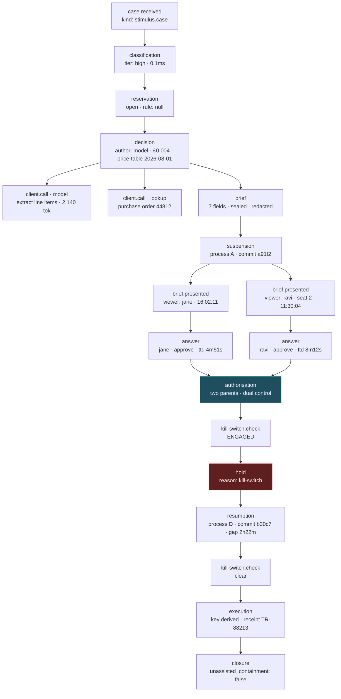

# `approval` — the minimal shape

**Shape:** minimal. Three entry points, no more. Everything that could be
derived, defaulted, inferred or hidden is.

**Thesis in one sentence:** the caller declares a *decision point* once and
thereafter only ever hands the module a *stimulus*; the module owns the whole
path from classification to effect, so there is no place in a caller's code
where an unrecorded step could be written.

The single design move that makes this shape work is a separation the interface
review left implicit:

> **Capability is compile-time and static per decision point. Tier is runtime
> and dynamic per case.**

A decision point declares a **ceiling** — the highest tier any case reaching it
may be classified at — and its handler is typed against the strictest
capability that ceiling permits. This is what lets the type system enforce
interface fact 1 at all, because a tier computed per case can never be a
compile-time fact.

---

## 1. The interface

### 1.0 The whole surface

```ts
// packages/agent-ops-core/src/approval/index.ts

export function createApproval(deps: ApprovalDeps): Approval;

export interface Approval {
  /** Declared once, at process start. Where the capability constraint lives. */
  define<T extends Tier>(spec: DecisionPointSpec<T>): DecisionPoint<T>;

  /** The only runtime verb. Drives, suspends, resumes, presents and sweeps. */
  advance(stimulus: Stimulus): Promise<Progress>;
}
```

Three entry points. There is no `classify`, no `register`, no `authorise`, no
`execute`, no `resume`, no `expire`, no `getBrief`, no `engageKillSwitch`.
Every one of those exists in the implementation; none of them is interface.

Where a fourth verb pushed to exist, it became a variant of `Stimulus` rather
than a method. Four such variants exist. That is the price of this shape and
§6 pays it in full.

### 1.1 Identity, time, capability

```ts
export type CorrelationId   = string & { readonly __k: "CorrelationId" };
export type DecisionPointId = string & { readonly __k: "DecisionPointId" };
export type AuthorityId     = string & { readonly __k: "AuthorityId" };
export type Instant         = number & { readonly __k: "Instant" }; // epoch ms

export interface Clock { now(): Instant }   // injected. Never Date.now().

export type Tier        = "low" | "medium" | "high";
export type Reservation = "open" | "reserved";
```

The capability brand. `writes` is declared but **not exported**, so no code
outside `lib/` can name the key and therefore no code outside `lib/` can
construct a `WriteCapableClient`:

```ts
declare const writes: unique symbol;               // not exported

export interface ReadOnlyClient {
  readonly [writes]?: never;
  model(call: ModelCall): Promise<ModelResult>;    // recorded as a child node
  lookup(q: Lookup):      Promise<LookupResult>;   // recorded as a child node
}

export interface WriteCapableClient extends ReadOnlyClient {
  readonly [writes]: true;
  commit(w: EffectDescriptor, a: Authorisation): Promise<Receipt>;
}
```

`WriteCapableClient.commit` takes an `Authorisation` positionally. There is no
overload without it. The application never holds one of these at all — see
§1.4.

### 1.2 The two mapped types

**`ClientFor<T>` — the required compile error.**

```ts
export type ClientFor<T extends Tier> =
    T extends "high"   ? ReadOnlyClient
  : T extends "medium" ? ReadOnlyClient
  : T extends "low"    ? ReadOnlyClient
  : never;
```

All three arms are `ReadOnlyClient`. **This is deliberate and it is a
departure from the interface review's sketch, which made the low arm
write-capable.** I rejected the write-capable low arm:

- Fact 4 says `classify → handle → authorise → execute`, strictly. A low-tier
  handler holding a write client executes an effect *during* `handle`, before
  any authorisation exists. Recovering the ordering requires pre-authorising
  from the classification, which is a second path through the module — and a
  second path is where nineteen applications each find a different way to be
  wrong.
- CONTEXT.md permits automated approval at low tier. It does not require the
  effect to happen inside the handler. A delegated authority can authorise in
  microseconds; the effect still goes through the one gate.

The mapped type is retained rather than collapsed to `ReadOnlyClient` because
it is the **forcing function**: adding a fourth tier will not compile until
someone answers the capability question for it explicitly. A type test in
`tests/` asserts `ClientFor<Tier> extends ReadOnlyClient`.

The consequence is that the constraint is now *total* rather than
high-tier-only:

```ts
// ❌ does not compile, at any tier
gate.define({
  ceiling: "high",
  decide: (c: WriteCapableClient, s: Invoice) => screen(c, s),
//        ~~~~~~~~~~~~~~~~~~~~~~
// Type '(c: WriteCapableClient, s: Invoice) => Promise<Verdict>' is not
// assignable to type '(c: ReadOnlyClient, s: Invoice) => Promise<Verdict>'.
//   Types of parameters 'c' and 'c' are incompatible.
//     Property '[writes]' is missing in type 'ReadOnlyClient'.
  ...
});
```

This relies on two things and both are already project policy: `decide` is a
**property with a function type**, not a method shorthand (method shorthand is
bivariant even under `strict`), and `strictFunctionTypes` is on.

**`AuthorityFor<T, R>` — the mapped type that does the real work.**

```ts
export interface Authority<R extends Reservation> {
  readonly id: AuthorityId;
  request(brief: SealedBrief<R>): Promise<Ticket>;
}

export type HumanAuthority = Authority<Reservation>;   // accepts both
export type DelegatedPolicy = Authority<"open">;       // accepts open only

export type AuthorityFor<T extends Tier, R extends Reservation> =
    R extends "reserved" ? HumanAuthority
  : T extends "high"     ? readonly [HumanAuthority, HumanAuthority]
  : T extends "medium"   ? HumanAuthority
  :                        Authority<"open">;
```

Read the arm order. `R extends "reserved"` is tested **first**, so no value of
`T` reaches the delegated arm when the decision is reserved. A team that
re-tiers a £50 reserved decision from `medium` down to `low` chasing throughput
changes nothing about who may authorise it. *A risk-threshold change cannot
delete a legal obligation*, expressed as a conditional type rather than a
paragraph in a policy document.

`DelegatedPolicy` is `Authority<"open">` and `SealedBrief<R>` is invariant in
`R`, so wiring an automated policy into a reserved slot is a compile error. And
there is no configuration key to try instead: `ApprovalDeps` has an
`authorities` field typed as a directory, not a `mode` or an `automatic` flag.

High tier is `readonly [HumanAuthority, HumanAuthority]` — a two-tuple. Dual
control is not a boolean somebody sets; you cannot satisfy the type with one
authority.

### 1.3 Declaring a decision point

```ts
export interface DecisionPointSpec<T extends Tier> {
  /** Stable across deploys. Continuations resolve by this. Never reused. */
  readonly id: DecisionPointId;

  /** The highest tier any case may classify at here. Types `decide`. */
  readonly ceiling: T;

  /** SYNC. Pure. Sub-millisecond. Cannot see a verdict, cannot see confidence. */
  readonly classify: (s: Subject) => TierAtOrBelow<T>;

  /** SYNC. Pure. Separate seam from `classify` — deliberately not merged. */
  readonly reserve: (s: Subject) => ReservationAssignment;

  /** Async. Receives a node-instrumented read-only client. Returns a verdict. */
  readonly decide: (c: ClientFor<T>, s: Subject) => Promise<VerdictFor<T>>;

  /** Pure. DESCRIBES the effect in the approver's units. Never performs it. */
  readonly effect: (v: Determination, s: Subject) => EffectDescriptor;

  /** What the approver must be told about doing nothing. Non-optional. */
  readonly doNothing: (s: Subject) => DoNothingConsequence;

  /** Payload schema version for this point's nodes. Additive-only within a kind. */
  readonly payloadVersion: `v${number}`;
}

export type TierAtOrBelow<T extends Tier> =
    T extends "high" ? Tier : T extends "medium" ? "low" | "medium" : "low";

export type ReservationAssignment =
  | { readonly reservation: "open" }
  | { readonly reservation: "reserved"; readonly rule: StatuteRef }; // rule required

export type VerdictFor<T extends Tier> = Determination | Abstention;

export interface Determination {
  readonly kind: "determination";
  readonly conclusion: Conclusion;
  readonly confidence: Confidence;
  readonly evidence:   readonly EvidenceRef[];   // reachable, not summarised
  readonly contrary:   readonly EvidenceRef[];   // required, may be empty ARRAY
  readonly unchecked:  readonly UncheckedRef[];  // what it could not check, and why
}

export interface Abstention {
  readonly kind: "abstention";
  readonly because: "evidence-missing" | "out-of-scope" | "guardrail"
                  | "below-tier-floor";
  readonly detail: string;
}
```

Three facts are load-bearing and all three are structural:

1. **`classify` and `reserve` return synchronously.** Not `Promise`. You cannot
   `await` inside a synchronous function, so no network or database call can
   hide in a tier policy. (Honest limit: `readFileSync` is still reachable. A
   dependency-cruiser rule forbids `fs`, `http` and `pg` imports from any module
   reachable from a policy function; that is the belt for this brace.)
2. **Neither `classify` nor `reserve` receives a verdict.** Their parameter is
   `Subject`. "The model was 99.8% sure" is not a lawful basis for skipping a
   reserved decision, and here it is not even an expressible one — confidence is
   not in scope.
3. **`contrary` and `unchecked` are non-optional arrays.** A handler that has
   no contrary evidence must write `contrary: []` and that emptiness is
   recorded. "A brief that presents only the supporting case is advocacy, not a
   brief" — the type will not let a determination be constructed without the
   author confronting the field.

`define` returns a `DecisionPoint<T>` which is an **opaque handle** — it has no
methods. Its only use is as a field of a `Stimulus`. It exists so a typo in a
decision point name is a compile error rather than a runtime miss.

### 1.4 The only runtime verb

```ts
export type Stimulus =
  | { readonly kind: "case";
      readonly correlationId: CorrelationId;
      readonly point: DecisionPoint<Tier>;
      readonly subject: Subject }

  | { readonly kind: "present";
      readonly ticket: Ticket;
      readonly viewer: AuthorityId }

  | { readonly kind: "answer";
      readonly presentation: Presentation;   // minted by "present". Carries presentedAt.
      readonly answer: ApproverAnswer }

  | { readonly kind: "due";
      readonly limit?: number };             // sweeper. Bounded. Default 200.

export type Progress =
  | { readonly state: "settled";   readonly settlement: Settlement; readonly head: NodeRef }
  | { readonly state: "awaiting";  readonly ticket: Ticket; readonly dueAt: Instant;
      readonly consequence: DoNothingConsequence;                   readonly head: NodeRef }
  | { readonly state: "presented"; readonly presentation: Presentation;
      readonly brief: Brief<Reservation, Seat>;                     readonly head: NodeRef }
  | { readonly state: "held";      readonly reason: HoldReason;
      readonly alert: true;                                         readonly head: NodeRef }
  | { readonly state: "swept";     readonly advanced: number; readonly remaining: number };

export type Settlement =
  | { readonly kind: "executed";  readonly receipt: Receipt }
  | { readonly kind: "replayed";  readonly receipt: Receipt }   // idempotent repeat
  | { readonly kind: "abstained"; readonly abstention: Abstention }
  | { readonly kind: "rejected";  readonly by: AuthorityId; readonly reason: string }
  | { readonly kind: "expired" }                               // do-nothing consequence fired
  | { readonly kind: "escalated"; readonly to: AuthorityId };  // disposition, not an error

export type HoldReason =
  | "kill-switch" | "authority-unavailable" | "continuation-unresolvable"
  | "effect-indeterminate" | "redaction-failed" | "trace-unavailable";
```

`advance` is re-entrant on a correlation ID and takes a lease. Calling it twice
concurrently for one case is safe: the loser records a `contention` node and
re-reads.

**Every stimulus writes at least one node before anything else happens.**
`present` looks like a read; it is not, because serving a brief to a named
authority is an approval interaction and C1 requires it recorded. That is why
the verb is honestly called `advance` even for the presentation case.

### 1.5 The brief, and the two seats

```ts
export type Seat = "first" | "second";

export interface Brief<R extends Reservation, S extends Seat> {
  readonly correlationId: CorrelationId;                    // (7) trace one step away
  readonly effect: EffectDescriptor;                        // (1) "£47,200 leaves 8812 today"
  readonly concluded: Conclusion;                           // (2) what the system concluded
  readonly evidence: readonly ResolvableEvidence[];         // (2) reachable, not summarised
  readonly contrary: readonly ResolvableEvidence[];         // (3) required
  readonly unsure: readonly Uncertainty[];                  // (3) required
  readonly unchecked: readonly UncheckedRef[];              // (4) required
  readonly reserved: R extends "reserved"
    ? { readonly rule: StatuteRef } : { readonly rule: null }; // (5) required either way
  readonly doNothing: DoNothingConsequence;                 // (6) required
  readonly seat: S;
  readonly priorAnswer: S extends "second" ? AnswerReceipt : null;
}

/** What the second seat is allowed to know about the first. Note what is absent. */
export interface AnswerReceipt {
  readonly by: AuthorityId;
  readonly at: Instant;
  readonly node: NodeRef;
  // there is no `outcome` field, and no way to add one from outside lib/
}
```

`Brief<R, "second">` cannot carry the first approver's verdict, because
`AnswerReceipt` has no field for it. Dual control is two judgements or it is
one judgement with an echo, and the difference is a missing property rather
than a rule for whoever builds the screen.

Distinctness is structural rather than checked: the second request is issued
against a directory already narrowed by the first authority's identity —

```ts
// inside lib/, not exported
function secondSeat(dir: AuthorityDirectory, first: AuthorityId)
  : AuthorityDirectory /* provably excludes `first` */;
```

— so the first approver never receives the second request. `DualControlSelfApproval`
survives as a runtime backstop for a directory that lies about identity, not as
the primary mechanism.

### 1.6 The answer, and anti-rubber-stamping

```ts
export interface Presentation {           // minted only by advance({kind:"present"})
  readonly ticket: Ticket;
  readonly viewer: AuthorityId;
  readonly presentedAt: Instant;          // from the injected clock, not the app's
  readonly node: NodeRef;
}

export type BriefFieldRef =
  | "effect" | "concluded" | "evidence" | "contrary" | "unsure"
  | "unchecked" | "reserved" | "doNothing";

/** Both arms carry the same weight. Approving is not the low-effort path. */
export type ApproverAnswer =
  | { readonly kind: "approve";
      readonly justification: NonEmpty<string>;
      readonly acknowledged: Acknowledged }
  | { readonly kind: "reject";
      readonly justification: NonEmpty<string>;
      readonly acknowledged: Acknowledged }
  | { readonly kind: "abstain";
      readonly justification: NonEmpty<string>;
      readonly acknowledged: Acknowledged };

/** Must include contrary evidence and the do-nothing consequence, in that order. */
export type Acknowledged = readonly ["contrary", "doNothing", ...BriefFieldRef[]];
```

There is no default arm. `ApproverAnswer` is a union with three equally
expensive members: each requires a non-empty justification and each requires
the approver's screen to have surfaced the contrary evidence and the cost of
waiting. `Acknowledged` is a tuple type with two fixed leading members, so an
answer that skips them does not typecheck.

Time-to-decision is `clock.now() - presentation.presentedAt`, computed inside
the module from a token the module minted. An application cannot omit it,
cannot round it, and cannot supply its own timestamp for it. The library
records the number and **sets no threshold**: a £200 expense and a £2M
disbursement do not share a plausible reading time and only the application
knows which it is holding.

### 1.7 Required configuration

`createApproval` has no defaults for anything that could be wrong in a
regulated setting.

```ts
export interface ApprovalDeps {
  readonly clock: Clock;
  readonly recorder: Recorder;              // audit's CaseTrace opener. Injected.
  readonly store: CaseStore;                // suspension + idempotency + kill switch
  readonly redactor: Redactor;              // from guardrails. Seals payloads.
  readonly authorities: AuthorityDirectory;
  readonly renderer: BriefRenderer;
  readonly channel: EffectChannel;          // performs effects; wrapped into the write client
  readonly prices: PriceTable;              // carries its own version; recorded per node
  readonly limits: Limits;
}

export interface Limits {
  readonly maxInFlight: number;             // global outbound semaphore. No default.
  readonly retry: { attempts: number; totalMs: number };  // bounded. No default.
  readonly sweepBatch: number;              // default 200, hard cap 500
  readonly maxPendingPerAuthority: number;  // backpressure. No default.
  readonly payloadBytes: number;            // per-node payload cap. No default.
}
```

The reserved-decision list is **not** here. It lives on each
`DecisionPointSpec.reserve`, per decision point, because a global list is a
configuration file and configuration files get edited at 4pm on a Friday. An
application with no reserved decisions writes `reserve: () => ({ reservation:
"open" })` at every point, which is visible in code review and greppable in
nineteen repositories.

### 1.8 Error modes, with policy and reason

| Name | Class | Policy | Reason |
|---|---|---|---|
| `Escalated` | disposition, returned | — | Escalation is the system working. It is a `Settlement`, never a throw. |
| `Abstained` | disposition, returned | — | Abstention is a successful outcome of a working system. |
| `Rejected` | disposition, returned | — | A refused approval is an answer, not a failure. |
| `IdempotentReplay` | disposition, returned | — | Returns the *original* receipt. Records a `replay` node — a silent replay would be an unrecorded node. |
| `KillSwitchEngaged` | hold | **fail-closed** | Effects stop, decisions do not. The authorisation is retained and the case resumes when the switch clears — that retained evidence of what the system *would* have done is the point of the switch. |
| `AuthorityUnavailable` | hold, **alertable** | **fail-closed** | The flattering failure. For an open decision the case holds until `dueAt` and then fires the declared do-nothing consequence. For a **reserved** decision it holds *indefinitely* and can never expire to a default: "nobody was on shift" is not a lawful basis for an automated decision. |
| `AuthorityQueueFull` | hold | **fail-closed** | Backpressure. `maxPendingPerAuthority` exceeded. A queue that grows without bound produces rubber-stamping by exhaustion. |
| `ContinuationUnresolvable` | hold, **alertable** | **fail-closed** | The decision point id vanished in a deploy, or its payload version is unreadable. A suspended case is not silently dropped. |
| `EffectIndeterminate` | hold, **alertable** | **fail-closed** | The idempotency key was reserved and the channel did not confirm. We do not know whether the money moved. Never auto-retried; requires human reconciliation. This is the nastiest state in the module and it gets its own name. |
| `TraceUnavailable` | hold | **fail-closed at every tier** | **Deliberately unlike `audit`.** `audit` sets fail policy by tier because an unrecorded low-tier decision may be an acceptable degradation. In `approval` the trace records *are* the tokens: no node, no authorisation, no effect. A reader who learns `audit`'s tiered policy will assume the same here, so the asymmetry is stated in both modules' documentation. |
| `RedactionFailed` | hold | **fail-closed** | The node closes with `payload: withheld` plus a reason and a hash. There is no un-writing personal data, so it is never written. |
| `DualControlSelfApproval` | error | **fail-closed** | Backstop only. The structural mechanism is candidate exclusion at request time. |
| `PayloadBudgetExceeded` | recorded, continues | fail-open | Payload truncated; a content hash of the full value is recorded. Bounded resources beat complete payloads at the margin, and the hash preserves the ability to prove what was truncated. |
| `LeaseLost` | transient | retry-safe | Concurrent writers to one case. The loser records `contention` and re-reads. Ordering is assigned by the store, never by the caller. |

### 1.9 Performance characteristics

- `classify` + `reserve`: synchronous, pure, target p99 < 200µs combined. They
  run on every decision. No I/O is expressible.
- `advance({kind:"case"})`, low tier, no gate: 5 node writes
  (`classification`, `reservation`, `decision`, `authorisation`, `execution`)
  plus one child per client call. Target p99 < 40ms, dominated entirely by the
  recorder.
- `advance({kind:"answer"})`: 3 node writes plus a lease. Target p99 < 30ms.
- `advance({kind:"due"})`: bounded batch (default 200, cap 500), bounded
  concurrency `maxInFlight`. It is a scheduled job and is allowed to be slow.
- The human gate is unbounded — hours to days — and is **never** a held
  promise. `advance` returns `awaiting` and the process is free to die.
- Global outbound concurrency is capped by a semaphore over `maxInFlight`.
  Retries are capped by `Limits.retry` and **every attempt is a node**.

### 1.10 Schema evolution over seven years

Every node payload carries `schema: "<nodeKind>/v<n>"`. Within a kind, versions
may only **add optional fields**. Removing a field, retyping a field, or
changing a field's meaning requires a **new kind**; kinds are never reused.
`approval` publishes a frozen, content-addressed JSON-schema registry for every
kind and version it has ever written, shipped inside the package, so a 2033
reader resolves a 2026 payload from the package that wrote it. Upcasting is
`audit`'s job, not `approval`'s — `approval` guarantees only that it never
writes a kind/version it cannot describe.

---

## 2. Usage example — invoice disbursement

The domain is invoice approval. £47,200 to a supplier, from account 8812.
Disbursement above £25,000 is high tier at this company. Payments to a supplier
flagged under sanctions screening are **reserved** by policy, regardless of
amount.

### 2.1 Wiring, once, at process start

```ts
// src/wiring.ts
const gate = createApproval({
  clock: systemClock(),
  recorder: audit.recorderFor(pool),
  store: postgresCaseStore(pool),
  redactor: guardrails.redactor({ locale: "en-GB" }),
  authorities: financeDirectory(ldap),
  renderer: dashboardRenderer(),
  channel: bankingChannel(treasuryApi),
  prices: priceTable("2026-08-01"),
  limits: {
    maxInFlight: 32,
    retry: { attempts: 3, totalMs: 10_000 },
    sweepBatch: 200,
    maxPendingPerAuthority: 40,
    payloadBytes: 64_000,
  },
});

export const disbursement = gate.define({
  id: "invoice.disbursement" as DecisionPointId,
  ceiling: "high",
  payloadVersion: "v3",

  classify: (inv: Invoice) =>
    inv.amountMinor >= 2_500_000 ? "high"
    : inv.amountMinor >= 100_000 ? "medium"
    : "low",

  // Separate seam. Cannot see confidence. Cannot be switched off.
  reserve: (inv: Invoice) =>
    inv.supplier.sanctionsFlag
      ? { reservation: "reserved", rule: statute("UK.SAMLA.2018.s.11") }
      : { reservation: "open" },

  decide: async (c /* : ReadOnlyClient */, inv) => {
    const extraction = await c.model(extractLineItems(inv));      // child node
    const po = await c.lookup(purchaseOrder(inv.poRef));          // child node
    if (!po.found) {
      return { kind: "abstention", because: "evidence-missing",
               detail: `no purchase order for ${inv.poRef}` };
    }
    return {
      kind: "determination",
      conclusion: reconcile(extraction, po),
      confidence: extraction.confidence,
      evidence:  [ref(po), ref(extraction)],
      contrary:  po.deliveryConfirmed ? [] : [ref(po.openGoodsReceipt)],
      unchecked: [{ what: "supplier bank detail change", why: "treasury feed stale 6h" }],
    };
  },

  effect: (v, inv) => describe({
    summary: `£${money(inv.amountMinor)} leaves account 8812 today`,
    account: "8812",
    amountMinor: inv.amountMinor,
    beneficiary: inv.supplier.id,
    valueDate: "same-day",
  }),

  doNothing: (inv) => ({
    kind: "expiry",
    at: inv.paymentTermsEnd,
    then: "supplier late-payment interest accrues at 8% + base from that date",
  }),
});
```

Note what is *not* here: no recorder call, no node identifiers, no idempotency
key, no tier-to-authority mapping, no dual-control switch, no kill-switch
check, no timing, no cost accounting. All of it is derived.

### 2.2 The happy-ish path, across four processes and two days

**Process A, Tuesday 09:14 — the invoice arrives.**

```ts
const p = await gate.advance({
  kind: "case",
  correlationId: inv.correlationId,
  point: disbursement,
  subject: inv,
});
// p.state === "awaiting"
// p.ticket, p.dueAt = paymentTermsEnd, p.consequence = the 8% interest sentence
```

Behind that one call: classification (`high`), reservation (`open` — this
supplier is not flagged), the decision with two child client nodes, brief
assembly, `AuthorityFor<"high", "open">` resolving to a two-tuple so dual
control is selected without anyone configuring it, the first request issued,
and a suspension node written. Nothing is held in memory. **Process A is then
redeployed.**

**Process B, Tuesday 16:02 — the first approver opens the screen.**

```ts
const p = await gate.advance({ kind: "present", ticket, viewer: jane });
// p.state === "presented"; p.brief is Brief<"open", "first">
// p.presentation.presentedAt is the clock's timestamp, not the browser's
```

**Process B, Tuesday 16:07 — Jane answers.**

```ts
const p = await gate.advance({
  kind: "answer",
  presentation: p.presentation,
  answer: {
    kind: "approve",
    justification: "PO 44812 matches to the penny; goods receipt open but "
                 + "delivery confirmed by depot email 12 Aug.",
    acknowledged: ["contrary", "doNothing", "evidence"],
  },
});
// time-to-decision: 4m 51s — recorded, not judged
// p.state === "awaiting" again: the second seat is now open, and the directory
// served to it provably excludes Jane.
```

**Process C, Wednesday 11:30 — the second approver, who is not shown Jane's answer.**

The brief served here is `Brief<"open", "second">`. Its `priorAnswer` is an
`AnswerReceipt`: *Jane, 16:07 yesterday, node 0x…*. There is no field that
could carry "approved", so the screen cannot render one.

**Process C, Wednesday 11:38 — the second answer, and a treasury incident.**

```ts
const p = await gate.advance({ kind: "answer", presentation, answer: raviApproves });
// p.state === "held", p.reason === "kill-switch", p.alert === true
```

The authorisation was minted and recorded. The kill switch — checked at
execute, never at classify — stopped the payment. The trace now contains
complete evidence of a fully authorised £47,200 disbursement that the system
declined to make during the incident, which is exactly what the switch exists
to preserve.

**Process D, Wednesday 14:00 — the sweeper, after treasury clears the switch.**

```ts
await gate.advance({ kind: "due", limit: 200 });
// { state: "swept", advanced: 37, remaining: 0 }
```

The held case resumes from its suspension node, the idempotency key — derived
from `(correlationId, decisionPointId, canonical(effect), authorisationNode)`
and never supplied by the caller — is reserved, the channel commits, and a
receipt is recorded. `Settlement: { kind: "executed", receipt }`.

### 2.3 The unhappy paths

**A duplicate POST from the upstream queue, Tuesday 09:14:03.**

```ts
const p = await gate.advance({ kind: "case", correlationId: inv.correlationId, ... });
// p.state === "awaiting", same ticket. The lease serialises the two writers;
// the loser records a `contention` node and re-reads. No second brief is
// issued, no second approver is disturbed, no second payment is possible.
```

Later, after settlement, the same duplicate arrives again:

```ts
// p.state === "settled", settlement.kind === "replayed", the ORIGINAL receipt.
// A `replay` node is written. It did not re-execute and it did not error.
```

**A sanctioned supplier at 02:00, with nobody on shift.**

```ts
// reserve() returns { reservation: "reserved", rule: UK.SAMLA.2018.s.11 }
// AuthorityFor<"low", "reserved"> is HumanAuthority — the £900 amount does not
// buy a delegated policy, and no configuration key exists to make it.
const p = await gate.advance({ kind: "case", ... });
// p.state === "held", p.reason === "authority-unavailable", p.alert === true
```

`dueAt` is **not set**. The do-nothing consequence is not armed. A reserved
decision does not expire to a default at 04:00 because the queue was empty —
it waits, and it alerts, and correct unassisted containment for it remains
exactly zero.

**A deploy that removed the decision point.**

Someone renames `invoice.disbursement` to `invoice.payment` in a refactor.
Eleven cases are suspended against the old id.

```ts
await gate.advance({ kind: "answer", presentation, answer });
// p.state === "held", p.reason === "continuation-unresolvable", p.alert === true
```

The approver's answer is still recorded as a node. The case is not lost, not
silently dropped, and not auto-defaulted. Someone re-registers the old id as an
alias and runs the sweeper.

**The treasury API times out after the key is reserved.**

```ts
// p.state === "held", p.reason === "effect-indeterminate", p.alert === true
```

No retry. We do not know whether £47,200 moved. Retrying is how it moves twice.

---

## 3. What the implementation hides

Everything below is real complexity that nineteen applications would otherwise
each write, and none of it appears in the interface:

- **Per-correlation leases** and the contention path under concurrent writers.
- **Store-assigned sequencing**: monotonic, gapless within a correlation ID.
  The caller never sees a sequence number and therefore cannot supply a wrong one.
- **Canonical, byte-stable payload serialisation** (delegated to `audit`, but
  the choice of what is canonicalised is here).
- **Node parenting**, including the dual-control join where the authorisation
  node has *two* parents.
- **Idempotency key derivation.** Nineteen key schemes replaced by one. A
  caller who genuinely wants a second payment must create a second decision,
  which is what they should have been doing anyway.
- **Continuation descriptors**: what is written into a suspension node such
  that a different process, on a different host, running different code, can
  reconstitute the case.
- **Token re-minting on resume** — from the recorded nodes, never from
  in-memory state that did not survive.
- **Authority directory narrowing** for the second seat.
- **Brief assembly** from the spec's `effect`, `doNothing`, the verdict and the
  reservation, including the seat-dependent shape.
- **Presentation tokens** and time-to-decision arithmetic.
- **Redaction sealing** before every write.
- **Cost, token and latency accounting**, and stamping the price-table version
  on every node — the one surviving requirement of the cut `telemetry` module.
- **The retry budget**, and the fact that every attempt is its own node.
- **The kill-switch check**, placed at execute and nowhere else.
- **Sweeper batching**, lease recovery, and poison-case quarantine after N
  failed sweeps.
- **Bounded outbound concurrency.**

---

## 4. How C1 is satisfied

### 4.1 The mechanism: nodes mint tokens, tokens are the only inputs

Every stage of the path consumes a value that **only a recorded node can
produce**. The brand is a non-exported `unique symbol`, so no code outside
`lib/` can name the key, and therefore no code outside `lib/` can construct the
type without an explicit unsafe cast:

```ts
// lib/recorded.ts — not exported from index.ts
declare const recorded: unique symbol;

export type Recorded<Stage extends string, T> =
  T & { readonly [recorded]: NodeRef & { readonly stage: Stage } };
```

The chain:

```
Recorded<"classified",  Classification>   ← only from the classification node
        ↓ required input of
Recorded<"reserved",    Reservation>      ← only from the reservation node
        ↓ required input of
Recorded<"decided",     Verdict>          ← only from the decision node
        ↓ required input of
Recorded<"briefed",     SealedBrief>      ← only from the brief node
        ↓ required input of
Recorded<"answered",    Answer>           ← only from the answer node(s)
        ↓ required input of
Authorisation = Recorded<"authorised", Grant>
        ↓ the ONLY parameter that unlocks
WriteCapableClient.commit(effect, auth)   ← the only way an effect happens
```

`WriteCapableClient` cannot be constructed outside `lib/` (its `[writes]` key
is a non-exported symbol) and its only method demands an `Authorisation`. So:
*an effect without a recorded authorisation, which requires a recorded answer,
which requires a recorded brief, which requires a recorded verdict, which
requires a recorded classification, is uninhabited.*

**Ordering and auditability are the same mechanism.** Interface fact 4 —
`classify → handle → authorise → execute`, strictly — is not enforced by a
state machine that checks a status column. It is enforced by each stage's
parameter type having exactly one producer.

### 4.2 The runtime backstop for `as any`

A determined engineer can write `{} as Authorisation` at 4pm on a Friday.
Therefore `commit` is not reached until the module resolves
`auth.node` **against the recorder** and confirms the node exists, is closed,
belongs to this correlation ID, and has kind `authorisation`. A forged token
fails `TraceUnavailable`/`NodeNotRecorded`, fail-closed. One lookup, on a path
that is already about to move money.

The type is the primary guarantee. The lookup is what makes the guarantee hold
against the cast the type cannot see.

### 4.3 The graph, not the list



`AU` has two parents. This is why the trace is a directed acyclic graph and not
a list, and why parent relationships are recorded rather than inferred from
sequence order — the two approval branches are genuinely concurrent and their
relative sequence numbers carry no meaning.

### 4.4 Node kinds — a closed set

`stimulus`, `classification`, `reservation`, `decision`, `client.call`,
`brief`, `brief.presented`, `answer`, `suspension`, `resumption`, `expiry`,
`kill-switch.check`, `authorisation`, `execution`, `replay`, `contention`,
`retry`, `error`, `recovery`, `hold`, `abstention`, `escalation`, `closure`.

Every node record carries: `nodeId`, `correlationId`, `parents: NodeId[]`,
`kind`, store-assigned `seq`, `openedAt`, `closedAt`, `outcome`,
`cost { tokensIn, tokensOut, currencyMinor, priceTableVersion }` — with
`priceTableVersion` non-optional even for free nodes, so a 2026 cost chart does
not silently rewrite itself when a provider changes prices — and `payload:
Sealed` with its `schema` string.

### 4.5 Where the seal breaks — stated plainly

**Inside `decide`, a handler can call `fetch` directly.** That model call is
then not a node. The *handler's own* node is still recorded, with timing and an
`unaccounted: true` marker on its cost, so the graph shows a decision that
consumed 1.8 seconds and reported no cost — which is a detectable and
alertable pattern. But C1 asks for "each model call with its inputs and
outputs", and a handler that bypasses the injected client defeats that.

TypeScript cannot close this. Nothing in the language stops arbitrary I/O in a
callback. What closes it in practice is that a handler *gains* nothing by
bypassing the client, and dependency-cruiser can forbid `http`/`fetch`/SDK
imports from modules reachable from a `decide` function — a lint rule, which is
weaker than a type, and I am not going to pretend otherwise.

**Everything else is sealed.** No effect, no authorisation, no approval
interaction, no suspension, no resumption, no retry and no error is
constructible outside a recorded node, and `advance` is the only verb — so
there is no "run it without recording" path to find.

---

## 5. Seams and adapters

C5 applied to my own design, including two seams I removed by applying it.

| Seam | Adapter 1 | Adapter 2 | Verdict |
|---|---|---|---|
| `TierPolicy` (`spec.classify`) | Invoice-value ladder (finance) | Claim-severity ladder (claims triage) — and seventeen more | **Real.** The most obviously real seam in the project. |
| `ReservedPolicy` (`spec.reserve`) | Sanctions-flag rule (finance) | Coverage-denial rule under state insurance statute (claims) | **Real**, and deliberately *not* merged with `TierPolicy`. Merging them would let a business delete a legal obligation by adjusting a risk threshold. Two seams, on purpose, against the instinct to unify. |
| `Authority` | Human, via a task queue | Delegated automated policy at low tier, recorded with a named delegation | **Real.** Typed by `Reservation` so the delegated adapter cannot fill a reserved slot. |
| `BriefRenderer` | Web dashboard | Email/chat approval with all seven required fields inline | **Real.** This is the reason the brief is data and not a screen. |
| `CaseStore` | Postgres | In-memory — a **shipped deliverable**, not a test mock; it is what makes C3 structural | **Real.** |
| `Recorder` | `audit`'s Postgres-backed `CaseTrace` | `audit`'s in-memory `CaseTrace` | **Real**, and owned by `audit`. `approval` consumes it. |
| `EffectChannel` | The application's system-of-record writer (a banking API) | The no-write channel used by `evals` shadow runs — structurally cannot commit | **Real**, and it is the same mechanism that gives a shadow run its no-effect guarantee. This is where `approval` and `evals` share machinery rather than duplicating it. |
| `Clock` | System clock | Test clock, shipped | **Real**, and it is the second half of what makes C3 structural. |

### Two seams I removed

**`IdempotencyStore` — folded into `CaseStore`.** The interface review listed
it separately. Its two named adapters are Postgres and in-memory, which are the
*same two adapters, always chosen together*, as `CaseStore`'s. Two seams whose
adapter sets are identical and whose lifetimes are identical is one seam
wearing two names, and in a minimal shape it is one fewer dependency in
`ApprovalDeps` for nineteen applications to wire. Retention differs (effect
receipts outlive suspensions), but retention is a property of a table, not of a
seam.

**`KillSwitch` — folded into `CaseStore` as a query.** Adapter 1 is a durable
flag read with a TTL. I could not name a second adapter that is genuinely a
different *thing* rather than a different *place to put a boolean* — an
environment variable, a config file and a feature-flag service are all the same
adapter with different latency. Per C5: **speculative, do not build the seam.**
The kill switch is `store.effectsHalted(tier)`, checked at execute. If an
incident-management integration is ever actually asked for by a named
application, that is when it earns a seam.

### One seam I refuse to introduce

There is no `Notifier` seam. Telling a human something is not escalation unless
authority moves with the message, and a notification seam would invite nineteen
applications to build "we told someone" paths that look like escalation in a
dashboard and are not.

---

## 6. Trade-offs

### Where the leverage is high

- **One verb for the entire lifecycle.** A caller learns `advance` and gets
  classification, reservation, model orchestration, brief assembly, dual
  control, suspension, rehydration, expiry, kill switch, idempotency and
  effect execution. That is a very large amount of behaviour per unit of
  interface.
- **The whole ordering constraint costs zero interface.** It is a consequence
  of parameter types having one producer each. No caller ever reads a sequence
  diagram to get it right.
- **Nothing derivable is demanded.** The idempotency key, node identity,
  parenting, timing, cost, time-to-decision, the tier profile of a case, and
  whether dual control applies are all derived. Each is a thing nineteen
  applications would otherwise get subtly and differently wrong.
- **The tier profile falls out for free.** The open fork "tier per case or per
  decision-and-its-effect?" is settled here by the shape: a `DecisionPoint` *is*
  a decision-and-its-effect, and a case's tier profile is a `GROUP BY` over its
  trace. Per-decision costs nothing extra in this design because there was never
  a case-level tier field to remove.

### Where it is thin, and who suffers

- **`ApprovalDeps` has eight members with no defaults.** Minimal *entry points*
  is not minimal *configuration*, and I will not pretend it is. The first
  application to integrate spends a day on wiring. The other eighteen copy it.
- **The caller inverts control.** `decide` is a function the library calls.
  Any application already running an orchestrator — Temporal, Step Functions, a
  BPM engine — now has two schedulers with opinions about durability, and
  `advance` will look like a competitor to their workflow engine rather than a
  library. **This is the group who suffers most**, and if six of the nineteen
  are in that group this shape is wrong for the library.
- **`Stimulus` is four things wearing one name.** `case`, `present`, `answer`
  and `due` share a verb and share almost nothing else. Every caller writes an
  exhaustive switch over five `Progress` states, most of which are irrelevant
  to the site they are calling from. A caller handling an approver's webhook
  must still write a branch for `swept`.
- **No escape hatch.** There is no way to record a bespoke node, no way to run
  a decision point half-way, no way to hand-mint an authorisation for a
  break-glass manual payment. Break-glass is real in finance, and this design's
  answer — "define a `manual.override` decision point with `reserve` returning
  reserved and a two-human ceiling" — is correct but slower than the incident
  demands. Someone will eventually go round the library. When they do, the
  effect will be unrecorded, and the design will have caused exactly what it
  exists to prevent.
- **Diagnosis is worse.** When `advance` returns `held`, the reason is one of
  six strings. Finding out *why* means reading the trace, which means the
  in-memory `CaseStore` and a replay, not a stack trace. That is a real
  degradation for the on-call engineer relative to a design with separate verbs
  that each fail in their own place.
- **Type errors are ugly.** `Recorded<"authorised", Grant>` in an error message
  is not friendly, and a mis-typed `Acknowledged` tuple produces a message
  about tuple arity that says nothing about contrary evidence.

### What this shape makes hard

Partial adoption. An application that wants only the tier ladder, or only
idempotency, or only the brief type, cannot have it. `advance` is all-or-nothing
by construction. A flexible or ports-and-adapters shape would serve that caller;
this one tells them no.

---

## 7. The strongest argument against this design

**I moved the interface out of the verbs and into the types, and then counted
the verbs.**

Depth is *leverage per unit of interface a caller must learn*, and interface is
explicitly "everything a caller must know to use the module correctly — the
type signature, but also invariants, ordering constraints, error modes,
required configuration, and performance characteristics." By that definition,
count what a caller of this module actually has to learn before their first
correct call:

- 3 entry points
- `Stimulus`, 4 variants
- `Progress`, 5 states
- `Settlement`, 6 dispositions
- `HoldReason`, 6 values
- `DecisionPointSpec`, 8 fields, three of which have non-obvious purity and
  synchrony requirements that the type only half-enforces
- `Determination`, 6 required fields including two the author must actively
  confront
- `Brief`, 11 fields across two seat shapes
- `ApproverAnswer`, 3 arms with a fixed-prefix tuple type
- `ApprovalDeps`, 8 injected seams with no defaults
- `Limits`, 5 numbers with no defaults
- 15 named error modes with individual fail policies
- Two mapped types whose arm *order* is load-bearing

That is not a small interface. It is a large interface with a small number of
function names on top of it, and "three entry points" is a claim about the
shape of the front door, not about how much a caller must know. A design with
five well-named verbs and half these types would very plausibly score higher on
the actual definition of depth in this repository — the caller would learn
`classify`, `handle`, `authorise`, `execute` and `resume`, each of which names
something they already understand from `CONTEXT.md`, rather than learning
`advance` plus a four-armed union that they must mentally decompose back into
those same five verbs anyway.

Worse, the collapse actively destroys locality. `advance` is one function that
does five unrelated jobs, so every bug in any of them is a bug in `advance`,
every log line says `advance`, and every stack trace bottoms out in the same
dispatch. Locality is supposed to be what maintainers *get* from depth. Here I
have concentrated the code without concentrating the *concerns*, which is the
cheap version of the same word.

**What I would say back**, and I do not think it fully answers the charge: the
types in that list are not optional surface I chose to add — they are the
requirement. `Brief`'s eleven fields exist because CONTEXT.md names seven
mandatory contents and dual control needs a seat. Fifteen error modes exist
because C2 demands every one be named with a policy. The mapped types exist
because interface fact 1 and interface fact 3 are compile-time requirements. A
five-verb design carries every one of those types too, *plus* five verbs and
plus the ordering constraint that the token chain currently gives away for
free. The honest comparison is not "3 verbs + N types vs 5 verbs + fewer types";
it is "3 verbs + N types vs 5 verbs + N types + a state machine the caller can
drive wrong."

But the charge lands on the `Stimulus` union specifically, and I concede that
part. `advance({kind: "due"})` is a scheduled sweeper. It shares a lease
manager with the other three variants and nothing else. It is in `advance`
because my shape told me not to have a fourth entry point, and that is a rule
about the deliverable rather than a fact about the module. **If this design were
being built rather than compared, the sweeper would be the fourth entry point,
and the interface would be better for it.**
