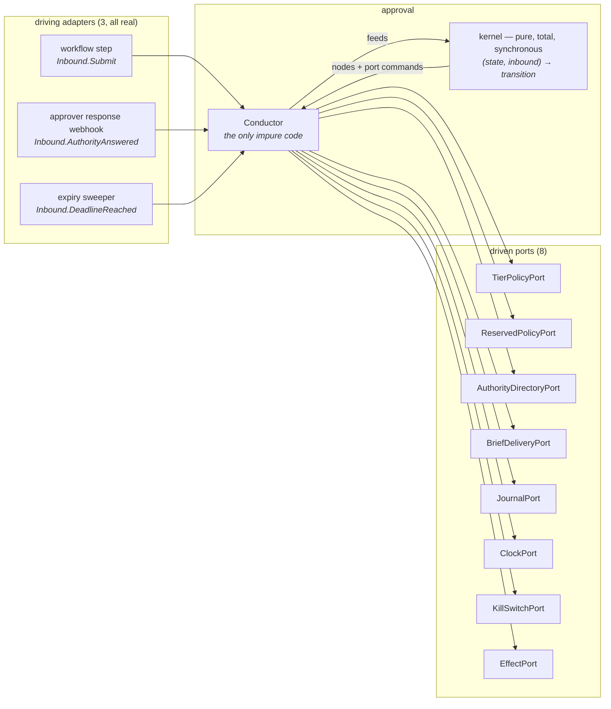
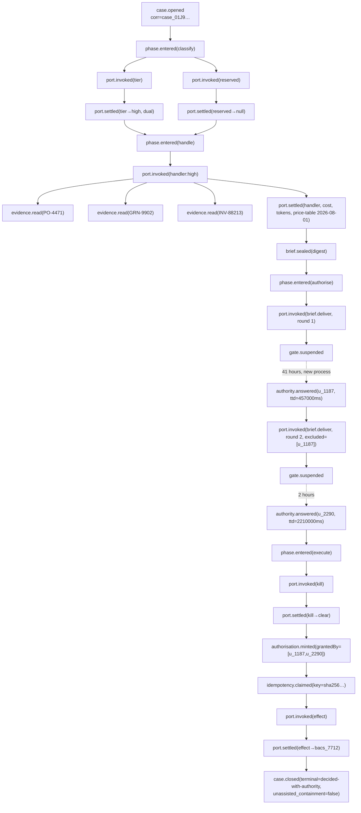

# `approval` — the ports-and-adapters design

**Shape:** ports and adapters, pushed to its honest extreme.
**Author's stance:** the module is a pure kernel surrounded by eight named
driven ports and one driving port. Nothing in the module does I/O except a
single conductor, and the conductor's only job is to turn port *descriptions*
into port *calls* while writing a node on both sides of every one.

The organising claim of this design is one sentence:

> **The kernel cannot perform I/O, because no port is in its scope. It can only
> return a description of the I/O it wants, and the only thing that interprets
> those descriptions records them.**

That is how C1 is satisfied structurally rather than diligently. Everything else
in this document follows from it.

Three decisions that make this design differ sharply from the other three
shapes, stated up front so they can be argued with:

1. **Transaction requirements determine port placement, not conceptual tidiness.**
   Phase 2 listed `CaseStore`, `IdempotencyStore` and the trace as three seams.
   They are one port here (`JournalPort`), because the suspended state, the
   idempotency claim and the trace node must commit atomically or the module is
   wrong under crash. Two seams that must commit together are one port. I am
   overruling Phase 2's seam list and §5 says why.
2. **Ports are sealed with an unforgeable context token.** Adapter methods take
   a `PortContext` that only the conductor can hold. An application that keeps a
   reference to the adapter it constructed still cannot call it: the call is a
   compile error. This is the piece that turns "recording is enforced" from a
   convention into a type.
3. **Durable resumption is not a second entry point. It is a second driving
   adapter.** `advance` is the only verb. A workflow step, an approver's answer
   arriving 41 hours later, and an expiry sweep are three adapters feeding the
   same port with different `Inbound` values. `await approve()` is not merely
   discouraged — there is nothing to await.

---

## 1. The interface

### 1.1 The hexagon



### 1.2 Public entry points — `packages/agent-ops-core/src/approval/index.ts`

Four functions and the port types. Everything else is invariant.

```ts
// The only constructor. Consumes the adapters; never re-exposes them.
export function conductor(ports: Ports, config: ApprovalConfig): Conductor;

// The only verb.
export interface Conductor {
  advance(inbound: Inbound): Promise<Progress>;
}

// The only way to construct a brief. Every required field is non-optional.
export function sealBrief(fields: BriefFields): SealedBrief;

// The pure reducer, exported so `audit` can replay a case without this
// module's adapters. Deterministic by construction.
export function kernel(state: GateState, inbound: Inbound): Transition;

// Shipped adapters. Not test doubles — deliverables. They are what makes
// C3 structural: a test constructs these and there is no code path to a
// live model, database or payment client even with real credentials present.
export function inMemoryJournal(): JournalPort;
export function fixedClock(at: Instant): ClockPort;
export function noWriteEffectPort(): EffectPort;   // also `evals`' shadow guarantee
```

`lib/` holds the conductor loop, the kernel's step functions, the canonical
codec, the node-version registry and the Postgres adapters. `tests/` holds the
fixtures. Nothing outside `index.ts` is reachable; dependency-cruiser enforces
it (C4).

### 1.3 The capability constraint — where the type *is* the guarantee

The brands are **disjoint**, not nested. A write-capable client is not a
subtype of a read-only one and a read-only client is not a subtype of a
write-capable one, so the mistake is a compile error in both directions:
supplying the wrong client, and registering a handler that demands the wrong
client.

```ts
declare const cap: unique symbol;

interface Reads {
  read(q: EvidenceQuery, c: PortContext): Promise<Evidence>;
}

/** Cannot stage an effect. */
export interface ReadOnlyClient extends Reads {
  readonly [cap]: { readonly read: true; readonly stage: false };
}

/** May stage an effect. Staging is not executing — see §1.5. */
export interface WriteCapableClient extends Reads {
  readonly [cap]: { readonly read: true; readonly stage: true };
  stage(plan: EffectPlan, c: PortContext): StagedEffect;
}

export type Tier = "low" | "medium" | "high";

export type ClientFor<T extends Tier> =
  T extends "high"   ? ReadOnlyClient :
  T extends "medium" ? ReadOnlyClient :
                       WriteCapableClient;

export type Handler<T extends Tier> = (c: ClientFor<T>) => Determination;

export interface Ports {
  readonly handlers: { readonly [T in Tier]: Handler<T> };
  // ... the eight driven ports
}
```

Why both directions fail, concretely:

```ts
const highTier: Handler<"high"> = (c: WriteCapableClient) => …;
//    ^ error: Type '(c: WriteCapableClient) => Determination' is not assignable
//      to type 'Handler<"high">'. Types of parameters are incompatible.
//      Property '[cap].stage' types 'true' and 'false' are not comparable.
```

```ts
declare const wc: WriteCapableClient;
declare const h: Handler<"high">;
h(wc);
//  ^ error: Argument of type 'WriteCapableClient' is not assignable to
//    parameter of type 'ReadOnlyClient'.
```

This requires `strictFunctionTypes` (already on — `strict` in `tsconfig`) and
`Handler` being a function *type alias*, not a method signature; method
signatures are bivariant and would silently permit the first error. That is a
load-bearing detail and belongs in the interface, not in a comment in `lib/`.

`cap` is a module-private `unique symbol`. An application cannot declare a
conforming object literal, cannot widen one brand into the other, and cannot
construct either client at all: both are minted by the conductor.

### 1.4 The port context — how "recording is enforced" becomes a type

```ts
declare const ctx: unique symbol;

/**
 * Unforgeable. The property key is a module-private unique symbol and its
 * type is `never`, so no value of this type can be written outside `lib/`.
 * The conductor holds the only instance.
 */
export interface PortContext { readonly [ctx]: never }
```

Every method on every driven port takes a `PortContext` as its **first**
parameter. The application writes the adapter — it must, that is the whole
point of a port — and it still cannot call it:

```ts
const journal = postgresJournal(pool);
await journal.commit(batch);
//                   ^ error: Expected 2 arguments, but got 1.
//                     An argument for 'c' was not provided.
```

There is no expression in application code that produces a `PortContext`. Not
`{} as PortContext` — that requires an explicit assertion, which is a review
signal and a lint failure under `@typescript-eslint/consistent-type-assertions`
with `objectLiteralTypeAssertions: "never"`. §7 attacks this.

### 1.5 The kernel — where C1 becomes unrepresentable

```ts
export type NonEmpty<T> = readonly [T, ...T[]];

export interface Transition {
  readonly next: GateState;
  /** A state change with no node does not typecheck. */
  readonly nodes: NonEmpty<NodeDraft>;
  /** Descriptions. Never invocations. */
  readonly commands: readonly PortCommand[];
}

export function kernel(state: GateState, inbound: Inbound): Transition;
```

Note the signature. `kernel` takes state and an inbound value. It does not take
`Ports`. It is synchronous and returns no `Promise`. Inside `lib/`, the kernel's
step functions have no port in lexical scope; a step that wanted to reach an
adapter would have to import one, and `lib/kernel/**` is barred from importing
`lib/adapters/**` by a dependency-cruiser rule, in CI, as a build failure.

`PortCommand` is a closed union of plain data:

```ts
export type PortCommand =
  | { readonly port: "tier";      readonly op: "classify";  readonly subject: DecisionSubject }
  | { readonly port: "reserved";  readonly op: "rule";      readonly subject: DecisionSubject }
  | { readonly port: "authority"; readonly op: "candidates"; readonly need: AuthorityNeed }
  | { readonly port: "brief";     readonly op: "deliver";   readonly envelope: SealedBriefEnvelope }
  | { readonly port: "clock";     readonly op: "now" }
  | { readonly port: "kill";      readonly op: "state";     readonly tier: Tier }
  | { readonly port: "effect";    readonly op: "perform";   readonly auth: Authorisation<Tier>; readonly plan: EffectPlan }
  | { readonly port: "handler";   readonly op: "run";       readonly tier: Tier };
```

There is no `PortCommand` for the journal. The journal is not commanded — it is
how the conductor commits, and it commits on every transition without asking.

### 1.6 Ordering, expressed as types

`classify → handle → authorise → execute` is a phase index in `GateState`, and
the kernel's step table is keyed by it. `execute` is reachable only from
`authorised`, and `Authorisation<T>` is constructible only inside `lib/` by the
authorise step:

```ts
declare const authTag: unique symbol;

export interface Authorisation<T extends Tier> {
  readonly [authTag]: T;
  readonly authorisationId: NodeId;
  readonly grantedBy: NonEmpty<AuthorityRef>;   // 2 entries under dual control
  readonly timeToDecisionMs: NonEmpty<number>;
  readonly reservedRule: ReservedRule | null;
}
```

`EffectPort.perform` demands an `Authorisation<T>`. There is no exported
constructor, no factory, and no `Authorisation.of`. An effect executing before
its authorisation is not a rule the conductor checks; it is a value that cannot
be produced.

**Staging vs executing.** `WriteCapableClient.stage()` returns a `StagedEffect`,
not an outcome — a low-tier handler describes what it wants and the conductor
still mints an authorisation (from the delegated-automation adapter of
`AuthorityDirectoryPort`, with a named delegation, per `CONTEXT.md`) before
`EffectPort.perform` runs. So the strict ordering holds at every tier while
`ClientFor<"low">` remains write-capable exactly as Phase 2 specified. A
high-tier handler holds a `ReadOnlyClient` and therefore cannot even *express*
an effect; at high tier the `EffectPlan` comes from the sealed brief, which the
approver saw.

### 1.7 The brief, and why redaction is not a port

```ts
export interface BriefFields {
  /** In the approver's units. "£47,200 leaves account 8812 today." */
  readonly effectInConcreteTerms: PlainText;
  readonly conclusion: PlainText;
  readonly evidence: NonEmpty<EvidenceRef>;        // reachable, not summarised
  readonly uncertainties: NonEmpty<PlainText>;
  readonly contraryEvidence: readonly EvidenceRef[]; // may be empty; MUST be stated
  readonly contraryEvidenceStatement: PlainText;     // "none found" is a statement
  readonly couldNotCheck: NonEmpty<UncheckedItem>;   // absence of a finding is not a finding
  readonly reserved: ReservedRule | null;
  readonly doNothingConsequence: DoNothing;          // expiry | escalation | indefinite hold
  readonly correlationId: CorrelationId;
}

export type DoNothing =
  | { readonly kind: "expires";    readonly at: Instant; readonly then: TerminalState }
  | { readonly kind: "escalates";  readonly at: Instant; readonly to: AuthorityRole }
  | { readonly kind: "holds-indefinitely" };
```

Every field is required. `contraryEvidence` may be an empty array but
`contraryEvidenceStatement` may not be absent — omitting the sentence is the
failure mode, not omitting the evidence. `couldNotCheck` is `NonEmpty`: a system
that claims it checked everything is lying, and the type says so.

`sealBrief` returns two things at once and they are the only way to get either:

```ts
export interface SealedBrief {
  /** Delivered to the authority. Never journaled. */
  readonly presented: BriefFields;
  /** Journaled. Never delivered. */
  readonly digest: BriefDigest;
}

export interface BriefDigest {
  readonly v: 1;
  readonly fieldHashes: { readonly [K in keyof BriefFields]: Sha256 };
  readonly traceSafe: {
    readonly amountBucket: AmountBucket;      // "£10k–£50k", not £47,200
    readonly currency: CurrencyCode;
    readonly tier: Tier;
    readonly reservedRuleId: string | null;
    readonly evidenceCount: number;
    readonly contraryEvidenceCount: number;
    readonly couldNotCheckCount: number;
    readonly doNothingKind: DoNothing["kind"];
  };
}
```

**There is no `RedactionPort`.** Redaction is a projection performed by
`sealBrief`, a pure total function with one implementation. A seam here would
mean nineteen redaction policies and nineteen ways to leak an account number
into a seven-year trace. The trace records that every field was present, what
each hashed to, and safe scalars — enough to prove completeness and to diff a
replay, and never enough to reconstruct the payment. `guardrails` still owns
redacting the *evidence* the handler read; approval's job is only to not undo it.

### 1.8 Dual control

```ts
export type Round = 1 | 2;

export interface BriefEnvelope<R extends Round> {
  readonly round: R;
  readonly brief: SealedBrief;
  readonly deadline: Instant;
  readonly excluded: readonly AuthorityRef[];   // round 2: contains round 1's authority
}
```

`BriefEnvelope<2>` has no field that can carry round 1's outcome, and the kernel
builds it from the original `DecisionSubject`, never from the round-1
transition — so the second approver's brief structurally excludes the first's
verdict, as `CONTEXT.md` requires. Information-distinctness is type-level.

**Identity-distinctness is not type-level, and I will not pretend it is.** Two
runtime identities cannot be proven distinct by TypeScript. It is enforced by
the kernel — a pure function, exhaustively tested through the module's own
interface — which refuses to emit an `authority.deliver` command for round 2
whose `need.excluded` does not contain round 1's `AuthorityRef`, and refuses to
accept an `Inbound.AuthorityAnswered` for round 2 from an excluded identity
(`DualControlSelfApproval`). Being pure, that logic is replayable and auditable;
being runtime, it is weaker than the capability constraint. Say so out loud.

### 1.9 Anti-rubber-stamping

```ts
export type Answer =
  | { readonly choice: "grant" }
  | { readonly choice: "refuse"; readonly reason: PlainText };

export interface AuthorityAnswer {
  readonly answer: Answer;          // no default member; no optional
  readonly presentedAt: Instant;    // supplied by the delivery adapter
  readonly answeredAt: Instant;
  readonly by: AuthorityRef;
}
```

There is no `Answer` value meaning "unanswered" and no default. `refuse`
requires a reason and `grant` does not, which is the one place this library
takes a position on effort asymmetry — and it takes it in the *wrong* direction
if you read it carelessly, so: `CONTEXT.md` says approving must not be the
low-effort path. The library cannot enforce that in a screen it does not own.
What it does instead is record `timeToDecisionMs = answeredAt - presentedAt` on
every approval node, set no threshold, and require the `BriefDeliveryPort`
contract to state that no answer is pre-selected. The signal is recorded; the
judgement is the application's.

### 1.10 Invariants

- Tier is assigned before the handler runs, never derived from handler output.
- A reserved decision cannot complete unassisted. The kernel's reserved branch
  has no terminal state reachable without an `AuthorityAnswer` from a human
  authority. There is no configuration key, threshold or confidence value that
  reaches it. `ReservedPolicyPort`'s return type has no waive branch.
- Every transition carries at least one node (`NonEmpty<NodeDraft>`).
- Node sequence and ordering are assigned by `JournalPort`, never by the kernel
  or the caller.
- An effect executes at most once per idempotency key; a repeat returns the
  original outcome, does not re-execute, does not error.
- The kill switch is consulted only in the `execute` step. There is no
  `PortCommand` emitting `kill` from `classify`, so a kill switch cannot stop a
  decision.
- Serialisation is byte-stable: canonical JSON, sorted keys, no floats (integers
  and decimal strings), RFC 3339 UTC at fixed millisecond precision. One codec,
  no seam (§5).
- No personal data reaches the journal (§1.7). There is no un-writing.

### 1.11 Error modes, with policy and reason

| Error | Raised at | Policy | Reason |
|---|---|---|---|
| `JournalUnavailable` | any transition | **fail-closed** at `high`/`medium`; at `low` per required config, **no default** | Mirrors `audit`'s tiered rule. No trace, no effect at high tier. The absence of a default is deliberate: a module that picks one policy is wrong for most of nineteen callers. |
| `TierPolicyThrew` | classify | **fail-closed** → treat as `high`, escalate | A policy that cannot classify is not trusted to say "low". |
| `ReservedPolicyThrew` | classify | **fail-closed** → treat as reserved | Never guess away a legal obligation. |
| `KillSwitchUnreadable` | execute | **fail-closed** → `KillSwitchEngaged` | A switch you cannot read is engaged. |
| `AuthorityUnavailable` | authorise | **fail-closed**; distinct and alertable; for a reserved decision the case holds **indefinitely** and never falls to a default | "Nobody was on shift" is not a lawful basis for an automated decision. This is the error that silently becomes containment-without-resolution if folded into a timeout. |
| `DualControlSelfApproval` | authorise | rejected in the kernel before any command is emitted | |
| `BriefDeliveryFailed` | authorise | bounded retry (5 attempts, exponential, 30 s cap), then `AuthorityUnavailable` | |
| `IdempotencyReplay` | execute | **not an error** — returns the original outcome | |
| `EffectIndeterminate` | execute | **fail-closed**, terminal, requires named reconciliation; never auto-retried | A payment that may or may not have happened must not be retried blindly. |
| `StateVersionConflict` | any | transient, retry-safe, bounded at 8 attempts | Optimistic concurrency on the gate state. |
| `RoundTripBudgetExhausted` | authorise | **fail-closed**, escalate | Bounded resources: 64 authority round-trips per case. |
| `NodeVersionAhead` | replay | **fail-closed**, explicit | A reader seeing a payload version it does not know refuses rather than partially reading. |
| `Escalated` | disposition | **returned, never thrown** | Escalation is not a failure. |

### 1.12 Required configuration

`TierPolicyPort` adapter, `ReservedPolicyPort` adapter (defaults to "no rules
declared", which is honest and visibly incomplete — a pre-flight check fails a
production deploy on an empty reserved list), authority directory adapter, brief
delivery adapter, journal adapter, clock adapter, kill-switch adapter, effect
adapter, the three handlers, the per-tier journal fail policy (**no default**),
the concurrency bound, the round-trip budget, and the price-table version.

### 1.13 Performance characteristics

- `TierPolicyPort.classify` returns `TierAssignment`, **not** `Promise<TierAssignment>`.
  That is how "pure and sub-millisecond, no I/O" is enforced: an adapter that
  wanted to await cannot. Same for `ReservedPolicyPort`.
- Node counts, measured as design targets: a low-tier decision with a delegated
  automated approval produces **6 nodes in 2 journal transactions**. A high-tier
  decision with dual control produces **~34 nodes across ~9 transactions**,
  spread over however long the humans take.
- Nodes are batched per `advance` and flushed once, so classify's sub-millisecond
  budget is not spent on a write.
- `advance` p99 target 25 ms excluding port latency; the journal commit is the
  floor.
- Concurrency is bounded by the conductor (default 32 concurrent advances) and
  by one in-flight advance per correlation ID, enforced by the state version.
- The human gate has no latency budget. It is measured in days.

### 1.14 Schema evolution over seven years

Every node payload is `{ v: number, kind: string, body: unknown }`. Rules:

1. **Additive only.** A field is never removed and never retyped. New fields
   arrive optional with a documented default.
2. A reader registry maps `(kind, v) → Reader`. Readers are kept forever; the
   registry is append-only and its completeness is a test.
3. A payload whose `v` exceeds the highest known reader raises `NodeVersionAhead`
   and refuses. Silent partial reads are how a seven-year trace becomes fiction.
4. `v` bumps only for semantic change. A rename is a new field plus a retained
   old one, never a bump.
5. Cost, token counts, latency and the **price-table version** are fields on
   every port-settled node — `telemetry`'s one surviving requirement.

---

## 2. Usage example — invoice approval, £47,200 to a supplier

One of the nineteen. Wiring first, then the happy path across a redeploy, then
three unhappy paths.

### 2.1 Wiring

```ts
// apps/invoice-approval/src/approval-wiring.ts
import {
  conductor, sealBrief,
  type Ports, type Handler, type ReadOnlyClient, type WriteCapableClient,
} from "@acme/agent-ops-core/approval";

const tierPolicy: TierPolicyPort = {
  classify(_c, subject) {                       // synchronous: no I/O possible
    const pence = subject.attributes.amountPence ?? 0;
    if (pence >= 1_000_000) return { tier: "high", dualControl: true };
    if (pence >= 50_000)    return { tier: "medium", dualControl: false };
    return { tier: "low", dualControl: false };
  },
};

const reservedPolicy: ReservedPolicyPort = {
  rule(_c, subject) {                           // separate port, on purpose
    if (subject.attributes.relatedParty === true) {
      return { id: "FIN-POL-14", authority: "policy",
               text: "Payments to related parties are reserved to a human." };
    }
    return null;                                // no waive branch exists
  },
};

const handleHigh: Handler<"high"> = (c: ReadOnlyClient) => ({
  conclusion: "Invoice INV-88213 matches PO-4471 and GRN-9902.",
  confidence: 0.93,
  evidence: [/* refs read through c.read */],
});

const handleLow: Handler<"low"> = (c: WriteCapableClient) => {
  const staged = c.stage({ kind: "post-to-ledger", ref: "INV-88213" }, CTX);
  return { conclusion: "Under threshold; posting.", confidence: 0.99, staged };
};

const gate = conductor(
  { handlers: { low: handleLow, medium: handleMedium, high: handleHigh },
    tierPolicy, reservedPolicy,
    authority: workdayDirectory(pool),
    brief: emailApproval(smtp),
    journal: postgresJournal(pool),
    clock: systemClock(),
    kill: killSwitch({ primary: postgresRow(pool), fallback: fileSentinel("/etc/acme/effects.off") }),
    effect: bacsPaymentPort(bankClient) },
  { journalFailPolicy: { low: "degrade", medium: "closed", high: "closed" },
    concurrency: 32, roundTripBudget: 64, priceTableVersion: "2026-08-01" },
);
```

If a maintainer later writes `const handleHigh: Handler<"high"> = (c: WriteCapableClient) => …`
to "just post it straight through for the big ones", the build fails. Not the
test suite. The build.

### 2.2 Happy path, across a redeploy

```ts
// t+0ms — the workflow driving adapter
const p1 = await gate.advance({
  kind: "Submit",
  correlationId: "case_01J9…",
  subject: { question: "May we pay invoice INV-88213?",
             attributes: { amountPence: 4_720_000, relatedParty: false },
             effectPlan: { kind: "bacs-payment", account: "8812", amountPence: 4_720_000 } },
  brief: sealBrief({
    effectInConcreteTerms: "£47,200.00 leaves account 8812 today.",
    conclusion: "Invoice matches purchase order and goods-received note.",
    evidence: [poRef, grnRef, invoiceRef],
    uncertainties: ["Supplier bank details changed 9 days ago."],
    contraryEvidence: [bankChangeRef],
    contraryEvidenceStatement:
      "The supplier's bank details were changed on 8 Aug and the change was not re-verified by phone.",
    couldNotCheck: [{ item: "Telephone re-verification of bank change", why: "No call record in the CRM." }],
    reserved: null,
    doNothingConsequence: { kind: "expires", at: "2026-08-20T17:00:00.000Z",
                            then: "escalate-to-finance-director" },
    correlationId: "case_01J9…",
  }),
});
// p1.state === "awaiting-authority"
// p1.round === 1 ; p1.suspendedAt === node #14
// The process may now be killed. Nothing is held in memory.
```

Nodes 1–14 are already durable: `case.opened`, `port.invoked(tier)`,
`port.settled(tier → high, dualControl)`, `port.invoked(reserved)`,
`port.settled(reserved → null)`, `phase.entered(handle)`,
`port.invoked(handler)`, `evidence.read` ×3, `port.settled(handler)`,
`brief.sealed(digest)`, `port.invoked(brief.deliver, round 1)`,
`gate.suspended`.

```ts
// t+41h — a *different process*, from the response driving adapter
const p2 = await gate.advance({
  kind: "AuthorityAnswered",
  correlationId: "case_01J9…",
  round: 1,
  answer: { choice: "grant" },
  by: { id: "u_1187", role: "finance-manager" },
  presentedAt: "2026-08-17T09:04:11.000Z",
  answeredAt: "2026-08-17T09:11:48.000Z",     // timeToDecisionMs = 457_000
});
// p2.state === "awaiting-authority" ; p2.round === 2
// Round 2's envelope carries no field that could hold u_1187's answer,
// and `excluded` contains u_1187.

// t+43h — second authority
const p3 = await gate.advance({ kind: "AuthorityAnswered", round: 2,
  answer: { choice: "grant" }, by: { id: "u_2290", role: "financial-controller" }, … });
// p3.state === "executed"
// p3.outcome === { effectId: "bacs_7712", at: "2026-08-17T11:02:03.000Z" }
```

Between `p3`'s authorisation and its effect the conductor emitted
`port.invoked(kill)` → `port.settled(kill → clear)` →
`authorisation.minted(grantedBy: [u_1187, u_2290], timeToDecisionMs: [457000, 2210000])`
→ `idempotency.claimed(key)` → `port.invoked(effect)` →
`port.settled(effect → bacs_7712)` → `case.closed(unassisted_containment: false, terminal: "decided-with-authority")`.

Note the closing node. `unassisted_containment` is `false` and is recorded, not
scored. `resolution` is absent — it is not knowable here and this module never
writes it.

### 2.3 Unhappy path A — the same person answers twice

```ts
const p = await gate.advance({ kind: "AuthorityAnswered", round: 2,
  answer: { choice: "grant" }, by: { id: "u_1187", role: "finance-manager" }, … });
// p.state === "halted"
// p.reason === { kind: "DualControlSelfApproval", excluded: ["u_1187"], round: 2 }
```

Nodes written: `authority.rejected(reason: DualControlSelfApproval)`,
`gate.suspended` — the case returns to awaiting round 2. The rejection is
evidence and is never a silent drop. `advance` returned; it did not throw.

### 2.4 Unhappy path B — nobody is on shift, and the decision is reserved

```ts
// Same case, but relatedParty === true, so ReservedPolicyPort returned FIN-POL-14.
const p = await gate.advance({ kind: "DeadlineReached", correlationId: "case_01JA…" });
// p.state === "awaiting-authority"
// p.alert === { kind: "AuthorityUnavailable", reserved: "FIN-POL-14",
//               heldSince: "2026-08-15T…", roundTripsUsed: 3 }
```

The case **holds**. It does not expire to a default, because the reserved branch
has no terminal state reachable without a human answer — the kernel has no such
transition to take. `AuthorityUnavailable` is emitted as a distinct alertable
node every sweep, bounded by the round-trip budget. If the budget exhausts, the
case halts with `RoundTripBudgetExhausted` and stays open. It never closes as
contained.

### 2.5 Unhappy path C — the journal is down at high tier

```ts
const p = await gate.advance({ kind: "Submit", … });      // tier resolves to "high"
// throws JournalUnavailable
```

This is the one place `advance` throws rather than returning a `Progress`,
because there is nowhere to record a `Progress`. Per `journalFailPolicy.high = "closed"`,
no port beyond `tier` and `reserved` was invoked — those two are pure and their
results are re-derivable — and no effect ran. The trace has no partial case: the
conductor commits the opening batch before invoking any impure port, so either
the case exists in the journal or it does not exist at all. At `low` tier with
`"degrade"` the same failure returns
`Progress { state: "halted", reason: { kind: "JournalUnavailable", degraded: true } }`
and the caller may proceed on its own record — which is a decision the
application made in configuration, in writing.

---

## 3. What the implementation hides behind the seam

The conductor loop and the kernel's step table hide, from all nineteen callers:

- **The suspend/rehydrate machine.** Serialising `GateState`, versioning it,
  reloading it by correlation ID, and reconciling an `Inbound` that arrives for
  a state that has already moved on. Nineteen partial implementations of this
  would each survive one restart and none would survive a week.
- **Atomic commit of node batch + gate state + idempotency claim.** One
  transaction, one optimistic version bump, one retry policy.
- **Canonical serialisation.** Key ordering, float elimination, instant
  precision, hash stability across hosts and Node versions. Invisible until a
  replay diff is pure noise, six months in.
- **The node graph's parent/child wiring.** Every `port.settled` node carries
  the `port.invoked` node as parent; every phase node carries the case node.
  Callers never assign a node ID.
- **Retry, backoff and budget accounting** for brief delivery.
- **Idempotency key derivation** — `sha256(correlationId ‖ canonical(effectPlan) ‖ authorisationId)` —
  and the claim/settle protocol that makes `EffectIndeterminate` a recorded
  terminal state rather than a lost payment.
- **Brief sealing**: the presented/digest split, field hashing, and the safe
  projection.
- **The kill-switch read with fallback**, and its fail-closed interpretation.
- **Terminal-state discrimination**: `decided-unassisted`, `decided-with-authority`,
  `escalated`, `timed-out`, `defaulted`, `abandoned`. `CONTEXT.md` rule 7 says
  "nobody decided" must be distinguishable from "the system decided"; that
  discrimination is a kernel branch, not a caller's diligence.

What is deliberately **not** hidden: which tier, which reserved rule, which
authority, which effect. Those are the application's domain and belong in its
adapters.

---

## 4. How C1 is satisfied

Five mechanisms, in descending order of strength.

**1. The kernel cannot do I/O.** `kernel(state, inbound): Transition` — no port
parameter, no `Promise` return, and `lib/kernel/**` is barred from importing
`lib/adapters/**` in CI. Every effect on the world is a `PortCommand` value
returned to the conductor. There is no code path from a business rule to a side
effect.

**2. Every transition carries a node, by type.** `Transition.nodes` is
`NonEmpty<NodeDraft>`. A step function that changed state and recorded nothing
does not compile. This is not a lint rule; it is the return type.

**3. Every port call is bracketed by nodes, by the conductor's only loop.** The
conductor is roughly:

```ts
// lib/conductor.ts — the whole of the impure surface
async function run(state: GateState, inbound: Inbound): Promise<Progress> {
  let t = kernel(state, inbound);
  let batch = [...t.nodes];

  for (const command of t.commands) {
    const invoked = draftInvoked(command, clock.now(CTX));   // node, before the call
    batch.push(invoked);
    const settled = await invokePort(command, CTX);           // the ONLY call site
    batch.push(draftSettled(invoked.id, settled, cost(settled), priceTableVersion));
    t = kernel(t.next, { kind: "PortSettled", parent: invoked.id, settled });
    batch.push(...t.nodes);
  }

  await journal.commit(CTX, { correlationId, expectedVersion: state.version,
                              nodes: batch, next: t.next, claim: t.claim });
  return progressOf(t.next);
}
```

`invokePort` is the only expression in the module that touches an adapter, and
it is unreachable without having pushed `invoked` first — they are adjacent
statements in a five-line loop that is covered by every test in the module. If
the journal commit fails, nothing was written and the state did not move; the
one exception is `EffectPort`, whose claim is written and committed *before* the
call (§ idempotency), so a crash mid-payment leaves a claimed-but-unsettled node
that reconciliation finds. Partial failure never corrupts the trace: it leaves it
short, and shortness is detectable because the claim node names what should
follow.

**4. The caller cannot reach an adapter.** `PortContext` (§1.4). The application
constructs the adapters — it must — but every adapter method's first parameter
is a type no application expression can produce. Going around the conductor is a
compile error.

**5. Replay reproduces the graph, not the answer.** `audit.replay(correlationId)`
loads the nodes, filters to `port.settled` and `Inbound` nodes, and folds them
through the **exported pure `kernel`**. Because the kernel is total and
synchronous and every non-determinism entered the case as a recorded port result,
the fold re-emits node drafts that must be byte-identical to the recorded ones.
A mismatch is `ReplayDivergence`, naming the node. This is why `kernel` is
public: replay must cross the same seam as callers (C4), and `audit` must not
need approval's adapters to replay approval's cases.

### 4.1 The node graph



It is a DAG, not a list: `S1` and `S2` are siblings that both parent `P2`, and
the three `evidence.read` nodes are siblings under `I3`. Parenthood is recorded
by the conductor (`draftSettled(invoked.id, …)`), never inferred from ordering.

### 4.2 Where this design is honestly awkward

Two places, stated rather than narrowed.

- **Inside a handler.** A handler is application code. Its `read` calls go
  through `ReadOnlyClient`, which is a conductor-minted proxy, so every evidence
  read is a node. But arbitrary computation inside a handler — a prompt template
  chosen by an `if`, a retry the application wrote itself — is invisible to
  approval. Approval records that the handler ran, what it read, what it
  returned, and what it cost. It does not record the handler's internals. The
  answer to "every node" for *model* calls is that the model client is itself a
  port supplied to the handler by the application and recorded by `audit`, not
  by `approval`. This design does not close that gap; it names it.
- **The delivery adapter's own graph.** `BriefDeliveryPort` sends an email. If
  that email bounces, is forwarded, and is answered from a phone, approval sees
  one `port.settled` node. The adapter's internals are the adapter's to record.

---

## 5. Seams and adapters — C5 applied without mercy

Eight ports survive. Eight candidate ports are marked speculative and must not
be built. That ratio is the point of this section: a ports-and-adapters design
that finds sixteen real seams has found none.

### 5.1 Real seams

| Port | Adapter 1 | Adapter 2 | Verdict |
|---|---|---|---|
| **`TierPolicyPort`** | `invoice-approval`: amount bands in pence | `ticket-routing`: customer-tier × contractual-remedy matrix | **Real.** Nineteen adapters, one per application. The most obviously real seam in the project. |
| **`ReservedPolicyPort`** | `claims-triage`: adverse benefit determinations, statutory | `expense-validation`: payments to related parties, standing policy | **Real, and deliberately not merged into `TierPolicyPort`.** Merging them would let a business delete a legal obligation by adjusting a risk threshold, which is precisely the failure the concept exists to prevent. Two seams, on purpose, against the instinct to unify. |
| **`AuthorityDirectoryPort`** | Human directory (Workday roles → `AuthorityRef`) | Delegated-automation registry: low-tier automated authorities, each with a named delegation recorded in the trace | **Real.** Both are named in `CONTEXT.md`; "the system approved it" without a delegation identity is exactly what this seam prevents. |
| **`BriefDeliveryPort`** | Web dashboard task queue | Email/Slack inline approval carrying the same required fields | **Real.** Phase 2's `BriefRenderer`, renamed: this library never renders. The seam exists because the library refuses to build nineteen screens and refuses to let any of them omit a field. |
| **`JournalPort`** | Postgres (nodes + gate state + idempotency claim, one transaction) | In-memory, shipped as a deliverable | **Real.** The in-memory adapter is not a test double; it is what makes C3 structural. A test that constructs `inMemoryJournal()` has no code path to a socket even with `DATABASE_URL` set. |
| **`ClockPort`** | System clock | `fixedClock` / deadline-simulating clock, shipped | **Real, and the weakest of the eight — I flag it rather than dress it up.** Its second adapter exists only for tests. It clears the bar on the same precedent `audit` set for its in-memory store, and it is genuinely load-bearing here: expiry logic measured in days cannot be tested any other way. If you reject that precedent, this is a one-adapter seam and you should say so. |
| **`KillSwitchPort`** | Postgres control row, per tier | Filesystem sentinel read by the process itself | **Real, and the second adapter is motivated rather than imagined:** a kill switch that lives in the database currently melting is not a kill switch. Fail-closed on port error. |
| **`EffectPort`** | The application's payment / system-of-record client | `noWriteEffectPort()` — the shipped no-write adapter that gives `evals` its shadow-run guarantee | **Real, and it is the seam the `shadow`-into-`evals` merge depends on.** The no-effect guarantee of a shadow run is this adapter, not a flag. |

Plus one **driving** port, with three real adapters — which is the payoff of this
shape for the durable-resumption requirement:

| Driving port | Adapters |
|---|---|
| **`Conductor.advance`** | (1) the in-process workflow step, `Inbound.Submit`; (2) the approver-response webhook or queue consumer, `Inbound.AuthorityAnswered`, running in a different process days later; (3) the expiry sweeper, `Inbound.DeadlineReached`, on a timer. |

Three adapters on one verb is why `await approve()` never appears. Resumption
did not need a second entry point; it needed a second adapter.

### 5.2 Speculative — do not build

| Candidate port | Why it looks real | Why it is not | Verdict |
|---|---|---|---|
| **`IdempotencyStorePort`** | Phase 2 listed it, with Postgres and in-memory adapters | The claim must commit in the same transaction as the effect-outcome node. A separate port lets a caller configure two stores that cannot share a transaction, and the failure is a duplicate payment discovered by reconciliation. **Transaction requirements determine port placement.** Folded into `JournalPort`. | **Speculative — do not build.** Overrules Phase 2. |
| **`CaseStorePort`** (durable suspension) | Phase 2 listed it separately | Same argument. The suspended state and the node that says it suspended must commit together, or a crash produces a case that suspended without a record of suspending. Folded into `JournalPort`. | **Speculative — do not build.** Overrules Phase 2. |
| **`RedactionPort`** | C2 demands redaction before write | One canonical projection, in `sealBrief`. Nineteen redaction adapters means nineteen ways to leak an account number into a seven-year trace. `guardrails` owns redacting evidence; approval owns not undoing it. | **Speculative — do not build.** |
| **`SerialisationPort`** | Byte-stability is the hardest thing here | A seam guarantees divergence, and divergence is exactly the failure. Exactly one canonical codec, forever. | **Speculative — do not build.** |
| **`DualControlPolicyPort`** | "Whether dual control applies" feels configurable | Whether it applies is a field on `TierPolicyPort`'s output. Distinctness is structural. A separate port would create a place to switch dual control off — a config key where `CONTEXT.md` demands a structure. | **Speculative — do not build.** |
| **`ExpiryPolicyPort`** | Deadlines vary by application | The do-nothing consequence is a **required brief field**, i.e. data on the request the approver was shown. A port would let the deadline differ from what the approver was told, which is the one thing it must never do. | **Speculative — do not build.** |
| **`NotificationPort`** (reminders, nudges) | Approvers do need chasing | It is `BriefDeliveryPort` with a different verb and the same two adapters. Two ports, one adapter set. | **Speculative — do not build.** Add a `remind` method to `BriefDeliveryPort` when someone asks. |
| **`MetricsPort`** | Cost, tokens, latency need to go somewhere | `telemetry` was cut. These are fields on every `port.settled` node, alongside the price-table version. Aggregation is an `audit` query. | **Speculative — do not build.** |
| **`ToolTransportPort`** (Model Context Protocol) | `tools` dissolved into this module | Per Phase 2 §6, nobody has named a second transport, and few of nineteen internal applications expose tools to an external model host. | **Speculative — do not build.** |

### 5.3 One thing this design demands of `audit`

`JournalPort`'s Postgres adapter must write approval's gate state, approval's
idempotency claim and `audit`'s trace nodes in **one** transaction. `audit`'s
current sketch (`open` → `CaseTrace.record`) owns its own connection and
therefore cannot be enlisted. This design requires `audit` to expose a
transaction handle — `audit.open(caseId, profile, tx?)` — or approval cannot be
atomic and C1 degrades to "usually recorded". That is a concrete, testable
change to a sibling module, and it should be agreed before either is built.

---

## 6. Trade-offs — and who suffers

**Where leverage is high.** A caller gets durable suspension, rehydration across
redeploys, dual control with structural information-exclusion, idempotency,
kill-switch semantics, tier routing, reserved enforcement, complete node capture
and byte-stable replay from **one verb**: `advance`. Nineteen applications would
otherwise each build the suspend/rehydrate machine and each get it wrong in a
different way. Locality is excellent: every behavioural change lands in the
kernel's step table, is a pure function, and is testable without a database.

**Where leverage is thin, and the number that should worry you.** The interface
is one verb *and eight port types*. Counting honestly — the definition of
interface in this repository is "everything a caller must know" — a caller must
learn eight port contracts, their `PortContext` discipline, ten `Inbound`
variants and a `Progress` union before writing a line. **That is a wide
interface, and the brief says a wide interface poisons all nineteen callers at
once.** On the brief's own headline metric, depth-as-leverage-per-unit-of-
interface-learned, this design loses to the minimal shape and it is not close.

**Who suffers, specifically:**

- **The low-tier caller.** Support-ticket routing, thousands of cases a day, no
  human gate, no dual control, no money. They must still construct eight
  adapters — including a kill switch and an authority directory they will never
  meaningfully use — before their first ticket routes. I refuse to ship a
  `standardPorts()` convenience bundle, because that is the common-case-optimised
  design wearing this one's clothes and it would hide the seam that the whole
  design exists to expose. So this caller genuinely suffers, and for them the
  common-case-optimised design is simply better. Read that one.
- **The on-call engineer at 3am.** A stack trace shows `conductor.run` →
  `invokePort` → adapter. It never shows the business logic, because the
  business logic returned data and does not appear on any stack. Debugging means
  reading the node graph. That is better forensics and worse ergonomics, and the
  difference is felt at the worst possible time.
- **The nineteen teams sharing the kernel.** Every new capability is a
  `PortCommand` variant plus a kernel branch, in one file, in one repository.
  Locality's flip side is contention: the kernel is where nineteen teams' feature
  requests collide.
- **The adapter author.** `PortContext` makes an adapter untestable in isolation
  — you must drive it through the conductor. I claim that as C4 compliance
  ("tests cross the same seam as callers") but it is a real cost, and an adapter
  author with a subtle SQL bug will feel it.
- **Latency-sensitive callers.** Every port round-trip is two nodes. Batching
  keeps it to one journal transaction per `advance`, but a high-tier case is
  ~34 nodes and ~9 transactions. That is fine for a payment and heavy for a
  classification.

**What this shape makes hard.** Adding a capability that does not fit the
command/settle rhythm — streaming, or a handler that needs to interleave reads
with a partially-formed authorisation. The rhythm is the design. Anything that
does not fit it fights it all the way down.

---

## 7. The strongest argument against this design

Written by me, and I think it lands.

**The module is one module in name and nine in fact.** I called the eight port
types "the seams" and treated the single `advance` verb as "the interface". That
is bookkeeping. By this repository's own definition — interface is everything a
caller must know — my interface is `advance` *plus* eight contracts, their
context-token discipline, ten inbound variants, a progress union and thirteen
named error modes. I have not built a deep module. I have built a **wide module
with a narrow front door**, and I disguised the width by putting most of it in
type definitions instead of function signatures. The brief's central warning is
about exactly this, and the shape I was assigned is the shape most likely to
commit it, because ports-and-adapters rewards naming seams and my score goes up
every time I name one. Marking eight candidates speculative is a real defence
and it is not a sufficient one: I still shipped eight.

**Worse: the width is not gradual.** `PortContext` means an application cannot
start with two adapters and grow into eight — every port must be supplied at
construction because the conductor holds the token. A design whose minimum
viable configuration is its maximum configuration has no on-ramp. Nineteen teams
will each spend their first week on wiring, and some of them will conclude the
library is not worth it, which is the failure mode that no amount of elegance
survives.

**And the C1 guarantee rests on a cast.** Everything in §4 above `PortContext`
is genuinely structural: a pure kernel cannot do I/O, and `NonEmpty<NodeDraft>`
is a return type. But `PortContext` is a `unique symbol` and a `as PortContext`
inside `lib/conductor.ts`. One `as any` in one of nineteen applications, written
by someone in a hurry with a production incident open, deletes it — silently,
permanently, and invisibly to CI unless that application happens to run the same
lint rules we do, which we do not control. The real wall is the database grant:
the role the conductor connects as has `INSERT` on the effect tables and the
application's own role does not. If the grant is the wall, then the elaborate
type-level fence I built around the ports is decoration, and I spent the
project's single scarcest resource — nineteen teams' patience with the interface
— buying something the database already gave me for free.

**Finally, the design is a bet on ADR 0001 that it does not hedge.** A closed
`PortCommand` union and a pure reducer are correct precisely because the set of
decision points is known before the case runs. If ADR 0001's trigger 1 fires —
route exhaustion above 15% — an open-world caller needs commands the kernel
cannot name, and the answer is not "add a variant"; it is that a pure reducer
over a closed command set is the wrong machine. Every other shape in this
exercise degrades gracefully into a somewhat-worse module. This one degrades
into a rewrite.

The honest summary: **this design has the strongest answer to C1 in the exercise
and the weakest answer to the brief's opening sentence.** If auditability is
genuinely the binding constraint, take it. If nineteen callers' onboarding cost
is, do not.
