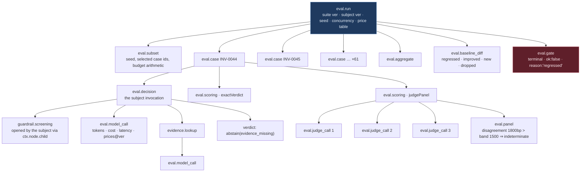

# `evals` — common-case-optimised

**Shape:** common-case optimised. One caller's path is one call with no
configuration. Every other caller pays, deliberately and visibly.

**Status:** design proposal for the Design It Twice comparison. No code exists.

---

## 0. The caller I optimised for, and why I believe they are the majority

> **The overwhelmingly common caller is a continuous-integration job that runs
> one application's golden suite against the handler on a pull-request branch
> and fails the build if quality went backwards.**

I optimised for that caller's *invocation*, not for their *authoring*. The
distinction matters, so here is the arithmetic I am betting on.

| Caller | Who | Frequency across nineteen applications |
|---|---|---|
| Pre-merge gate | CI, every push | 19 apps × ~8 pull requests/day × ~3 pushes ≈ **450/day** |
| Nightly full suite | CI, scheduled | 19/day |
| Local iteration on a prompt | An engineer, same code path as CI | ~50/day |
| Shadow run against recorded production cases | A team doing a model migration | ~1/week/app ≈ **3/day** |
| Authoring a new scorer | Once per application, ever | ~0/day |

Roughly **99% of all invocations of `evals` are one of two things**, and they
are the same thing: *run the suite, compare to the baseline, tell me pass or
fail*. The engineer running it locally wants exactly what CI wants and wants it
without reading a manual. This is the caller I made trivial.

The bet is not "the pre-merge gate is the most important use of `evals`." It is
demonstrably not — see §7, where I attack myself on precisely this point. The
bet is that **the pre-merge gate is the use that gets abandoned if it is not
trivial**, and an abandoned gate is worth zero. Shadow runs are done by people
who have already decided the exercise is worth a day of their time; they will
tolerate friction. A gate is run by someone who is trying to merge a
three-line prompt change, and if it takes them forty minutes of configuration
to adopt, nineteen teams will not adopt it.

**What the minority suffers, stated up front so it is not buried:** the shadow-run
caller writes a fourteen-field plan object with **zero optional fields** — they
must state the seed, the concurrency, the two clocks, the budgets and the
redaction policy even though they have no opinion on any of them. There is no
partial-configuration middle path. You take every default or you state every
value. That cliff is the design, not an oversight (§6).

---

## 1. The interface

### 1.1 The whole of the common caller's interface

```ts
// packages/agent-ops-core/src/evals/index.ts

/**
 * Run this application's golden suite against `subject`, compare to the
 * recorded baseline, and return whether the build should pass.
 *
 * Everything else — which suite, its version, which scorers, the seed, the
 * concurrency bound, the baseline, the budgets, where the report goes — is
 * determined by the module. None of it is a parameter.
 *
 * `deps` exists so this module's own tests and the nineteen applications'
 * tests can run hermetically. Application *production* code never passes it.
 */
export function check(
  subject: Subject,
  mode: "premerge" | "nightly" = "premerge",
  deps: EvalsDeps = nodeDefaults(),
): Promise<GateOutcome>;
```

One required argument. That is the entire common-case interface, and the
`subject` is not a thing the caller constructs for `evals` — it is the
composition root they already wrote to run their application in production
(§1.3).

The command-line adapter over it, which is what CI actually invokes:

```
$ npx agent-ops-eval            # === check(defaultExportOf("evals.config.ts"))
$ npx agent-ops-eval nightly    # === check(..., "nightly")
```

No flags. One positional argument with two legal values, defaulting to
`premerge`. Exit codes are load-bearing and are **not** collapsed:

| Exit | Meaning | Why it is its own code |
|---|---|---|
| `0` | Gate passed on evidence | |
| `1` | **Gate failed on evidence.** Your change made something worse. | |
| `2` | **Gate could not be evaluated.** `BaselineMissing`, partial run, or indeterminate scoring. | Conflating this with `0` is exactly the silent-pass failure the brief names. Conflating it with `1` teaches people to ignore `1`. |
| `3` | **Integrity failure.** Recorder unavailable, subject attempted a write, suite unreadable. | Not a quality signal at all. Never retried automatically. |

### 1.2 Types where the type is the guarantee

Three constraints in this module are enforced by the type system rather than by
a check. They are written out precisely because the precision is the point.

**(a) The subject structurally cannot write.**

```ts
declare const readOnlyBrand: unique symbol;

/** The only client this library will ever hand to a subject.
 *  Not constructible by application code: the brand is a module-private
 *  `unique symbol`, so a structurally identical object literal is not
 *  assignable. */
export interface ReadOnlyClient {
  readonly [readOnlyBrand]: true;
  complete(req: ModelRequest): Promise<ModelResponse>;
  fetchEvidence(ref: EvidenceRef): Promise<Evidence>;
}

/** Defined here only so the compile error below is expressible. `evals` never
 *  constructs one and has no code path that can produce one. */
export interface WriteCapableClient extends ReadOnlyClient {
  execute(effect: Effect, key: IdempotencyKey): Promise<EffectOutcome>;
}
```

The subject's decide function is declared as a **function-typed property, never
a method signature** — this is not stylistic, it is the guarantee:

```ts
export interface SubjectSpec {
  readonly version: SubjectVersion;
  readonly deps: SubjectDeps;
  // property syntax ⇒ parameters are checked contravariantly under
  // `strictFunctionTypes`. Method syntax would make them bivariant and
  // silently destroy the guarantee below.
  readonly decide: (ctx: DecisionContext) => Promise<Verdict>;
}

export interface DecisionContext {
  readonly client: ReadOnlyClient;
  // ...
}
```

Given that, this is a **compile error**, not a runtime check:

```ts
// ✗ Type '(ctx: { client: WriteCapableClient }) => Promise<Verdict>' is not
//   assignable to type '(ctx: DecisionContext) => Promise<Verdict>'.
//     Property 'execute' is missing in type 'ReadOnlyClient'.
defineSubject({
  version, deps,
  decide: async (ctx: { client: WriteCapableClient }) => {
    await ctx.client.execute(payInvoice, key);   // never reached; never compiles
    return verdict;
  },
});
```

The mechanism is parameter contravariance: `(c: WriteCapable) => V` is
assignable to `(c: ReadOnly) => V` only if `ReadOnlyClient` is assignable to
`WriteCapableClient`, and it is not. **This requires
`strictFunctionTypes: true`, which `CLAUDE.md` already mandates
(`strict`), and it requires the property-not-method declaration above.** Both
facts belong in the module's own tests as `@ts-expect-error` assertions, so a
future contributor who "tidies" the declaration into method syntax breaks a
test rather than the guarantee.

This is the same mechanism that gives a shadow run its no-effect property, which
is the strongest single argument for `shadow` living here rather than as its own
module.

**(b) The two reports are not interchangeable, and only one of them can be
gated.**

```ts
declare const reportKind: unique symbol;

export interface AccuracyReport {
  readonly [reportKind]: "accuracy";
  readonly against: "golden";
  readonly suiteVersion: SuiteVersion;      // content hash; see §1.4
  readonly subjectVersion: SubjectVersion;
  readonly deterministic: boolean;
  readonly partial: boolean;
  readonly correlationId: CorrelationId;    // replay reproduces the graph
  readonly runNodeId: NodeId;
  readonly traceDigest: TraceDigest;
  readonly cases: readonly CaseResult[];
  readonly baselineComparison: BaselineComparison;
  readonly schema: "report.accuracy/1";
}

export interface AgreementReport {
  readonly [reportKind]: "agreement";
  readonly against: "recorded-human-decisions";
  readonly humanDecisionSource: HumanDecisionSourceRef;   // required, named
  readonly window: ObservationWindow;                     // required, named
  readonly agreementBasisPoints: number;                  // integer, 0..10000
  readonly disagreements: readonly Disagreement[];        // never "failures"
  readonly correlationId: CorrelationId;
  readonly traceDigest: TraceDigest;
  readonly schema: "report.agreement/1";
  // No `baselineComparison`. No `deterministic`. No gate. On purpose.
}
```

Neither is assignable to the other: the `unique symbol` key carries
incompatible literal types, so this fails even with identical field sets.

The gate defence goes one step further than "`gate` accepts only
`AccuracyReport`". **There is no `gate` entry point at all.** Gating is a field
on one member of the run-plan union:

```ts
export type RunPlan = GoldenRunPlan | RecordedRunPlan;

export interface GoldenRunPlan {
  readonly against: "golden";
  readonly gate: GatePolicy;      // present on this member only
  /* ... */
}

export interface RecordedRunPlan {
  readonly against: "recorded";
  /* no `gate` field exists — supplying one is an excess-property error */
}
```

You cannot gate on agreement data because there is no callable thing that
gates. A folder does not typecheck; a missing method cannot be reached for.

**(c) An unredacted payload cannot be recorded.**

```ts
declare const redactedBrand: unique symbol;
export type RedactedPayload = { readonly [redactedBrand]: true; readonly json: CanonicalJson };

export interface Recorder {
  // Takes RedactedPayload. A raw object is not assignable.
  append(node: NodeDraft & { payload: RedactedPayload }): Promise<Sequenced<Node>>;
}
```

`RedactedPayload` is produced only by the injected `RedactionPolicy` (a
`guardrails` value). Redaction happens before write; there is no un-writing, and
the type says so.

### 1.3 `Subject` — the one thing the caller constructs

```ts
declare const subjectBrand: unique symbol;
export type Subject = { readonly [subjectBrand]: true; /* opaque */ };

export interface SubjectDeps {
  readonly recorder: Recorder;         // C1 — injected, never constructed here
  readonly clock: Clock;               // C2 — wall clock, for timestamps
  readonly monotonic: Monotonic;       // C2 — for latency; NTP steps are real
  readonly models: ModelBackend;       // C3 — the only thing that can dial out
  readonly redaction: RedactionPolicy; // C2 — redact before write
}

export function defineSubject(spec: SubjectSpec): Subject;
```

Every injection C1/C2/C3 demand lives here — and here is the common-case move
that makes `check(subject)` a *one*-argument call rather than a five-argument
one:

> **The application already wrote this object.** `SubjectDeps` is the
> composition root their production entry point is built from. `evals` does not
> ask for a recorder, a clock or a model backend, because asking would be asking
> twice.

`evals` reads the recorder and the clocks off the subject and uses them for its
*own* nodes — the run node, the case nodes, the scorer nodes. So the module has
no internally constructed dependency of any kind, and the caller passed nothing
extra. Depth: the caller learns one word (`Subject`) and gets injection,
hermeticity, and node capture.

**Cross-module fork I am surfacing rather than deciding** (per `CLAUDE.md`):
`decide` should be *the same function value* the application registers with
`approval.register(tier, handler)`. That is the difference between "point
`evals` at your handler" and "write an adapter that pretends to be your
handler", and the second one rots. It requires `approval` to mint a
`DecisionContext` of the same shape rather than passing a bare
`ClientFor<T>`. **This is a real constraint on `approval`'s interface and I am
raising it as a fork, not assuming it.** If `approval` declines, the common case
grows a shim and this design gets materially worse; I would rather know now.

### 1.4 What is inferred, and the invariants that inference buys

| Inferred | How | Invariant it makes free |
|---|---|---|
| Suite location | `evals/` beside the nearest `package.json` | — |
| **Suite version** | `sha256` over the canonical serialisation of the ordered case list | **A suite cannot be unversioned.** The refusal in interface fact 4 becomes vacuous: there is no unversioned suite to refuse. |
| Scorer set | `exactVerdict` always; `judgePanel` added in `nightly` if the suite manifest declares a rubric | Judge configuration is data in the suite, versioned with it — so "which judge produced this number" is answered by the suite hash. |
| Seed | `0`. Fixed, not random. | Determinism is the default, not an option. |
| Concurrency | `8` | Meets the 200-cases-in-5-minutes target; bounded (§2). |
| Case budget | `60s` wall | No unbounded case. |
| Run budget | `premerge` 5 min, `nightly` 60 min | No unbounded run. |
| Baseline | `evals/.baseline.json`, committed | Reviewable in the pull request that changes it. |
| **Gate policy** | **No regression on cases present in both runs.** | The only universally correct threshold. Absolute thresholds are domain knowledge the library does not have. |
| Subset (`premerge`) | Every case tagged `tier: "high"`, plus every case in quarantine, plus a seeded sample of the rest sized to the run budget | Reproducible: the selection is itself a recorded node carrying the seed and the chosen identifiers. |

The gate policy deserves its own paragraph, because it is the one default that
could be wrong for everyone rather than for four applications:

> **Default gate: fail if any case present in *both* the baseline run and this
> run went from pass to fail. New cases are reported as `new`, never as
> regressions. Dropped cases fail the gate.**

New-cases-are-not-regressions is what stops the gate failing every time someone
adds a golden case (the suite hash changes, so a version-keyed baseline would
otherwise always be missing — the baseline is matched on the intersection of
case identifiers, not on the suite hash). Dropped-cases-fail is what stops the
obvious cheat: deleting the failing golden case to go green. Re-accepting the
baseline is one command and shows up as a diff in the pull request, which is
where the argument about whether the case should have been dropped belongs.

**Judges are advisory in `premerge` and blocking in `nightly`.** A judge-scored
case cannot fail a pre-merge gate; it is reported, and its panel disagreement is
surfaced. Rationale: a flaky gate gets disabled, and a disabled gate is worth
less than an advisory number. Cost, stated plainly: **a quality regression that
only a judge can see does not block a merge in any of the nineteen
applications.** I attack this choice in §7.

### 1.5 The rare caller's entry point

```ts
/**
 * Run an explicit plan. Every field is required. There are no optional fields
 * and no partial-configuration path: you take `check`'s defaults entirely, or
 * you state every value.
 */
export function run<P extends RunPlan>(plan: P): Promise<ReportOf<P>>;

export type ReportOf<P> =
    P extends GoldenRunPlan   ? AccuracyReport
  : P extends RecordedRunPlan ? AgreementReport
  : never;

export interface GoldenRunPlan {
  readonly against: "golden";
  readonly subject: Subject;
  readonly suite: GoldenSuite;                       // loaded ⇒ content-addressed
  readonly scorers: readonly [Scorer, ...Scorer[]];  // non-empty tuple type
  readonly seed: Seed;
  readonly concurrency: Concurrency;                 // branded 1..32
  readonly caseBudget: Millis;
  readonly runBudget: Millis;
  readonly gate: GatePolicy;
  readonly baseline: BaselineRef;
  readonly reports: ReportRef;
  readonly fs: Filesystem;
}

export interface RecordedRunPlan {
  readonly against: "recorded";
  readonly subject: Subject;
  readonly cases: RecordedCases;                     // CaseSource adapter 2
  readonly humanDecisions: HumanDecisionSource;      // required; named source
  readonly window: ObservationWindow;                // required; named window
  readonly scorers: readonly [Scorer, ...Scorer[]];
  readonly seed: Seed;
  readonly concurrency: Concurrency;
  readonly caseBudget: Millis;
  readonly runBudget: Millis;
  readonly reports: ReportRef;
  readonly fs: Filesystem;
  // no gate, no baseline, no `deterministic` claim
}
```

`humanDecisions` and `window` are required on the recorded plan and have no
default, mirroring `CONTEXT.md`'s rule for resolution evidence: a number whose
provenance is unknown is not evidence of anything. An agreement figure without a
named comparison source is exactly that.

Two entry points: `check` and `run`. `defineSubject`, `loadSuite`,
`exactVerdict` and `judgePanel` are constructors of argument types — they
perform no evaluation and open no node. I concede in §7 that this accounting is
convenient for me.

### 1.6 Error modes, each with a policy and a reason

| Error | Policy | Reason |
|---|---|---|
| `BaselineMissing` | **Fail closed** — exit 2, gate `ok: false`, prints the exact accept command | "A gate that silently passes because it had nothing to compare against is worse than no gate." Never a warning. |
| `SuiteEmpty` / `SuiteUnreadable` | Fail closed, exit 3 | A zero-case suite passes trivially. That is the same failure wearing a different hat. |
| `SubjectError` (a case threw) | **Fail closed per case, fail open per run** — the case scores `fail`, the run continues | One crashing case must not destroy the evidence from the other 199; it must also not be quietly excluded. A handler that throws *is* a regression. |
| `CaseTimeout` (budget exceeded) | As `SubjectError`. Recorded with the budget value. | Same reasoning. A subject that got slower got worse. |
| `SubjectAttemptedWrite` | **Fail closed, abort the entire run**, exit 3 | The no-effect property is the whole safety story of a shadow run. A breach is an incident, not a data point. Runtime backstop for dynamically constructed subjects; the compile-time guarantee is primary. |
| `ScorerDisagreement` (panel split beyond the suite's declared band) | Case is **`indeterminate`** — neither pass nor fail. In `nightly`, any indeterminate case in the shared set fails the gate (exit 2). In `premerge`, advisory. | You measured with a ruler that disagrees with itself. Averaging it away is the specific dishonesty interface fact 6 forbids. |
| `JudgeUnavailable` | Bounded retry: 3 attempts, exponential backoff with full jitter, per judge call. Then `indeterminate`. | Bounded resources. Never infinite retry, never silent substitution of a different model. |
| `RecorderUnavailable` | **Fail closed, abort immediately**, exit 3 | Deliberate asymmetry with `audit`, whose fail policy is set per tier. `evals` has no low-tier degradation argument: an unrecorded evaluation produces a number nobody can check, and being checkable is the module's only purpose. Stated in both modules' documentation, because a reader who learns one will assume the other. |
| `RunBudgetExceeded` | Run aborts; report is written with `partial: true`; **a partial report cannot pass a gate** — exit 2 | Gating a partial run is an error, not a warning (PHASE-2). |
| `DroppedGoldenCase` | Fail closed, exit 1 | The cheapest way to make a gate green is to delete the evidence. |
| `TraceDigestMismatch` (on replay) | Fail closed | The trace is evidence. Evidence that does not reproduce is not evidence. |
| `SuiteRedactionRefused` | Fail closed at load, exit 3 | A golden case whose input trips the personal-data detector and carries no redaction provenance is never loaded, so it is never recorded. |

Note what is **not** an error: an abstention by the subject. Per `CONTEXT.md` an
abstention is a successful outcome of a working system; it is scored against the
golden case's expected verdict like any other verdict, and a golden case may
assert that abstention *is* the correct answer.

### 1.7 Performance characteristics

- Dominated by the subject. Target: **200 golden cases under 5 minutes at
  concurrency 8** ⇒ a 12-second budget per case; the default `caseBudget` of 60s
  is a ceiling for outliers, not the plan.
- Recording overhead: ≥ 5 nodes per case (case, decision, ≥ 1 model call,
  scoring, case verdict). At `audit`'s stated p99 of 10 ms per append that is
  ~50 ms per case, **0.4% of the per-case budget**. Nodes are batched per case
  and flushed at case close; the case-open node is flushed immediately so a
  process death leaves an open node rather than no node.
- `premerge` subset sizing is adaptive and bounded: `min(suiteSize,
  floor(runBudget / observedP50CaseLatency × concurrency))`, where
  `observedP50CaseLatency` comes from the baseline file. Always includes every
  `tier: "high"` case and every quarantined case; if those alone exceed the
  budget, the run proceeds over budget and the report records
  `subsetOverBudget: true` rather than dropping a high-tier case.
- `run` with `RecordedRunPlan` over 5,000 cases is an off-hot-path batch job. It
  is allowed to take an hour. It must never be called from a request path, and
  the module gives no streaming interface that would tempt someone to.

---

## 2. Usage example — invoice approval, end to end

### 2.1 The whole of the caller's code

The invoice-approval team's entire adoption of `evals` is one file:

```ts
// apps/invoice-approval/evals.config.ts
import { defineSubject, subjectVersion } from "@acme/agent-ops-core/evals";
import { auditRecorder } from "@acme/agent-ops-core/audit";
import { systemClock, systemMonotonic } from "@acme/agent-ops-core/clock";
import { decideInvoice } from "./src/decide.js";          // the production handler
import { deps } from "./src/composition.js";              // the production wiring

export default defineSubject({
  version: subjectVersion(process.env.GIT_SHA!, deps.promptSetHash),
  deps: {
    recorder:  auditRecorder(deps.pool),
    clock:     systemClock(),
    monotonic: systemMonotonic(),
    models:    deps.models,
    redaction: deps.redaction,
  },
  decide: decideInvoice,
});
```

and one line of CI:

```yaml
- run: npx agent-ops-eval
```

`decideInvoice` is not written for `evals`. It is the handler registered with
`approval` in production:

```ts
// apps/invoice-approval/src/decide.ts
export const decideInvoice = async (ctx: DecisionContext): Promise<Verdict> => {
  const screening = await ctx.node.child(
    { kind: "guardrail.input", schema: "guardrail.screening/1" },
    async () => screenInput(ctx.caseInput, "medium"),
  );
  if (screening.disposition === "abstain") {
    return abstain({ findings: screening.findings });        // a verdict, recorded
  }

  // No recording code here. `ctx.client` is bound to the open node, so this
  // model call *is* a node: tokens, cost, price-table version, latency.
  const extracted = await ctx.client.complete(extractionPrompt(ctx.caseInput));

  const supplier = await ctx.node.child(
    { kind: "evidence.lookup", schema: "evidence.lookup/1" },
    async (n) => n.client.fetchEvidence(supplierRef(extracted)),
  );

  return determine(extracted, supplier);
};
```

The suite, committed beside the source:

```
apps/invoice-approval/evals/
  manifest.json          { "manifestVersion": 1, "rubric": "…", "panelBand": 1500 }
  cases/0001.json        { "id": "…", "tier": "high", "input": {…}, "expected": {…} }
  …
  .baseline.json         accepted by `npx agent-ops-eval accept`, reviewed in the PR
```

### 2.2 Happy path

```
$ npx agent-ops-eval
agent-ops-eval · invoice-approval
  subject   1f4c9ab · prompts d0e7…
  suite     sha256:9c2e41…  (214 cases, 61 selected: 38 high-tier, 2 quarantined, 21 sampled @ seed 0)
  scorers   exactVerdict          (judgePanel deferred to nightly)
  budget    5m00s @ concurrency 8

  61/61 scored · 4m12s · £0.83 · 184,102 in / 22,940 out · prices@2026-07-01

  vs baseline (suite sha256:7b10c5…, 2026-08-14)
    regressed   0
    improved    2   INV-0113 INV-0187
    unchanged   57
    new         2   INV-0212 INV-0213   (no baseline — reported, not gated)
    dropped     0

PASS  correlation 01J9…QK  ·  agent-ops-audit replay 01J9…QK
```

### 2.3 Unhappy path one — a regression

Someone tightens the extraction prompt and three duplicate-invoice cases start
abstaining where they used to determine.

```
$ npx agent-ops-eval
  …
  vs baseline (suite sha256:7b10c5…, 2026-08-14)
    regressed   3
      INV-0044  high    expected determine(duplicate) → got abstain(evidence_missing)
                        node 01J9…QK/case-0044/decision  ·  2 model calls  ·  £0.004
      INV-0091  high    expected determine(duplicate) → got abstain(evidence_missing)
      INV-0155  medium  expected determine(duplicate) → got abstain(evidence_missing)

FAIL  3 regressions against baseline
      agent-ops-audit replay 01J9…QK --case INV-0044
$ echo $?
1
```

Exit 1: the gate had evidence and the evidence says worse. Note the correlation
identifier is on the failure line, so the engineer's next command reproduces the
whole graph rather than the answer.

### 2.4 Unhappy path two — no baseline

The ticket-routing team adopts `evals` on a Tuesday.

```
$ npx agent-ops-eval
  61/61 scored · 3m48s

  vs baseline
    BaselineMissing — no accepted baseline for any case in this suite.

FAIL  the gate could not be evaluated, so it did not pass.
      Review the report, then accept it as the baseline:
          npx agent-ops-eval accept 01J9…QK
      This writes evals/.baseline.json. Commit it in this pull request so the
      numbers you are accepting are reviewed by a human before they become the
      standard everything else is measured against.
$ echo $?
2
```

Exit 2, not 0. The first run of a gate is the run where a silent pass is most
tempting and most damaging.

### 2.5 Unhappy path three — the integrity failure

A contributor, mid-refactor, has `decideInvoice` calling a repository helper
that writes a `supplier_verified` flag.

The compile-time guarantee did not catch it, because the write does not go
through `ctx.client` at all — it goes through an imported module (§4.6, the
honest hole). What catches it is the `EffectSink` adapter `evals` installs for
the duration of the run, which every `agent-ops-core` write path consults:

```
$ npx agent-ops-eval
  case INV-0007 …
SubjectAttemptedWrite — the subject attempted an effect during an evaluation.
  effect     supplier.verify(supplier_id=88213)
  node       01J9…QK/case-0007/decision
  run        ABORTED at case 7 of 61. Report written, marked partial. Not gateable.
$ echo $?
3
```

Aborted, not scored-as-fail. A subject that can write is not a subject whose
numbers mean anything.

### 2.6 The rare caller — a shadow run in underwriting

Underwriting want to know whether a candidate model agrees with what their human
underwriters actually decided over the last quarter. They cannot use `check`.
They write this, and every field is mandatory:

```ts
import { run, loadRecordedCases, judgePanel, exactVerdict,
         seed, concurrency, millis } from "@acme/agent-ops-core/evals";

const report: AgreementReport = await run({
  against: "recorded",
  subject: candidateSubject,
  cases: await loadRecordedCases(audit, {
    tier: "high",
    closedBetween: ["2026-05-01T00:00:00Z", "2026-08-01T00:00:00Z"],
    limit: 5_000,
  }),
  humanDecisions: recordedApprovalsFrom(audit),      // named source
  window:        { from: "2026-05-01", to: "2026-08-01" },
  scorers:       [exactVerdict, judgePanel({ n: 5, band: 1500 })],
  seed:          seed(0),
  concurrency:   concurrency(8),
  caseBudget:    millis(60_000),
  runBudget:     millis(3_600_000),
  reports:       reportRef("s3://uw-evals/2026-q3"),
  fs:            nodeFilesystem(),
});

console.log(report.agreementBasisPoints);   // 9412  →  "94.12% agreement"
console.log(report.disagreements.length);   // 294 cases for adjudication

// ✗ Property 'gate' does not exist on type 'AgreementReport'.
// ✗ Argument of type 'AgreementReport' is not assignable to parameter of
//   type 'GoldenRunPlan'.
```

There is no way to turn 94.12% agreement into a passing build. The 294
disagreements are typed `Disagreement`, not `Failure`, and the field on the
report is `disagreements` — every one of them is a case for adjudication, and
the vocabulary refuses to call them defects.

---

## 3. What the implementation hides

The caller writes `check(subject)`. Behind that seam:

1. **Suite discovery, canonical serialisation and content addressing.** Walking
   up to the nearest `package.json`, reading `evals/`, sorting cases by
   identifier, canonicalising (sorted keys, UTF-8 NFC, no floats), hashing.
2. **Redaction at load.** Running the injected `RedactionPolicy` over every
   golden case input, refusing any case that trips a personal-data detector
   without redaction provenance.
3. **Deterministic subset selection** under a run budget, with high-tier and
   quarantined cases pinned, and the selection recorded as its own node.
4. **The bounded-concurrency runner**: a semaphore of 8, per-case `AbortSignal`
   wired to the case budget, a run-level deadline, no unbounded queue anywhere.
5. **Node capture** — the whole of §4. This is the largest single piece of hidden
   implementation and the caller writes none of it.
6. **Idempotency and resumption.** Run key derivation, per-case memoisation,
   replay of a completed run key without re-execution.
7. **Judge panel mechanics**: n≥3 calls, bounded retry with jittered backoff,
   panel aggregation, disagreement measurement against the suite's declared
   band, and refusal to average a split panel into a single number.
8. **Baseline matching on case-identifier intersection**, so a suite edit does
   not invalidate a baseline, plus new/dropped/quarantine bookkeeping.
9. **Byte-stable serialisation.** Integers everywhere in payloads: cost in
   tenths of a cent, latency in microseconds, scores in basis points. **No
   IEEE-754 float appears in a node payload, ever** — a float is where
   byte-stability dies quietly and replay diffs become noise months later.
10. **Report rendering** to something a human reads at 07:40 while trying to
    merge, with a correlation identifier on the failure line.

The deletion test: delete this module and nineteen teams each write a
bounded-concurrency runner, a baseline differ, judge-flakiness handling, and a
content-addressing scheme. None of that is domain-specific and most of them get
byte-stability wrong in a way that surfaces as unexplained diff noise a quarter
later. **Earns its keep.**

---

## 4. How C1 is satisfied

### 4.1 The graph

An evaluation run is itself a case-shaped execution, and it *nests* the
subject's own graph rather than flattening it.



Every node carries:

```ts
interface Node {
  readonly id: NodeId;
  readonly parent: NodeId | null;        // recorded, never inferred
  readonly correlationId: CorrelationId;
  readonly runKey: RunKey;
  readonly kind: NodeKind;
  readonly schema: `${string}/${number}`;
  readonly sequence: Sequence;           // assigned by the STORE, never the caller
  readonly openedAt: Timestamp;          // injected clock
  readonly closedAt: Timestamp | null;   // null ⇒ the process died here
  readonly elapsedMicros: number;        // injected MONOTONIC, integer
  readonly outcome: NodeOutcome;         // ok | abstained | error | timeout | indeterminate
  readonly costTenthCents: number;       // integer
  readonly priceTableVersion: PriceTableVersion;
  readonly tokensIn: number;
  readonly tokensOut: number;
  readonly payload: RedactedPayload;
  readonly payloadDigest: Digest;
}
```

**Concurrency and ordering.** With concurrency 8, eight `eval.case` nodes are
open simultaneously. `sequence` is a total order over *writes*, assigned by the
store; it is emphatically not a claim about execution order. Concurrent
execution is represented by parentage plus the `openedAt`/`closedAt` interval —
which is why both are recorded and why the parent is a field rather than an
inference from adjacency. A caller-assigned sequence would be a caller-assigned
lie under concurrency.

### 4.2 The mechanism: the node handle *is* the capability

This is the load-bearing paragraph of the whole design.

```ts
export interface NodeHandle {
  /** Open a child node, run `body` inside it, close it with the outcome —
   *  including on throw, on abort, and on timeout. */
  child<T>(spec: NodeSpec, body: (ctx: NodeContext) => Promise<T>): Promise<T>;
}

export interface NodeContext {
  readonly node: NodeHandle;        // for grandchildren
  readonly client: ReadOnlyClient;  // node-bound; see below
  readonly now: () => Timestamp;
  readonly signal: AbortSignal;
}
```

Three facts, and together they make an unrecorded execution unrepresentable
rather than merely discouraged:

**(i) There is no `open()` and no `close()` on the public interface.** Only
`child(spec, body)`. The `try/finally` lives inside the library. A caller cannot
open a node without closing it, cannot close one without having opened it, and
cannot forget to record the failure path — because the failure path is written
by the library, not by them. "Recording is something the caller remembers to do"
is not a mistake this interface can express.

**(ii) The client is minted by the node, not held by the caller.** There is no
exported constructor for `ReadOnlyClient` and no way to obtain one except from a
`NodeContext`, which only `child` produces. So: **no node, no client; no client,
no model call.** An unrecorded model call is unrepresentable because the thing
that makes model calls does not exist until the node exists.

**(iii) The node-bound client records its own call.** `ctx.client.complete(req)`
appends an `eval.model_call` node as a child of the current node — with the
redacted request, the redacted response, tokens, cost in tenth-cents, the
price-table version and the monotonic elapsed micros — before it resolves. The
subject author writes no recording code at all. They write `child()` only when
they want a *semantic* node (a guardrail screening, a retry, a tier
classification), and even a subject that never calls `child()` still produces a
complete graph: case → decision → every model call.

The same shape applies to scorers:

```ts
export type Scorer = (ctx: ScoringContext) => Promise<Score>;
export interface ScoringContext {
  readonly node: NodeHandle;
  readonly judge: ReadOnlyClient;   // node-bound; a judge_call node per call
  readonly expected: RedactedPayload;
  readonly actual: RedactedPayload;
}
```

A judge scorer that wants to call a model has no client to call it with except
the one that records.

### 4.3 The report cannot be forged

`AccuracyReport`'s brand is a module-private `unique symbol` and its only
producer is private to `lib/`. A hand-built object is not assignable. Every
report carries `runNodeId`, `correlationId` and `traceDigest` — the digest being
a hash over the canonical serialisation of the run's acknowledged nodes in
sequence order. So a report is not merely *accompanied by* a trace; it is
**derived from acknowledged nodes and identifies them by hash**. A report whose
digest does not match its trace on replay is `TraceDigestMismatch`, fail closed.

### 4.4 Replay reproduces the graph, not the answer

`audit.replay(report.correlationId)` returns the node DAG. To reproduce it
node-for-node rather than merely inspect it, swap the subject's `ModelBackend`
for the `recordedResponses` adapter keyed by the same run key (§5, seam 6): the
same suite version, subject version, scorer set and seed then yield an identical
sequence of nodes and an identical `traceDigest`. That is what interface fact 5
means operationally, and it is why the model backend is a seam rather than a
parameter.

Where determinism does not hold — any run whose scorer set includes a judge —
the report sets `deterministic: false` and names the reason. It does not claim
reproducibility it cannot deliver.

### 4.5 Never drop a node

Backpressure is applied to the *work*, not to the *recording*. The unflushed
node buffer is bounded at `concurrency × 64`; when it fills, the runner blocks
new case starts. It does not sample, does not drop, and does not degrade to a
summary. If the recorder is unavailable the run aborts (§1.6) rather than
continuing unrecorded — the asymmetry with `audit`'s per-tier fail policy is
deliberate and is stated in both modules' documentation.

### 4.6 Where full node capture is awkward — stated plainly

**The guarantee covers everything the library hands you. It cannot cover a
caller who brings their own socket.**

If a subject's `decide` function does `import Anthropic from "@anthropic-ai/sdk"`
and calls it directly, `evals` records the surrounding `eval.decision` node but
not that call, its tokens or its cost. No type prevents it, because TypeScript
cannot express "this function does no I/O other than through its argument".

Three responses, in descending order of strength, and I am not going to pretend
the first one is a type:

1. **Dependency-cruiser forbids network imports under any registered subject's
   module graph** — `node:http`, `node:https`, `node:net`, `undici`, and the
   provider SDKs. This is real enforcement in CI, and it is convention-shaped,
   not type-shaped. It catches the honest mistake; a determined contributor with
   a dynamic `import()` defeats it.
2. **`evals` itself has no network capability at all.** Dependency-cruiser also
   forbids those imports anywhere under `src/evals/`, and the module declares no
   HTTP dependency. This is what makes C3 structural rather than conventional:
   a test cannot reach a live model with real credentials present, because the
   module contains nothing that can dial. `nodeDefaults()` is a filesystem and
   two clocks; there is no model client in it to accidentally take.
3. **The report says what it captured.** Every report carries
   `capturedVia: "injected-client-only"`. A reader years later learns the
   *scope* of the guarantee from the artefact rather than from a wiki page. If
   we ever add sandboxed egress interception, that field changes value and old
   reports remain honest about what they were.

This is the one place in the design where "unrecorded is unrepresentable"
narrows to "unrecorded is unrepresentable through the library's own surface". I
would rather write that sentence than quietly let the stronger claim stand.

### 4.7 Seven-year schema evolution

- Every node payload carries `schema: "<name>/<integer>"`. Readers are
  registered per (name, version) and are **never deleted** for the retention
  window. Fields may be added; never removed, never retyped, never
  re-purposed. A changed meaning gets a new version number and a new reader.
- **Trace nodes are never rewritten in place.** Upcasting happens on read. There
  is no migration that touches history, because a migration that touches history
  makes the trace evidence of the migration rather than of the case.
- Reports carry `schema: "report.accuracy/1"`; suites carry `manifestVersion`;
  the baseline file carries its own version.
- Model prices change, so `priceTableVersion` is on every model-call node. That
  single field is the surviving requirement from the cut `telemetry` module, and
  without it the 2033 view of 2026's cost-per-decision is fiction.
- Retention is stratified: case traces keep the seven-year window; **eval-run
  traces keep 90 days**, because 450 runs/day × ~1,200 nodes/run × 19
  applications is ~10M nodes/day and seven years of that is not evidence, it is
  a bill. The *reports* keep seven years; the node-level graph behind them does
  not. This is a real weakening of C1 for this module specifically and it is a
  choice, not an accident: an eval run's evidentiary value decays with the code
  it evaluated, whereas a case's does not.

---

## 5. Seams and adapters

C5 applied to my own design, including where it costs me.

| # | Seam | Adapter 1 | Adapter 2 | Verdict |
|---|---|---|---|---|
| 1 | **`Scorer`** | `exactVerdict` — structural comparison of verdict and disposition | `judgePanel` — LLM-as-judge, n≥3, band-checked | **Real.** The reason judge is an adapter rather than a feature of the runner. |
| 2 | **`CaseSource`** | `goldenSuiteOnDisk` — content-addressed | `recordedCasesFromAudit` | **Real.** This is the seam that makes `shadow` a case source rather than a module. |
| 3 | **`Recorder`** | `auditRecorder` — Postgres-backed, via `audit` | `inMemoryRecorder` — a **shipped deliverable**, not a test mock | **Real.** Same argument PHASE-2 accepted for `audit`'s `TraceStore`: the in-memory adapter is what makes hermetic testing structural instead of conventional. |
| 4 | **`Filesystem`** | `nodeFilesystem` | `inMemoryFilesystem` | **Real**, and deliberately *one* seam covering suite loading, the baseline and report storage. See note below. |
| 5 | **`ModelBackend`** (on the subject) | the application's production provider client | `recordedResponses(runKey)` — replays a completed run's model calls | **Real**, and adapter 2 is what makes §4.4's node-for-node replay achievable rather than aspirational. |
| 6 | **`Clock` / `Monotonic`** | `systemClock` / `systemMonotonic` | `fixedClock` / `manualMonotonic` | **Real**, but small — two adapters that exist only because `Date.now()` is forbidden. I would not defend this as a seam if C2 did not require it; I am counting it honestly rather than pretending it is architecture. |
| 7 | **`HumanDecisionSource`** (recorded plan only) | `recordedApprovalsFrom(audit)` | `legacyReviewerExport` — a CSV or ticketing extract of decisions made *before* the system existed | **Real**, and adapter 2 is not hypothetical: the bootstrap shadow run for any of the nineteen compares against humans whose decisions were never in `audit`. |
| 8 | **`Invocation`** | `bin/agent-ops-eval` | in-process `check()` | **Real but weak.** Two adapters ship and both are used. They differ only in transport and add no capability. If only one existed I would not build the seam, and I am flagging it rather than dressing it up. |
| 9 | ~~`BaselineStore`~~ | JSON file in the repository | — | **Not a seam. Deleted.** PHASE-2 called a second adapter speculative and I agree. The baseline lives *inside* seam 4, so hermetic testing of baseline behaviour needs no separate seam. One fewer seam is one fewer thing nineteen callers must learn. |
| 10 | ~~`GatePolicy`~~ | no-regression | — | **Not a seam. Speculative — do not build.** `GatePolicy` is a two-member discriminated union value on `GoldenRunPlan`, not a plugin point. A second adapter would be absolute thresholds; nobody has asked for one and the common caller must never see it. |
| 11 | ~~`ReportRenderer`~~ | terminal | — | **Not a seam. Speculative — do not build.** The obvious second adapter is a pull-request comment, and it belongs in the application's CI configuration reading the report artefact, not behind an interface here. |

Note on seam 4: collapsing suite loading, baseline storage and report storage
into a single `Filesystem` seam is a depth decision, not a laziness. Three seams
would each need two adapters to be real by C5, and two of the three would have
had an in-memory adapter and nothing else — the definition of a hypothetical
seam. One seam with two genuine adapters is the honest version.

Eight seams survive; three I killed. Two of the eight (6 and 8) I have marked as
weak rather than claiming them.

---

## 6. Trade-offs — who suffers, specifically

**Where the leverage is high.** The pre-merge caller learns one word, writes
twelve lines once, and gets: content addressing, redaction at load, bounded
concurrency, per-case and per-run budgets, deterministic subsetting, quarantine
of recently-flaky cases, idempotent resume after a crash, judge-panel
disagreement surfacing, baseline matching that survives suite edits, and a
complete node graph they wrote no code for. That is the deepest ratio of
behaviour-to-interface I can find in this module, and it is available to
nineteen teams on day one.

**Where it is thin, and who pays.**

1. **The shadow-run caller — the biggest loser, named.** Underwriting doing a
   model migration writes a fourteen-field object with zero optional fields,
   including a seed and two budgets they have no opinion about. There is no
   `run({ ...defaults, cases })`. This is intentional — a partial-configuration
   path is how a common-case design rots into a flexible one with worse
   defaults — but it means the person doing the most consequential work in the
   module has the worst ergonomics in the module. I attack this in §7.

2. **The absolute-threshold caller.** "Tier-high cases must score ≥ 95%
   regardless of the baseline" is unexpressible through `check`. They must drop
   to `run` and write the whole plan. Regulated applications with a
   contractually stated accuracy floor are a plausible several of the nineteen,
   and for them `check` is not the common case at all — it is a toy they outgrow
   in month two.

3. **The monorepo.** Suite discovery walks to the nearest `package.json`, which
   is right for nineteen separate repositories and ambiguous for nineteen
   packages in one. Convention over configuration always has a topology it does
   not fit, and this is mine.

4. **Anyone who wants to gate a report produced elsewhere.** There is no `gate`
   entry point, so the split-job CI pattern (run in one job, gate in another
   reading an artefact) works only because the gate outcome is a *field on the
   report* the second job reads. It cannot re-gate with different thresholds. A
   team that wants a stricter gate on `main` than on branches cannot have one
   without `run`.

5. **Anyone who wants a third case source.** Synthetically generated cases,
   adversarial suites, cases pulled from a labelling tool: refused. Per the
   review rule, that is a signal to split the module, and I am honouring it
   rather than adding a third entry point. Those teams build their own runner or
   materialise cases into a golden suite on disk first.

6. **Everyone, on judge-detected regressions.** Judges are advisory pre-merge.
   A quality regression that only a model-as-judge can see merges freely in all
   nineteen applications and is caught, at best, the following night.

7. **The trace-retention bill.** ~10M eval nodes per day across nineteen
   applications is why eval-run traces get 90 days rather than seven years
   (§4.7). That is a real narrowing of C1 for this module, chosen deliberately
   and stated rather than discovered on an invoice.

**What this shape makes hard that another shape would make easy.** Every
inference in §1.4 is a decision moved out of the caller's code and into the
library's. That is exactly what makes the common case trivial, and it is exactly
what makes the design brittle to a caller whose situation differs from my
assumption in *any single respect* — because the defaults come as one
indivisible bundle. A flexible shape would let a caller override the one thing
they care about. Mine makes them override all fourteen or none.

---

## 7. The strongest argument against this design

Written by me, and I think it lands.

### 7.1 I optimised for the loudest caller, not the most important one, and I used volume as a proxy for value

The arithmetic in §0 is honest and the conclusion drawn from it is not. Yes,
450 pre-merge gate runs a day dwarf three shadow runs. But a pre-merge gate on a
frozen golden suite is close to the *least informative* thing this module does,
and `CONTEXT.md` says so in as many words: golden cases "are frozen while
production traffic drifts… they go stale, and a passing golden set is not
evidence that today's traffic is being handled well." I made 450 low-information
calls a day trivial and taxed the handful of calls a quarter that carry the real
information: is the model actually better than our reviewers, has traffic
drifted away from the suite, and — per ADR 0001's trigger 3, which names `evals`
as the only thing that could ever falsify the workflows-not-agents stance —
should this library's founding assumption be reversed.

**Every one of those questions lives on the `run(RecordedRunPlan)` path, which
is the path I deliberately made unpleasant.** ADR 0001 says trigger 3 "is the
one nobody will measure unless `evals` makes it cheap." I did not make it cheap.
I made the other thing cheap and wrote a table justifying it by call count.

The counter I would offer is that friction is proportionate to stakes, and a
team spending a week on a model migration will not be stopped by a
fourteen-field object. I believe that. But I also believe it is the sentence
every designer says right before the important measurement stops being taken,
and the failure mode is invisible: nobody files a ticket saying "we did not run
a shadow evaluation this quarter."

### 7.2 One-argument `check` moves a regulatory obligation from the caller to the library

`check(subject)` never names a suite. The caller does not choose the suite, does
not choose the scorers, does not choose the threshold and does not choose the
subset. All of it is inferred.

In a regulated industry the entity with the obligation is the application, not
the library. When an auditor asks "who decided that these 214 cases are what
your invoice-approval system is measured against, and who decided that 61 of
them are enough to merge on," the honest answer under my design is "the
convention did." The suite hash is in the report, so the fact is *discoverable*
— but the caller never made a choice, so there is no artefact of them having
made one. A design that requires `evaluate(suite, subject, scorer)` produces a
line of code with a name on it in `git blame`. Mine produces a default.

I think this is the sharpest attack in the list, because it is not about
ergonomics — it is about whether the trivial path is *allowed to be trivial* in
this domain at all.

### 7.3 "Judges are advisory" is a policy that will outlive its reasoning

I defaulted judge scorers to non-blocking pre-merge because flaky gates get
disabled. That reasoning is real, and it is also the reasoning that makes the
choice permanent: defaults are never revisited, they are inherited. Nineteen
applications will run for years with the rule "a regression that only a judge
can detect does not block a merge," and none of them will have decided that —
I decided it, once, in a table.

The rebuttal to my own rationale is that judge flakiness is an engineering
problem with known solutions (larger panels, variance bands calibrated per
suite, requiring a regression to reproduce across two consecutive runs), whereas
"judges never block" is a policy problem with no owner. I picked the cheap
answer to the tractable problem and let it decide the intractable one.

### 7.4 My entry-point accounting is convenient

The review rule says a third entry point on `evals` is a signal to split. I have
`check` and `run`, and I exported `defineSubject`, `loadSuite`, `loadRecordedCases`,
`exactVerdict`, `judgePanel`, `seed`, `concurrency`, `millis`, `reportRef`, and a
command-line binary — and I declared none of them entry points because they
"perform no evaluation and open no node."

That distinction is defensible and I do defend it. It is also *exactly* the
argument someone will use next year to add `generateSuite()` or `adjudicate()`
as "just a constructor". The review rule was meant to be a hard stop, and I have
demonstrated in a single design that it can be routed around by classification.
If the rule is to survive, it should be restated as a count of exported symbols,
not of entry points — and by that measure this design already spends eleven.

### 7.5 The nineteen may not have a common case at all

The whole shape rests on the claim that the nineteen applications' evaluation
needs are similar enough for one default bundle. That claim is stronger than
anything in PHASE-2 supports. Claims triage, invoice approval and ticket routing
plausibly share it. Underwriting document intake — long documents, expensive
per-case, tens of cases rather than hundreds, judge-dominated scoring — almost
certainly does not: a 5-minute run budget at concurrency 8 with a 60-second
per-case ceiling is wrong for them in every parameter simultaneously, and my
design's answer is "then write all fourteen fields."

If the true distribution is 12 applications in the common case and 7 outside it,
this shape is not common-case-optimised. It is majority-optimised at a 37%
minority's expense, which is a considerably worse trade than the one I claimed
to be making — and I do not currently have the evidence to distinguish the two.
**The measurement that would settle it is how many of the nineteen can adopt
`check` unmodified. If the answer is below fifteen, this design should lose the
comparison.**
