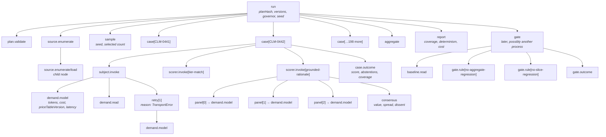
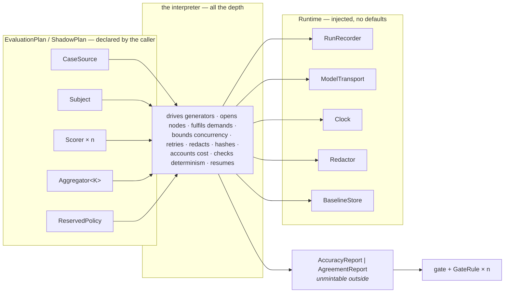

# `evals` — the flexible shape

**Shape:** maximum flexibility. Explicit extension points everywhere. Assume the
nineteen callers want things I have not imagined and that future ones want more.

**One-line summary:** `evals` is not a function that runs an evaluation — it is
an **interpreter for a declared evaluation plan**, where every element of the
plan is an adapter at a named seam, and where an adapter physically cannot obtain
a result from the outside world except by yielding a demand that the interpreter
records as a node before it fulfils it.

**The bet this shape makes:** if you are going to let nineteen teams plug their
own behaviour into the middle of a measurement pipeline, the only way to keep
C1 is to stop letting adapters *call* anything. Take the call away and give them
a yield. Flexibility then costs ergonomics rather than auditability.

**The bet's price, stated up front so section 6 is not a surprise:** the caller
must learn fourteen types to run one suite where the minimal shape asks for
three, every scorer in the estate is a generator function rather than an `async`
function, and by my own count in section 5 **eight of the seams this shape
produces are speculative** — which CLAUDE.md and C5 both call a stated failure.
I have not deleted them, because deleting them would be designing a different
shape. I have counted them and named what I would cut first.

---

## 0. Vocabulary

Everything here comes from `docs/CONTEXT.md` except the following, which are new
and justified:

| Term | Why it is new |
|---|---|
| **Run** | The whole execution of a plan against a case source. `CONTEXT.md` forbids *run* as a synonym for **decision**; it already blesses the compound *shadow run*. `Run` here is that noun generalised, never a single act of judgment. |
| **Node** | From C1 in the brief: a vertex in a case's execution graph. Not a synonym for decision — a decision is one node kind among sixteen. |
| **Demand** | A request from an adapter to the interpreter for something the adapter cannot do itself: a model call, a read, the time, a random draw. The unit at which nodes are recorded. New because no existing term names "the thing an extension point is allowed to ask for". |
| **Plan** | The declared, content-addressed description of a run. New. |
| **Socket** | A named, typed hole in a plan into which exactly one adapter is fitted. This is `SKILL.md`'s **seam** viewed from the caller's side; I use *seam* when discussing the design and *socket* only when discussing the plan's fields. |

`Subject`, `Scorer`, `CaseSource`, `BaselineStore`, `GoldenSuite`,
`AccuracyReport`, `AgreementReport`, `GateOutcome` are carried over unchanged
from `PHASE-2-INTERFACE-REVIEW.md` §3.

Deliberately **absent**, and this is a design statement: there is no
`ResolutionSource` and no way for any report to carry a resolution figure. See
§1.11.

---

## 1. The interface

### 1.1 Three entry points, and why flexibility does not add a fourth

```ts
export function evaluate(
  plan: EvaluationPlan,
  runtime: Runtime,
): Promise<AccuracyReport>;

export function shadow(
  plan: ShadowPlan,
  runtime: Runtime,
): Promise<AgreementReport>;

export function gate(
  report: AccuracyReport,
  spec: GateSpec,
  runtime: Runtime,
): Promise<GateOutcome>;
```

The review rule is binding: *a third entry point on `evals` is a signal to split
the module, not to extend it*, and the review's own sketch already spends all
three. So the flexible shape cannot express itself as more verbs.

**It expresses itself as more nouns.** Every extension point lives inside
`EvaluationPlan`, `ShadowPlan`, `GateSpec` and `Runtime`. Resumption is not a
fourth entry point — it is `evaluate` called again with the same plan and the
same `RunId`. Replay is not a fourth entry point — it is `evaluate` with a
`RecordedTransport` in the `Runtime`. Dry-run is not a fourth entry point — it
is a `Sampler` that yields zero cases.

I want to flag, rather than hide, that this obeys the rule in letter while
routing round its spirit: the pressure the rule exists to detect has moved from
the verb list into a plan type with twelve sockets. Judge that in §7.

### 1.2 Identity, versions and hashes

```ts
declare const brand: unique symbol;
type Branded<T, B extends string> = T & { readonly [brand]: B };

type CorrelationId  = Branded<string, "CorrelationId">;  // owned by audit
type RunId          = Branded<string, "RunId">;
type NodeId         = Branded<string, "NodeId">;
type ContentHash    = Branded<string, "ContentHash">;    // "sha256:<64 hex>"
type SuiteVersion   = Branded<ContentHash, "SuiteVersion">;
type SubjectVersion = Branded<string, "SubjectVersion">;
type AdapterVersion = Branded<string, "AdapterVersion">;
type PlanHash       = Branded<ContentHash, "PlanHash">;
type Seed           = Branded<number, "Seed">;
type AuthorityId    = Branded<string, "AuthorityId">;    // per CONTEXT.md

/** Scores are decimal strings, never IEEE doubles. Byte-stability is the
 *  reason: 0.1 + 0.2 does not serialise identically on every host, and a
 *  report that cannot be diffed byte for byte is not evidence. */
type Score = Branded<string, "Score">;                   // e.g. "0.9375"
```

Every adapter in a plan declares `{ id: string; version: AdapterVersion }`. The
plan hash is the canonical hash of those declarations plus the seed, the suite
version, the subject version, the redactor version, the price-table version and
the payload schema version. The plan hash is what determinism is claimed
*against*.

### 1.3 Capability, as a type — the subject cannot write

This is the same mechanism `approval` uses for its tier constraint, and the
review says so explicitly: the structural no-write on the subject is what gives
a shadow run its no-effect guarantee.

```ts
declare const capability: unique symbol;

export interface ReadOnlyClient {
  readonly [capability]: "read-only";
  fetchDocument(ref: DocumentRef): Promise<RedactedDocument>;
  lookupPolicy(ref: PolicyRef): Promise<PolicySnapshot>;
}

export interface WriteCapableClient {
  readonly [capability]: "write-capable";
  fetchDocument(ref: DocumentRef): Promise<RedactedDocument>;
  lookupPolicy(ref: PolicyRef): Promise<PolicySnapshot>;
  issuePayment(instruction: PaymentInstruction): Promise<PaymentReceipt>;
}
```

`WriteCapableClient` is **not** a subtype of `ReadOnlyClient`. It has every
member `ReadOnlyClient` has and more, so structurally it would be assignable —
the `unique symbol` property with two different literal types is what blocks it.
Remove that one line and the guarantee evaporates silently, which is why it is
the first thing a reviewer should look for.

```ts
declare function evaluate(plan: EvaluationPlan, runtime: Runtime): Promise<AccuracyReport>;

const subject: Subject = {
  id: "claims-triage",
  version: "2026.08.14+9f1c" as SubjectVersion,
  *run(c, node) {
    node.client;                    // ReadOnlyClient — the only client in scope
    // @ts-expect-error  Property 'issuePayment' does not exist on type 'ReadOnlyClient'.
    yield* node.call(() => node.client.issuePayment(...));
    return verdict;
  },
};
```

And at the socket:

```ts
// A caller who tries to fit a write-capable subject into a plan:
const leaky = {
  id: "claims-triage",
  version: v,
  run(c: SubjectCase, node: SubjectNode & { client: WriteCapableClient }) { /* … */ },
};

evaluate({ ...plan, subject: leaky }, runtime);
// ^ Argument of type '{ … client: WriteCapableClient … }' is not assignable to
//   parameter of type 'Subject'.
//   Types of property '[capability]' are incompatible:
//     Type '"write-capable"' is not assignable to type '"read-only"'.
```

That is a compile error, not a lint rule and not a review convention. The
runtime backstop `SubjectAttemptedWrite` exists for subjects constructed
dynamically — the review names it, and it is a backstop, not the guarantee.

### 1.4 The demand algebra — the load-bearing decision of this shape

An adapter is a **generator**, not an `async` function. It cannot `await`. The
only way it can obtain anything from outside its own arithmetic is to `yield` a
`Demand`, which the interpreter fulfils.

```ts
export type Demand =
  | { readonly t: "model";  model: ModelRef; prompt: PromptRef; input: Redactable; budget: TokenBudget }
  | { readonly t: "read";   via: "client"; op: ReadOp }
  | { readonly t: "now" }
  | { readonly t: "random" }
  | { readonly t: "note";   label: string; body: Redactable }
  | { readonly t: "child";  label: string; body: () => Generator<Demand, unknown, DemandResult> };

export type DemandResult =
  | { readonly t: "model";  output: ModelOutput; usage: Usage }
  | { readonly t: "read";   value: unknown }
  | { readonly t: "now";    instant: Instant }
  | { readonly t: "random"; draw: number }
  | { readonly t: "note" }
  | { readonly t: "child";  value: unknown };

export type Adapter<In, Out> = (input: In, node: NodeHandle) => Generator<Demand, Out, DemandResult>;
```

Four consequences, each of which is doing real work:

1. **Every external interaction is a node.** The interpreter opens a node for
   the demand, records the redacted input, fulfils it, records the redacted
   output plus usage, cost, latency and price-table version, and closes it.
   There is no fulfilment path that skips the record — recording is not a
   wrapper around fulfilment, it is the surrounding code that *does* the
   fulfilment.
2. **`Date.now()` and `Math.random()` are unreachable and unnecessary.** Time
   and randomness are demands. The clock and the seeded generator live in the
   `Runtime`; the adapter never sees them. C2's injected-clock requirement stops
   being a discipline and becomes an absence of alternatives.
3. **Concurrency, cancellation, backpressure and retry belong to the
   interpreter.** An adapter that yields is suspended; the interpreter decides
   when it resumes. A caller cannot write an unbounded `Promise.all`, because a
   caller does not hold the promises.
4. **Replay is free and exact.** Swap the `ModelTransport` for a
   `RecordedTransport` that answers demands from the stored node graph, and the
   same generators produce the same graph. C1 asks that replay reproduce the
   graph rather than the answer; here replay *is* re-driving the same
   generators, so a divergence in node shape is detectable rather than
   invisible.

The cost is stated plainly in §6: nineteen teams write `function*` and `yield*`
forever, and `await` inside a scorer is a compile error they will hit on day
one.

### 1.5 The node handle

```ts
export interface NodeHandle {
  readonly id: NodeId;
  readonly runId: RunId;
  /** For shadow runs: the production case this node was derived from. */
  readonly derivedFrom?: CorrelationId;
  /** Read-only. There is no write-capable client anywhere in evals. */
  readonly client: ReadOnlyClient;
  /** Sugar over `yield { t: "child", … }`, so nesting is ergonomic. */
  child<T>(label: string, body: Adapter<void, T>): Generator<Demand, T, DemandResult>;
}
```

`NodeHandle` has no constructor exported from `index.ts`. There is no
`createNode`, no `NodeHandle.of`, no default recorder. An adapter that wants a
node handle must be invoked by the interpreter, and the interpreter records the
node before the adapter body's first statement executes.

### 1.6 The twelve sockets

This is the flexible shape's centre of gravity, and its bill.

```ts
export interface EvaluationPlan {
  readonly kind: "accuracy";

  // — where cases come from —
  readonly source:     CaseSource<GoldenCase>;
  readonly sampler:    Sampler<GoldenCase>;

  // — what is measured —
  readonly subject:    Subject;

  // — how it is measured —
  readonly scorers:    readonly ScorerSpec<GoldenCase>[];   // 1..n, ordered, all run
  readonly consensus:  Consensus;                            // how n>1 judge opinions combine

  // — how per-case scores become a report —
  readonly aggregator: Aggregator<"accuracy", GoldenCase>;

  // — run mechanics —
  readonly seed:       Seed;
  readonly retry:      RetryPolicy;
  readonly coverage:   { readonly minimum: Score };          // below this the report is not gate-eligible
  readonly labels:     Readonly<Record<string, string>>;     // free-form, hashed into the plan
  readonly schema:     PayloadSchemaVersion;
}

export interface ShadowPlan {
  readonly kind: "agreement";
  readonly source:     CaseSource<RecordedCase>;             // from audit
  readonly sampler:    Sampler<RecordedCase>;
  readonly subject:    Subject;
  readonly scorers:    readonly ScorerSpec<RecordedCase>[];
  readonly consensus:  Consensus;
  readonly aggregator: Aggregator<"agreement", RecordedCase>;
  readonly reserved:   ReservedPolicy;   // required — see §1.9
  readonly seed:       Seed;
  readonly retry:      RetryPolicy;
  readonly coverage:   { readonly minimum: Score };
  readonly labels:     Readonly<Record<string, string>>;
  readonly schema:     PayloadSchemaVersion;
}
```

And the injected side — everything that must not be constructed inside the
module, which is what makes C3 structural:

```ts
export interface Runtime {
  readonly recorder:   RunRecorder;      // the node store. No default. No no-op.
  readonly transport:  ModelTransport;   // the ONLY route to a model
  readonly clock:      Clock;
  readonly redactor:   Redactor;
  readonly baselines:  BaselineStore;
  readonly priceTable: PriceTable;       // versioned data, not a seam — see §5
  readonly governor:   GovernorSettings; // data, not a seam — see §5
}
```

Twelve sockets in a plan plus six in the runtime. That is the number the
minimal shape gets to three. It is the number I am accountable for in §6.

### 1.7 The socket types

```ts
export interface CaseSource<C> {
  readonly id: string;
  readonly version: AdapterVersion;
  /** Content-addressed. `evals` refuses to run against a source that cannot
   *  name its own version — see error mode SuiteUnversioned. */
  readonly suiteVersion: SuiteVersion;
  enumerate: Adapter<void, readonly C[]>;
}

export interface Sampler<C> {
  readonly id: string;
  readonly version: AdapterVersion;
  /** Must be a pure function of (cases, seed). Given a demand for randomness it
   *  gets the run's seeded generator, so a sample is reproducible from the plan
   *  hash alone. */
  select: Adapter<{ cases: readonly C[]; seed: Seed }, readonly C[]>;
}

export interface Subject {
  readonly id: string;
  readonly version: SubjectVersion;
  run: (c: SubjectCase, node: NodeHandle) => Generator<Demand, Verdict, DemandResult>;
}

export interface ScorerSpec<C> {
  readonly id: string;
  readonly version: AdapterVersion;
  /** Declared, not inferred. A judge scorer that declares itself deterministic
   *  and then disagrees with its own replay raises DeterminismClaimViolated. */
  readonly determinism: "deterministic" | "judge";
  /** Judge scorers only. Non-optional for them: the review requires the judge
   *  model and prompt version on the report, and n > 1. */
  readonly panel?: { readonly model: ModelRef; readonly prompt: PromptRef; readonly n: 3 | 5 | 7 };
  score: Adapter<{ case: C; verdict: Verdict }, Opinion>;
}

export interface Opinion {
  readonly score: Score;
  readonly rationale: Redactable;
  /** An abstaining scorer is not a zero. CONTEXT.md is explicit that abstention
   *  is a successful outcome, not a failure, and averaging it as 0 is the
   *  single most common way an eval lies. */
  readonly abstained: boolean;
}

export interface Consensus {
  readonly id: string;
  readonly version: AdapterVersion;
  /** Receives every opinion in the panel. Must return the spread as well as the
   *  central value — the type has no field for "the average" alone. */
  combine: Adapter<readonly Opinion[], { value: Score; spread: Spread; dissent: readonly Opinion[] }>;
}

export interface Aggregator<K extends "accuracy" | "agreement", C> {
  readonly id: string;
  readonly version: AdapterVersion;
  readonly produces: K;                                   // phantom-carrying, see §1.8
  fold: Adapter<readonly CaseOutcome<C>[], ReportBody<K>>;
}

export interface BaselineStore {
  readonly id: string;
  readonly version: AdapterVersion;
  read:  Adapter<{ key: BaselineKey }, Baseline | { readonly t: "missing" }>;
  write: Adapter<{ key: BaselineKey; baseline: Baseline; authority: AuthorityId; justification: string }, void>;
}

export interface GateSpec {
  readonly rules: readonly GateRule[];                     // 1..n, all evaluated, all recorded
  readonly baselineKey: BaselineKey;
  readonly onMissingBaseline:
    | { readonly t: "block" }                              // default
    | { readonly t: "adopt"; authority: AuthorityId; justification: string };
}

export interface GateRule {
  readonly id: string;
  readonly version: AdapterVersion;
  apply: Adapter<{ report: ReportBody<"accuracy">; baseline: Baseline }, RuleOutcome>;
}
```

### 1.8 The two report types, and why pluggability cannot cross between them

The most important thing this shape has to prove is that maximal extensibility
does not dissolve the one type-level guarantee the review demanded. It does not,
and the mechanism is that **every extension point is indexed by report kind**.

```ts
declare const reportKind: unique symbol;
declare const minted: unique symbol;

interface ReportBase<K extends "accuracy" | "agreement"> {
  readonly [reportKind]: K;
  /** Unconstructible outside the interpreter. `gate` therefore cannot be handed
   *  a report that has no node graph behind it. */
  readonly [minted]: true;
  readonly runId: RunId;
  readonly planHash: PlanHash;
  readonly suiteVersion: SuiteVersion;
  readonly subjectVersion: SubjectVersion;
  readonly coverage: { readonly attempted: number; readonly scored: number; readonly fraction: Score };
  readonly determinism:
    | { readonly t: "deterministic"; readonly planHash: PlanHash }
    | { readonly t: "non-deterministic"; readonly reasons: readonly NonDeterminismReason[] };
  readonly cost: { readonly total: Money; readonly priceTableVersion: string };
  readonly schema: PayloadSchemaVersion;
}

export interface AccuracyReport extends ReportBase<"accuracy"> {
  readonly perCase: readonly { caseId: string; score: Score; adjudicatedBy: AuthorityId; adjudicatedAt: Instant }[];
  readonly aggregate: Score;
}

export interface AgreementReport extends ReportBase<"agreement"> {
  readonly perCase: readonly { correlationId: CorrelationId; agreed: boolean; humanVerdictAuthor: "human" }[];
  readonly agreement: Score;
  /** Non-optional. See §1.9. */
  readonly reservedDecisionBreaches: readonly CorrelationId[];
  /** Non-optional. Recorded because a shadow run comparing against escalated
   *  cases is comparing against the human who took over, which is a different
   *  claim from comparing against the system's own path. */
  readonly unassistedContainmentOfSource: { readonly contained: number; readonly escalated: number };
}
```

`AgreementReport` is not assignable to `AccuracyReport` and never will be: the
`[reportKind]` property has incompatible literal types. `gate` accepts only
`AccuracyReport`. There is no `Report<K>` generic in the public interface for a
caller to instantiate at `K = "accuracy"` from shadow data, because
`shadow(plan)` returns `AgreementReport` concretely and the only aggregator it
will accept is `Aggregator<"agreement", RecordedCase>`.

The pluggability is contained because `evaluate` and `shadow` fix `K` at their
signatures. A caller who writes an aggregator that produces accuracy numbers
from recorded production cases cannot fit it into a `ShadowPlan`:

```ts
const sneaky: Aggregator<"accuracy", RecordedCase> = { /* … */ };
shadow({ ...plan, aggregator: sneaky }, runtime);
// ^ Type 'Aggregator<"accuracy", RecordedCase>' is not assignable to
//   type 'Aggregator<"agreement", RecordedCase>'.
//     Type '"accuracy"' is not assignable to type '"agreement"'.
```

**Note what this costs the shape's own thesis.** The one place I refused
flexibility — hard-coding the report kind at the entry point instead of making
it a socket — is the one place the design is safe. That is the strongest single
piece of evidence against the shape, and I return to it in §7.

### 1.9 Reserved decisions in a shadow run

`ShadowPlan.reserved` is not optional, and this is deliberate. A shadow run
scores what the subject *would* have done against recorded production cases. If
any of those decisions is reserved, the subject producing an automatic verdict
is not a data point to be scored — `CONTEXT.md` is explicit that the correct
unassisted containment for a reserved decision is exactly zero, and that a
reserved decision completing unassisted is an incident rather than a metric
movement.

So: for every recorded case, the interpreter asks `ReservedPolicy` (the same
adapter shape `approval` uses — one per application, nineteen real adapters)
whether the decision was reserved. If it was and the subject returned a verdict
other than an escalation, the case is recorded as a `ReservedBreach` node, is
**excluded from the agreement figure**, and appears in the report's
non-optional `reservedDecisionBreaches` array. An `AgreementReport` with a
non-empty breach list is a finding, not a score.

There is no configuration key that turns this off. It is not a threshold and not
a rule in `GateSpec`; it is in the interpreter, upstream of every socket.

### 1.10 Invariants

1. **No adapter is invoked by the caller.** The caller declares a plan; the
   interpreter invokes. This is what makes every invocation a node.
2. **No adapter can obtain an external result without yielding a demand**, and
   every demand is a node. Adapters have no capabilities as arguments and no
   capability is exported from `index.ts` to import.
3. **Node identity is `(runId, path)`**, where `path` is deterministic:
   `run/case[<caseId>]/subject/demand[3]/retry[1]`. Sequence numbers within a
   run are assigned by the store, never by the interpreter and never by the
   caller — ordering under concurrent writers is the store's problem, per C2.
4. **Parent/child edges are recorded, not inferred.** The interpreter holds the
   parent `NodeId` when it opens a child, so the graph is a DAG by
   construction.
5. **Serialisation is byte-stable.** Canonical encoding: keys sorted by code
   point, no `undefined`, no floats — scores are decimal strings, instants are
   RFC3339 with fixed 6-digit fractional seconds from the injected clock,
   integers are integers. The same logical node produces identical bytes on
   every host and every library version.
6. **Redaction happens before write, and is deterministic.** The redactor's
   version enters the plan hash. A non-deterministic redactor makes the whole
   run declare itself non-deterministic, which is correct rather than
   inconvenient.
7. **Content hashes are computed over redacted canonical bytes**, so hash
   comparison across runs compares like with like and no hash is a channel for
   the unredacted original.
8. **Suites are versioned and content-addressed.** A `CaseSource` that cannot
   produce a `SuiteVersion` is refused before any case runs.
9. **Determinism is declared, then checked.** A report claiming determinism is
   falsifiable: replay the plan hash under a `RecordedTransport` and compare
   node output hashes.
10. **A judge scorer's panel is n > 1 and its dissent is preserved.** The
    `Consensus` return type has no shape that discards spread.
11. **Abstention is not zero.** `Opinion.abstained` is a separate field and
    aggregators receive it; an aggregator that folds abstentions into the mean
    is a bug the type makes visible rather than one it hides.
12. **A report is unconstructible outside the interpreter**, so a `GateOutcome`
    always has a graph behind it.
13. **`evals` never writes to a production trace.** Shadow nodes carry
    `derivedFrom: CorrelationId` as a reference. `audit` treats recording after
    close as an error, and evals reads closed cases.

### 1.11 The refusal: `evals` cannot produce a resolution figure

`CONTEXT.md` rule 3: *a metric named `resolution_rate` derived from trace data
alone is a bug*. A shadow run's `CaseSource` reads recorded production cases
from `audit`. Everything it can see is available at case close. Therefore
anything it computes is unassisted containment or agreement, never resolution.

The flexible shape's instinct is to add a `ResolutionSource` socket so that
applications with a reviewed-sample process can plug it in. **I have not, and
this is the one socket I will argue hardest against adding.** Resolution needs a
named evidence source *and* an observation window *and* an entitlement standard,
all three of which `CONTEXT.md` leaves to the application. A socket for it in a
shared library would produce nineteen differently-shaped resolution numbers
carrying the library's name, which is worse than nineteen application-owned ones
carrying their own. If an application wants resolution, it computes it beside
its reserved-decision list, where the two can be read together.

This is the flexible shape declining to be flexible, on the grounds that the
extension point would manufacture false comparability.

### 1.12 Ordering constraints

- **Within a run:** `plan.validate` → `source.enumerate` → `sample` → *(cases,
  unordered and concurrent)* → `aggregate` → `report`. `gate` is later and may
  be in another process; it attaches to the same run graph by `runId`.
- **Within a case:** `subject.invoke` strictly before any `scorer.invoke`. A
  scorer cannot see another scorer's opinion — scorers within a case run
  concurrently against the same verdict, deliberately, so that a scorer cannot
  anchor on a peer.
- **Between cases:** none. Embarrassingly parallel, bounded by the governor.
- **`gate` on a partial run is an error, not a warning.** The report's coverage
  fraction is checked against `coverage.minimum` before any rule runs.
- **Panel opinions within a judge scorer are unordered**; `Consensus` receives
  them sorted by opinion content hash so the consensus node's input hash is
  stable regardless of completion order.

### 1.13 Error modes, each with a policy and a reason

| Error | Policy | Reason |
|---|---|---|
| `SuiteUnversioned` | **Fail-closed**, before any node other than `run` and `plan.validate` | A report against content nobody can name is not evidence of anything. The review already refuses it. |
| `SuiteVersionMismatch` | **Fail-closed** | Resuming a run whose source content has changed silently rebases the measurement. |
| `PlanMismatchOnResume` | **Fail-closed** | Same run id, different plan hash, is two runs wearing one name. |
| `RecordingUnavailable` | **Fail-closed, always** | Deliberately stricter than `audit`, which is tiered. `audit` may degrade at low tier because a live decision has a throughput argument; `evals` is off the hot path and has none. An unrecorded eval is a number with no provenance, which is the failure this whole module exists to prevent. The asymmetry with `audit` and with `guardrails` is intentional and stated in all three modules' documentation. |
| `RedactionFailed` | **Fail-closed for the payload, fail-open for the run** | The node is written with `payload: { withheld: "redaction-failed" }` and the run continues. There is no un-writing personal data, so the only safe direction is to withhold. Losing one payload body must not destroy a five-minute run. |
| `SubjectAttemptedWrite` | **Fail-closed, run aborted, report void** | A shadow run that had an effect may have moved money. There is no partial-credit reading of this. Compile-time prevention is primary; this catches dynamically constructed subjects. |
| `SubjectUnavailable` / `TransportError` | **Bounded retry, then fail-open per case** | Each attempt is its own node with its own reason. After the budget the case is recorded `NotAttempted` and reduces coverage. |
| `CoverageBelowMinimum` | **Fail-closed at the gate** | Scoring 190 of 200 cases and reporting a percentage is a lie by omission. The report is produced (it is evidence of the failure) but is not gate-eligible. |
| `ScorerDisagreement` | **Fail-open per case, fail-closed at the report** | Every dissent is recorded on the case; if the run-level disagreement rate exceeds the plan's declared bound the report declares itself unreliable. Never averaged away — the review is explicit. |
| `ScorerAbstained` | **Not an error** | A disposition. Recorded as an abstention node, excluded from the denominator, counted separately. |
| `BaselineMissing` | **Fail-closed by default: `GateOutcome` is `blocked`, never `pass`** | A gate that silently passes because it had nothing to compare against is worse than no gate. Adoption is possible but requires `onMissingBaseline: { adopt, authority, justification }`, and the adoption is itself a node naming the authority — per `CONTEXT.md`, "the system approved it" never appears in a trace without saying under whose delegation. |
| `DeterminismClaimViolated` | **Fail-closed** | A replay of the same plan hash produced different node output hashes. The report is marked void; the diverging node path is named. |
| `ReservedBreach` | **Not an error — a finding, and an alert** | Recorded, excluded from the agreement figure, surfaced non-optionally on the report. `CONTEXT.md`: an incident, not a metric movement. |
| `GovernorSaturated` | **Fail-open with recorded waits** | Backpressure is normal operation. Wait time is recorded per case so a slow run is diagnosable rather than mysterious. |
| `UnattributedWork` | **Fail-open, loudly** | The subject's self-reported token counters exceed the sum of recorded demand nodes, meaning something did I/O without yielding. Detection, not prevention — see §4.4, the one honest hole in C1 here. |

### 1.14 Required configuration

No defaults, all injected: `recorder`, `transport`, `clock`, `redactor`,
`baselines`, `priceTable` (versioned data), `governor` (`maxConcurrency`,
`maxInFlightDemands`, `maxRetriesPerCase`, `caseTimeout`, `runTimeout`).

Defaulted in the plan but explicit in the type: `sampler` (there is a shipped
`allCases` adapter, but you have to name it), `consensus` (shipped
`majorityWithDissentRecorded`), `coverage.minimum` (shipped `"1.0"`).

### 1.15 Performance characteristics

- Dominated by the subject. Target from the review: **200 golden cases under 5
  minutes at concurrency 8**, held.
- Node volume: roughly 200 cases × (1 subject + ~4 model demands + 3 scorers ×
  3 panel demands + consensus + outcome) ≈ **~4,000 nodes per run**. Appends are
  batched at 50 per write, so ~80 writes; at `audit`'s p99 of 10 ms per append
  that is under a second of recording across a five-minute run. Recording is
  not the bottleneck and must never become one.
- Generator-driving overhead is a few microseconds per yield against model calls
  measured in hundreds of milliseconds. Immeasurable.
- Bounded everywhere: `maxConcurrency` caps in-flight cases, `maxInFlightDemands`
  caps demands, `maxRetriesPerCase` caps retries, both timeouts cap wall clock.
  There is no unbounded queue in the interpreter — the case list is enumerated
  once and consumed by a fixed pool.
- `gate` is milliseconds plus one baseline read.

---

## 2. Usage example — insurance claims triage, end to end

A claims application runs a nightly full golden suite plus a weekly shadow run
against last week's recorded production cases.

### 2.1 The adapters this application supplies

```ts
// ─── its own case source: a versioned, content-addressed golden suite ───
const goldenSuite: CaseSource<GoldenCase> = {
  id: "claims-golden",
  version: "3.1.0" as AdapterVersion,
  suiteVersion: "sha256:8b91…" as SuiteVersion,     // hash of the suite content
  *enumerate(_, node) {
    const files = yield* node.child("load", function* (_, n) {
      return (yield { t: "read", via: "client", op: { kind: "suite-manifest" } }) as GoldenCase[];
    });
    return files;
  },
};

// ─── a deterministic scorer: does the tier match? ───
const tierMatch: ScorerSpec<GoldenCase> = {
  id: "tier-match",
  version: "1.2.0" as AdapterVersion,
  determinism: "deterministic",
  *score({ case: c, verdict }) {
    const agreed = verdict.tier === c.expected.tier;
    return { score: (agreed ? "1" : "0") as Score, rationale: { text: `expected ${c.expected.tier}` }, abstained: false };
  },
};

// ─── a judge scorer: is the stated rationale grounded in the claim file? ───
const groundedRationale: ScorerSpec<GoldenCase> = {
  id: "grounded-rationale",
  version: "2.0.1" as AdapterVersion,
  determinism: "judge",
  panel: { model: "judge-m" as ModelRef, prompt: "grounded@7" as PromptRef, n: 3 },
  *score({ case: c, verdict }, node) {
    // The panel is driven by the interpreter: this body runs once per panellist,
    // each invocation its own node, each model demand its own child node.
    const out = yield { t: "model", model: "judge-m" as ModelRef, prompt: "grounded@7" as PromptRef,
                        input: { claimFile: c.payload, rationale: verdict.rationale },
                        budget: { maxOutputTokens: 400 } };
    if (out.t !== "model") throw new Error("unreachable");
    const parsed = parseJudge(out.output);
    return parsed.refused
      ? { score: "0" as Score, rationale: parsed.raw, abstained: true }   // abstention, not a zero
      : { score: parsed.score, rationale: parsed.raw, abstained: false };
  },
};
```

Note what the judge scorer does **not** contain: no client construction, no
`fetch`, no API key, no `Date.now()`, no retry loop, no concurrency control, no
cost accounting, no redaction call. All of it is the interpreter's.

### 2.2 The plan and the nightly run

```ts
const plan: EvaluationPlan = {
  kind: "accuracy",
  source: goldenSuite,
  sampler: allCases(),                              // shipped
  subject: claimsTriageSubject,                     // read-only by type
  scorers: [tierMatch, groundedRationale, abstentionFloorRespected],
  consensus: majorityWithDissentRecorded(),         // shipped
  aggregator: accuracyByTier(),                     // application's own, Aggregator<"accuracy", GoldenCase>
  seed: 20260817 as Seed,
  retry: { attempts: 3, backoff: { kind: "exponential", baseMs: 500, jitter: "full" } },
  coverage: { minimum: "1.0" as Score },
  labels: { trigger: "nightly", branch: "main", commit: "9f1c2ad" },
  schema: "evals.v3",
};

const runtime: Runtime = {
  recorder:   postgresRunRecorder(pool),            // injected by the CI harness
  transport:  liveModelTransport(providerClient),   // injected; evals never constructs one
  clock:      systemClock(),
  redactor:   guardrailsRedactor({ locale: "en-GB" }),
  baselines:  repoBaselineStore("./evals/baselines"),
  priceTable: priceTable("2026-08-01"),
  governor:   { maxConcurrency: 8, maxInFlightDemands: 24, maxRetriesPerCase: 3,
                caseTimeout: 90_000, runTimeout: 600_000 },
};

const report = await evaluate(plan, runtime);
// AccuracyReport { runId, planHash, suiteVersion, coverage: 200/200,
//                  determinism: { t: "non-deterministic",
//                                 reasons: [{ scorer: "grounded-rationale", why: "judge" }] },
//                  aggregate: "0.9350", cost: { total: …, priceTableVersion: "2026-08-01" } }

const outcome = await gate(report, {
  rules: [noAggregateRegression({ tolerance: "0.01" }), noSliceRegression({ by: "tier", tolerance: "0.02" })],
  baselineKey: { suiteVersion: report.suiteVersion, branch: "main" },
  onMissingBaseline: { t: "block" },
}, runtime);
```

### 2.3 The unhappy paths

**First run on a new suite — `BaselineMissing`.**

```ts
// outcome:
{ t: "blocked",
  reason: "baseline-missing",
  key: { suiteVersion: "sha256:8b91…", branch: "main" },
  remedy: "re-run gate with onMissingBaseline: { t: 'adopt', authority, justification }",
  nodeId: "…/gate/baseline.read" }
```

CI fails. It does not pass. The engineer re-runs with an explicit adoption:

```ts
onMissingBaseline: { t: "adopt", authority: "eng:priya.n" as AuthorityId,
                     justification: "new suite v3.1.0, adjudicated 2026-08-15 by claims QA" }
```

which writes a `baseline.adopt` node naming the authority and the
justification. Six months later, when somebody asks why the gate has been green
since August, that node is the answer.

**A judge panel splits.** Case `CLM-0442`: panel opinions `0.9`, `0.9`, `0.1`.
`majorityWithDissentRecorded` returns `{ value: "0.9", spread: "wide", dissent:
[…] }`. The case's outcome node records all three opinions and the dissent. The
run-level disagreement rate crosses the plan's bound, so the report's
`determinism` block carries an extra reason and `noAggregateRegression` refuses
to compare a report flagged unreliable:

```ts
{ t: "blocked", reason: "report-unreliable", detail: "panel disagreement 6.5% > 5%",
  cases: ["CLM-0442", …] }
```

Nobody has to notice a subtly wrong number. The gate stops.

**A case times out.** `CLM-1180`'s subject exceeds `caseTimeout` on all three
attempts. Three `retry` nodes with reasons, then `NotAttempted`. Coverage is
199/200 = `"0.995"`, below `minimum: "1.0"`. The report is produced — it is the
evidence — but the gate returns `{ t: "blocked", reason:
"coverage-below-minimum", attempted: 200, scored: 199 }`. A 93.5% score computed
over 199 cases is never silently compared with last night's over 200.

**A subject that writes.** Someone hot-wires a subject from configuration and it
reaches a write path. `SubjectAttemptedWrite` aborts the run at the first
attempt, the report is void, and the node graph shows exactly which case, which
demand, and which operation. In the shadow run this is the difference between an
experiment and an incident.

**The shadow run, and a reserved breach.**

```ts
const agreementReport = await shadow({
  kind: "agreement",
  source: recordedCasesFrom(audit, { window: { from: "2026-08-04", to: "2026-08-10" }, tiers: ["medium", "high"] }),
  sampler: stratifiedByTier({ perTier: 400 }),
  subject: claimsTriageSubject,
  scorers: [verdictMatchesHuman],
  consensus: majorityWithDissentRecorded(),
  aggregator: agreementByTier(),
  reserved: claimsReservedPolicy,        // required
  seed: 20260817 as Seed,
  retry: { attempts: 2, backoff: { kind: "exponential", baseMs: 500, jitter: "full" } },
  coverage: { minimum: "0.98" as Score },
  labels: { trigger: "weekly" },
  schema: "evals.v3",
}, runtime);

// AgreementReport {
//   agreement: "0.9710",
//   reservedDecisionBreaches: ["clm-2026-08-06-7731"],   ← non-optional, non-empty
//   unassistedContainmentOfSource: { contained: 742, escalated: 58 },
// }
```

One recorded case was a total-loss determination the application's
`ReservedPolicy` marks reserved. The subject produced an automatic verdict. That
case is excluded from the 97.1% and named. The correct reading is not "97.1%
agreement with one asterisk" — it is "we found a case where the workflow would
have made a decision it is not permitted to make", and it goes to whoever owns
the reserved list, not to the dashboard.

And nobody can pass `agreementReport` to `gate`. It does not typecheck.

---

## 3. What the implementation hides behind the seam

The interpreter is where all the depth in this design lives. A caller writing a
scorer never writes, and cannot write:

- **The node graph.** Opening, parenting, ordering, closing, batching appends,
  handling `SequenceConflict`, and getting parent edges right under concurrency.
- **Byte-stable canonical serialisation.** Key ordering, decimal-string scores,
  fixed-precision instants, absence of `undefined`, stable panel ordering by
  content hash. The review calls this the hardest and least visible thing in
  `audit`; `evals` inherits the same obligation for its own node payloads.
- **Redaction before write**, on every payload, with the redactor's version
  folded into the plan hash so redaction changes are visible as determinism
  changes rather than as mysterious score drift.
- **Bounded concurrency and backpressure.** A fixed pool over an enumerated case
  list, a demand-level in-flight cap so a single case cannot monopolise the
  provider, recorded wait time.
- **Retry with bounded attempts, exponential backoff and full jitter**, each
  attempt its own node with its own named reason.
- **Idempotency and resumption.** `RunId` is derived from the plan hash plus an
  attempt label. Re-invoking `evaluate` with an existing `RunId` replays
  already-closed nodes from the recorder instead of re-executing them; only
  open or absent nodes run. An effect — here, a model call — executes at most
  once per node path, and a repeat returns the original recorded outcome. A
  five-minute run that dies at minute four resumes at minute four.
- **Determinism accounting.** Collecting every reason a run is non-deterministic
  (a judge scorer, a non-deterministic redactor, a live transport, a sampler
  that demanded randomness outside the seed) and refusing to let a report claim
  determinism it does not have.
- **Cost, tokens, latency and price-table version per node.** `telemetry`'s one
  surviving requirement, applied at node granularity rather than run
  granularity, so a run's cost is a sum over evidence rather than a counter.
- **Panel driving.** Invoking a judge scorer n times, sorting opinions by
  content hash, calling `Consensus`, computing run-level disagreement.
- **Schema evolution.** Every node payload is `{ schema: "evals.node.scorer", v:
  3, body }`. A registry of pure upgrader functions `v1→v2→v3` runs on read;
  readers never write back. A node written in 2026 is readable in 2033 because
  the 2033 reader still has the upgrader chain, and the chain is append-only —
  the same rule as the trace itself. The report carries its own
  `PayloadSchemaVersion` so a seven-year-old report and a new one can be diffed
  after a common upgrade.
- **The reserved-decision check** in the shadow path, upstream of every socket.

Nineteen applications would each get roughly half of this list right.

---

## 4. How C1 is satisfied

### 4.1 The node graph



Every node carries: `id`, `parent`, `runId`, optional `derivedFrom`
(`CorrelationId`, for shadow), store-assigned `sequence`, `path`, `startedAt`
and `endedAt` from the injected clock, `inputHash`, `outputHash`, redacted
`input` and `output` payloads, `outcome` (`ok` | `abstained` | `error` with a
named reason), `usage` (tokens in/out), `cost` with `priceTableVersion`, and
`schema` + `v`.

The node kind list is a closed union, which matters: adding a node kind is a
schema version bump, not a string somebody typed.

```ts
type NodeKind =
  | "run" | "plan.validate" | "source.enumerate" | "sample"
  | "case" | "subject.invoke" | "scorer.invoke" | "panel" | "consensus"
  | "demand.model" | "demand.read" | "demand.now" | "demand.random" | "demand.note"
  | "retry" | "case.outcome" | "reserved.breach"
  | "aggregate" | "report"
  | "gate" | "baseline.read" | "baseline.adopt" | "gate.rule" | "gate.outcome";
```

### 4.2 Why an unrecorded execution is unrepresentable

Seven mechanisms, in order of how much weight they carry:

1. **The caller never invokes an adapter.** A plan is data. The interpreter is
   the only thing that calls `subject.run`, `scorer.score`, `aggregator.fold`,
   `rule.apply`. There is no code path in which an adapter runs without the
   interpreter having opened its node first — because the interpreter's opening
   of the node is what produces the `NodeHandle` the adapter is called with.

2. **An adapter has no capabilities.** Its arguments are its input and a
   `NodeHandle`. `index.ts` exports no model client, no HTTP client, no clock,
   no database handle and no `createNodeHandle`. There is nothing to import that
   would let an adapter do work off-graph through this module.

3. **The only route out is `yield`.** A generator that wants a model output, a
   read, the time or a random number suspends. The interpreter resumes it with
   the result. Recording is not a decorator around fulfilment — the interpreter
   opens the node, fulfils, records the outcome, closes the node, and only then
   calls `generator.next(result)`. Removing the record would mean removing the
   fulfilment.

4. **`Report` is unmintable.** `[minted]: true` is keyed by a `unique symbol`
   that is not exported. A caller cannot construct an `AccuracyReport` literal,
   so `gate` cannot be fed a number that has no graph. The gate's own decision
   is therefore always attached to a real run.

5. **`recorder` is a required field of `Runtime` with no default and no shipped
   no-op.** There is no `evaluate(plan)` overload. The two shipped recorder
   adapters are Postgres-via-`audit` and in-memory; neither discards.

6. **`RecordingUnavailable` is fail-closed, without exception.** A run cannot
   proceed past a failed append, so a report cannot exist over a partially
   recorded graph. Partial failure leaves a truncated but internally consistent
   graph — every closed node is complete, the open one is marked `error`, and
   resumption picks up from there. The trace is never corrupt, only short.

7. **Ordering is the store's.** Sequence numbers are assigned on append. Under
   concurrency 8 the interpreter never invents an order, so there is no
   interleaving in which two nodes claim the same position.

### 4.3 Replay

`RunId` → the recorder yields the full node graph. Replay re-drives the same
generators with a `RecordedTransport` that answers each demand from the recorded
node at the same path. Because demands are yielded in a deterministic order
within a generator, the paths line up; where they do not, the divergence is
itself the finding (`DeterminismClaimViolated`, naming the first path that
differs). Replay reproduces the **graph**, not merely the aggregate — which is
exactly what C1 asks for and what a design that recorded only the final report
could never offer.

### 4.4 Where full node capture is awkward — stated, not narrowed

Three honest holes. The brief asks me to say so plainly rather than quietly
narrow the requirement.

**(a) Pure computation between yields is not a node.** A scorer that loops a
thousand times over a claim file produces one `scorer.invoke` node with an input
hash and an output hash, not a thousand nodes. The graph's granularity is the
*demand*, not the instruction. I claim this is the right granularity — a node
per instruction is a debugger, not a trace — but it is a narrowing of "every
node in the execution graph" and I am naming it rather than pretending the
question does not arise. The mitigation is that input and output hashes make the
computation *verifiable by replay* even though it is not itemised.

**(b) An adapter can import `node:https` and bypass the demand algebra.**
TypeScript cannot stop a scorer author from calling `fetch` directly. What this
design offers is: nothing to import from `evals` that would help, a
dependency-cruiser rule forbidding network imports under adapter paths (a lint —
weaker than a type, and I say so), and one detection mechanism —
**`UnattributedWork`**: the interpreter reconciles the subject's self-reported
token counters and wall-clock against the sum of its recorded demand nodes, and
raises when they diverge. That is detection, not prevention. It is the single
place in this design where C1 is achieved by catching rather than by
construction, and if I had to defend one weakness to an auditor, it is this one.

**(c) A lying `AdapterVersion` breaks determinism silently.** The plan hash
covers declared versions, not closure contents. A scorer edited without bumping
its version produces a different result under an unchanged plan hash. The
mitigation is replay: `DeterminismClaimViolated` catches it on the next replay,
not at the time. In a repository-hosted CI world the suite and the adapters are
in the same commit, so the practical exposure is small — but it is real and the
type system does not see it.

---

## 5. Seams and adapters — C5 applied to my own design

This is where the flexible shape has to pay. C5: one adapter is a hypothetical
seam; two is a real one. Name the second or mark it speculative and do not build
it. CLAUDE.md calls speculative seams a stated failure.

### Real seams — two or more named adapters, build these

| Seam | Adapter 1 | Adapter 2 | Note |
|---|---|---|---|
| **`CaseSource`** | versioned golden suite on disk | recorded production cases read from `audit` | The review's own seam, and the reason `shadow` is a case source rather than a module. |
| **`Subject`** | in-process claims-triage workflow (read-only) | `RecordedSubject`, replaying verdicts from a prior run's graph | Nineteen further adapters, one per application. The most obviously real seam here. |
| **`Scorer`** | deterministic structural comparison | LLM-as-judge | The review's seam. Groundedness is implemented here once and *used* by `guardrails`, per the review's §4 recommendation. |
| **`Aggregator`** | `accuracyByTier` (`K = "accuracy"`) | `agreementByTier` (`K = "agreement"`) | Indexed by report kind — this is what keeps the two report types from leaking into each other while still being pluggable. |
| **`ModelTransport`** | live provider client, injected by the caller | `RecordedTransport`, answering from a stored graph | **This is C3's mechanism.** The module constructs no client; a test injects the recorded transport and cannot reach a live model even with real credentials in the environment. No flag is involved because there is no branch to flag. |
| **`RunRecorder`** | Postgres, via `audit`'s store | in-memory | In-memory is a shipped deliverable, not a test mock — the same argument the review makes for `audit`'s `TraceStore`. |
| **`Clock`** | system clock | fixed/tick clock | Same. Injected, per C2. |
| **`Redactor`** | `guardrails` deterministic redaction, locale-parameterised | `WithholdAll` — stores content hashes and no bodies | The second is for applications whose golden cases contain material they will not put in a shared store at all. Named, wanted, real. |
| **`ReservedPolicy`** | claims reserved list | invoice-approval reserved list | Nineteen adapters. Shared with `approval` deliberately: one reserved list per application, read by both modules, so a shadow run and a live decision cannot disagree about what is reserved. |
| **`GateRule`** | `noAggregateRegression` | `noSliceRegression` (by tier, and by reserved subset) | The second is not optional in practice: a suite that improves overall while collapsing on reserved-adjacent cases must fail, and an aggregate rule cannot see that. |
| **`BaselineStore`** | a file in the repository | in-memory | **I disagree with the review here and say so.** The review marks the second adapter speculative. But `gate` records nodes and reads baselines, so hermetic tests of the gate need a baseline store that is not the filesystem. The in-memory adapter is the same category of shipped deliverable as the in-memory recorder. If the disagreement is resolved against me, `gate` tests touch the filesystem, which I think is worse. |

Eleven real seams. That is already a lot for a module the review describes in
three lines.

### Speculative seams — this shape produces them, and they should not be built

| Seam this shape wants | Why it is speculative | What to do instead |
|---|---|---|
| **`Sampler`** | I can name `allCases` and `stratifiedByTier`, and both are shipped by us. But a sampler is a pure function of `(cases, seed)` — this is a **parameter wearing a seam's clothes**, and the honest test is whether anything varies that a discriminated union could not express. It does not. | Make it a closed union: `{ t: "all" } \| { t: "stratified", by, perStratum } \| { t: "since", baseline }`. Loses nothing, removes an extension point we would owe compatibility for seven years. |
| **`Consensus`** | Same shape of problem. Two shipped adapters exist, so it passes C5 by the letter. But both are ten-line pure functions over an opinion array and no caller has asked for a third. | Closed union. |
| **`Governor`** | One adapter: a fixed-bound pool. An adaptive-on-429 governor is imaginable and nobody has asked for it. | It is already data in this design (`GovernorSettings`), and it should stay data. **Do not build.** |
| **`PriceTable` as a seam** | The review already settled this: `telemetry`'s one survivor is *record which price-table version priced a decision*. A price table is data. | Versioned data value, hashed into the plan. **Do not build.** |
| **`Codec` / payload serialisation** | The flexible instinct is to make encoding pluggable for schema evolution. This is exactly wrong: a second codec means two byte-stable encodings, which means the byte-stability guarantee is per-codec, which means replay diffs across a codec change are noise. | One canonical encoding, forever. Evolution is per-payload `{ schema, v }` plus an append-only upgrader chain. **Do not build the seam.** |
| **`ReportRenderer`** | Rendering a report as HTML, JUnit XML, a Slack message. Genuinely plural — but it is a consumer of `AccuracyReport`, not a socket in a plan. Putting it in the plan couples rendering to running. | An application concern, downstream of the returned report. **Do not build.** |
| **`MetricRegistry`** | The maximal-flexibility fantasy: register named metrics, compose them, let each application define its own. It would let a shadow run register a metric called `accuracy`, which is the exact failure the two report types exist to prevent. | **Actively harmful. Do not build.** |
| **`ResolutionSource`** | See §1.11. Resolution needs an entitlement standard, an evidence source and a window, all per application. A shared socket would manufacture nineteen incomparable numbers under the library's name. | **Refuse.** Applications compute resolution beside their reserved list. |

**The count: eleven real, eight speculative.** That ratio is the honest
signature of this shape. A project whose rules call speculative seams a stated
failure should read that number as a verdict on the shape, not as a to-do list.

If I were told to ship this design with C5 enforced strictly, I would collapse
`Sampler` and `Consensus` into closed unions, delete the other six, and land at
nine seams and nine plan fields — which is roughly the ports-and-adapters shape,
and is the flexible shape admitting it went too far.

### The seam map



---

## 6. Trade-offs

### Where the leverage is genuinely high

- **C1 is achieved by construction over an open set of extensions.** This is the
  thing this shape does that no other shape does as well. In a design where the
  caller calls a scorer, adding a new scorer adds a new way to do unrecorded
  work. Here, adding a new scorer adds a new *node kind path* and nothing else,
  because the scorer cannot do anything except yield. The extension surface and
  the audit surface are the same surface. If you are going to be maximally
  flexible, this is the only way I know to stay maximally auditable.
- **Replay is a first-class capability rather than a feature.** Swapping one
  injected adapter turns a live run into an exact re-drive. C1's "replay
  reproduces the graph" is not extra machinery; it falls out.
- **C3 is structural without effort.** There is no branch to flag because there
  is no client to construct. A test that injects `RecordedTransport` cannot
  reach a model even with production credentials in the environment, because no
  code inside `evals` knows how to make a request.
- **Determinism, cost, concurrency, retry and redaction are written once.** A
  scorer author writes eight lines and inherits all of it. That is real
  leverage, and it is the argument for the interpreter existing at all.
- **Locality of behaviour is excellent.** A bug in concurrency, ordering,
  redaction or cost accounting is fixed in one file and fixed for nineteen
  applications and every adapter they will ever write.

### Where it is thin, and who pays

- **The caller pays at the interface, immediately.** Twelve plan fields and six
  runtime fields to run one suite. `CLAUDE.md` says in as many words that a
  wide, shallow interface poisons all nineteen callers at once. **My interface is
  the wide one.** The implementation behind it is deep, but depth is measured at
  the interface, and by that measure this shape is the worst of the four. The
  first engineer at each of nineteen applications pays a day. They pay it
  nineteen times because there is no shared plan to copy — every application's
  plan differs in the sockets that matter.
- **Generators are a real ergonomic tax, forever.** Every scorer in the estate is
  `function*` with `yield*`. `await` inside an adapter is a compile error.
  Stack traces through a driven generator are worse than through `async`
  functions. Debugger stepping is worse. New hires hit this on day one and it
  never becomes invisible. I think it is worth it; I do not think it is small.
- **Locality of *configuration* is bad, and this is the asymmetry that matters.**
  Behaviour concentrates in the interpreter; configuration disperses across
  nineteen plans. A misconfigured plan is not a crash — it is a plausible
  number. A `Sampler` that quietly selects 40 cases still reports a percentage.
  Coverage checks catch the obvious version of this; they do not catch a
  stratification that over-weights easy tiers.
- **Eleven seams are eleven compatibility surfaces for seven years.** Every
  socket type is a promise to nineteen applications that we will not break it.
  The minimal shape promises three. This is the cost that arrives in year three
  rather than week one, and it is the one I would weight most heavily if I were
  choosing between the four shapes.
- **Comparability across time is at risk, structurally.** A regression gate is
  only meaningful if this week's number is comparable with last week's. A plan
  that can express anything can express a run whose number is not comparable
  with yesterday's, and nothing in the type system stops a plan edit landing in
  the same commit as a subject change. The plan hash makes the change *visible*
  — the report names it — but visible is not prevented, and CI diffs are read
  quickly.
- **The interpreter is a large, subtle thing to build and to review.** Driving
  generators under bounded concurrency with retry, resumption, cancellation and
  exact node parenting is the kind of code that is correct or silently almost
  correct. It concentrates risk in one place, which is good for locality and bad
  for the week it is wrong.

### What this shape makes hard

- **Reading a plan and knowing what will happen.** You must resolve twelve
  adapters, each with its own version, to know what a report means. In the
  common-case shape you read one call.
- **Onboarding.** "Run the evals" is not a sentence anyone can act on without
  reading this document.
- **Saying no later.** A shape whose thesis is "plug in what you need" has no
  principled way to refuse socket thirteen. The review rule catches a third
  *entry point*; nothing catches a thirteenth *field*. I have relied on my own
  judgement in §5 to refuse eight of them, and judgement is not a mechanism.
- **A junior contributor doing the right thing by default.** The default plan is
  not short. Every socket is a decision, and a decision made carelessly looks
  identical to one made well.

---

## 7. The strongest argument against this design

**`evals` has one caller pattern, and this shape is built for variation that
does not exist.**

Nineteen applications differ entirely in domain and share almost all of their
operational machinery — that is the premise of the whole library. Applied here
it says something uncomfortable: claims triage and invoice approval differ in
*what a case is* and *what a correct answer is*, and they do not differ at all
in *how you run two hundred cases through a subject and score them*. The
variation is concentrated in exactly two places, and the review already named
both: `CaseSource` and `Scorer`. Everything else in my plan — the sampler, the
consensus rule, the aggregator, the gate rule, the coverage minimum — is a
socket serving a caller nobody has met.

Run the project's own deletion test on my seams rather than on the module.
Delete `Sampler`: complexity does not reappear nineteen times; it collapses into
a three-arm union. Delete `Consensus`: same. Delete `Governor`, `Codec`,
`PriceTable`-as-a-seam, `MetricRegistry`, `ReportRenderer`, `ResolutionSource`:
nothing reappears anywhere. **By the project's own test, most of what makes this
shape flexible is a pass-through.** I counted eight speculative seams in §5 and
called it the honest signature of the shape. A less charitable reading is
available: eight speculative seams in a project that calls them a stated failure
is not a signature, it is a verdict.

Then the sharper version. **Maximal configurability is directly hostile to the
one job a regression gate has.** The gate exists so that a change in the number
means a change in the system rather than a change in the weather. Golden cases
are frozen for precisely that reason. A plan with twelve sockets is twelve ways
for the weather to change while the system stands still, and every one of them
produces a number that looks exactly like a real regression or a real
improvement. The plan hash records that the weather changed; it does not stop
anyone shipping on the number. The minimal shape has three dials and therefore
three ways to be fooled. I have eighteen.

And the argument I find hardest to answer, because it is made of my own design:
**the one place I refused flexibility is the one place this design is safe.** The
accuracy/agreement separation holds because I fixed the report kind at the entry
points instead of exposing it as a socket. Had I been consistent with my own
thesis — a `Metric` seam, a `Report` seam, a caller who composes what they need —
somebody would have registered `accuracy` on a shadow run inside eighteen months
and put the figure in a board pack, which is exactly the outcome the review
predicted and typed against. The design's most important guarantee is bought by
doing the opposite of what the design argues for. That is not a small
inconsistency; it is evidence about which instinct is right.

The counter-argument I would actually make, and its limit: the demand algebra is
not flexibility, it is *containment* of flexibility, and it earns its place
independently. It gives C1 by construction, C3 without a flag, replay for free,
and cost accounting at node granularity. It would be worth having in the minimal
shape too — three entry points, two seams, and adapters that are still
generators. Which is to say: **the best idea in this design is separable from the
shape that produced it**, and if this document contributes one thing to the
comparison, it should be the demand algebra rather than the plan with twelve
sockets. If the exercise picks the minimal or common-case shape and steals the
generators, that is the right outcome and I will have argued myself out of a
job.
