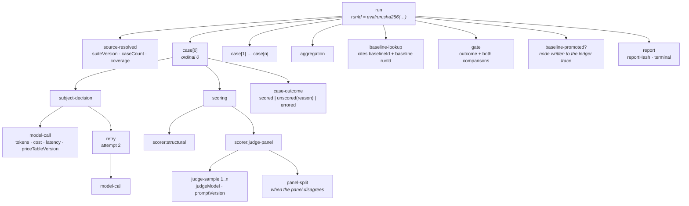

# `evals` — the minimal shape

**Shape:** minimal. **One verb.** `run`.

Everything the Phase 2 sketch asked the caller to supply — scorer, seed,
thresholds, baseline, gate invocation, subset selection, run identity — is
inferred, derived, or hidden. What survives as interface is what genuinely
cannot be known by the library: *which cases* and *which subject*.

The Phase 2 sketch had three entry points and a standing review rule that a
third is a signal to split. This design reads that rule as a warning about the
direction of travel and moves the other way: **`evaluate` and `shadow` collapse
into one verb whose return type is decided by the case source, and `gate`
disappears into the report.** A golden run cannot avoid being gated; a shadow
run has no gate to misapply, because `AgreementReport` has no gate field at all.

The claim this design is making, and the one to attack in §7:

> The minimality *is* the auditability mechanism. Every entry point is a place
> where a caller can construct an execution the library does not see. One verb
> is one such place. The reason C1 is satisfiable here is that there is nothing
> else to call.

---

## 1. The interface

### 1.1 Everything a caller learns

Four names. **One of them executes anything.**

| Name | Kind | Learned once? |
|---|---|---|
| `createEvals(deps)` | construction — the dependency-injection root | yes, at wiring |
| `evals.run(source, subject)` | the only verb | yes |
| `goldenSuite(...)` | shipped adapter at the `CaseSource` seam | at wiring |
| `recordedCases(...)` | shipped adapter at the `CaseSource` seam | at wiring |

A hostile reader will count four names and say this is not a one-verb module. I
accept the count. The distinction I am defending is that `goldenSuite` and
`recordedCases` are *values at a seam* — they take no behavioural decisions, run
nothing, record nothing, and appear once in an application's wiring — whereas
`run` is the only thing that executes a subject, invokes a scorer, spends money,
or writes to a trace. Entry points that execute: one.

### 1.2 Construction

```ts
// packages/agent-ops-core/src/evals/index.ts

export declare const Writes: unique symbol;

/** A model client with no way to cause an effect. */
export interface ReadOnlyClient {
  complete(req: ModelRequest): Promise<ModelResponse>;
}

/** A model client that can cause an effect. Branded, so it is *not*
 *  silently assignable where a read-only client is expected. */
export interface WriteCapableClient extends ReadOnlyClient {
  readonly [Writes]: true;
  execute(effect: Effect, key: IdempotencyKey): Promise<EffectOutcome>;
}

/** Collapses to `never` for anything carrying the write brand. */
export type NoWrite<C> = C extends { readonly [Writes]: unknown } ? never : C;

export interface EvalsDeps<C extends ReadOnlyClient> {
  /** The trace. Injected, never constructed. Also the run store,
   *  the idempotency store and the baseline ledger — see §3. */
  readonly audit: Audit;
  /** The subject's only lawful source of model capability. */
  readonly model: NoWrite<C>;
  /** Resolves scorer identifiers named *by the suite*, not by the caller. */
  readonly scorers: ScorerRegistry;
  /** No `Date.now()` exists anywhere in this module. */
  readonly clock: Clock;
  /** Default 8. Hard ceiling 32 — a higher value is a construction error,
   *  because an unbounded runner rate-limits the provider and produces
   *  failures indistinguishable from regressions. */
  readonly concurrency?: 1 | 2 | 4 | 8 | 16 | 32;
  /** Defaults: 30 min wall clock, 1 000 000 judge tokens, 2 retries per case.
   *  All three are ceilings, not targets. */
  readonly budget?: Partial<RunBudget>;
}

export function createEvals<C extends ReadOnlyClient>(
  deps: EvalsDeps<C>,
): Evals;
```

**The write constraint is exact, and it is the same mechanism `approval` uses
for its tier/handler constraint.** Naming the parameter `ReadOnlyClient` is not
enough: `WriteCapableClient extends ReadOnlyClient`, so under structural typing
a write-capable client is assignable to a read-only parameter. `NoWrite<C>`
inverts that. Given

```ts
const live: WriteCapableClient = makeProductionClient();
createEvals({ model: live, ... });
//            ^^^^^ Type 'WriteCapableClient' is not assignable to type 'never'.
```

the program does not typecheck. This is interface fact 3 — *the subject cannot
write* — and it is the identical guarantee that makes a shadow run's no-effect
property structural rather than a flag someone remembered to set.

The second half of the guarantee is that **`model` is not the subject's
parameter.** The subject never receives a client from the caller at all; it
receives one from a `NodeCursor` (§1.4), minted per node from `deps.model`.
There is therefore no channel through which a caller could hand a subject a
different client, and the one channel that exists rejects write capability at
compile time.

### 1.3 The verb

```ts
export interface Evals {
  run<S extends CaseSource>(source: S, subject: Subject): Promise<ReportOf<S>>;
}

export declare const GoldenBrand: unique symbol;
export declare const RecordedBrand: unique symbol;

export interface GoldenSuiteSource {
  readonly [GoldenBrand]: "golden";
  readonly suiteId: SuiteId;
  readonly suiteVersion: ContentHash;   // sha256 over the canonical suite bytes
  readonly coverage: "full" | "subset";
  readonly caseCount: number;
}

export interface RecordedCaseSource {
  readonly [RecordedBrand]: "recorded";
  readonly window: SamplingWindow;      // named, closed, and recorded
  readonly sampleKey: ContentHash;      // hash of the resolved correlation-ID list
}

export type CaseSource = GoldenSuiteSource | RecordedCaseSource;

export type ReportOf<S> =
  S extends GoldenSuiteSource   ? AccuracyReport
  : S extends RecordedCaseSource ? AgreementReport
  : never;
```

Two source types, two report types, one verb. The type-level defence of the
`CONTEXT.md` distinction is preserved and strengthened: not only is
`AgreementReport` unassignable to `AccuracyReport`, there is no `gate` function
anywhere to misapply, because gating is a *field on the accuracy report only*.

### 1.4 The two report types, made mutually unassignable

```ts
export declare const AccuracyBrand: unique symbol;
export declare const AgreementBrand: unique symbol;

export interface AccuracyReport {
  readonly [AccuracyBrand]: "accuracy";
  readonly [AgreementBrand]?: never;     // blocks the reverse assignment

  readonly runId: CorrelationId;         // derived — see §3.3
  readonly reportHash: ContentHash;      // independent of completion order
  readonly suiteVersion: ContentHash;
  readonly suiteId: SuiteId;
  readonly coverage: "full" | "subset";
  readonly subject: { id: SubjectId; version: ContentHash };
  readonly scorerSetVersion: ContentHash;
  readonly seed: Seed;                   // derived — see §3.2
  readonly deterministic: boolean;       // false iff any scorer declared itself so
  readonly scored: readonly MetricValue[];
  readonly unscored: readonly UnscoredCase[];   // reason-tagged; never averaged away
  readonly exemplars: readonly Exemplar[];      // bounded; worst-first by delta
  readonly cost: Money;                  // decimal string, never IEEE754
  readonly tokens: TokenCounts;
  readonly priceTableVersion: PriceTableVersion;
  readonly gate: GateOutcome;            // not optional; see below
}

export interface AgreementReport {
  readonly [AgreementBrand]: "agreement";
  readonly [AccuracyBrand]?: never;

  readonly runId: CorrelationId;
  readonly reportHash: ContentHash;
  readonly window: SamplingWindow;
  readonly sampledFrom: number;
  readonly subject: { id: SubjectId; version: ContentHash };
  /** The rate at which this run's verdicts match the recorded human
   *  decisions. Not accuracy. The baseline is human behaviour including
   *  human error. */
  readonly agreementRate: Rate;
  /** Every disagreement is a case for adjudication, never a defect. */
  readonly adjudications: readonly Adjudication[];
  readonly cost: Money;
  readonly tokens: TokenCounts;
  readonly priceTableVersion: PriceTableVersion;
  // deliberately absent: gate, baseline, thresholds, any field named `accuracy`
}
```

`AgreementReport` has no `gate`, no `scored`, and — searched for by the CI
author who wants a number — no field named `accuracy`. The only rate it carries
is spelled `agreementRate`.

### 1.5 The gate, as a value

```ts
export type GateOutcome =
  | { kind: "pass"; margin: readonly MetricDelta[]; baselineRun: CorrelationId;
      advancedBaseline: boolean }
  | { kind: "fail"; regressions: readonly Regression[]; baselineRun: CorrelationId }
  | { kind: "baseline-missing"; key: BaselineKey }
  | { kind: "baseline-incomparable"; overlap: number; required: number;
      baselineRun: CorrelationId }
  | { kind: "insufficient-coverage"; scored: number; total: number; required: number };
```

There is no `report.passed` boolean, no `assertPass()`, and no helper that
turns a `GateOutcome` into an exit code. The library owns the verdict; the
application owns the process. The intended call site is

```ts
if (report.gate.kind !== "pass") process.exit(1);
```

and the shape is chosen so that **the safe reading is the short one**. Interface
fact 7 — `BaselineMissing` must be explicit and must never silently pass — is
satisfied by construction: `baseline-missing` is not `pass`, and letting it
through costs the caller an extra clause they have to write on purpose.

### 1.6 Subject and cursor — the recording spine

```ts
export declare const CursorBrand: unique symbol;

export interface NodeCursor {
  readonly [CursorBrand]: true;

  /** Opens a child node, runs `body`, closes the node with timing, cost,
   *  outcome and any error. There is no `open`/`close` pair to unbalance. */
  node<T>(kind: NodeKind, attrs: NodeAttrs,
          body: (child: NodeCursor) => Promise<T>): Promise<T>;

  /** A model client bound to *this* node. Every call becomes a recorded
   *  `model-call` child with tokens, cost, latency and price-table version. */
  readonly model: ReadOnlyClient;
}

export interface Subject {
  readonly id: SubjectId;
  /** Content hash over prompts + code revision. Required. A report against an
   *  unversioned subject is as meaningless as one against an unversioned
   *  suite, and is refused for the same reason. */
  readonly version: ContentHash;
  decide(input: CaseInput, at: NodeCursor): Promise<Verdict>;
}
```

`Subject.decide` cannot be called by a caller: it needs a `NodeCursor`, whose
brand is a `declare`d unique symbol with no runtime value. Constructing one
requires a written `as` assertion — a visible, reviewable, lint-flaggable act —
and the resulting object has no store binding and throws on first use.

### 1.7 Invariants

1. **Recording is not a step in `run`; it is `run`'s skeleton.** Every unit of
   work in the module is executed *inside* a `node(...)` scope. There is no code
   path from `run` to a scorer, a subject, or a model call that does not pass
   through a cursor. §4.
2. **Parent is not inferred, it is the receiver.** A node can only be created
   from its parent's cursor, so the DAG's edges are the derivation chain of
   cursors. An unparented node is not constructible.
3. **Node identity is positional, not temporal.**
   `nodeId = sha256(parentNodeId ‖ kind ‖ ordinalWithinParent)`, where the
   ordinal comes from the suite's canonical case ordering, never from completion
   order. Two runs of the same (suite version, subject version, scorer set,
   seed) produce **identical node id sets**, so a replay diff is signal.
   Store-assigned sequence numbers record what actually happened when; node ids
   record where a node sits in the graph. Both are written; they do different
   jobs.
4. **Report hash is order-independent.** Aggregations are commutative; exemplar
   and adjudication lists are sorted by case id before hashing. Two runs at
   concurrency 1 and concurrency 32 produce the same `reportHash`.
5. **The subject cannot write.** Compile-time via `NoWrite<C>`; runtime backstop
   `SubjectAttemptedWrite` for dynamically constructed subjects.
6. **A suite is versioned and content-addressed or it is refused.** No
   `suiteVersion`, no run — `SuiteUnversioned`, before any model call.
7. **Thresholds live inside the versioned suite.** They are not a `run`
   parameter and not configuration. Loosening a gate therefore changes the
   suite's content hash and shows up in a pull request diff. See §3.1 for the
   `policyVersion` carve-out that keeps a threshold change from destroying
   baseline comparability.
8. **Passing is not advancing.** A run passes if it is within the suite's
   declared tolerance of the baseline. A run advances the baseline only if it
   is *not worse* than the baseline on every gated metric. These are different
   comparisons, and separating them is what stops twenty consecutive
   within-tolerance runs from ratcheting quality down 20%.
9. **A subset run never advances the baseline** and is keyed separately, so a
   pre-merge subset can never satisfy the nightly full-suite gate.
10. **Judge panels are never averaged.** `n > 1` samples; if the panel splits
    beyond the scorer's declared threshold, the case becomes `unscored` with
    reason `panel-split` and every sample is cited in the trace. A split is
    surfaced, not smoothed.
11. **evals cites; it never copies.** Node payloads carry content hashes and
    references (suite version + case id, or correlation id + sequence), never
    case payloads. §2.4 covers the one exception and why it is safe.
12. **Nothing is recorded outside the run's own trace.** A shadow run never
    appends to the production case's trace. Appending eval nodes to a closed
    production case would corrupt the evidence of what actually happened.

### 1.8 Ordering constraints

- Within `run`: `resolve source → open trace → per case (decide → score) →
  aggregate → baseline lookup → gate → promote-or-not → report`. Strict.
- Between cases: **none**. Embarrassingly parallel, bounded pool.
- Gating a partial run is unrepresentable: the report and its gate are produced
  together, and an aborted run produces no report at all.
- `recordedCases` reads only *closed* traces. Sampling an in-flight case would
  compare against a human decision that has not happened yet.

### 1.9 Error modes, each with a stated policy

| Name | Policy | Reason |
|---|---|---|
| `SuiteUnversioned` | **fail-closed**, before any spend | A report against an unversioned suite is not evidence. Interface fact 4. |
| `SuiteIntegrityMismatch` | **fail-closed** | Manifest hash ≠ computed hash. Tampering or a bad merge; either way the run's identity is a lie. |
| `SubjectUnversioned` | **fail-closed** | Same argument as the suite. |
| `TraceUnavailable` | **fail-closed, unconditionally** | Deliberately *unlike* `audit`'s tiered policy. `audit` lets a low-tier decision proceed unrecorded because the decision has value independent of its record. An eval run's only product **is** the record. There is nothing to preserve by continuing, so there is no tier at which continuing is right. |
| `Unredacted` | **fail-closed** | A recorded case arrived without a redaction marker. See §2.4. |
| `SubjectAttemptedWrite` | **fail-closed**, run aborts | Runtime backstop under the compile-time guarantee. |
| `UnattributedDecision` | **fail-closed for that case** → `unscored` | A subject returned a verdict with zero recorded model-call nodes. Either it is a pure function (declare it, and the check is waived) or it went around the cursor. §4.4. |
| `SubjectUnavailable` | bounded retry ×2 with seeded jitter, then `unscored: errored` | Provider flakiness must not read as regression; the unscored fraction gates. |
| `ScorerDisagreement` | case → `unscored: panel-split`, surfaced | Interface fact 6. Never averaged. |
| `InsufficientCoverage` | **gate outcome**, not an exception | Too many unscored cases means the run cannot support a verdict; `{ kind: "insufficient-coverage" }` is not `pass`. |
| `BaselineMissing` | **gate outcome**, not an exception | Interface fact 7. Not `pass`. |
| `BaselineIncomparable` | **gate outcome** | Case overlap with the baseline run below the suite's declared minimum. |
| `BudgetExceeded` | **run aborts**; nodes stay, no report, no run-key index entry | Partial failure cannot corrupt the trace: the trace is append-only and the run node closes as `aborted`. A repeat of the same run key re-executes, because only *completed* runs are idempotently cached. |
| `CaseSourceUnavailable` | **fail-closed** | |

Note what is *not* an error: a failing gate. `{ kind: "fail" }` is a returned
value describing a working measurement, in the same way an abstention is a
verdict rather than a failure.

### 1.10 Required configuration

Injected at `createEvals` and nowhere else: `audit`, `model`, `scorers`,
`clock`. Optional with stated defaults: `concurrency` (8, ceiling 32), `budget`
(30 min, 1M judge tokens, 2 retries).

Nothing is configured per run. Seed, thresholds, baseline, scorer selection, run
identity and gate invocation are all derived — §3.

### 1.11 Performance characteristics

- Target, per interface fact 8: **200 golden cases under 5 minutes at
  concurrency 8** — a 12-second budget per case, dominated by the subject.
- Recording overhead: 6–10 nodes per case (case → decision → 1..n model calls
  → scoring → 1..n judge samples → outcome), so 1 200–3 000 nodes per run.
  Appends are O(1) and batched per case subtree; at `audit`'s stated p99 of
  10 ms this is single-digit seconds across the run. Recording is roughly 1–2%
  of run wall clock, which is the number that makes "record everything"
  affordable.
- `run` is off the hot path entirely. It is never called from a request path.
- Memory is bounded by concurrency, not by suite size: cases stream, exemplars
  are a bounded top-N, and the report holds aggregates.

---

## 2. Usage example — invoice approval

The invoice-approval application has a suite of 200 adjudicated golden invoices
and a nightly shadow run against last week's closed production cases.

### 2.1 Wiring, once

```ts
// apps/invoice-approval/src/evals-wiring.ts
import { createEvals, goldenSuite, recordedCases } from "@acme/agent-ops-core/evals";
import { postgresAudit } from "@acme/agent-ops-core/audit";

export const evals = createEvals({
  audit:   postgresAudit(pool, systemClock),
  model:   readOnlyAnthropic(process.env.ANTHROPIC_API_KEY!), // read-only by type
  scorers: registry({ structural: fieldMatch, judge: judgePanel({ n: 5 }) }),
  clock:   systemClock,
  concurrency: 8,
});
```

If someone reaches for the client the production workflow already has:

```ts
  model: productionClient,
//^^^^^ Type 'WriteCapableClient' is not assignable to type 'never'.
```

The build fails. Not a review comment, not a lint rule — the build.

### 2.2 The pre-merge gate

```ts
// apps/invoice-approval/ci/pre-merge.ts
const report = await evals.run(
  goldenSuite("evals/invoices.suite.json", repoFiles).subset("pre-merge"),
  invoiceSubject(),                        // Subject: id + version + decide
);

// report: AccuracyReport — the conditional return type resolved from the source
console.log(renderTable(report));
if (report.gate.kind !== "pass") process.exit(1);
```

No scorer argument: `invoices.suite.json` names `structural` for the
line-item extraction metric and `judge` for the "was the rejection reason
adequate" metric, and the registry resolves them. No seed: derived from the
suite version. No thresholds: they are in the suite. No baseline: looked up by
`(suiteId, subjectId, scorerSetVersion, coverage)`. No `gate(...)` call: the
report arrives gated.

### 2.3 First run on a new suite — the unhappy path that matters most

```
suite      invoices@sha256:9f31…  (subset "pre-merge", 40 cases)
subject    invoice-approval@sha256:11ab…
scored     38/40    line_item_f1 0.947    reason_adequacy 0.88 (judge, n=5)
unscored   2        panel-split: INV-0142, INV-0311
gate       BASELINE-MISSING
           key = invoices / invoice-approval / scorers@sha256:77cd… / subset
           No prior run exists for this key. This run has not been compared
           against anything. It has been recorded as run
           evalrun:sha256:4c02… and will become the baseline on the next
           passing full-coverage run.
exit 1
```

The build fails on the first run. That is the design intent of interface fact 7
and it is the moment where most gates get quietly weakened. The mitigation here
is deliberately *not* a config key: to get green you must run once, look at the
numbers, and re-run — an act which is recorded, because the promotion is a node.

Two other unhappy paths in the same output:

- **Panel split on two cases.** Five judge samples disagreed beyond the
  scorer's declared threshold. The cases are `unscored`, not averaged to 0.6.
  All five samples with their judge model and prompt version are in the trace.
- If splits had exceeded the suite's coverage floor, the gate would read
  `insufficient-coverage` — a run that cannot support a verdict does not get
  to issue one.

### 2.4 The nightly shadow run

```ts
const agreement = await evals.run(
  recordedCases(audit, { from: "2026-08-10", to: "2026-08-17", sample: 500 }),
  invoiceSubject(),
);

// agreement: AgreementReport
report(agreement.agreementRate, agreement.adjudications);

// @ts-expect-error — Property '[AccuracyBrand]' is missing.
if (agreement.gate.kind !== "pass") process.exit(1);
//            ^^^^ Property 'gate' does not exist on type 'AgreementReport'.
```

The CI author who tries to gate on the shadow run does not get a bad gate; they
get a compile error, twice over — `gate` does not exist on the type, and the
report is not assignable where an accuracy report is expected.

**On redaction.** The only inputs `evals` ever hands a scorer are (a) golden
case content from a version-controlled suite and (b) records read from `audit`,
which were redacted before write and carry a redaction marker. A record without
that marker raises `Unredacted` and fails the run closed. Consequently `evals`
needs no redaction policy of its own and introduces no seam for one: it cannot
see unredacted personal data, and the judge rationales it stores can only quote
material that was already safe to store.

---

## 3. What the implementation hides

This is where a minimal shape either earns its keep or is revealed as a
pass-through. Each row is something the Phase 2 sketch demanded from the caller.

### 3.1 Thresholds → inside the versioned suite

A suite file carries its own gate policy:

```jsonc
{ "suiteId": "invoices",
  "policyVersion": 3,                       // excluded from the case-content hash
  "gate": { "line_item_f1": { "min": 0.93, "tolerance": 0.005 },
            "reason_adequacy": { "min": 0.85, "tolerance": 0.02 },
            "coverageFloor": 0.95, "baselineOverlapMin": 0.8 },
  "cases": [ /* … */ ] }
```

Two hashes are computed: `suiteVersion` over the whole canonical file (this is
what a report cites and what shows in a PR diff), and `caseSetVersion` over the
cases alone (this is what baseline *comparability* keys on). Tightening a
threshold therefore changes `suiteVersion` — visible, deliberate, reviewed —
without resetting the comparison history, which it would if there were one hash.
That two-hash trick is the price of hiding thresholds, and it is a real cost:
there are now two version numbers to explain to a newcomer.

### 3.2 Seed → derived

`seed = sha256(suiteVersion ‖ subjectVersion ‖ scorerSetVersion)`. Interface
fact 5 says a run is deterministic given exactly those inputs plus a seed; if
the seed is a *function* of those inputs, the qualifier collapses and
determinism becomes a property of the tuple alone. There is deliberately **no
way to force a fresh sample**. If you want a different answer, change something
real — the suite, the subject, or the scorer configuration. §6 names who this
hurts.

### 3.3 Run identity, idempotency and replay → one derived thing

```
runKey = sha256(suiteVersion ‖ subjectVersion ‖ scorerSetVersion ‖ sourceKey)
runId  = "evalrun:" ⟨runKey⟩            // this is the correlation ID
```

The run key *is* the correlation ID. Consequences, all free:

- **Idempotency** (C2): a repeat `run` with the same inputs finds a completed
  trace at that correlation ID and returns the recorded report rather than
  re-executing. CI re-running on the same commit does not burn judge tokens
  twice, and the repeat returns the *original* outcome — it neither
  re-executes nor errors.
- **Replay** (C1): `audit.replay(report.runId)` reproduces the whole graph, not
  just the answer. The report is the terminal node of its own trace.
- Only *completed* runs are cached. An aborted run leaves its nodes behind for
  forensics but no index entry, so a retry after an infrastructure failure
  genuinely re-runs.

### 3.4 The baseline → an append-only ledger in `audit`, not a store

The Phase 2 sketch had a `BaselineStore` seam with one adapter and called the
second speculative. This design **deletes the seam entirely**.

The baseline for a key is the most recent `baseline-promoted` node in a
long-lived trace under a derived correlation ID:

```
baselineId = "evalbaseline:" ⟨sha256(suiteId ‖ subjectId ‖ scorerSetVersion ‖ coverage)⟩
```

Each promotion is a node citing the run that justified it. Because `audit` is
append-only with database grants that withhold `UPDATE`/`DELETE`, a baseline can
only ever be *advanced*, never rewritten, and every advance is evidence. The
baseline is a citation, never a copy of a report — consistent with invariant 11.

Promotion is derived, with no configuration key: a run advances the baseline iff
its coverage is `full` **and** it is not worse than the current baseline on
every gated metric (invariant 8). There is no `promote()` verb, which is exactly
how this design avoids a third entry point without hiding one behind a flag.

**What this costs:** the baseline stops being a file you can see move in a pull
request. Engineers like seeing `0.91 → 0.93` in a diff, and they lose it. A
file-in-repo mirror is easy to build — *in the application*, from
`audit.replay(baselineId)`. It is not the library's job, and making it the
library's job would be the fourth name.

### 3.5 Also hidden

- **Bounded-concurrency runner** with per-case timeout, per-run wall clock and
  token budget, and bounded jittered retries seeded from the derived seed.
- **Byte-stable canonical serialisation**: keys sorted by UTF-16 code unit,
  money as decimal strings with explicit scale, tokens as integers, timestamps
  RFC3339 UTC with milliseconds from the injected clock, hashes prefixed with
  their algorithm (`sha256:…`) so a successor can co-exist. No IEEE-754 ever
  reaches the trace.
- **Schema evolution over seven years**: every node payload carries
  `{ v: 1, kind }`. Fields may be added, never removed or retyped. A shape
  change gets a **new `kind` string**, never a redefined one. Decoders for
  every version live in `lib/decode/` and are never deleted; readers must
  preserve unknown fields verbatim. A run written today decodes in 2033 because
  its decoder is still compiled in and its `kind` still means what it meant.
- **Judge panel mechanics**: n samples, judge model and prompt version on every
  sample node, split detection, and the refusal to average.
- **Coverage arithmetic**, exemplar selection, metric deltas, regression
  attribution.
- **Concurrent-writer correctness**: many workers append to one correlation ID;
  ordering is assigned by the store, never by the runner.

### 3.6 The deletion test

Delete `evals` and nineteen applications each rebuild: a bounded-concurrency
runner, content-addressed suites, seed derivation, baseline storage and
promotion policy, judge-panel flakiness handling, gate arithmetic, byte-stable
report hashing, and a node-level trace of all of it. None of that is
domain-specific, and at least three of them (promotion policy, panel handling,
order-independent hashing) will be got subtly wrong in most of the nineteen, in
ways that surface as quality drift six months later. Complexity reappears
nineteen times and divergently. **It earns its keep.**

---

## 4. How C1 is satisfied

### 4.1 The node graph



Every node carries: node id (positional, invariant 3), parent node id,
store-assigned sequence, kind, schema version, opened-at and closed-at from the
injected clock, cost, tokens, price-table version, outcome, error if any, and
**citations rather than payloads**.

### 4.2 Why an unrecorded execution is unrepresentable *through this interface*

Four structural facts, in order of strength:

1. **There is one verb.** The caller cannot iterate the suite, cannot invoke a
   scorer, cannot call the subject, cannot reach a baseline, cannot construct a
   report. Every one of those is reachable only from inside `run`. Where a
   three-entry-point design has three places to get recording right, this has
   one. *This is the whole argument for the shape.*
2. **`Subject.decide` is uncallable without a cursor.** Its second parameter is
   a branded type with no runtime constructor. A caller who wants to run a
   subject outside `run` must write an `as` assertion, and the object they
   fabricate has no store binding and throws.
3. **The only lawful model client is minted per node.** `deps.model` is never
   handed to the subject. The subject reaches model capability only via
   `cursor.model`, and each call becomes a `model-call` child of the node whose
   cursor it came from. Attribution is not a convention the subject follows; it
   is the only route to the capability.
4. **Nodes are scopes, not open/close pairs.** `node(kind, attrs, body)` records
   the open, the timing, the cost, the outcome, and — on a thrown error — the
   error node, before rethrowing. A dangling open node is not constructible, so
   partial failure cannot corrupt the trace. Parent linkage is the receiver, so
   an unparented node is not constructible either.

### 4.3 Where the recorder comes from

`audit` is a constructor parameter. `evals` never constructs a store, a client,
a clock or a file handle. This is what makes tests hermetic (C3) and what lets
nineteen applications share one trace store. With the in-memory `audit` adapter
and the recorded-response client adapter injected, a test **cannot** reach a
live model even with real credentials in the environment — not because a flag
says so, but because there is no code path from `evals` to a socket.

### 4.4 The honest hole

**An unrecorded execution is not literally impossible, and I will not claim it
is.** TypeScript cannot stop an application's `Subject.decide` from closing over
a provider SDK it imported itself and making a model call that never touches the
cursor. No library-level type prevents that; it needs process-level enforcement
(an `undici` interceptor, or Node's permission model) which is outside a
library's reach.

What this design does instead is make the bypass *fail closed and visible*:

> A case whose `subject-decision` subtree contains **zero** `model-call` nodes,
> where the subject has not declared itself pure, raises
> `UnattributedDecision`. That case becomes `unscored`, which counts against
> the suite's coverage floor, which fails the gate.

So a subject that goes around the cursor does not produce a quietly
under-recorded green run — it produces a red one. That is as close to
structural as a library can get, and the residual gap (a subject that records
*and also* calls out of band) is real. It is named here rather than narrowed
away.

---

## 5. Seams and adapters

C5 applied to my own design: name the second adapter or do not build the seam.

### Real seams

**`CaseSource`** — the seam that made the `shadow` merge correct.
- Adapter 1: `goldenSuite(path, fileReader)` — a versioned, content-addressed
  suite on disk, with `.subset(name)` producing a separately keyed source.
- Adapter 2: `recordedCases(audit, window)` — closed production cases read from
  `audit`, with their recorded human decisions as the comparison.
- **Real.** Two shipped adapters, and the type of the source is what selects the
  report type. The adapter's own dependency (`fileReader`, `audit`) is injected,
  so neither adapter constructs I/O either.

**`Scorer`** (resolved through `ScorerRegistry` by identifiers the *suite*
names).
- Adapter 1: deterministic structural comparison.
- Adapter 2: LLM-as-judge panel, `n > 1`, recording judge model and prompt
  version per sample.
- **Real.** A third adapter already has a named caller: groundedness, implemented
  once here and *used* by `guardrails`, per the Phase 2 recommendation. That is
  a third adapter at an existing seam, not a new seam.

**`ReadOnlyClient`**.
- Adapter 1: provider-backed read-only client.
- Adapter 2: recorded-response replay client — the thing that makes hermetic
  testing structural rather than conventional, and that makes a re-run of a
  deterministic suite genuinely free.
- **Real**, and C3 forces the second adapter to be a shipped deliverable rather
  than a test mock.

**`Clock`** — system clock / controllable test clock. **Real**, trivial, and the
same convention as every other module. Listed for completeness; it earns no
discussion.

### Seams refused

- **`BaselineStore` — not built.** Replaced by the append-only ledger in
  `audit` (§3.4). Phase 2 called its second adapter speculative and it was
  right; the honest response is to delete the seam, not to ship a one-adapter
  seam and hope.
- **`RedactionPolicy` — not built.** `evals` cannot see unredacted data (§2.4).
  A seam with nothing behind it.
- **`ReportRenderer` / export format — speculative, do not build.** Reports are
  values; nineteen applications can render them. The second adapter would be a
  second file format, which nobody has asked for.
- **`SuiteAuthoring` / adjudication-to-golden promotion — speculative, do not
  build.** `AgreementReport.adjudications` is data; turning an adjudicated
  disagreement into a golden case is a human act producing a version-controlled
  file. It would also be the fourth name.
- **`TraceStore` — not this module's seam.** `evals` consumes `audit`'s
  interface; `audit` owns that seam and its two adapters.
- **A `PromotionPolicy` seam — deliberately refused.** Making promotion
  configurable is exactly how tolerance-ratcheting gets reintroduced. The rule
  in invariant 8 is structural, and if an application disagrees with it, that is
  a conversation about the rule, not a config key.

---

## 6. Trade-offs

### Where leverage is highest

- **One verb, both case sources, both report types, gate included.** A caller
  learns `run` and gets: bounded-concurrency execution, content-addressed
  versioning, seed derivation, scorer resolution, judge-panel handling, baseline
  lookup, gate arithmetic, promotion policy, idempotency, full node-level
  tracing, and a replayable correlation ID. That ratio is the point of the
  shape.
- **Nothing to misconfigure per run.** Nineteen applications cannot drift into
  nineteen different threshold conventions, because thresholds are in the suite
  and the suite is in version control.
- **Two structural defences that cost the caller nothing**: tolerance-ratcheting
  (invariant 8) and subset-satisfying-the-full-gate (invariant 9) are both
  impossible, and neither required the caller to know they existed.

### Where leverage is thin

- **The conditional return type is worse tooling than two verbs.** Hovering
  `run` shows `Promise<ReportOf<S>>`, not `Promise<AccuracyReport>`. Error
  messages from a mismatched source mention `never`. Two named verbs would read
  better in an editor, and I have traded that away.
- **`goldenSuite(...).subset("pre-merge")` is a fluent builder wearing a
  disguise.** It is a fourth name and a fifth method, and an honest reader
  should count it. My defence is that it is at a seam and executes nothing; I
  do not think that defence is airtight.

### Who suffers, specifically

- **The researcher sweeping seeds.** There is no seed parameter and no
  force-rerun. Comparing five judge temperatures means five scorer registry
  configurations, hence five `scorerSetVersion`s, hence five baseline keys. That
  is more ceremony than a `{ seed }` argument, and for exploratory work it is
  worse. I think the trade is right — an escape hatch on determinism is an
  escape hatch on the entire evidentiary claim — but the researcher is genuinely
  paying for it.
- **The engineer with a corrupted cached run.** Because run identity is fully
  derived, a completed-but-wrong report cannot be re-run through the interface at
  all. Recovery means evicting the trace at the adapter level — outside `evals`,
  and awkward in an append-only store. This is the sharpest edge in the design.
- **The team tightening a gate mid-quarter.** They must edit the suite, which
  bumps `suiteVersion`, which shows in a diff. That is the intent, but it means
  a threshold change goes through code review and cannot be done from a
  dashboard at 4pm on a Friday. Some teams will experience that as friction and
  will be right that it is friction.
- **The reviewer who wants the baseline in the diff.** §3.4. They must build a
  mirror in their application.
- **The application with an ad-hoc one-off scorer.** It must be registered in
  the scorer registry at wiring, with a version, before it can be named by a
  suite. There is no `run(source, subject, scorer)` escape.

### What this shape makes hard

Extension. Every future capability — a new report type, a cost-only dry run, a
per-case explain mode, a stratified sampler — has nowhere to go except into
`run`'s inference rules or into a new adapter at an existing seam. That is
deliberate: the review rule says a third entry point is a signal to split, and
this design starts from one so that the signal fires earlier. But a caller with
a legitimate need that does not fit the inference rules has no polite way in,
and will fork.

---

## 7. The strongest argument against this design

**Collapsing `evaluate` and `shadow` into `run` removes the single most
effective defence against the conflation that `CONTEXT.md` spends four hundred
words warning about — and replaces it with a defence that does not operate where
the failure actually happens.**

The failure mode is not a program assigning an `AgreementReport` to an
`AccuracyReport`. That was already impossible in the Phase 2 design, and it is
impossible here. The failure mode is a **human reading a number aloud in a room
where the distinction is not present** — an engineer pasting `agreementRate:
0.97` into a slide, a manager hearing "97%", a board pack recording "97%
accurate". Types do not typecheck slides.

In the Phase 2 design the call site reads:

```ts
const r = await evals.shadow(cases, subject, scorer);
```

The word `shadow` is at the call site, in the diff, in the code review, in the
stack trace, in the log line, in the CI job name someone copied from the
function name. It is a speed bump at the exact moment a person is forming the
mental model they will later repeat out loud. In this design both call sites
read:

```ts
const r = await evals.run(source, subject);
```

and the semantic cliff — *this baseline is human behaviour including human
error; 97% agreement with reviewers who are wrong 8% of the time is not 97%
right* — is visible only in the type of a variable, in an editor, to someone
who hovers. **I have traded a defence that works on humans for a defence that
works on compilers, in a domain where the compiler was never the one making the
mistake.**

My mitigations are honest but weaker than the thing I removed: the report type
is named `AgreementReport`, its rate is named `agreementRate`, it has no field
named `accuracy`, and it carries no gate. Those are good. They are all one level
of indirection away from the call site, and the Phase 2 verb was zero.

There is a second, sharper version of the same attack. The Phase 2 review
recorded a standing rule — *a third entry point on `evals` is a signal to split
the module, not to extend it* — and reasoned that two entry points with two
report types was the mitigation for `evals` becoming the module that does
everything. This design goes to one entry point and **absorbs the gate as
well**, which is strictly more responsibility behind strictly less interface.
The rule was designed to fire when `evals` grew. I have made it structurally
incapable of firing: there is no count that can reach three, because everything
new arrives as an inference rule inside `run` or as an adapter at an existing
seam. A tripwire you have disconnected is not a tripwire. If this module does
drift shallow — if `run`'s inference rules accumulate until nobody can predict
what a call will do — this design has removed the instrument that was supposed
to detect it.

I would still ship it, for one reason: the C1 argument in §4.2 is real, and it
gets weaker with every entry point added. But if the answer to "how do we stop
someone reporting agreement as accuracy" turns out to matter more than "how do
we guarantee nothing runs unrecorded", then the two-verb design is better and
this document is the record of why.

---

## Appendix — module shape (C4)

```
packages/agent-ops-core/src/evals/
  index.ts          ← createEvals, run, goldenSuite, recordedCases,
                      and the types above. Public.
  lib/
    runner.ts       ← bounded pool, budgets, retries
    cursor.ts       ← NodeCursor: the only constructor of nodes and clients
    suite.ts        ← canonical serialisation, two hashes, subsets
    recorded.ts     ← audit-backed source, redaction-marker check
    score.ts        ← registry resolution, panel handling
    gate.ts         ← comparison, promotion rule, coverage floor
    decode/         ← one decoder per node payload version, never deleted
  tests/            ← cross the same seam as callers: createEvals + run only,
                      with in-memory audit and the recorded-response client
```

No test reaches past `index.ts`. If one needs to, the module is the wrong shape.
