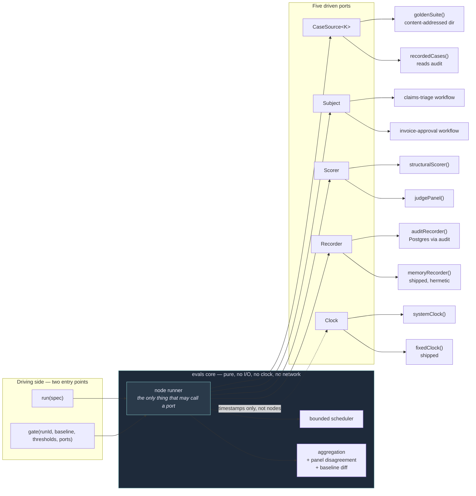
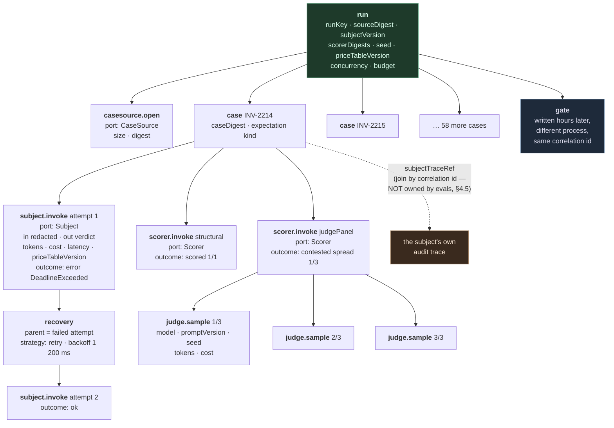

# `evals` — ports and adapters

**Shape:** ports and adapters, pushed to its honest extreme.
**Status:** design only. No implementation code exists.

---

## The thesis, before the types

A ports-and-adapters design earns its place here for one reason, and it is not
testability.

**C1 says every node in the execution graph is recorded. This shape gets to
*define* what a node is: a node is a port invocation.** Not "an interesting
step". Not "a step someone remembered to instrument". A port invocation. That
definition is checkable by a machine, because the set of ports is finite,
declared, and typed — and because the core is physically unable to reach across
a seam except through a port.

In every other shape, "which steps count as nodes?" is a judgement call made
repeatedly by whoever is writing the runner, and the answer drifts. Here the
question does not arise. If it crossed a seam, it is a node. If it did not
cross a seam, it is a pure function of already-recorded inputs and replay
recomputes it.

That is the entire argument for taking this shape on `evals`. Everything else
in this document is either the consequence of it or the price of it.

The counter-discipline — and the reason this document spends as much space
refusing ports as declaring them — is that the shape's famous failure is
manufacturing seams. **I declare five ports and I refuse seven.** The refusal
list in §5 is the part of this design I would defend hardest.

---

## Table of contents

1. [The interface](#1-the-interface)
2. [Usage example](#2-usage-example--invoice-approval-pre-merge-gate)
3. [What the implementation hides](#3-what-the-implementation-hides)
4. [How C1 is satisfied](#4-how-c1-is-satisfied)
5. [Seams and adapters](#5-seams-and-adapters)
6. [Trade-offs](#6-trade-offs)
7. [The strongest argument against this design](#7-the-strongest-argument-against-this-design)

---

## 1. The interface

### 1.1 The hexagon



### 1.2 Entry points — there are exactly two

```ts
// packages/agent-ops-core/src/evals/index.ts

/**
 * Execute a run. The report type is determined by the case source port,
 * not by which function you called.
 *
 * Fails closed on: SuiteUnversioned, SuiteVersionMismatch, RecorderUnavailable,
 * CaseSourceUnavailable, SubjectAttemptedWrite, BudgetExhausted.
 * Idempotent by runKey — see §1.9.
 */
export function run<K extends SourceKind>(
  spec: RunSpec<K>,
): Promise<ReportOf<K>>;

/**
 * Compare a completed run against a baseline. Takes a RunId, never a report —
 * you cannot gate a report you fabricated. See §4.4.
 *
 * Never throws for the ordinary outcomes. BaselineMissing is a GateOutcome,
 * not an exception, and it does not pass.
 */
export function gate(
  runId: RunId<"golden">,
  baseline: Baseline,
  thresholds: Thresholds,
  ports: GatePorts,
): Promise<GateOutcome>;
```

Two entry points, satisfying the review rule that a third is a signal to split
rather than extend. `evaluate` and `shadow` from the Phase 2 sketch have been
collapsed into one `run`: **which report you get is a property of which
`CaseSource` adapter you plugged in.** Agreement-is-not-accuracy stops being a
convention about which function to call and becomes a consequence of where the
cases came from, which is where the distinction actually lives.

Everything else exported from `index.ts` is a port interface (a type) or a
shipped adapter factory (configuration, not execution). §6.2 argues about
whether that counts against the review rule.

### 1.3 The port bundle

Every cross-seam dependency is here. There are no others. `evals/lib/**` is
forbidden by dependency-cruiser from importing `node:http`, `node:https`,
`node:fs`, `node:child_process`, `undici`, or reading `process.env`.

```ts
export interface Ports<K extends SourceKind> {
  readonly cases: CaseSource<K>;
  readonly subject: Subject;
  readonly scorers: readonly [Scorer, ...Scorer[]];   // at least one, in the type
  readonly recorder: Recorder;
  readonly clock: Clock;
}

export interface RunSpec<K extends SourceKind> {
  readonly ports: Ports<K>;
  readonly seed: Seed;                    // required. No default seed.
  readonly limits: Limits;                // required. No default budget.
  readonly priceTable: PriceTable;        // required. Data, not a port — §5.2
  readonly label: RunLabel;               // human-readable, e.g. "pre-merge"
}

export interface GatePorts {
  readonly recorder: Recorder;
  readonly clock: Clock;
}
```

Note what is **required with no default**: `seed`, `limits`, `priceTable`. A
default seed makes a non-deterministic run look reproducible. A default budget
is an unbounded budget wearing a number. A default price table silently
rewrites your historical cost figures the next time a provider changes prices —
the one fact that survived the `telemetry` cut.

### 1.4 Port: `CaseSource<K>` — and the report type it determines

```ts
export type SourceKind = "golden" | "recorded";

export interface CaseSource<K extends SourceKind> {
  readonly kind: K;
  /** Content address of the whole source. Non-optional: an unversioned
   *  source cannot be constructed, so a report against one cannot exist. */
  readonly digest: SourceDigest;
  /** Declared up front so budget, progress and backpressure are computable.
   *  A source that cannot declare its size must declare a hard cap instead. */
  readonly size: number;
  /** Bounded. The runner never buffers more than `limits.prefetch` cases. */
  open(): AsyncIterable<EvalCase<K>>;
}

export interface EvalCase<K extends SourceKind> {
  readonly caseRef: CaseRef;
  readonly digest: CaseDigest;
  /** Redacted at the adapter, before it enters the core. See §1.10. */
  readonly input: Redacted<CasePayload>;
  readonly expectation: ExpectationOf<K>;
}

/** Golden cases assert a correct verdict. Recorded cases carry what a human
 *  actually did — which is not the same thing and is typed as not the same. */
export type ExpectationOf<K> =
  K extends "golden"   ? { readonly kind: "correct-by-construction";
                           readonly verdict: Verdict;
                           readonly adjudicatedBy: AuthorityRef;
                           readonly adjudicatedAt: Instant }
: K extends "recorded" ? { readonly kind: "recorded-human-decision";
                           readonly verdict: Verdict;
                           readonly correlationId: CorrelationId;
                           readonly authority: AuthorityRef }
: never;
```

The report type falls out of the source kind:

```ts
export type ReportOf<K extends SourceKind> =
  K extends "golden"   ? AccuracyReport
: K extends "recorded" ? AgreementReport
: never;
```

### 1.5 The two incompatible report types

Both are nominally sealed with a non-exported `unique symbol`, so neither is
assignable to the other **in either direction** — not by structural accident,
not by a widening cast that looks innocent in review.

```ts
declare const ACCURACY: unique symbol;   // not exported
declare const AGREEMENT: unique symbol;  // not exported

export interface AccuracyReport {
  readonly [ACCURACY]: true;
  readonly kind: "accuracy";
  readonly runId: RunId<"golden">;
  readonly suite: SourceDigest;
  readonly subject: SubjectVersion;
  readonly scorers: readonly ScorerDescriptor[];
  readonly determinism: Determinism;
  readonly cases: number;
  /** Exact rationals, never floats. Byte-stable across platforms. §3.2 */
  readonly correct: Ratio;
  readonly incorrect: Ratio;
  readonly unscored: Ratio;      // judge unavailable, subject errored — never "passed"
  readonly contested: Ratio;     // panel split beyond threshold
  readonly cost: CostSummary;    // includes priceTableVersion
  readonly startedAt: Instant;
  readonly finishedAt: Instant;
}

export interface AgreementReport {
  readonly [AGREEMENT]: true;
  readonly kind: "agreement";
  readonly runId: RunId<"recorded">;
  readonly cohort: SourceDigest;
  readonly subject: SubjectVersion;
  readonly scorers: readonly ScorerDescriptor[];
  readonly determinism: Determinism;
  readonly cases: number;
  readonly agreed: Ratio;
  readonly disagreed: Ratio;
  readonly unscored: Ratio;
  readonly contested: Ratio;
  readonly cost: CostSummary;
  readonly startedAt: Instant;
  readonly finishedAt: Instant;

  /** Required, literal-typed, and therefore present in every serialisation,
   *  every JSON dump, every dashboard that renders the object naively.
   *  It costs one field to make the trap visible everywhere the number goes. */
  readonly interpretation:
    "agreement is not accuracy — the baseline is human behaviour including "
    + "human error; every disagreement is a case for adjudication, not a defect";

  /** Disagreements are enumerated, not summarised. An agreement report whose
   *  disagreements you cannot open is a number with no evidence behind it. */
  readonly disagreements: readonly DisagreementRef[];
}
```

There is **no field named `accuracy`, `correct`, or `score` on
`AgreementReport`**, and no field named `agreement` on `AccuracyReport`. The
vocabulary separation from `CONTEXT.md` is enforced by the absence of the
tempting name, not by a comment asking people not to use it.

`gate` accepts `RunId<"golden">`. Passing a shadow run's id is a compile error
(§2.4), and a stringly-typed id smuggled in from an environment variable is
caught at runtime by the recorder, which knows the run's kind (§1.8).

### 1.6 Port: `Subject` — and the no-write guarantee

This is the load-bearing type in the module. The guarantee is: **a subject that
wants to write cannot be plugged in.** Not "will be caught"; cannot be plugged
in.

```ts
declare const READ_ONLY: unique symbol;   // not exported

export interface ReadOnlyClient {
  readonly [READ_ONLY]: true;
  read<T>(q: Query<T>): Promise<T>;
}

export interface WriteCapableClient {
  read<T>(q: Query<T>): Promise<T>;
  write(effect: Effect, key: IdempotencyKey): Promise<EffectOutcome>;
}

export interface SubjectContext {
  /** The runner constructs this. There is no code path in `evals` that can
   *  produce a WriteCapableClient — the type is imported for the constraint,
   *  never instantiated. */
  readonly client: ReadOnlyClient;
  readonly correlationId: CorrelationId;  // the subject's own audit trace joins here
  readonly seed: Seed;                    // per-case, derived from run seed + caseRef
  readonly deadline: Instant;
}

export interface Subject {
  readonly version: SubjectVersion;       // required — a report names what it tested
  readonly invoke: (
    ctx: SubjectContext,
    input: Redacted<CasePayload>,
  ) => Promise<Verdict>;
}
```

`invoke` is a **function-typed property, not a method**. That is not cosmetic:
under `strictFunctionTypes`, TypeScript checks parameter types
*bivariantly* for method declarations and *contravariantly* for function-typed
properties. The guarantee only exists in the second form.

```ts
// This is the compile error the design exists to produce.
const payingSubject: Subject = {
  version: "invoice-approval@2026.08.14",
  invoke: async (ctx: { client: WriteCapableClient; /* ... */ }, input) => {
    await ctx.client.write(payment, key);   // never reached — does not compile
    return verdict;
  },
};
// ts(2322): Type '(ctx: { client: WriteCapableClient; ... }, ...) => ...' is not
// assignable to type '(ctx: SubjectContext, ...) => Promise<Verdict>'.
//   Types of parameters 'ctx' and 'ctx' are incompatible.
//     Property 'write' is missing in type 'ReadOnlyClient'.
```

And the reverse direction is sealed too: `WriteCapableClient` lacks the
`[READ_ONLY]` brand, so nothing can hand a write-capable client into a
`SubjectContext` even inside the library.

**This is the same mechanism as `approval`'s tier constraint**, which is why the
Phase 2 review used it as the argument for merging `shadow` into `evals`. In
`approval` the mapping is by tier rather than by run mode:

```ts
type ClientFor<T extends Tier> =
  T extends "high"   ? ReadOnlyClient
: T extends "medium" ? ReadOnlyClient
: WriteCapableClient;

// register is generic in T and the handler is a function-typed parameter,
// so the same contravariance rule applies:
declare function register<T extends Tier>(
  tier: T,
  handler: (client: ClientFor<T>) => Promise<Verdict>,
): void;

register("high", async (c: WriteCapableClient) => v);
// ts(2345): 'ReadOnlyClient' is not assignable to 'WriteCapableClient'.
//   Property 'write' is missing.  ← compile error, exactly as required.

register("low", async (c: WriteCapableClient) => v);   // ✅ compiles
```

One capability vocabulary, two modules, one guarantee. If these types are
defined twice, the guarantee is defined twice and will diverge; they live in a
shared root file both modules import.

**The `SubjectAttemptedWrite` runtime backstop** still exists, because a subject
constructed by `JSON.parse` and a `Function` constructor is outside the type
system's reach. When the runner's `ReadOnlyClient` observes an attempt to reach
a write path (via a poisoned `write` property that throws), the run **aborts
entirely** — not just the case. Reason: a subject that tried to write may have
written through some channel we do not own, so the run's no-effect guarantee is
void and every remaining case is suspect. Fail-closed, no partial report.

### 1.7 Port: `Scorer`

```ts
export interface Scorer {
  readonly descriptor: ScorerDescriptor;   // required — reports name their scorers
  readonly score: (
    observed: Verdict,
    expected: Verdict,
    ctx: ScoringContext,
  ) => Promise<ScoreOutcome>;
}

export interface ScorerDescriptor {
  readonly id: ScorerId;
  readonly digest: ScorerDigest;           // content address of the scoring logic/prompt
  /** Required. An adapter author must state this; the runner does not guess. */
  readonly determinism: "deterministic" | "non-deterministic";
  /** Present iff determinism is "non-deterministic". */
  readonly judge?: {
    readonly model: ModelId;
    readonly promptVersion: PromptVersion;
    readonly panelSize: number;            // > 1, enforced by the factory
  };
}

export type ScoreOutcome =
  | { readonly kind: "scored";    readonly value: Ratio }
  | { readonly kind: "contested"; readonly distribution: readonly Ratio[];
      readonly spread: Ratio }
  | { readonly kind: "unscored";  readonly reason: UnscoredReason };
```

`contested` is a first-class outcome, not an average. A judge panel that splits
4–3 does not become 0.57; it becomes a `contested` case that appears in the
report's `contested` ratio and blocks the gate above the configured rate. This
is the `ScorerDisagreement` requirement expressed as a value rather than an
exception — a single contested case must not abort a 200-case run, but it must
never be silently smoothed.

`unscored` is never `passed`. A judge that was unavailable produces `unscored`,
which counts against the gate.

### 1.8 Port: `Recorder`

The port to `audit`. This is where C1 lives.

```ts
export interface Recorder {
  /** Opens the run node. Returns a cursor — the only object in the system
   *  that can produce a Recorded<T>. */
  openRun(draft: RunNodeDraft): Promise<Cursor>;

  /** Idempotency and resume: has this exact run already been executed? */
  findRun(key: RunKey): Promise<RunLookup | undefined>;

  /** Gate reads the report back. This is why `gate` takes a RunId. */
  loadReport(runId: RunId<SourceKind>): Promise<StoredRun | undefined>;
}

export interface Cursor {
  /** Every port invocation goes through this and only this. */
  node<T>(draft: NodeDraft, body: (child: Cursor) => Promise<T>): Promise<Recorded<T>>;
  /** Store-assigned, never caller-assigned. */
  readonly nodeId: NodeId;
  readonly seq: Sequence;
}
```

`Cursor.node` is the single choke point. It:

1. writes the **open** record (kind, parent, payload version, redacted inputs,
   `startedAt` from the clock) and receives a store-assigned `NodeId` and
   `Sequence`;
2. runs `body` with a child cursor whose parent is this node;
3. writes the **close** record (outcome — `ok` or `error` with a named reason —
   `finishedAt`, `latencyMs`, `tokensIn`, `tokensOut`, `costMinorUnits`,
   `priceTableVersion`);
4. returns `Recorded<T>` — the branded wrapper described in §4.2.

The runner holds no unwrapped port. Ports are bound at `run` entry into a
`BoundPorts` type whose every member returns `Recorded<…>`; the core is written
against `BoundPorts` and cannot name the raw port types at all.

**Fail policy: `RecorderUnavailable` is fail-closed at every tier, with no
configuration.** This is deliberately the *opposite* of `audit`'s per-tier fail
policy, and the asymmetry must be documented in both modules because a reader
who learns one will assume the other. `audit` lets a low-tier decision proceed
unrecorded because a real case with a real customer waiting is worth more than
its trace. **An eval run has no customer.** An unrecorded eval run has zero
value — it produces a number nobody can check — so there is no tier at which
continuing is the right answer. There is no configuration key for this.

### 1.9 Port: `Clock`

```ts
export interface Clock {
  now(): Instant;
  /** Monotonic source for durations — wall-clock deltas are not durations. */
  elapsed(since: Ticks): Millis;
  ticks(): Ticks;
}
```

No `Date.now()` anywhere in `evals/lib/**`, enforced by an ESLint `no-restricted-globals`
rule and a dependency-cruiser rule.

**A wart in the thesis, stated plainly.** Clock reads are the one port
invocation that is *not* a node. Recording them would be absurd — every node
would spawn two timestamp children, tripling the graph to record nothing. So
`Clock` is a **metering port**: its output appears *on* nodes as `startedAt`,
`finishedAt`, `latencyMs`, and never *as* a node. This is a carve-out from
"every port invocation is a node", it is the only one, and it is written down
here rather than discovered by a reader of the code.

### 1.10 Redaction — a type obligation, not a port

C2 forbids personal data in traces. `guardrails` owns redaction. `evals` does
**not** get a redaction port. Instead:

```ts
declare const REDACTED: unique symbol;   // exported as a type-only brand
export type Redacted<T> = T & { readonly [REDACTED]: true };
```

`CaseSource.open()` yields `Redacted<CasePayload>`. The obligation is discharged
at the adapter:

- `goldenSuite()` — golden cases are synthetic and adjudicated by construction;
  the factory applies the injected `guardrails` redaction pass at load and
  refuses a suite whose manifest does not declare `redaction: { policy, version }`.
- `recordedCases()` — reads from `audit`, where redaction already happened
  before write and there is no un-writing.

The core never sees an unredacted payload because it cannot name one: every
signature that touches a payload takes `Redacted<CasePayload>`. This removes a
port that a lazier reading of the shape would have added, and it puts the
obligation on the two people who can actually discharge it.

### 1.11 Invariants

1. **Every port invocation is a node.** Exception: `Clock` (§1.9). No other
   exception exists or may be added without changing this document.
2. **Node identity, parent and sequence are assigned by the store.** The caller
   and the core never assign ordering. Under concurrent case execution the
   parent link comes from the cursor and the sequence from the recorder, which
   is what makes the graph correct without a lock.
3. **A run with no digest cannot exist.** `CaseSource.digest` is non-optional;
   `goldenSuite()` throws `SuiteUnversioned` at construction. A report against
   an unversioned suite is not refused at report time — it is unconstructable.
4. **Determinism is declared, never assumed.** `Determinism` on the report is
   `deterministic` only if every scorer declares `deterministic` and the subject
   declares a pinned version and the seed is recorded. One judge scorer forces
   `{ declared: "non-deterministic", reasons: [...] }`.
5. **Judge panels are n > 1.** `judgePanel({ panelSize })` throws at construction
   for `panelSize < 3` (and requires odd n). A single judge call is an opinion.
6. **Contested is never averaged.** §1.7.
7. **`unscored` is never `passed`.** A case that errored, timed out, or could
   not be judged counts against the gate.
8. **Reports are immutable.** A re-run produces a new `RunId`. There is no edit.
9. **Cases are independent.** No ordering constraint between them; ordering
   *within* a case's node subtree is total.
10. **`gate` runs only against a complete run.** A run that aborted stores
    `status: "aborted"`; gating it returns `blocked` with reason
    `incomplete-run`, never a pass.

### 1.12 Ordering constraints

```
construct adapters  →  run()  →  [ per case: subject → scorers ]  →  report
                                                                       ↓
                                                  gate(runId, baseline, thresholds)
```

- Adapter construction is where `SuiteUnversioned` / `SuiteVersionMismatch` are
  raised — **before** the first model call and before any money is spent.
- Within a case: `subject.invoke` strictly before any `scorer.score`. Scorers
  run in declared order and their nodes are siblings under the case node.
- `gate` strictly after a complete run, possibly in a different process, hours
  later. It is the same `Recorder` port, reconnected by `RunId`.

### 1.13 Error modes and fail policy

| Error | Where | Policy | Reason |
|---|---|---|---|
| `SuiteUnversioned` | adapter construction | **fail-closed**, throws | A report against an unversioned suite is a number with no referent. Caught before spend. |
| `SuiteVersionMismatch` | adapter construction | **fail-closed**, throws | The declared digest and the computed digest differ: someone edited a golden case without re-versioning. Continuing produces a report that lies about what it tested. |
| `CaseSourceUnavailable` | run open | **fail-closed** | No cases, no run. Nothing to degrade to. |
| `RecorderUnavailable` | any node | **fail-closed**, aborts run | §1.8. No tier, no config key. An unrecorded eval is worthless, unlike an unrecorded decision. |
| `SubjectAttemptedWrite` | any case | **fail-closed**, aborts **run** | The no-effect guarantee is void for the whole run, not just this case. Partial report suppressed. |
| `SubjectFailed` (threw / deadline) | per case | **fail-open per case, fail-closed per run** | Case scored `unscored`; run continues until `limits.maxCaseFailures` (default `ceil(0.10 × size)`), then aborts with `TooManyCaseFailures`. Skipping errors silently makes the number improve as the system gets worse. |
| `JudgeUnavailable` | per scorer | **fail-closed for that score** | Case is `unscored`, never `passed`. Bounded retry: 3 attempts, exponential backoff with full jitter, capped at `limits.perCaseMillis`. |
| `ScorerDisagreement` | per scorer | **value, not exception** | Returned as `contested`. Surfaced in the report, blocks the gate above `thresholds.maxContested`. Never averaged away. |
| `BudgetExhausted` | run | **fail-closed**, aborts, partial report suppressed | A run that stopped halfway has a biased sample; reporting it invites reading it as complete. |
| `TraceIncomplete` | gate | **fail-closed** | The recorder holds the run but a required node is missing. Distinct from "no such run". |
| `BaselineMissing` | gate | **`GateOutcome` of kind `blocked`**, not an exception | First CI run. Explicit and non-passing, with the exact command to establish the baseline in the outcome. A gate that quietly passes because it had nothing to compare against is worse than no gate. |
| `WrongRunKind` | gate | **`blocked`** | Runtime backstop for a `RunId` that crossed a process as a string. The compile-time check is primary. |

Nothing in this table is configurable except the two numeric bounds
(`maxCaseFailures`, `maxContested`). **There is no `continueOnError` flag and
there will not be one**, because it is precisely the flag that turns a gate into
decoration.

### 1.14 Idempotency, resume, and bounded resources

**Run key.** `runKey = digest(sourceDigest, subject.version, scorerDigests,
seed, priceTable.version, limits)`. On `run`:

- an existing **completed** run with this key → the original report is returned
  from the recorder. No re-execution, no error. This is C2's idempotency rule,
  and here it is also a cost rule: a repeated 200-case judge run is real money.
- an existing **partial** run within `limits.resumeWindow` (default 24 h) →
  resumed. Node keys are deterministic (`digest(parentNodeId, kind, ordinal)`),
  so already-scored cases are not re-run and no node is duplicated.
- an existing partial run **older** than the window → a new `RunId`. Reason:
  after a day the price table or the environment may have changed, and a
  resumed run would blend two worlds into one number.

**Bounds — every one of these is a required number with a hard ceiling:**

| Bound | Default | Ceiling | Why |
|---|---|---|---|
| `concurrency` | 8 | 32 | Target: 200 cases / 5 min. Unbounded concurrency rate-limits the provider and produces failures that read as regressions. |
| `prefetch` | 2 × concurrency | 128 | The case source is an `AsyncIterable`; the runner never buffers the whole suite. |
| `perCaseMillis` | 12 000 | 60 000 | 200/8 = 25 waves in 300 s → 12 s per case. |
| `runMillis` | 300 000 | 3 600 000 | Wall-clock kill. |
| `costMinorUnits` | required, no default | — | Abort with `BudgetExhausted`. |
| `retries` | 3 | 5 | Per port invocation, exponential backoff, full jitter. |
| `panelSize` | 3 | 7 | Odd, > 1. |
| `pendingNodes` | 4 096 | 4 096 | Recorder write queue. **When full the scheduler stops admitting cases.** Nodes are never dropped; backpressure propagates to the semaphore, never to the trace. |
| `maxCaseFailures` | `ceil(0.10 × size)` | — | §1.13. |

**Recorder batching.** Node writes batch at 64 or 250 ms, whichever first.
`run` does not resolve until every node is acknowledged; an unflushed recorder
fails the run. Roughly 8–11 nodes per case × 200 cases ≈ 2 000 nodes per run.

### 1.15 Schema evolution — seven years

Every node payload carries `{ pv: <integer>, kind: <string>, ... }`.

- `kind` values are **never repurposed**. A retired kind stays readable forever.
- `pv` is monotonic per `kind`. A new `pv` is *added*; an old `pv` is never
  edited and never removed from the decoder registry.
- Decoders live in a registry keyed by `(kind, pv)`. Adding a `pv` without
  adding its decoder is a compile error, because the registry is typed as an
  exhaustive record over the union of `(kind, pv)` pairs.
- Readers **must** tolerate unknown keys (forward compatibility) and **must not**
  tolerate unknown `(kind, pv)` pairs (that is `TraceIncomplete`, not a shrug).
- `tests/fixtures/wire/` holds one serialised example of **every** `(kind, pv)`
  ever shipped, asserted byte-identical on every CI run. The corpus only grows.
  This is the actual mechanism; the paragraph above is the policy.

**Byte-stable serialisation.** Canonical JSON: keys sorted by code unit, no
insignificant whitespace, UTF-8, no `NaN`/`Infinity`. **No floating point
anywhere in a payload.** Money is integer minor units. Durations are integer
milliseconds. Ratios are `{ num: integer, den: integer }` in lowest terms — so
`133/200` aggregates exactly and serialises identically on every host, which
`0.665` does not. This is the single most annoying constraint in the design and
the one that makes replay-diffing possible at all.

### 1.16 Performance characteristics

- `run` is **off the hot path entirely** — CI and nightly, never a request path.
- Dominated by the subject and by judge scorers. Target: **200 golden cases
  under 5 minutes at concurrency 8**, with a deterministic scorer. A 3-member
  judge panel adds 3 model calls per case; at concurrency 8 that is the
  binding constraint and the reason `perCaseMillis` defaults to 12 s.
- Node recording overhead: batched, ~2 000 nodes per run, target under 3 s of
  the 300 s budget (1%). If recording costs more than 5% of run wall clock the
  batch parameters are wrong, not the design.
- `gate` is pure arithmetic over a loaded report plus one node write: under
  100 ms excluding the recorder round trip.
- **Subset pre-merge, full suite nightly** — `goldenSuite().subset(selector)`
  returns a new `CaseSource<"golden">` with its own digest, so a subset report
  and a full report are never confused for one another.

---

## 2. Usage example — invoice approval, pre-merge gate

The `invoice-approval` application, one of the nineteen. CI job on a pull
request that touches the extraction prompt.

### 2.1 Wiring the ports (this is the honest cost of the shape)

```ts
// apps/invoice-approval/ci/evaluate.ts
import {
  run, gate,
  goldenSuite, judgePanel, structuralScorer,
  auditRecorder, systemClock,
  readBaselineFile,                    // a helper, not an adapter — §5.2
} from "@acme/agent-ops-core/evals";
import { openTraceStore } from "@acme/agent-ops-core/audit";
import { anthropicJudge } from "@acme/agent-ops-core/evals/judges";
import { invoiceApprovalSubject } from "../src/subject.js";
import priceTable from "./price-table.2026-08.json" with { type: "json" };

const clock = systemClock();
const store = openTraceStore({ url: process.env.TRACE_DATABASE_URL!, clock });

// Throws SuiteUnversioned / SuiteVersionMismatch here — before any spend.
const suite = await goldenSuite({
  dir: "./golden/invoices",
  expectDigest: "sha256:9f3c…",        // pinned in the repo; drift is a hard error
  redaction: { policy: "uk-fca", version: 4 },
});

const report = await run({
  label: "pre-merge",
  seed: "pr-4417",                     // required. Reproducible.
  priceTable,                          // required. Data.
  limits: {
    concurrency: 8,
    perCaseMillis: 12_000,
    runMillis: 300_000,
    costMinorUnits: 1_500,             // £15. Required — no default budget.
    retries: 3,
    maxCaseFailures: 20,
  },
  ports: {
    cases: suite.subset({ tag: "pre-merge" }),   // 60 of 200; own digest
    subject: invoiceApprovalSubject,             // version pinned inside
    scorers: [
      structuralScorer({ compare: "verdict-and-disposition" }),
      judgePanel({
        judge: anthropicJudge({ client: judgeClient }),  // client injected — §5.3
        promptVersion: "invoice-rationale@7",
        panelSize: 3,
        disagreementThreshold: { num: 1, den: 3 },
      }),
    ],
    recorder: auditRecorder({ store }),
    clock,
  },
});
// report: AccuracyReport — because `cases` is a CaseSource<"golden">.
```

Eleven lines of wiring that a `evaluate(suite, subject)` design would not
require. §6.1 says who pays for that and how much.

### 2.2 The gate, including the unhappy first run

```ts
const outcome = await gate(
  report.runId,                        // RunId<"golden">
  await readBaselineFile("./golden/baseline.json"),
  {
    maxRegression:  { num: 1, den: 100 },   // 1 percentage point
    maxContested:   { num: 5, den: 100 },
    maxUnscored:    { num: 2, den: 100 },
  },
  { recorder: auditRecorder({ store }), clock },
);

switch (outcome.kind) {
  case "passed":
    console.log(`✅ ${fmt(outcome.correct)} correct (baseline ${fmt(outcome.baselineCorrect)})`);
    process.exit(0);

  case "blocked":
    switch (outcome.reason) {
      case "baseline-missing":
        // FIRST RUN. Explicit, non-passing, and tells you exactly what to do.
        console.error(
          `⛔ No baseline for suite ${outcome.suite} / subject ${outcome.subject}.\n` +
          `   This run scored ${fmt(outcome.correct)} correct over ${outcome.cases} cases.\n` +
          `   Establish it deliberately, in a reviewed commit:\n` +
          `     npm run evals:baseline -- --run ${outcome.runId}\n` +
          `   A gate with nothing to compare against does not pass.`,
        );
        break;

      case "regression":
        console.error(
          `⛔ ${fmt(outcome.delta)} regression against baseline.\n` +
          outcome.newFailures.map(f =>
            `   ${f.caseRef}  expected ${f.expected}  observed ${f.observed}\n` +
            `     trace: ${f.correlationId}  node: ${f.nodeId}`).join("\n"),
        );
        break;

      case "contested-rate":
        // The judge panel split on 7 of 60. Not a regression — an ambiguity.
        console.error(
          `⛔ Panel contested ${fmt(outcome.contested)} of cases (limit ${fmt(outcome.limit)}).\n` +
          `   These are adjudication candidates, not defects. Distributions:\n` +
          outcome.contestedCases.map(c =>
            `   ${c.caseRef}  panel ${c.distribution.map(fmt).join(" / ")}`).join("\n"),
        );
        break;

      case "unscored-rate":
      case "incomplete-run":
      case "wrong-run-kind":
        console.error(`⛔ ${outcome.reason}: ${outcome.detail}`);
        break;
    }
    process.exit(1);
}
```

`GateOutcome` has exactly two kinds — `passed` and `blocked`. There is no
`warned`. A gate with a warning level is a gate that is off.

### 2.3 The nightly shadow run — same runner, different port, different type

```ts
const cohort = await recordedCases({
  store,                                  // reads audit
  window: { from: "2026-08-10", to: "2026-08-17" },
  filter: { tier: "medium", disposition: "escalated" },
  maxCases: 500,                          // required: the source must be bounded
});

const agreement = await run({
  label: "nightly-shadow",
  seed: "2026-08-17",
  priceTable,
  limits: { /* … */ },
  ports: { cases: cohort, subject: invoiceApprovalSubject,
           scorers: [structuralScorer({ compare: "verdict-and-disposition" })],
           recorder: auditRecorder({ store }), clock },
});
// agreement: AgreementReport — because `cases` is a CaseSource<"recorded">.

console.log(agreement.interpretation);
// "agreement is not accuracy — the baseline is human behaviour including
//  human error; every disagreement is a case for adjudication, not a defect"

for (const d of agreement.disagreements) {
  await adjudicationQueue.enqueue(d);      // every disagreement is a case, not a defect
}
```

### 2.4 The mistakes that do not compile

```ts
await gate(agreement.runId, baseline, thresholds, ports);
// ts(2345): Argument of type 'RunId<"recorded">' is not assignable to
//           parameter of type 'RunId<"golden">'.
//   ← You cannot build a CI gate on agreement data. Not by accident, not on purpose.

const summary: AccuracyReport = agreement;
// ts(2322): Property '[ACCURACY]' is missing in type 'AgreementReport'.
//   ← And it cannot be laundered through a variable on the way to a board pack.

const cheating: Subject = {
  version: "invoice-approval@2026.08.14",
  invoke: async (ctx: { client: WriteCapableClient; correlationId: CorrelationId;
                        seed: Seed; deadline: Instant }, input) => {
    await ctx.client.write(payment, key);
    return verdict;
  },
};
// ts(2322): Types of parameters 'ctx' and 'ctx' are incompatible.
//           Property 'write' is missing in type 'ReadOnlyClient'.
//   ← The no-effect guarantee. Structural, and identical to approval's.

await run({ label: "x", priceTable, limits, ports });
// ts(2345): Property 'seed' is missing.
//   ← No default seed. A run that cannot say what seed it used is not reproducible.
```

### 2.5 The unhappy path at runtime: the run that aborts

```
$ npm run evals:pre-merge

  ▸ suite golden/invoices@sha256:9f3c…  subset "pre-merge"  60 cases  concurrency 8
  ▸ run 01J9…  recording to trace store
  ✗ case INV-2214  subject failed: deadline exceeded (12 000 ms)   → unscored
  ✗ case INV-2251  judge unavailable after 3 attempts               → unscored
  ⛔ run 01J9… ABORTED: BudgetExhausted (1 512 / 1 500 minor units)

  No report produced. A run that stopped at case 41 of 60 has a biased
  sample; publishing it would invite reading it as complete.
  41 cases and 380 nodes are recorded under run 01J9… and are replayable.
  Raise limits.costMinorUnits or reduce the subset.
```

Note the two facts on that last screen: **no partial report**, and **the trace
is complete anyway**. The nodes for the 41 executed cases exist, are parented
correctly, and can be replayed. Aborting suppresses the *report*, never the
*record*.

---

## 3. What the implementation hides

Everything below is behind the two entry points. A caller learns none of it.

**3.1 The bounded scheduler with true backpressure.** A semaphore over
`concurrency`, fed by a prefetching iterator over the case source, with the
recorder's pending-node queue able to *stop admission*. Getting this wrong in
the obvious way — an unbounded `Promise.all` over the suite — rate-limits the
provider and produces failures indistinguishable from regressions. Nineteen
teams would each write this, and most would write the unbounded version first.

**3.2 Byte-stable canonical serialisation and exact rational arithmetic.**
Sorted-key canonical JSON, integer-only payloads, ratios as reduced
numerator/denominator pairs, aggregation by exact rational addition rather than
float accumulation. This is the least visible and hardest part of the module,
exactly as it is in `audit`. Without it, replay diffs are noise and the whole
promise collapses.

**3.3 Content addressing.** Suite digests, subset digests, case digests, scorer
digests (including judge prompt text), run keys. The rule that a subset gets its
own digest — so nobody compares a 60-case pre-merge number against a 200-case
nightly baseline — lives here.

**3.4 DAG assembly under concurrency.** Parent links from cursors, sequence from
the store, eight cases interleaving their node writes into one correctly-parented
graph without a lock and without caller-assigned ordering.

**3.5 Retry with bounded backoff and jitter, and the distinction between a
retry and a new node.** Each attempt is its own node with an `attempt` ordinal
and a parent link to the case; the recovery is a node whose parent is the failed
attempt. "Each retry, each error and each recovery" from C1 is graph structure,
not a log line.

**3.6 Judge panel mechanics.** Fan-out to n, per-member seeding, aggregation,
the disagreement statistic, and the decision to return `contested` rather than a
mean. Plus the bookkeeping that records model id and prompt version on every
member sample so a report can be read in three years.

**3.7 Cost accounting.** Token capture per node, pricing against the pinned
price table, roll-up to the run, budget enforcement mid-run. Including the fact
that `priceTableVersion` is stamped on every node rather than on the run, so a
mid-run table change is visible rather than smoothed.

**3.8 Idempotent run lookup and partial resume**, including deterministic node
keys and the 24-hour resume window.

**3.9 Baseline diffing** — matching cases across two runs by case digest rather
than by index, so an inserted golden case does not read as 60 regressions.

**3.10 The `(kind, pv)` decoder registry** and the wire-fixture corpus that
keeps seven-year-old traces readable.

---

## 4. How C1 is satisfied

### 4.1 The node graph



Every node carries, without exception: `nodeId`, `parentId`, `seq`
(store-assigned), `kind`, `pv`, `startedAt`, `finishedAt`, `latencyMs`,
`outcome` (`ok` | `error` with a named reason), `tokensIn`, `tokensOut`,
`costMinorUnits`, `priceTableVersion`, and a redacted payload.

Node kinds, exhaustively: `run`, `casesource.open`, `casesource.next`, `case`,
`subject.invoke`, `scorer.invoke`, `judge.sample`, `recovery`, `gate`. Nine
kinds. **Every one of them is a port invocation or a span over port invocations.**
There is no `log` kind and no `note` kind, because those are where drift starts.

### 4.2 Why an unrecorded execution is unrepresentable — the mechanism

Three layers, and I will be explicit about what each one actually stops.

**Layer 1 — the caller has nothing to forget.** The `evals` interface has no
`record()` method. It has no `trace` parameter you can omit. The `Recorder` is a
required member of `Ports` with no default. There is literally no expression a
caller can write that starts an evaluation without a recorder, because `run` is
the only way to start one and `run` does not typecheck without `ports.recorder`.
Recording is not a thing the caller does; it is a thing the caller *cannot
prevent*.

**Layer 2 — the core has one way to reach a port.** This is the load-bearing
layer.

```ts
declare const NODE: unique symbol;        // NOT exported from the module

/** A value that provably came out of a recorded node. The brand key is a
 *  module-private unique symbol, so no code outside `lib/node.ts` can name
 *  it, and therefore no code outside `lib/node.ts` can construct one. */
export type Recorded<T> = {
  readonly value: T;
  readonly nodeId: NodeId;
  readonly seq: Sequence;
  readonly [NODE]: true;
};
```

The runner never holds a raw port. At `run` entry the port bundle is bound
once, and the bound type is derived mechanically:

```ts
/** Every method of every port, rewritten to return Recorded<…> and to take
 *  a Cursor. Derived, not hand-written — so a port method that is added
 *  later is bound automatically or does not compile. */
type Bound<P> = {
  readonly [M in keyof P]: P[M] extends (...a: infer A) => Promise<infer R>
    ? (cursor: Cursor, ...a: A) => Promise<Recorded<R>>
    : P[M];
};

type BoundPorts<K extends SourceKind> = {
  readonly [P in Exclude<keyof Ports<K>, "clock">]: Bound<Ports<K>[P]>;
} & { readonly clock: Clock };            // the one carve-out, §1.9

/** The only function that produces a BoundPorts. It is the only importer of
 *  the NODE symbol, and dependency-cruiser forbids any other file in lib/
 *  from importing lib/node.ts's symbol export. */
declare function bind<K extends SourceKind>(p: Ports<K>): BoundPorts<K>;
```

The core's every function is typed against `BoundPorts`, never `Ports`. It
cannot name the unbound types — they are not in scope in the core's module
graph. **So the core cannot invoke a port without producing a node, because the
only invocable form of a port returns `Recorded<T>` and only `Cursor.node`
returns `Recorded<T>`.**

**Layer 3 — nothing unrecorded can become an answer.** The aggregation functions
that build the two reports take `readonly Recorded<CaseScore>[]`. A `CaseScore`
computed by any other means is not assignable. So even a contributor who wired a
port around the cursor could not get the result into a report:

```ts
declare function aggregateAccuracy(
  run: Recorded<RunOpen>,
  cases: readonly Recorded<CaseScore>[],
): AccuracyReport;
```

The honest phrasing of the guarantee is therefore: **you cannot compute an
unrecorded answer; you can at most compute an unrecorded value that nothing in
this module will accept.** That is one step weaker than "impossible" and one
step stronger than "discouraged", and I would rather write the true sentence.

### 4.3 Concurrency, ordering and the DAG

Parent comes from the cursor, which is lexically scoped to the enclosing
`node()` call — so a case's subtree cannot accidentally parent under another
case's node, whatever the interleaving. Sequence comes from the store. The
caller never orders anything. Eight concurrent cases produce one graph whose
parent links are correct by construction and whose sequence is correct by the
store's assignment, with no lock in `evals` at all.

### 4.4 Replay, and why `gate` takes a `RunId`

Replay by correlation identifier reproduces the **graph**: `audit.replay(runId)`
returns the nodes with parents and sequence, and because payloads are canonical
JSON with no floats, re-serialising a replayed node yields identical bytes.
Re-running the aggregation over replayed `Recorded<CaseScore>` values must
reproduce the report exactly; a wire-fixture test asserts this on every CI run.

This is also why `gate` takes a `RunId` rather than an `AccuracyReport` value.
A report that crossed a process boundary as JSON has lost its brand — and
inventing a way to re-brand it would be inventing a way to gate a fabricated
report. Instead `gate` fetches the run from the recorder. **You can only gate a
run the trace store actually holds.** The type-level `RunId<"golden">` stops the
wrong *kind*; the recorder round-trip stops the wrong *provenance*.

### 4.5 Where C1 is honestly incomplete

Four holes. I would rather name them than let a reader discover them.

**(a) The subject's internals are not evals' nodes.** `subject.invoke` is one
node with inputs, outputs, cost and latency. The model calls, tool calls and
guardrail screenings *inside* the application's workflow are recorded by that
application's own `audit` trace under its own correlation identifier; `evals`
records `subjectTraceRef` and nothing more. If an application's subject does not
use `audit`, those nodes exist nowhere. **This is a real gap against "every
model call is a node", it is the largest one in this design, and the shape
cannot close it** — the subject is behind a port, and what happens behind a port
is that adapter's business.

Partial mitigation, and it is genuinely partial: everything the subject does
*through the `ReadOnlyClient` we hand it* is a node under the case, because that
client is itself port-bound. Effects and reads are therefore captured. Model
calls the subject makes through its own client are not.

**(b) Clock reads are not nodes.** §1.9. Deliberate, singular, written down.

**(c) Pure in-core computation is not recorded step by step.** Aggregation
arithmetic, ratio reduction, the disagreement statistic, the baseline diff. The
design records their *inputs* (as `Recorded<CaseScore>`), the *code version*
that consumed them, and the *outputs*. Replay recomputes. If a reviewer wants
arithmetic recorded as nodes, this design does not do it and would be much
worse for doing it.

**(d) The `Recorded<T>` seal binds callers, not maintainers.** A contributor
editing `evals/lib/**` can import `lib/node.ts` and forge a brand. The
protection there is a dependency-cruiser rule allowing exactly one importer of
that symbol — which is a CI check, and a CI check is weaker than a type check.
I would rather say that than claim a guarantee that a determined maintainer
does not have to defeat.

---

## 5. Seams and adapters

C5 applied to my own design, which for this shape is the whole exam.

### 5.1 The five ports I declare

| Port | Adapter 1 | Adapter 2 | Verdict |
|---|---|---|---|
| `CaseSource<K>` | `goldenSuite()` — content-addressed directory of adjudicated golden cases | `recordedCases()` — production cases read from `audit`, filtered by window/tier/disposition | **REAL.** This is the seam that made `shadow` a case source rather than a module. The two adapters have genuinely different semantics, which is why the report type is derived from the port. |
| `Subject` | `invoice-approval@2026.08` workflow | `claims-triage@2026.08` workflow | **REAL — nineteen adapters, one per application.** The same argument that makes `approval`'s `TierPolicy` the most obviously real seam in the project. |
| `Scorer` | `structuralScorer()` — deterministic comparison of verdict and disposition | `judgePanel()` — model-as-judge, n > 1, contested rather than averaged | **REAL.** These differ in determinism, cost, latency and error mode, which is exactly why judge is an adapter and not a feature of the runner. Third named adapter already exists: `groundednessScorer()`, implemented once here and *used* by `guardrails` per the Phase 2 finding. |
| `Recorder` | `auditRecorder()` — the `audit` module over Postgres | `memoryRecorder()` — in-memory, **shipped in `index.ts` with its own tests** | **REAL.** Same precedent as `audit`'s in-memory `TraceStore`: the in-memory adapter is a deliverable, not a mock, and it is what makes C3 structural rather than conventional. |
| `Clock` | `systemClock()` | `fixedClock()` / `steppedClock()` — **shipped** | **REAL, under a stated rule** — see §5.4. |

### 5.2 The seven ports I refuse

This list matters more than the one above.

**`BaselineStore` — REFUSED, not merely speculative.** The Phase 2 review called
a second adapter speculative and said do not build the seam. In this shape the
temptation is stronger, because a core that reads a file is a core doing I/O.
Resolution: **`gate`'s comparison is a pure function of a `Baseline` value.**
Loading it is the caller's problem, and `readBaselineFile()` is an exported
plain helper — not injected, not an adapter, not swappable. If a second
storage location ever appears, the caller writes six lines. No port.

**`RedactionPolicy` — REFUSED.** Made a type obligation on the `CaseSource`
adapters instead (§1.10). The core never sees an unredacted payload because it
cannot name one. This deletes a port and puts the obligation on the two people
who can discharge it.

**`PriceTable` — REFUSED. It is data.** Same reasoning that cut `telemetry`: a
price table is a versioned JSON value, not a seam. It is a required field on
`RunSpec` and its version is stamped on every node.

**`ConcurrencyLimiter` / `Scheduler` — REFUSED, SPECULATIVE.** One adapter (a
bounded semaphore). Nobody has named a second. It is a number in `Limits`.

**`ReportSink` / `Reporter` — REFUSED, SPECULATIVE.** "JUnit XML output",
"GitHub check annotations", "Slack summary" all sound like adapters. They are
**formatting of a returned value**, and formatting a value the caller already
holds does not need a seam. `run` returns the report; the caller prints it.
Adding this port would let evals reach out to a network, which is exactly what
C3 forbids.

**`SuiteLoader` / `Storage` beneath `goldenSuite` — REFUSED, SPECULATIVE.**
"Golden cases from S3, from a database, from a git submodule." One adapter
exists (a directory). Content addressing means the *digest* is the identity, so
if a second storage ever appears, it is a second `CaseSource` adapter, not a
port beneath one. Do not build.

**`RunStore` for durable resume — REFUSED.** `approval` needs durable suspension
because a human gate runs for days. An eval run is five minutes. Resume is
implemented against the `Recorder` it already has, bounded to 24 hours, and
needs no port of its own. Naming the contrast explicitly because the two modules
sit next to each other and a reader will expect symmetry: **`approval` suspends
because the wait is unbounded; `evals` re-runs because the wait is not.**

### 5.3 A nested seam that is not a port of this module

`judgePanel()` requires a `JudgeModel`:

```ts
export interface JudgeModel {
  readonly id: ModelId;
  readonly sample: (prompt: JudgePrompt, seed: Seed) => Promise<JudgeSample>;
}
```

- Adapter 1: `anthropicJudge({ client })` — the client is injected into *it*.
- Adapter 2: `recordedJudge({ transcripts })` — replays a captured judge
  transcript corpus. **Shipped**, and it is what lets the judge path be tested
  hermetically and what lets a historical run be re-scored without re-spending.

**Real seam — and deliberately not a port of `evals`.** This is the single most
important discipline in this shape: *a dependency of an adapter belongs to that
adapter, not to the module's hexagon*. Promoting it would put a sixth entry in
`Ports` that the core never calls, and that is precisely how ports-and-adapters
designs rot into a bag of twelve injectable knobs. The core knows `Scorer`. It
does not know that one scorer talks to a model.

### 5.4 The rule I am using for test adapters, stated so it can be attacked

`Recorder` and `Clock` each have a "real" adapter and a "test" adapter. A strict
reading of C5 says a test double is not a second adapter, and under that reading
both seams are hypothetical and both should be inlined.

**The rule I apply: a test adapter counts as a second adapter if and only if it
is a shipped deliverable — exported from `index.ts`, documented, versioned, and
covered by its own tests — rather than a mock constructed inside a test file.**

Under that rule, `memoryRecorder()` and `fixedClock()` count, and `audit`'s
in-memory `TraceStore` (which the Phase 2 review already accepted as a real
adapter on exactly this basis) is the precedent. Under the strict rule they do
not count, C3 becomes unachievable structurally, and we are back to
`SKIP_NETWORK`. I think the stated rule is right. It is also the argument in
this document I would most expect to lose, and §7 makes the case against it.

### 5.5 Seam summary

- **Real: 5** (`CaseSource`, `Subject`, `Scorer`, `Recorder`, `Clock`)
- **Real, nested inside an adapter: 1** (`JudgeModel`)
- **Refused: 7**, of which 5 explicitly speculative and 2 relocated to types or
  data
- **Speculative seams built: 0**

---

## 6. Trade-offs

### 6.1 Where leverage is high

**The wiring cost is paid once per application and bought back nineteen times.**
Behind eleven lines of adapter construction sits a bounded scheduler with
backpressure, byte-stable canonical serialisation, exact rational aggregation,
content addressing, DAG assembly under concurrency, bounded retry, judge panel
statistics, cost accounting against a pinned price table, idempotent resume, and
baseline diffing by digest. That is real depth. The deletion test is
unambiguous: nineteen teams would each build a worse version of all ten, and the
byte-stability one would be wrong in most of them in a way that surfaces months
later as replay noise.

**C1 is the shape's gift.** "Which steps are nodes?" is a question this design
never has to answer twice.

**Testing is the second gift, and it is large.** A hermetic test wires
`memoryRecorder` + `fixedClock` + a fixture `CaseSource` + a scripted `Subject`
+ `structuralScorer`, and the resulting test exercises the *whole runner*
through the same seam a caller crosses — no reaching past the interface, no
network, no flag, no credentials involved. Testing the judge path uses
`recordedJudge`. There is no code path in `evals` that constructs an HTTP
client, so a test cannot reach a live model even with real credentials in the
environment, which is exactly what C3 asks for.

### 6.2 Where leverage is thin — and who pays

**The interface is wide, and I will count it honestly.** A caller must learn:
2 entry points + 5 port interfaces + 3 spec types (`RunSpec`, `Limits`,
`Thresholds`) + 2 report types + `GateOutcome` + 7 shipped adapter factories =
**20 named things**. A minimal design gets a caller running in four lines with
three. **Ports and adapters is intrinsically shallower at the interface than
minimal** — that is not a flaw in my execution, it is the shape's price, and any
version of this document that hides it is dishonest.

**Who pays, concretely:** the engineer at application seven who has never used
`evals` and wants to know whether their prompt change regressed anything. Their
first PR is eleven lines of wiring they do not understand, and they will copy it
from application three, including the mistakes.

**The obvious mitigation is one I refuse.** A `defaultPorts()` convenience would
collapse the wiring to three lines — and would make an adapter choice on behalf
of nineteen applications while hiding it. That is the common-case-optimised
shape, it is a different design, and blending the two here would make both
worse. What I would accept instead is a **documented copy-paste block in
`docs/EVALUATION.md`** — visible, versioned, and obviously somebody's choice
rather than the library's.

**The review rule is a real question here.** I have two *entry points*, which
passes. But I ship seven adapter factories from `index.ts`. My position is that
an entry point *executes* and a factory *configures*, so factories do not count.
A reviewer who disagrees would say this module exports nine callable things and
has already failed the rule that a third is a signal to split. I think they are
wrong, but not obviously wrong, and §7 takes that seriously.

### 6.3 What this shape makes hard

**A third case source is a library change, not an application change.**
`SourceKind` is a closed union, and `ReportOf<K>` is a conditional type over it.
Concretely: if the underwriting team wants cases sampled from a red-team
generator, they cannot add a `CaseSource<"adversarial">` in their own
repository. They need a pull request against `agent-ops-core` that adds the
union member, decides what report semantics adversarial cases have, and ships a
release. That is **a release cycle of latency for a team with a good idea.**

I claim this is correct rather than merely tolerable — a third report semantic
is exactly the kind of thing that should require an argument, and the closed
union is how the argument gets forced — but the person waiting on the release
does not experience it as correct, and they are the one paying.

**Conditional-type error messages are bad, and nineteen teams will see them.**
When `ReportOf<K>` fails to resolve because someone wrote a generic helper over
`CaseSource<SourceKind>`, TypeScript emits a paragraph. The Phase 2 sketch's two
functions (`evaluate` / `shadow`) produce error messages a human can read. I
traded readable errors for a stronger structural claim.

**Every eval run now requires trace-store credentials.** `gate` takes a `RunId`
and reads the recorder, so the CI job that gates a pull request needs a database
connection. On a fork PR from an external contributor, it does not have one.
That is a genuine operational cost I imposed to win a type argument, and §7
argues it may not have been worth it.

**The five-port bundle is verbose at every call site**, including in tests,
where it is the reason a test file starts with fifteen lines of setup before it
says anything about behaviour.

---

## 7. The strongest argument against this design

### 7.1 The main charge: three of my five ports are not seams, and the shape made me pretend they were

`CaseSource` is a real seam — two adapters with genuinely different semantics,
different enough that the return type changes. `Scorer` is a real seam —
deterministic and judge differ in determinism, cost and error mode.

The other three are not seams. They are **parameters wearing the word "port"**.

- **`Subject` is an argument.** It is the thing under test. Saying it has
  nineteen adapters is a rhetorical trick: nineteen callers passing nineteen
  different values is what a *parameter* is. By that logic `Math.max`'s first
  argument is a seam with nineteen adapters. The genuine content of `Subject` is
  the `ReadOnlyClient` capability constraint — and that is a **type**, which
  needs no seam at all.
- **`Recorder` is one adapter plus a fake.** In production, all nineteen
  applications use `auditRecorder`. There is no second production adapter and
  nobody has named one.
- **`Clock` is one adapter plus a fake.**

So the honest count is **two real seams**, and I dressed up a function with four
parameters as a hexagon. Then I charged nineteen teams a 20-item interface for
the costume.

My §5.4 rule — "a shipped test adapter counts" — is the load-bearing move, and
it is exactly the move C5 was written to stop. C5 says *one adapter means a
hypothetical seam*. A fake is not a second use case; it is the same use case
with the I/O removed. If I am allowed to count fakes, then **every** dependency
justifies a seam, C5 stops constraining anything, and the rule has been read out
of existence by the one design that was specifically told to apply it to itself
without mercy. I invoked `audit`'s precedent, but a precedent from a document
that was itself lenient about this is not an argument, it is a chain of two
people making the same convenient choice.

The uncomfortable version: **this shape is structurally predisposed to
manufacture seams, and my §5.2 refusal list is evidence of the disease, not the
cure.** Seven times I had to catch myself. Nobody designing this module in the
minimal shape had to catch themselves seven times, because nothing was pushing
them toward a port in the first place. A design that requires seven acts of
self-restraint to stay honest is a design whose default is dishonest.

**What I would say back, knowing it is not a full answer:** C3 is a
non-negotiable constraint that says hermetic tests must be enforced
*structurally*. `Recorder` and `Clock` are the only two dependencies through
which `evals` could touch the outside world. If they are inlined, C3 is
unachievable without a flag, which C3 forbids by name. So those two seams are
mandated by the brief rather than manufactured by the shape. That defends two of
the three. **It does not defend `Subject`, and `Subject` is the one where I most
clearly used the word "port" to make a parameter sound like architecture.**

### 7.2 The second charge: `gate` taking a `RunId` is a self-inflicted operational wound

I made `gate` read the recorder so that a fabricated report cannot be gated. The
threat model is: someone writes a JSON file claiming 99% correct and feeds it to
the gate. Is that a real threat? In a repository where the same person can edit
`thresholds`, delete the gate step from the workflow file, or lower the
baseline — no. It is the least likely of four easier attacks.

For that theoretical protection I made every pull-request gate require
trace-store credentials. Fork PRs cannot gate. A CI outage in the database
becomes a CI outage in the gate. The alternative — `gate(report, baseline,
thresholds)` as a pure function over a serialisable value — is testable without
a store, runs anywhere, and is a strictly better fit for the shape's own claim
that the core is pure. **I chose a type argument over an operational one, and
operations is where nineteen teams actually live.**

### 7.3 The third charge: the C1 guarantee is weaker than the prose suggests

I wrote that unrecorded execution is unrepresentable. §4.2 walks it back to "you
cannot compute an unrecorded *answer*", and §4.5 lists four holes. The largest —
that everything inside a `Subject` is invisible to `evals` — means the graph is
complete for the *evaluation* and silent about the *thing being evaluated*. C1
asks for "each model call with its inputs and outputs". The subject makes model
calls. They are not my nodes.

And the seal that does the work is a module-private `unique symbol` whose
single-importer rule is enforced by dependency-cruiser — **a CI check protecting
a type-level guarantee.** Against the actual threat to C1, which is a
maintainer under time pressure adding a code path, a CI rule is a speed bump
with a comment on it.

### 7.4 What would change my mind

Named and observable, in the style of ADR 0001:

1. **`Subject` gets a second adapter that is not an application** — for example
   a subject that replays a recorded verdict stream to test the runner against
   historical behaviour. That would make it a seam rather than a parameter, and
   §7.1's main charge would collapse.
2. **A second production `Recorder` appears** — object storage for seven-year
   retention in underwriting, which the Phase 2 review already flagged as
   plausible-and-speculative for `audit`. That would retire the §5.4 rule
   entirely, which would be a relief.
3. **Fork-PR gating is requested by any application.** Immediate: change `gate`
   to accept a serialised report plus a detached signature over the run's node
   digest — provenance without a database round trip. That is strictly better
   than what I have and I would take it today if someone asked.
4. **A third case source is requested by two applications within one quarter.**
   Then the closed `SourceKind` union is costing more than the argument it
   forces is worth, and `ReportOf<K>` should be replaced by an explicit
   report-type parameter on the source.
5. **Wiring cost shows up as non-adoption.** If, six months in, fewer than
   twelve of the nineteen applications have an `evals` run in CI, the interface
   is too wide and the correct response is to adopt the common-case-optimised
   design's front door and keep this hexagon behind it. That is the outcome I
   consider most likely, and this design's best possible fate is to be the
   *inside* of a smaller one.
